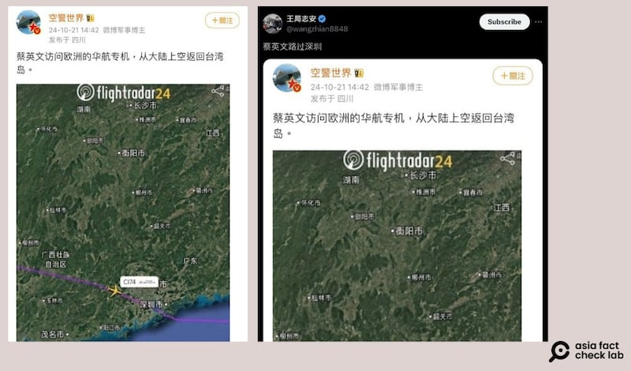

# 事實釐清｜蔡英文訪歐“專機”，回程經過中國上空？

作者：艾倫

2024.10.26 11:10 EDT

## 一分鐘完讀：

2024年10月12至19日，臺灣總統前任蔡英文訪問歐洲，行經捷克、法國和比利時三國，引發不少輿論關注。

亞洲事實查覈實驗室（Asia Fact Check Lab，下稱AFCL）觀察到，關於蔡英文出訪的回程路線，中國和臺灣社媒有大量討論。有中國軍事博主在微博發文，指出蔡英文的回臺“專機”曾飛越中國上空，並有航班追蹤截圖爲證，消息也被轉到X及Threads上。但也有人質疑此消息的真實性，認爲這位被中國口誅筆伐的前總統不太可能經過中國領空，而中國對此沒有反應。

AFCL以開源信息工具，輔以專家解析，釐清相關事實，蔡英文歐洲行程結束返臺之時，所乘坐的班機確實從中國領空飛過，但她乘坐的是一般商業航班，而不是”專機”。而臺灣民航航班飛經中國領空，則是近二十年來的常規操作。

## 深度分析：

10月21日,微博軍事博主 ["空警世界](https://weibo.com/2001530981/OCznUyYzw#comment)"轉發一張飛機航跡圖,稱臺灣前總統蔡英文在十月訪歐行程結束後,從荷蘭阿姆斯特丹飛回臺灣桃園的"專機"經過了"大陸上空",引發熱議。

相關消息也在 [X](https://x.com/Mise_ad2301/status/1848538949582790813)跟 [Threads](https://www.threads.net/@tsiu_ho_ui/post/DBa8T7dyrQk)上經兩岸網民大量轉載,其中包括知名時事評論員 [王志安](https://x.com/wangzhian8848/status/1848955898464768342)。但在對此圖的討論中,有不少網民質疑此消息的真實性,不少人發問,爲何該班機可以飛經中國上空而沒事。也有部分網民嘲諷:"蔡英文回國班機經查證確實飛過共產中國上空,這件事可以在後面30年都拿出來嘲笑粉紅。"

近期中文社媒出現一則消息，臺灣前總統蔡英文於訪問歐洲後回臺的班機上，經過中國上空，引發熱議。（圖取自微博、X）

## 蔡英文搭乘的是“專機”嗎？是否曾經過中國上空？

AFCL綜合臺灣 [中央社](https://www.cna.com.tw/news/aipl/202410200011.aspx)、 [聯合報](https://udn.com/news/story/6656/8303486)、 [風傳媒](https://www.storm.mg/article/5258188)及 [臺視](https://news.ttv.com.tw/news/11310200000300W)等多方新聞媒體報道得知,蔡英文在完成訪歐行程後,乘坐中華航空公司CI74班機,於10月20日凌晨5點49分抵達臺灣桃園機場。其中,臺灣民視新聞也捕捉到了當天蔡英文 [入境臺灣](https://www.youtube.com/watch?v=YeQbjJtHKFM)的畫面。

以該班機號碼及抵達時間在航班追蹤網站Flightradar24上搜尋, [航跡圖](https://www.flightradar24.com/data/flights/ci74#379c990d)顯示,中華航空CI74班機在臺灣時間10月19日於荷蘭阿姆斯特丹機場起飛,並在20日上午將近6點時降落於桃園機場,可判斷和報道所指爲同一班機。

AFCL將航跡圖放大，發現該架飛機的航跡確實曾進入中國雲南省，經過廣東省，最後飛過香港往臺北桃園機場方向前進，網傳CI74班機“飛越中國上空”的說法正確。

航班追蹤網站Flightradar24顯示，CI74班機確實曾從雲南飛進中國上空。（圖取自Flightradar24網站）

不過,該航班爲中華航空公司的一般商業航班,使用的是一般民航航線,並非如微博軍事大V所說是總統"專機"。 AFCL曾聯絡華航公關室及蔡英文辦公室詢問更多相關細節,至截稿前(25日)未獲正面回應。但以華航官網查詢,可以找到20日之後仍有 [相同航線的CI74班機](https://www.china-airlines.com/hk/zh/fly/flight-status/flight-status-result)。

臺灣國際法學者宋承恩告訴AFCL，蔡英文此次是以前總統身份出訪，非官方身份，所以用平民身份搭民航機而非公務機，是合理的出訪模式。

## 民航機和專機差異爲何？中國能夠任意攔截嗎？

在任職總統期間,蔡英文的政綱曾被中國官方多次批評,2023年,她過境美國的行程也曾被中共中央 [強烈譴責](http://www.gwytb.gov.cn/m/news/202304/t20230406_12524132.htm)爲"竄訪"。此次,卸任後的蔡英文曾飛越中國上空的消息一出,引發兩岸網民熱烈討論。許多中國網民質疑,中國爲何沒有迫降或攔截該架飛機。

宋承恩指出，民航機的飛行路線是全世界各家航空公司談判、協商得出來的結果，本就不會輕易更動。

“本班機爲定期航班，前總統僅單純爲機上之乘客之一，航班飛行之一切作業均採常態性作法，通常此航段之航路即爲此樣態，並無特殊之處”，臺灣朝陽科技大學飛行與民航人員技術系主任、現任華航集團華信航空董事盧衍良也向AFCL這樣表示。

中國政府網 [資料顯示](https://www.gov.cn/gzdt/2005-09/03/content_28834.htm),2005年,中國民航局就批准了臺灣民航航班可以飛越中國空域,2024年中,有傳言臺灣航班將被中國禁飛新疆空域,但隨後也被航空業者 [聲明澄清](https://www.worldjournal.com/wj/story/121220/8002518?zh-cn),臺灣航班可以正常按航線在中國空域飛行。

此外，盧衍良透露，現任總統出訪大多使用特定專機，由航空業者配合總統府的需求提供任務服務，作業非常複雜繁瑣。相較之下，“卸任總統出訪，基本上不會如此大費周章，通常是以既有航空業者之航班爲主，此次蔡前總統之出訪行程，即以此模式辦理，並無特殊之處。”

至於臺灣前任總統若因身份特殊，搭乘班機飛越上空，是否會引發國安疑慮？

宋承恩補充，蔡英文此次以卸任元首身份出訪，雖然一切以純民間規格的安排，仍會有安全上的疑慮。例如這次中國博主披露蔡英文的出訪班機，未來臺灣飛同航線的班機是否會格外引起中國的注意，卸任元首是否要考慮和現任元首一樣使用更高規格出訪，都是重要的安全考量。

今年7月,臺媒 [報道](https://news.pts.org.tw/article/699207)檢方指控一名中華航空職員疑似於2023年把蔡英文出訪行程、鳳翔專案停機坪照片提供給一名疑似共諜的人士,引發國安破口的討論。

儘管如此，宋承恩認爲，無論中國是否掌握臺灣卸任總統或高級官員的出訪情資，都不太可能出手影響民航機的飛行，主因爲民航機上有各國的旅客，中國用武力侵害依法、合規航行在正確軌跡上的民航機“須付出的代價太大”，他說。

*亞洲事實查覈實驗室(Asia Fact Check Lab)針對當今複雜媒體環境以及新興傳播生態而成立。我們本於新聞專業主義,提供專業查覈報告及與信息環境相關的傳播觀察、深度報道,幫助讀者對公共議題獲得多元而全面的認識。讀者若對任何媒體及社交軟件傳播的信息有疑問,歡迎以電郵*  [*afcl@rfa.org*](mailto:afcl@rfa.org)  *寄給亞洲事實查覈實驗室,由我們爲您查證覈實。* *亞洲事實查覈實驗室在X、臉書、IG開張了,歡迎讀者追蹤、分享、轉發。X這邊請進:中文*  [*@asiafactcheckcn*](https://twitter.com/asiafactcheckcn)  *;英文:*  [*@AFCL\_eng*](https://twitter.com/AFCL_eng)  *、*  [*FB在這裏*](https://www.facebook.com/asiafactchecklabcn)  *、*  [*IG也別忘了*](https://www.instagram.com/asiafactchecklab/)  *。*

[Original Source](https://www.rfa.org/mandarin/shishi-hecha/hc-tsai-flight-chinese-airspace-10262024110940.html)