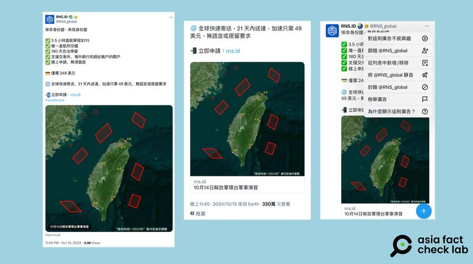

# 事實查覈｜臺灣人可網購帛琉“保命身份證”？

作者：莊敬

2024.10.28 18:31 EDT

查覈結果：錯誤

## 一分鐘完讀：

解放軍環臺軍演後，中文社交媒體上出現販售“保命身份證－帛琉身份證”的廣告，其配圖是10月14日解放軍環臺軍事演習“聯合利劍－2024B”演習區域示意圖。查覈發現，帛琉共和國（又譯作帕勞共和國）並未授權任何公司在網路上販售其身份證，網傳信息不實。

## 深度分析：

X賬號"RND.ID (@RNS\_global)"於10月中以繁體中文 [發帖](https://x.com/RNS_global/status/1846215731991794174),宣傳"保命身份證-帛琉身份證"並附上代理銷售站點的鏈接,帖文使用的配圖是10月14日解放軍環臺軍事演習"聯合利劍-2024B"演習區域示意圖。以圖反搜後發現,這張圖出自解放軍東部戰區微信公衆號。

社媒賬號於10月中發文，以解放軍環臺軍演的示意圖，宣傳販售“保命身份證” 圖取自X”

從這篇帖子的部分文字內容，包括“3.5小時直航”“唯一直航邦交國”等陳述，可知其宣傳對象爲臺灣人民。部分中文社媒用戶被推送了這則明確標註爲“推廣”的帖子，點選其右上角的選項，可以看出該帖是投放的廣告。

爲證實“保命身份證”是否爲帛琉共和國官方發佈和授權銷售，亞洲事實查覈實驗室（Asia Fact Check Lab）去信詢問帛琉共和國駐中華民國（臺灣）大使館。使館官員回覆，經向國內部門確認後，網路上這間公司（指賬號“RND.ID”）不隸屬於帛琉共和國，帛琉也沒有授權任何公司在網路上販售帛琉身份證。

“我們懇請您不要與相關公司往來。（We kindly request that you refrain from engaging with any related companies.）”帛琉駐臺大使館官員表示。

另根據臺灣外交部今年6月更新的 ["帛琉經貿投資環境簡介"](https://ws.mofa.gov.tw/001/Upload/402/relfile/20/480/8550a83c-4974-47e7-b143-4c1471a15ea1.pdf)文件,帛琉於2022年起開始接受境外人士或公司行號申辦"數位居留證"(Digital Residency ID),並據以使用帛琉境內各項雲端服務,如開通數位賬戶、通訊號碼及設置郵遞地址等,而公司行號的營運無須遵照帛琉法規。

但“數位居留”並不等同於該國的正規身份。臺灣外交部前述的簡介特別強調“數位公民不具有定居帛國權利”。簡介文件同時提醒，“數位公民計劃剛在帛國進行，相關實施細節尚待帛國政府更新，惟社羣媒體偶有相關訊息傳播誤導民衆，例如可移民、 實體地址信箱等，均須小心查證。”

*亞洲事實查覈實驗室(Asia Fact Check Lab)針對當今複雜媒體環境以及新興傳播生態而成立。我們本於新聞專業主義,提供專業查覈報告及與信息環境相關的傳播觀察、深度報道,幫助讀者對公共議題獲得多元而全面的認識。讀者若對任何媒體及社交軟件傳播的信息有疑問,歡迎以電郵*  [*afcl@rfa.org*](mailto:afcl@rfa.org)  *寄給亞洲事實查覈實驗室,由我們爲您查證覈實。* *亞洲事實查覈實驗室在X、臉書、IG開張了,歡迎讀者追蹤、分享、轉發。X這邊請進:中文*  [*@asiafactcheckcn*](https://twitter.com/asiafactcheckcn)  *;英文:*  [*@AFCL\_eng*](https://twitter.com/AFCL_eng)  *、*  [*FB在這裏*](https://www.facebook.com/asiafactchecklabcn)  *、*  [*IG也別忘了*](https://www.instagram.com/asiafactchecklab/)  *。*

[Original Source](https://www.rfa.org/mandarin/shishi-hecha/hc-taiwanese-life-id-10282024183120.html)