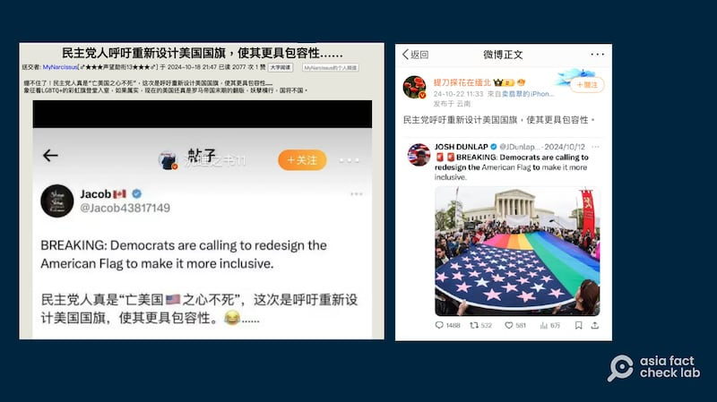

# 事實查覈｜美國民主黨呼籲重新設計美國國旗？

作者：董喆

2024.10.29 15:07 EDT

## 查覈結果：證據不足

## 一分鐘完讀：

中文社媒近日出現傳言稱，美國民主黨呼籲要重新設計“更具包容性”的美國國旗，傳言附有一個集會活動現場的照片，照片中衆人手捧的美國國旗被“改裝”成象徵多元性別羣體的彩虹星條旗。

經查，這張照片爲法新社記者在2015年的一次倡議同性婚姻合法化的集會現場所拍攝，與重新設計國旗無關。至於民主黨是否有此呼籲，亞洲事實查覈以關鍵字查閱並檢索民主黨2024年黨綱，皆未提及此事，沒有證據表明民主黨提出了改國旗的倡議。

## 深度分析：

微博近日出現 [傳言](https://archive.ph/pG0wn)稱,美國民主黨呼籲要重新設計美國國旗,使其更具有包容性,並附上一張衆人手捧新設計的"美國國旗"的照片,照片中的旗幟將美國國旗與"彩虹旗"相合二爲一。此事也在一些中文論壇被討論( [鏈接1](https://archive.ph/JieFO), [鏈接2](https://archive.ph/U4eRN)),有人稱民主黨人"亡美國之心不死",讓象徵LGBTQ+(各類性少數羣體)的彩虹旗登堂入室,是"妖孽橫行"。

近日，中文社媒平臺廣傳“民主黨呼籲重新設計美國國旗”的帖子。 (圖截取自新浪、X )

亞洲事實查覈實驗室發現,中文社羣平臺上流傳的截圖多數引用了X上的一則英文傳言,反搜其附圖,發現這張照片是2015年由法新社記者Paul J. Richards拍攝的新聞圖片,當時的背景是美國最高法院將裁決全美同性婚姻是否合法的前夕,民衆於最高法院外遊行。 [《金融時報》](https://www.ft.com/content/b456cafa-eb58-11e4-86ba-00144feab7de)與 [美國全國公共廣播電臺](https://www.npr.org/sections/itsallpolitics/2015/04/27/402456198/legal-battle-over-gay-marriage-hits-the-supreme-court-tuesday)(NPR)皆使用了這張照片報道該事件。

進一步以關鍵字搜尋,並未找到任何主流媒體報道民主黨要重新設計美國國旗一事,檢視民主黨2024年8月發表的最新 [黨綱](https://democrats.org/wp-content/uploads/2024/09/2024_Democratic_Party_Platform_8a2cf8.pdf),也並未提到任何與國旗設計有關的事項,國會網站亦查不到任何與此相關的提案。亞洲事實查覈實驗室去信美國民主黨,至截稿前未獲回應。

根據美國在臺協會 [資料](https://web-archive-2017.ait.org.tw/zhtw/american_story/category/page/jb/modern/birth_2.htm),美國國旗一共有27個歷史版本,1960年7月4日是最近的一次修改,因爲夏威夷列爲美國一州,國旗上新增了一顆星星。

事實上,美國的機構和民衆基於不同倡議理念,會將國旗元素與其倡議內容融合製作用於展示和宣傳的旗幟,但這些並不是對國旗的正式的修改。比如不同的機構會將國旗橫條紋變更爲不同顏色來致敬或者紀念爲公共事業做出貢獻的各類工作人員,如 [黑底細藍線版本](https://www.thinbluelineusa.com/pages/about-us)代表致敬執法人員, [黑底細綠線版本](https://www.thingreenline.com/pages/about-us)代表致敬軍人及軍屬,非營利組織會販售相關產品來支持因公殉職的警員、現退役軍人。

*亞洲事實查覈實驗室(* *Asia Fact Check Lab)針對當今複雜媒體環境以及新興傳播生態而成立。我們本於新聞專業主義,提供專業查覈報告及與信息環境相關的傳播觀察、深度報道,幫助讀者對公共議題獲得多元而全面的認識。讀者若對任何媒體及社交軟件傳播的信息有疑問,歡迎以電郵*  *[afcl@rfa.org](mailto:afcl@rfa.org)*  *寄給亞洲事實查覈實驗室,由我們爲您查證覈實。*

亞洲事實查覈實驗室在X、臉書、IG開張了,歡迎讀者追蹤、分享、轉發。X這邊請進:中文 *[@asiafactcheckcn](https://twitter.com/asiafactcheckcn)*  *;英文:*  *[@AFCL\_eng](https://twitter.com/AFCL_eng)*  *、*  *[FB在這裏](https://www.facebook.com/asiafactchecklabcn)*  *、*  *[IG也別忘了](https://www.instagram.com/asiafactchecklab/)*  *。*

[Original Source](https://www.rfa.org/mandarin/shishi-hecha/hc-10292024150506.html)