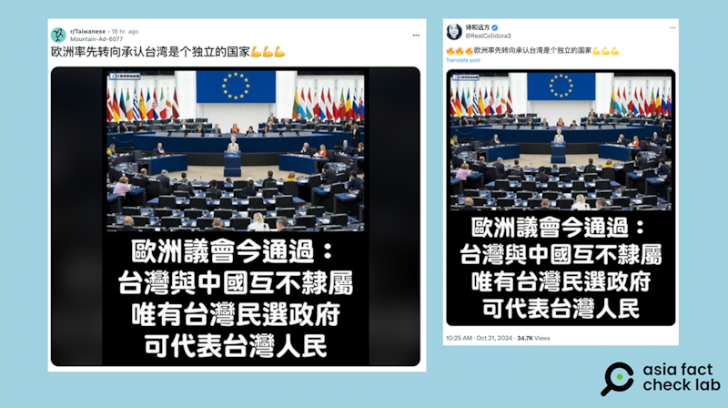

# 事實查覈｜歐洲率先轉向，承認臺灣是獨立國家？

作者：莊敬

2024.10.30 15:05 EDT

## 查覈結果：誤導

## 一分鐘完讀：

過去的幾個月中，社媒上頻傳“歐洲率先轉向承認臺灣是個獨立國家”的貼文，所附圖卡寫着：“歐洲議會今通過：臺灣與中國互不隸屬，唯有臺灣民選政府可代表臺灣人民”。

經過查覈發現，圖卡的文字確實符合歐洲議會今年2月通過的“共同外交暨安全政策”（CFSP）報告決議案，但CFSP並沒有寫到“承認臺灣是個獨立的國家”。歐洲議會新聞官回應此傳言時重申，歐盟的政策是支持臺海維持現狀。

## 深度分析：

近日在 [X](https://twitter.com/RealColidora3/status/1848188864487215536) 、 [Reddit](https://www.reddit.com/r/Taiwanese/comments/1g9g2dt/%E6%AC%A7%E6%B4%B2%E7%8E%87%E5%85%88%E8%BD%AC%E5%90%91%E6%89%BF%E8%AE%A4%E5%8F%B0%E6%B9%BE%E6%98%AF%E4%B8%AA%E7%8B%AC%E7%AB%8B%E7%9A%84%E5%9B%BD%E5%AE%B6/) 等平臺上,有用戶傳播"歐洲率先轉向承認臺灣是個獨立國家"的消息,搭配一張寫着"歐洲議會今通過:臺灣與中國互不隸屬,唯有臺灣民選政府可代表臺灣人民"的圖卡。

近日社媒上傳出“歐洲率先轉向承認臺灣是個獨立國家”的消息。（圖取自X、Reddit ）

以圖反搜後發現,這張圖卡於今年2月、3月已在社媒上流傳,當時網民討論的事件是,歐洲議會(European Parliament)於2月28日通過歐盟" [共同外交暨安全政策](https://www.europarl.europa.eu/doceo/document/TA-9-2024-0104_EN.html) "(Common Foreign and Security Policy, CFSP)及" [共同安全暨防禦政策](https://www.europarl.europa.eu/doceo/document/TA-9-2024-0105_EN.html) "(Common Security and Defence Policy, CSDP)二項年度執行報告決議案。

經檢視CFSP報告決議案，內容確實提及臺灣與中國互不隸屬、唯有臺灣民選政府可在國際舞臺上代表臺灣人民等內容。但並沒有寫到網民宣稱的“承認臺灣是個獨立的國家”。

## 歐盟對臺灣的政策立場

亞洲事實查覈實驗室（Asia Fact Check Lab，下簡稱AFCL）去信詢問歐洲議會與歐盟執委會。歐洲議會新聞官回覆表示，歐盟的政策是支持臺海現狀(supporting the status quo in the Taiwan Strait)，並警告勿採取片面行動，特別是武力或脅迫行動。

歐洲議會新聞官並提供最近發佈的 [新聞稿](https://www.europarl.europa.eu/news/en/press-room/20241017IPR24739/china-is-trying-to-distort-history-and-international-law-in-taiwan-meps-warn) ,關於10月24日通過的" [中華人民共和國不當詮釋聯合國大會第2758號決議及對臺灣持續軍事挑釁](https://www.europarl.europa.eu/doceo/document/TA-10-2024-0030_EN.html) "決議案,除了重申歐盟支持臺海現狀的立場,也同時強調" 一中政策"爲歐中關係的政治基礎。另根據歐洲議會在今年3月發佈" [2024臺灣選後的歐臺關係](https://www.europarl.europa.eu/RegData/etudes/ATAG/2024/760357/EPRS_ATA(2024)760357_EN.pdf) "文件,歐盟仍奉行"一中政策",承認中華人民共和國政府是中國唯一合法政府;歐盟與臺灣並無外交關係。

歐盟執委會則至截稿前尚未回覆。

根據CFSP報告的內容，以及歐洲議會的官方回應與相關文件，歐盟並未改變其一貫立場，仍奉行“一中政策”，持續支持臺海現狀。雖然前述網傳圖卡上的文字並無錯誤，但部分社媒用戶發文中過度解讀成“歐洲率先轉向承認臺灣是個獨立的國家”，傳播了誤導信息。

今年2月底CFSP報告發布後,中文世界便開始流傳有關報吿的誤導信息,AFCL亦曾發佈查覈報告《 [歐洲議會通過"反對一箇中國的法案"](2024-03-07_事實查覈｜歐洲議會通過"反對一箇中國的法案"？.md) ? 》

*亞洲事實查覈實驗室(* *Asia Fact Check Lab* *)針對當今複雜媒體環境以及新興傳播生態而成立。我們本於新聞專業主義,提供專業查覈報告及與信息環境相關的傳播觀察、深度報道,幫助讀者對公共議題獲得多元而全面的認識。讀者若對任何媒體及社交軟件傳播的信息有疑問,歡迎以電郵 [afcl@rfa.org](mailto:afcl@rfa.org)*  *寄給亞洲事實查覈實驗室,由我們爲您查證覈實。*

*亞洲事實查覈實驗室在* *X* *、臉書、* *IG* *開張了,歡迎讀者追蹤、分享、轉發。* *X* *這邊請進:中文 [@asiafactcheckcn](https://twitter.com/asiafactcheckcn)*  *;英文: [@AFCL\_eng](https://twitter.com/AFCL_eng)*  *、 [FB在這裏](https://www.facebook.com/asiafactchecklabcn)*  *、 [IG也別忘了](https://www.instagram.com/asiafactchecklab/)*  *。*

[Original Source](https://www.rfa.org/mandarin/shishi-hecha/hc-did-europe-formally-recognize-taiwan-10302024150241.html)