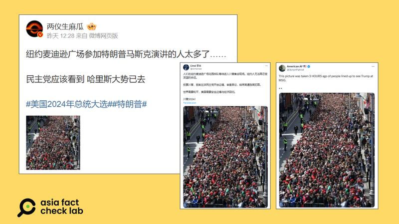
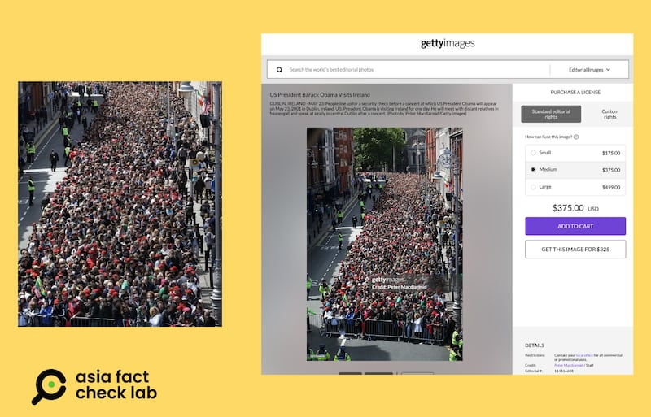

# 事實查覈｜網傳照片顯示特朗普支持者擠爆紐約街道？

作者：莊敬

2024.10.30 15:12 EDT

## 查覈結果：錯誤

## 一分鐘完讀：

美國共和黨總統候選人特朗普27日在紐約麥迪遜廣場舉行造勢活動，事後有中、英文社媒帳號傳播一張人潮擠滿街道的照片，聲稱是人們在紐約市麥迪遜廣場花園排隊等待進入特朗普集會現場。經查，這張照片出自2011年美國前總統奧巴馬訪問愛爾蘭的現場，部分網民挪用舊照片傳播錯誤信息。

**深度分析**:

美國共和黨總統候選人特朗普(Donald Trump,又譯川普)於美東時間10月27日,在紐約麥迪遜廣場舉行造勢活動,包括前第一夫人梅拉尼亞‧特朗普(Melania Trump)、特斯拉執行長馬斯克(Elon Musk)都登臺助選。從《 [紐約時報](https://www.nytimes.com/2024/10/27/us/politics/trump-msg-rally-line.html) 》、《 [衛報](https://www.theguardian.com/us-news/2024/oct/27/trump-madison-square-garden-rally) 》等媒體報道,可以看出現場聚集許多支持者。

亞洲事實查覈實驗室（Asia Fact Check Lab，下簡稱AFCL）注意到，有微博“大V”用戶在10月28日發文，稱，“紐約麥迪遜廣場參加特朗普馬斯克演講的人太多了⋯⋯民主黨應該看到哈里斯大勢已去”，搭配了一張人潮擠滿街道的照片。在X上有中文帳號傳播同一張照片，配文寫着“人們在紐約麥迪遜廣場花園排隊等待進入川普集會現場”。

AFCL發現,有英文帳號在 [X](https://x.com/iAnonPatriot/status/1850576008014864704) 、 [Threads](https://www.threads.net/@alanfahringer/post/DBo3t5AB9ax) 上,發佈同一張照片、相似文字內容,甚至有用戶宣稱是在其發文前3小時所拍攝的特朗普集會現場。

中、英文社媒用戶近日傳播一張照片，聲稱是美國共和黨總統候選人特朗普在紐約麥迪遜廣場的集會人潮。（圖取自微博、X）

然而,這張照片中公車站牌並不像美國紐約麥迪遜廣場附近街景、人們手上的旗幟也與特朗普其他集會使用的物料不同。 AFCL以圖反搜,找到了《 [衛報](https://www.theguardian.com/world/gallery/2011/may/23/barack-obama-usa) 》2011年的報道中有類似的圖片,根據其圖說,照片出自美國前總統奧巴馬(Barack Obama)訪問都柏林(Dublin)期間,其圖片來源爲 蓋蒂圖片社(Getty Images), 而該圖片社所拍的 [另一張照片](https://www.gettyimages.com/detail/news-photo/people-line-up-for-a-security-check-before-a-concert-at-news-photo/114516608?adppopup=true) ,則與網絡截圖高度一致,影像檔案創建時間爲2011年5月。

左圖爲網傳美國共和黨總統候選人特朗普在紐約麥迪遜廣場的集會人潮，右圖爲蓋蒂圖片社在2011年前總統奧巴馬訪問都柏林時拍攝的現場照片。（微博、蓋蒂圖片社截圖）

經比對,前述中、英文社媒用戶傳播的照片經裁切,但保留的影像中,無論街景、人羣、建築物等,都和2011年奧巴馬訪問都柏林的照片高度相似。從影像資料判斷,部分網民挪用了無關特朗普集會的影像,傳播錯誤信息。 美國事實查覈組織PolitiFact亦發佈了 [查覈報告](https://www.politifact.com/factchecks/2024/oct/28/tweets/photo-shows-obamas-2011-ireland-crowd-not-trumps-i/) 。

*亞洲事實查覈實驗室(* *Asia Fact Check Lab* *)針對當今複雜媒體環境以及新興傳播生態而成立。我們本於新聞專業主義,提供專業查覈報告及與信息環境相關的傳播觀察、深度報道,幫助讀者對公共議題獲得多元而全面的認識。讀者若對任何媒體及社交軟件傳播的信息有疑問,歡迎以電郵 [afcl@rfa.org](mailto:afcl@rfa.org)*  *寄給亞洲事實查覈實驗室,由我們爲您查證覈實。*

*亞洲事實查覈實驗室在* *X* *、臉書、* *IG* *開張了,歡迎讀者追蹤、分享、轉發。* *X* *這邊請進:中文 [@asiafactcheckcn](https://twitter.com/asiafactcheckcn)*  *;英文: [@AFCL\_eng](https://twitter.com/AFCL_eng)*  *、 [FB在這裏](https://www.facebook.com/asiafactchecklabcn)*  *、 [IG也別忘了](https://www.instagram.com/asiafactchecklab/)*  *。*

[Original Source](https://www.rfa.org/mandarin/shishi-hecha/hc-trump-rally-in-new-york-10302024150817.html)