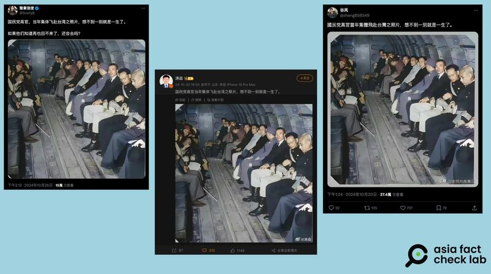
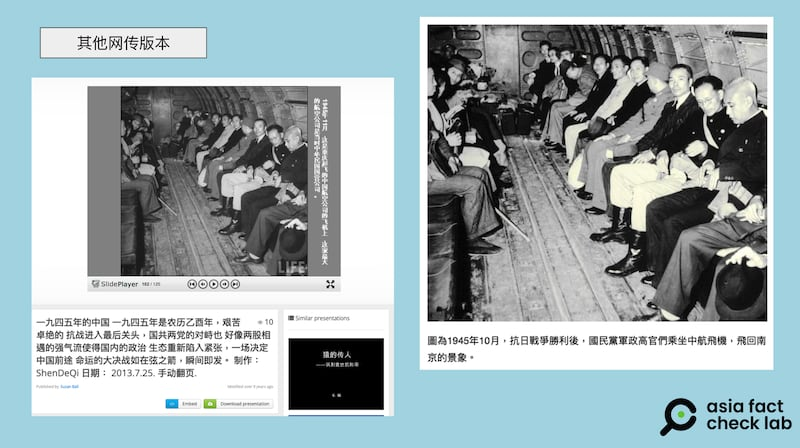

# 事實查覈｜國民黨高官集體撤退臺灣照片曝光？

作者：董喆

2024.10.31 18:03 EDT

查覈結果：錯誤

## 一分鐘完讀：

近日，中文社交媒體上有多個賬號發佈據稱是國民黨高官集體飛赴臺灣的照片，引發討論。經查，此張照片原始出處爲美國​​《生活》（Life）雜誌，是1945年一架中國航空公司（CNAC）飛機搭載乘客的畫面，與國民黨撤退至臺灣無關.

## 深度分析：

近日, [微博](https://archive.ph/oOtUQ)與X( [1](https://archive.ph/2BRBV), [2](https://archive.ph/4HbDj))上皆有簡體中文賬號貼出一張彩色照片,稱是國民黨高官集體飛赴臺灣的照片,引發中國網民熱烈討論。

網傳“國民黨高官集體赴臺”歷史照片 圖截取自X、新浪

亞洲事實查覈實驗室（以下簡稱AFCL）以圖反搜，發現此張照片還有黑白版本，已經在中文社媒廣爲流傳並曾有過多種說法，除了稱是國民黨高官撤退赴臺之外，亦有一說是抗日戰爭勝利後，國民黨軍政高官們乘坐中航飛機返回南京的場景。

網絡流傳的同一張照片的黑白版本和不一樣的圖片說明 圖截取自google

在多種版本中,部分照片在右下角可見美國​​《生活》(Life)雜誌浮水印。AFCL去信《生活》雜誌,獲回覆稱這張照片攝於1945年的中國重慶,攝影師爲 [Jack Wilkes](https://www.life.com/photographer/jack-wilkes/),當時這張照片的圖說爲"裝滿乘客的CNAC(中國航空公司)飛機,採用桶式座椅,中國重慶(CNAC planes filled to capacity with the bucket seat arrangement, CHUNGKING, China)"。

根據《生活》雜誌版權部門提供的資料，並未提到搭機者的身份。

根據《臺灣學研究》臺灣學者歐素瑛所撰 [《臺灣省參議會與中華民國政府遷臺》](https://wwwacc.ntl.edu.tw/public/Attachment/281415584816.pdf),1949年4月23日,共軍攻下南京,國民政府遷往廣州。10月15日、11月21日再遷至重慶、成都,12月7日,總統令:"政府遷設臺北,並在西昌設大本營,統率陸海空軍,在大陸指揮作戰。此令。"12月9日正式在臺灣辦公。

根據中國民用航公局 [資料](https://www.caac.gov.cn/big5/www.caac.gov.cn/ZTZL/RDZT/2021BNWY/JKCY/202106/t20210624_208120.html),中央人民政府政務院總理周恩來1949年11月12日宣佈,接管原先屬於國民政府的中國航空公司,中國航空公司爲中華人民共和國的資產。

從前述查證資料可以發現，該照片攝於1945年，此時三年國共內戰尚未開打；而到1949年12月國民政府遷至臺灣時，中國航空公司已被中華人民共和國政府接管，因此網傳照片不可能是國民黨高官遷臺的情景。

*亞洲事實查覈實驗室(Asia Fact Check Lab)針對當今複雜媒體環境以及新興傳播生態而成立。我們本於新聞專業主義,提供專業查覈報告及與信息環境相關的傳播觀察、深度報道,幫助讀者對公共議題獲得多元而全面的認識。讀者若對任何媒體及社交軟件傳播的信息有疑問,歡迎以電郵*  [*afcl@rfa.org*](mailto:afcl@rfa.org)  *寄給亞洲事實查覈實驗室,由我們爲您查證覈實。* *亞洲事實查覈實驗室在X、臉書、IG開張了,歡迎讀者追蹤、分享、轉發。X這邊請進:中文*  [*@asiafactcheckcn*](https://twitter.com/asiafactcheckcn)  *;英文:*  [*@AFCL\_eng*](https://twitter.com/AFCL_eng)  *、*  [*FB在這裏*](https://www.facebook.com/asiafactchecklabcn)  *、*  [*IG也別忘了*](https://www.instagram.com/asiafactchecklab/)  *。*

[Original Source](https://www.rfa.org/mandarin/shishi-hecha/hc-kmt-retreat-photo-10312024180246.html)