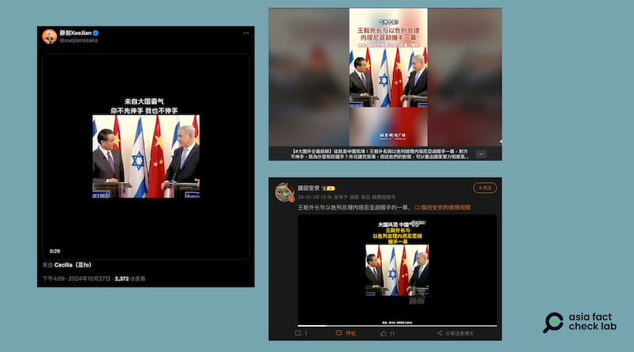

# 事實查覈｜王毅“霸氣”會晤以色列總理，拒絕主動伸手示好？

2024.10.31 18:05 EDT

作者：董喆

查覈結果：誤導

## 一分鐘完讀：

中國官媒以及社交平臺近期流傳一段視頻，畫面是中國外交部長王毅與以色列總理內塔尼亞胡會面的場景，視頻字幕稱王毅與內塔尼亞胡握手的一幕展現“大國霸氣”，因爲視頻中王毅不主動伸手，而是一定要內塔尼亞胡先伸手纔會與他握手。

經查，這段視頻拍攝於2013年兩人在耶路撒冷會面時，根據以色列官方公佈的保留現場原聲的原視頻，兩人對視是正在聆聽翻譯，而非爲了誰先伸手僵持不下，中國官媒與社羣平臺流傳的視頻帖通過加工和詮釋向公衆傳遞了誤導信息。

## 深度分析：

中國駐大阪總領事薛劍10月27日在X(原推特)上轉推了 [一則視頻](https://archive.ph/aeRAX),畫面中,中國外交部長王毅與以色列總理內塔尼亞胡對視僵持,偶爾微微點頭,差不多半分鐘後,內塔尼亞胡先伸出手與王毅握手,字幕稱"來自大國霸氣,你不先伸手,我也不伸手",視頻的背景音樂中還配上了冷笑聲。留言處中國網友紛紛盛讚"強大的祖國,讓我們挺直了腰桿",稱中國不需要再看他國臉色。

圖：近期媒體及社媒出現的中國外長“霸氣”會晤以總理的視頻 圖截取自X、微博、北京新聞廣播視頻

同樣一則視頻亦在微博( [1](https://archive.ph/0Hsc9), [2](https://archive.ph/pQ8Vx))與 [臉書](https://archive.ph/2Klpy)廣傳,強調王毅"扛住了幾秒的凝視,威武霸氣",官媒北京新聞廣播、大象新聞皆以此畫面作爲素材,宣傳中國外交手腕。

亞洲事實查覈實驗室查證,這則視頻出自2013年,當時王毅以中國外交部長身分前往耶路撒冷與以色列總理內塔尼亞胡會面。 [中國新聞網](http://politics.people.com.cn/n/2013/1220/c70731-23893545.html)以及 [以色列總理辦公室](https://www.gov.il/en/pages/eventchina240114)皆有針對此事發表新聞稿。 [美聯社](https://www.youtube.com/watch?v=kPrrBBzjo20&ab_channel=APArchive)以及 [以色列總理辦公室](https://www.youtube.com/watch?v=kRgJp_n2MSI&ab_channel=IsraeliPM)有發佈現場影音,畫面與網傳視頻一致。

但是,網傳視頻刪除了現場原聲並配上了背景音樂,其畫面與以色列官方釋出 [影片](https://youtu.be/kRgJp_n2MSI?si=Fy9hnLMIvydDFpKI&t=350)的5分50秒至6分30秒完全一致,且網傳影片在多處慢放延長了秒數,讓兩人對視"僵持"的時間比原始影片顯得更久。

在原始影片中，內塔尼亞胡正發表完一段講話，翻譯正將其內容翻譯爲中文，全文如下：

“兩國都對教育、家庭、知識、學問、創新和進取的精神有着深厚的感情，我認爲以色列是中國完美的、天然的合作伙伴，我相信兩國合作可以打造更加美好的未來。希望今天在與您的會晤當中，能夠有機會進一步探討雙邊關係以及與我們的鄰國進行和平相處的看法。我知道這個問題對於中國也非常重要，中方也非常關注，我們希望實現一個和平、繁榮以及安全的未來，實現中東人民的和平和進步，以及全世界的和平。”

隨後，內塔尼亞胡伸手對王毅說：“歡迎來到耶路撒冷”。

中國官媒及社交媒體發佈的視頻帖修改和扭曲了會面時的真實場景，並通過臆測的詮釋和解讀向公衆傳遞了誤導信息。

*亞洲事實查覈實驗室(Asia Fact Check Lab)針對當今複雜媒體環境以及新興傳播生態而成立。我們本於新聞專業主義,提供專業查覈報告及與信息環境相關的傳播觀察、深度報道,幫助讀者對公共議題獲得多元而全面的認識。讀者若對任何媒體及社交軟件傳播的信息有疑問,歡迎以電郵*  [*afcl@rfa.org*](mailto:afcl@rfa.org)  *寄給亞洲事實查覈實驗室,由我們爲您查證覈實。* *亞洲事實查覈實驗室在X、臉書、IG開張了,歡迎讀者追蹤、分享、轉發。X這邊請進:中文*  [*@asiafactcheckcn*](https://twitter.com/asiafactcheckcn)  *;英文:*  [*@AFCL\_eng*](https://twitter.com/AFCL_eng)  *、*  [*FB在這裏*](https://www.facebook.com/asiafactchecklabcn)  *、*  [*IG也別忘了*](https://www.instagram.com/asiafactchecklab/)  *。*

[Original Source](https://www.rfa.org/mandarin/shishi-hecha/hc-wang-yi-israel-handshake-10312024180542.html)