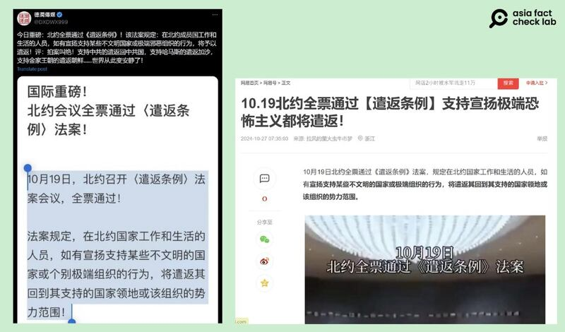

# 事實查覈｜北約會議全票通過“遣返條例”法案？

作者：艾倫

2024.11.01 17:09 EDT

## 查覈結果：錯誤

## 一分鐘完讀：

十月中，美國國土安全部發布消息指出，該部門和中國國家移民管理局合作，將新一批未經合法管道進入美國的中國公民遣返回國，引起中國社媒關於移民問題的熱議。數天後，社交媒體開始傳播一則消息，稱北約（NATO）於10月19日開會決議通過“《遣返條例》法案”，賦予成員國可將支持極端組織、國家的人民遣返至該國或組織勢力範圍。

亞洲事實查覈實驗室（Asia Fact Check Lab，下稱AFCL）查覈後發現北約確實在10月19日召開會議，但記錄中卻沒有任何內容與所謂《遣返條例》相關。再查詢北約其它新聞發佈及國際媒體報道，未發現任何可靠的相關消息。

## 深度分析：

10月21日,X上多個帳號( [1](https://x.com/DXDWX999/status/1848118866918191356), [2](https://x.com/zhihui999/status/1848138582646505589), [3](https://x.com/mosestalking/status/1848036185790169391?s=46&t=OcwRl26KwGrlCoefgaqyvw), [4](https://x.com/Accord756737545/status/1848216798572724356))及 [網易](https://www.163.com/dy/article/JFG0C5U905565O8G.html)多個賬號轉發一則消息:"北約會議全票通過《遣返條例》法案"。內容提到,10月19日北約召開會議,全票通過"《遣返條例》法案",未來若發現有住在北約國家的人民宣揚或支持某些"不文明國家"或"極端組織",將遣返這些人到他們支持的國家或組織勢力範圍。

消息傳開之後，有中文網名錶示贊同：“決議合法、合情、和合理”，也有網名錶示不相信，質疑此消息的來源及真實性。

近日中文互聯網及社媒出現北約通過“遣返條例”的相關傳言。（自X、網易截圖）

AFCL先將“北約”、“遣返條例”的中英文關鍵字至谷歌上搜尋，並未發現有任何相關的官方信息及媒體報道。傳言內容也並未提供更詳盡細節，例如“不文明的國家”以及“極端組織”指的是什麼。

再查詢北約網站,會找到10月19日北約發佈的唯一一則 [新聞稿](https://www.nato.int/cps/en/natohq/news_229665.htm?selectedLocale=en),題爲"北約祕書長參加那不勒斯七國集團國防部長會議"。當天北約祕書長馬克呂特(Mark Rutte)在意大利那不勒斯出席了七國集團(G7)國防部長會議,討論如何進一步增加對烏克蘭的支持、加強國防工業生產等議題。這是呂特以祕書長身份參加的首場G7會議,也是G7首次以國防部長形式召開專門會議。

當天的新聞稿完全未提及“遣返條例”相關議題，此後北約的新聞發佈也都和該消息無關。網傳“北約全票通過《遣返條例》法案”沒有任何根據。

AFCL多次詢問北約公關部門及其發言人，以覈實相關說法，至截稿日（10月28日）前未獲回應。

英國皇家聯合研究所（RUSI）歐洲安全資深研究員Ed Arnold告訴AFCL，網傳說法不可能發生，因爲北約並沒有權力“通過法案”。此外，移民問題也不屬於北約的職責範疇。

事實上，北約國家也有各自遣返他國移民的政策及行動，例如美國。

10月17日，美國國土安全部 （DHS）發佈新聞，稱其15日透過美國移民與海關執法局 （ICE）執行了今年第二次包機遣返中國公民的航班。美國國土安全部截至8月底已啓動超過398架次國際遣返航班，目的地涵蓋140多個國家，包括中國。但並沒有任何證據顯示，遣返決定與被遣返者的觀點表達有關。

*亞洲事實查覈實驗室(Asia Fact Check Lab)針對當今複雜媒體環境以及新興傳播生態而成立。我們本於新聞專業主義,提供專業查覈報告及與信息環境相關的傳播觀察、深度報道,幫助讀者對公共議題獲得多元而全面的認識。讀者若對任何媒體及社交軟件傳播的信息有疑問,歡迎以電郵*  [*afcl@rfa.org*](mailto:afcl@rfa.org)  *寄給亞洲事實查覈實驗室,由我們爲您查證覈實。* *亞洲事實查覈實驗室在X、臉書、IG開張了,歡迎讀者追蹤、分享、轉發。X這邊請進:中文*  [*@asiafactcheckcn*](https://twitter.com/asiafactcheckcn)  *;英文:*  [*@AFCL\_eng*](https://twitter.com/AFCL_eng)  *、*  [*FB在這裏*](https://www.facebook.com/asiafactchecklabcn)  *、*  [*IG也別忘了*](https://www.instagram.com/asiafactchecklab/)  *。*

[Original Source](https://www.rfa.org/mandarin/shishi-hecha/hc-faux-nato-vote-11012024170913.html)