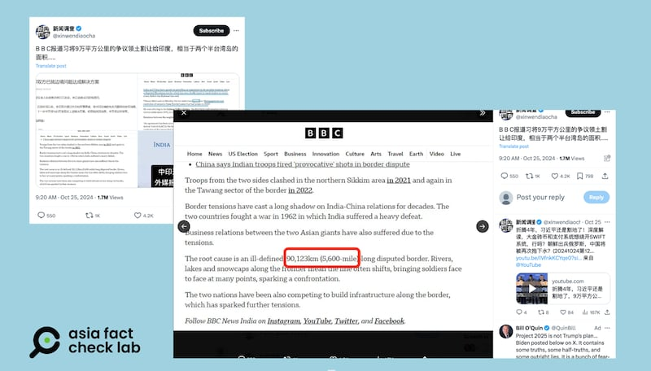
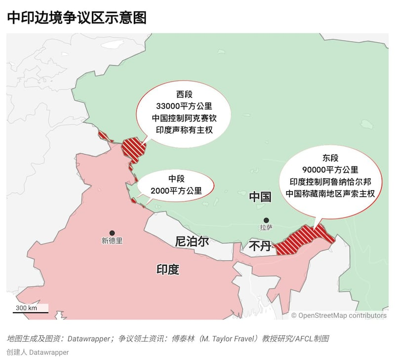
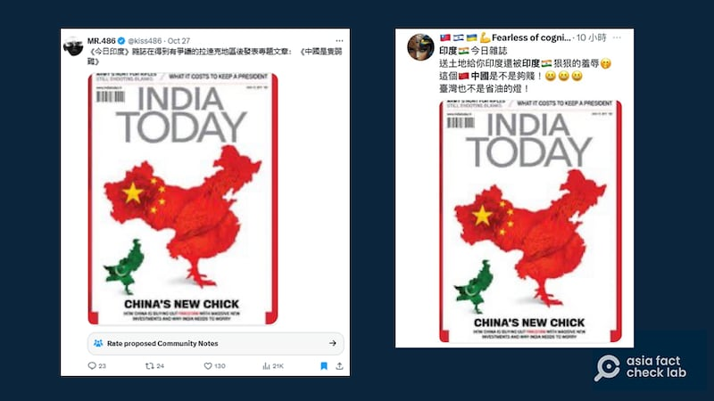

# 事實查覈|國際媒體稱中國將“爭議領土割讓給印度”、是“弱雞”？

作者：鄭崇生（記者莊敬對本報告有貢獻）

2024.11.02 16:43 EDT

就在印度總理穆迪(Narendra Modi)日前赴俄羅斯參加金磚峯會前夕,印度外長 [蘇傑生(Subrahmanyam Jaishankar)](https://www.reuters.com/world/asia-pacific/india-china-have-arrived-border-patrolling-pact-indias-top-diplomat-says-2024-10-21/)21日證實,中印雙方就邊界的巡邏問題達成協議;中國方面,外交部發言人林劍22日則在 [例行記者會](https://www.mfa.gov.cn/web/fyrbt_673021/202410/t20241022_11511370.shtml)上也說,"雙方已就有關問題達成解決方案"。

路透社30日引述印度國防部官員的話報導，印度和中國雙方已按計劃從有爭議的喜馬拉雅邊境、印度領土拉達克（Ladakh）的兩個對峙點撤軍，雙方士兵並於31日以善意的姿態交換糖果，並在兩軍地面指揮官敲定後、隨即展開邊境巡邏。北京沒有立即針對撤軍發表評論。

該協議在中國廣受關注，並有大量社媒討論，一些不實信息也隨即傳開，亞洲事實查覈實驗室（AFCL）發現以下兩則造假和誤導的信息。

## 一、英國廣播公司（BBC）報道，習近平割讓兩個半臺灣大土地給印度？

## 查覈結果：錯誤

X上名爲"新聞調查"的 [帳號](https://archive.ph/hVRjs)25日發文附上BBC英文報道截圖聲稱," BBC報道習(指習近平)將9萬平方公里的爭議領土割讓給印度,相當於兩個半臺灣島的面積… "。

X賬號“新聞調查”引述BBC報道，發出的“BBC報道”截圖（紅圈爲AFCL所加），與BBC網站的原始報道（下圖）中數字並不一樣，疑似篡改原報道。（X截圖）

但這一發文是錯誤內容，且其中所貼出的“截圖”，疑似是篡改過的BBC的報道。

首先,BBC的 [報道原文](https://www.bbc.com/news/articles/ckg0gwy0nlyo)提到爭議邊境時,稱"(中印邊境衝突的)問題根源是"長達3440公里(2100英里)未定界國境", 而在"新聞調查"貼出的所謂"BBC截圖"中,這個數字卻變成了"90123公里(5600英里)",不僅與原文不符,公里和英里的換算也是錯誤的,因此AFCL推斷,該截圖疑似經過了篡改。

其次,BBC對這件事情的 [報道原文](https://www.bbc.com/news/articles/ckg0gwy0nlyo)提到爭議邊境時,採用的是公里爲單位,描述爭議邊境線長度,而"新聞調查"帳號在解讀該報道時的時候,說的卻是"平方公里",描述的是邊境地區的面積,並聲稱割地面積多達"9萬平方公里"、"相當於兩個半臺灣",這些都是無中生有的信息。

BBC報道原文截圖，其中紅圈部分爲AFCL所加，網傳信息中的數字與原文並不一樣。（BBC網站截圖）

BBC印度分社回覆AFCL查覈詢問時確認,BBC在處理中印邊境爭議的相關報道,一向都是引用自 [印度內政部](https://www.mha.gov.in/sites/default/files/INDO%20CHINA_05052017.pdf)的數據,包括這篇報道在內、都是上述的3440公里(2100英里)。該報道自發表後也並沒有勘誤或改動。

至於中印有爭議邊境所涉及的領土面積,根據專研國際安全與中國的美國麻省理工學院安全研究項目主任傅泰林(M Taylor Fravel)的 [研究](https://cis.mit.edu/publications/analysis-opinion/2020/why-are-china-and-india-skirmishing-their-border-here%E2%80%99s-4-things),主要可分爲以下三段。

東段：爭議邊界約爲9萬平方公里，由印度實際控制，印方稱當地爲阿魯納恰爾邦（Arunachal Pradesh），中國稱爲藏南地區。

中段：爭議地區位於尼泊爾以西約2000平方公里，位於印度的喜馬偕爾邦（Himachal Pradesh）、即西藏流亡政府德蘭薩拉所在地與北阿坎德邦（Uttarakhand）。

西段：位於印度的查謨和克什米爾（Jammu and Kashmir）專區，面積約爲3萬3000平方公里，這一地區有主權與邊境爭議的國家涉及印度、巴基斯坦與中國，其中，中國目前實際控制的阿克賽欽（Aksai Chin），印度也宣稱有主權。

東、西、中三段具體位置如下。

傅泰林研究指出的中國印度邊界爭議地區示意圖。（亞洲事實查覈實驗室製圖）

中國1949年建國與印度獨立後,雙方在未定界邊境對峙不曾停止,1962年發生中印戰爭後,雙方各自仍在這一片高海拔的山區與冰川地點開墾建設。根據 [BBC](https://www.bbc.com/zhongwen/simp/world-57340325),2020年雙方對峙局勢圖突然升高,主要是因印度在位於自身所控制的喀什米爾東部拉達克(Ladakh)一帶修建公路,可通往喀什米爾當地一處空軍基地,引發中國不滿,雙方在拉達克與阿克賽欽間的加勒萬河谷(Galwan Valley)發生冷兵器械鬥死亡衝突,印度方面證實,印軍死亡人數達20人;中國方面則是到2021年2月,中國《解放軍報》才 [披露](https://www.sohu.com/a/451469006_120823584),在加勒萬河谷衝突中,有4名解放軍死亡。

也就是說,中印有爭議領土涉及的面積約爲12萬5000平方公里,而東段面積達9萬多平方公里的爭議地區,儘管 [中國方面認爲這一地區屬藏南](https://www.gov.cn/gongbao/shuju/1962/gwyb196212.pdf),但 [1962年中印戰爭以來中國就不曾實際控制過](https://www.bbc.com/zhongwen/trad/world-52826828),更談不上"割讓"。

至於這一次雙方達成共識的西段爭議地區,根據 [路透社](https://www.reuters.com/world/asia-pacific/india-china-complete-troops-pull-back-border-face-off-points-indian-defence-2024-10-30/),中方與印度都從原本在拉達克區的對峙點撤離、脫離接觸,並商定共同展開巡邏,並不涉及解決西段領土的爭議。

## 二、《今日印度》雜誌稱中國是隻弱雞？

## 查覈結果：誤導

中印邊境達成解決方案的消息傳出後,臺灣知名電商商人"486先生"在 [X上貼出一張圖](https://archive.ph/w82uS),稱印度雜誌《今日印度》(India Today)用封面諷刺中國,"《今日印度》雜誌在得到有爭議的拉達克地區後發表專題文章: 《中國是隻弱雞》",隨後也引起其他用戶轉發,並嘲諷"中國送土地給印度還遭羞辱"。

網傳《今日印度》發佈封面評論最近邊境爭議，實爲多年前評論巴基斯坦與中國交好的專題。（X截圖）

然而，上述說法有誤導性，該雜誌封面發表於2017年，與近日邊境事項並無關聯，並且，該封面是以諷刺內容評論當年巴基斯坦和中國的關係，並無直接指責中國“是弱雞”之意。

雖然上述截圖都有些模糊，但仍可清楚看到紅色中國五星旗與綠色巴基斯坦國旗圖樣，分別覆蓋在雙方領土上。AFCL以圖翻搜發現，這是《今日印度》2017年7月31日發行的刊物，和這次中印達成爭議邊境巡邏的協議無關。

在這張封面圖上，《今日印度》給兩國圖樣都加上了禽類雙腳，看上去像是一隻小雞跟着一隻大雞。文字大標題大意則是“中國的新妞” （AFCL注：英文原文China's New Chick-“chick”在英文中有小雞或是姑娘的雙關意思），副標題則寫着：“中國如何通過大規模新投資買通巴基斯坦，以及爲什麼印度需要擔心”。

該封面專題可以有多種解讀，更可能的意義是在貶抑巴基斯坦過度親中、中國收買巴基斯坦的行爲，但無論是字面或者引申義，都很難得出“中國是隻弱雞”的解釋。

《今日印度》自稱,自家雜誌封面"經常引起爭議",在該封面的 [後續報道](https://www.indiatoday.in/amp/fyi/story/india-today-magazine-cover-china-chick-viral-global-times-1026816-2017-07-28)中指出,這一封面當時也中國境內的社交媒體引發不滿。

[Original Source](https://www.rfa.org/mandarin/shishi-hecha/hc-international-media-slander-china-11022024164319.html)