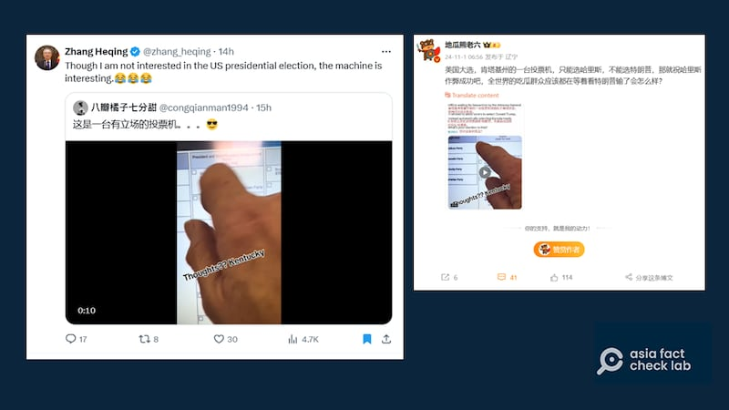
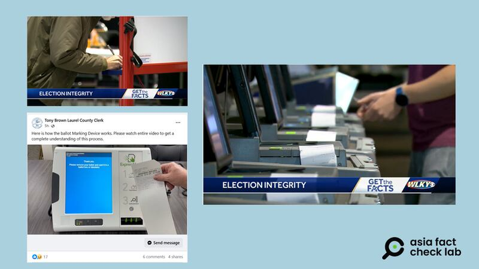
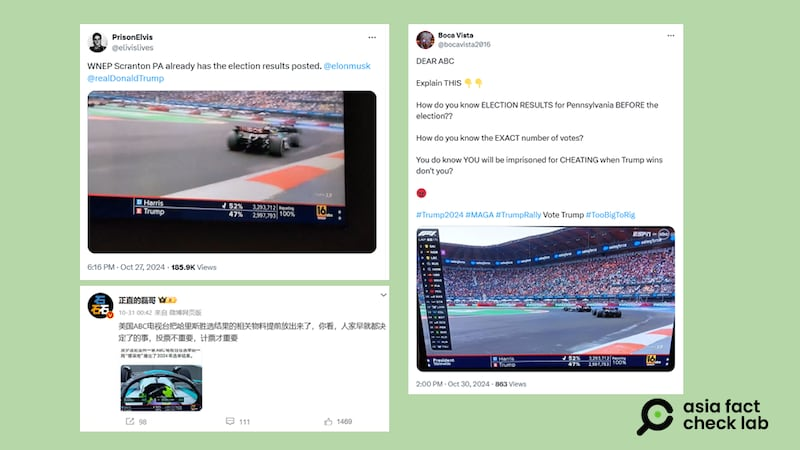

# 事實快查 | 美總統大選提前投票，「作票」流言又來了

作者：鄭崇生

2024.11.03 11:10 EST

美國總統大選十一月五日正式投票，但絕大多數的州也開辦了提前投票（Early voting），隨着投票進行，部分錯假和誤導信息開始在中文世界傳播。

AFCL針對以下兩則廣傳的不實信息進行了查覈：

## 1. 肯塔基州投票機「有立場」,只能投給哈里斯?

## 查覈結果：誤導

一段美國肯塔基州近日有投票機器出現問題的影片,近來在 [TikTok上發酵](https://www.tiktok.com/@lisadixie20/video/7431950284546444575?lang=en),影片中一位選民正在操作一部投票機,但螢幕上無法點選特朗普,但可以點選哈里斯。這段影片引發美國輿論熱議,也在中文圈廣爲流傳。

中國外交官 [張和清就在X上](https://archive.ph/f17mi)轉發網民的貼文內容諷刺這是"一臺有立場的投票機"; [新浪微博上更有用戶以同一段視頻聲稱](https://archive.ph/GxRvC)這機器"只能選哈里斯,不能選特朗普",調侃"祝哈里斯作弊成功",要看美國接下來的亂局。

然而,亞洲事實查覈實驗室綜合各方信息後查證發現,事件發生後,肯塔基州勞雷爾郡書記官布朗(Tony Brown)在官方 [臉書上公佈](https://www.facebook.com/share/v/Pvqz36Smtkp5ZbFa/)發佈了多則相關信息,證實圈票機(Ballot marking device)曾出現故障,事發投票所在10月31日第一時間得知後,就先暫停使用出問題的圈票機。

布朗上傳的一段 [影片](https://www.facebook.com/watch/?v=902576131808577&rdid=NNABKjE0R8fuu2XS)中,他表示一開始點選兩組候選人選擇框之間,確實會出現如同網絡上廣傳的問題,但反覆試驗幾次後,問題不再發生,在他公佈的相關視頻中,他也的確在肯塔基州6組總統、副總統候選人組合中反覆點選都能正確對應選擇,沒有出現問題。

布朗特別解釋，電子觸控式螢幕圈票機的設計，需要選民點選整個方形框格，而圈票機打印民衆選擇之前，還會與選民確認兩次；選票打印出來，民衆還有再次審覈的機會，如果選民圈選出現失誤，可以重投，肯塔基州規定，每個人可以有兩次廢棄選票的機會。

另根據肯塔基州當地媒體 [WLKY報導](https://www.wlky.com/article/voter-fraud-kentucky-election-safety/62686241),肯塔基州也有民衆可以自行人工圈票的選項。布朗則在11月1日更再次發出影片,詳細介紹觸控式圈票機的使用方法。

左上爲肯塔基州人工圈票情況，左下爲電子觸控式圈票機，右方則掃描投票機。 （截圖取自WLKY、Facebook/AFCL製圖）

除了當地官員的公開說明外,美國主要媒體ABC及查覈組織VERIFY都 [新聞報道](https://abcnews.go.com/US/kentucky-election-officials-push-back-viral-vote-switching/story?id=115410287)或 [查覈](https://www.verifythis.com/article/news/verify/elections-verify/kentucky-voting-machine-issue-not-voter-fraud-fact-check/536-36c84a54-9286-435e-93f5-cf4c9d5a1c44)了這則信息。結論都相同:圈票機曾經故障,但官方即時進行了調查和處理,之後經多次反覆試驗查覈。至截稿爲止,不曾再傳出故障信息。網傳信息忽略了後續的處理,造成誤導。

## 2. 美國ABC電視臺搶先報導哈里斯勝選,計票比投票重要?

## 查覈結果：誤導

新浪微博上大V"正直的磊哥"10月31日 [發文](https://archive.ph/Bn68a)指出,"哈里斯勝選結果的相關物料提前放出來了",選舉結果"人家早就都決定了",並調侃"投票不重要,計票才重要"。相關發文其實於10月27日就已經在 [X上](https://x.com/elivislives/status/1850662836428775543)引發美國民衆的討論。

美國廣播公司(ABC)在賓州當地所屬的電視臺WNEP轉播出現上述情況後,已經立刻 [發表聲明](https://www.wnep.com/article/news/politics/elections/note-from-wnep-election-test-results-mistakenly-shown-on-air/523-ec2d364b-8b55-495e-9305-95e5e30224fa)指出,27日當天確實在轉播F1賽車賽事時,將內部測試用的資訊錯誤地播出,導致出現民衆轉拍的民主黨總統候選人哈里斯(Kamala Harris, 又譯:賀錦麗)獲得52%的投票的上述視頻,並且標註哈里斯取得賓州選舉人票的勾勾圖樣。

WNEP除了表達歉意，也說明相關數字是隨機產生的結果，會做這樣的演練是爲了爲投票後的選情之夜報導做好準備，“ 這些數字不代表任何實際票數。賓州法律也規定，在11月5日晚上8 點投票結束前，賓州不會對任何類型的投票進行統計。 ”

包括美國專注政治新聞事實查覈的 [政治事實](https://www.politifact.com/factchecks/2024/oct/30/viral-image/an-abc-news-affiliate-in-pennsylvania-accidentally/)已經發布相關查覈報告,說明出現上述的錯誤情況,不代表就是選舉出現舞弊,報告更指出,電視臺在選前做好選情之夜轉播的報票系統測試,卻出錯於投票日前就播出,這也不是第一次出現。

但前述網傳貼文，沒有提到WNEP坦承錯誤的相關說明，並將各國媒體常見的這類錯誤詮釋成選舉舞弊，形成誤導。

亞洲事實查覈實驗室(AFCL)在美國大選期前,持續關注中文媒體及社媒與競選活動有關的不實信息,併發布多篇 [查覈報告](2024-10-30_事實查覈｜網傳照片顯示特朗普支持者擠爆紐約街道？.md)。

[Original Source](https://www.rfa.org/mandarin/shishi-hecha/hc-us-election-early-voting-11032024110955.html)