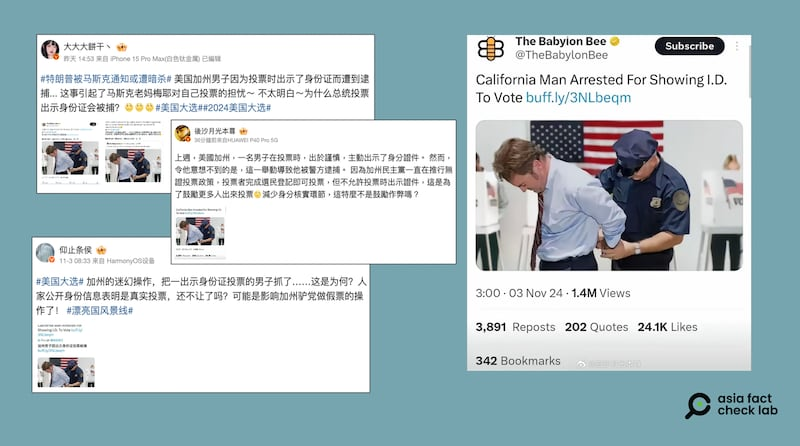
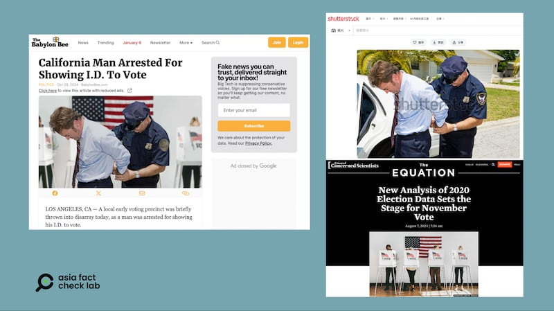

# 事實查覈｜加州男子因投票時出示身份證被逮捕？

作者：莊敬

2024.11.04 18:48 EST

## 查覈結果：錯誤

## 一分鐘完讀：

近日，“美國加州男子因爲投票時出示了身份證而遭到逮捕”的消息在社媒傳播，並附有一張警察在“投票所”逮捕一名男子的照片。經查，網傳消息來自發布虛構信息的諷刺網站“巴比倫蜜蜂”。至於網傳警察在投票所逮捕男子的照片，經以圖反搜發現，畫面中警察逮捕男子的圖像與2008年圖片庫中的舊照相同，但原圖背景是房屋與街道，並非投票所。AFCL判斷網傳照片極可能是變造背景的假照片。

## 深度分析：

2024年美國大選日前夕,社媒上傳出"美國加州男子因爲投票時出示了身份證而遭到逮捕"的消息,包括中國微博上多位"大V"用戶( [1](https://m.weibo.cn/detail/5096960945821867), [2](https://m.weibo.cn/detail/5096638569779089), [3](https://m.weibo.cn/detail/5096543036113262))和X上的中文 [賬戶](https://x.com/congqianman1994/status/1852952401076256899)都轉發了這則信息,並附上消息來源的截圖,而截圖中的照片看起來是警察在投票所逮捕一名男子。

經檢視,該消息來源爲網站" [巴比倫蜜蜂](https://archive.ph/3fV4o)"(The Babylon Bee)。"巴比倫蜜蜂"的網站介紹表明,這是個發佈虛構信息的諷刺網站,自稱是"你可相信的假新聞"。

圖：社媒傳出美國加州男子因爲投票時出示了身份證而遭到逮捕的消息 圖截取自微博、X

亞洲事實查覈實驗室(Asia Fact Check Lab,下簡稱AFCL)以圖反搜發現,圖中的警察逮捕男子的形象,曾出現在圖庫網站" [Shutterstock](https://www.shutterstock.com/zh/image-photo/businessman-being-handcuffed-placed-under-arrest-17843134)",圖片檔案上傳日期顯示爲2008年9月。經比對兩張照片,警察與男子從形象到細節高度一致,但警察左臂上的徽章和照片背景不同,圖庫檔案照的背景爲房屋、車輛、道路,"巴比倫蜜蜂"文章配圖的背景則是投票所。

AFCL再以“投票所”“美國國旗”等英文關鍵字搜尋圖片，找到“憂思科學家聯盟”（Union of Concerned Scientists, UCS）一篇分析文章，其配圖爲四位選民在投票，中間牆上掛著美國國旗，圖說顯示照片出處爲“Getty Images”，而這張照片與“巴比倫蜜蜂”文章配圖的背景高度相似。根據上述影像證據，AFCL認爲網傳照片極可能經組合變造而成。

圖：“巴比倫蜜蜂”文章配圖（圖左）中的警察與男子曾出現在圖庫網站2008的檔案照（圖右上），但兩張照片的背景不同；AFCL還找到與“巴比倫蜜蜂”配圖背景高度相似的投票所照片（圖右下）。圖取自The Babylon Bee、Shutterstock、UCS

AFCL以中、英文關鍵字查詢,沒有找到主流媒體報道近日有加州男子因投票時出示身份證而被逮捕的消息,但發現不少知名社媒用戶( [1](https://twitter.com/elonmusk/status/1851391793553936416), [2](https://x.com/mayemusk/status/1852868333504540685))轉傳"巴比倫蜜蜂"的文章。這些中、英文社媒賬號在轉傳信息時,並未註明消息來自諷刺網站,而擴大傳播了虛構內容,讓不少網民信以爲真。

根據加州州務卿網站 [說明](https://www.sos.ca.gov/elections/voting-resources/voting-california/what-bring),一般情況下,不要求加州選民在投票前出示身份證。如果是在郵寄或在線登記後第一次投票,並且沒有在登記申請上提供加州身份證號、駕照號或社會保險號碼最後4位數,則在投票時可以請選民出示身份證。

每逢選舉,投票措施成爲政治爭議話題,而加州州長紐森(Gavin Newsom)日前簽署通過 [SB1174號法案](https://leginfo.legislature.ca.gov/faces/billNavClient.xhtml?bill_id=202320240SB1174),禁止地方政府立法強制選民投票前出示身份證明,引起部分人士批評,質疑這項法案損害投票合法性。已有機構查覈 [與此法案相關的不實信息](https://www.politifact.com/factchecks/2024/aug/30/instagram-posts/a-new-california-bill-wont-eliminate-voter-id-at-p/)。

美國總統大選投票日臨近,網上流傳質疑選舉公正性的消息,AFCL亦發佈查覈報告: [《美總統大選提前投票,"作票"流言又來了》](2024-11-03_事實快查 ｜ 美總統大選提前投票，「作票」流言又來了.md)。

*亞洲事實查覈實驗室(Asia Fact Check Lab)針對當今複雜媒體環境以及新興傳播生態而成立。我們本於新聞專業主義,提供專業查覈報告及與信息環境相關的傳播觀察、深度報道,幫助讀者對公共議題獲得多元而全面的認識。讀者若對任何媒體及社交軟件傳播的信息有疑問,歡迎以電郵*  [*afcl@rfa.org*](mailto:afcl@rfa.org)  *寄給亞洲事實查覈實驗室,由我們爲您查證覈實。* *亞洲事實查覈實驗室在X、臉書、IG開張了,歡迎讀者追蹤、分享、轉發。X這邊請進:中文*  [*@asiafactcheckcn*](https://twitter.com/asiafactcheckcn)  *;英文:*  [*@AFCL\_eng*](https://twitter.com/AFCL_eng)  *、*  [*FB在這裏*](https://www.facebook.com/asiafactchecklabcn)  *、*  [*IG也別忘了*](https://www.instagram.com/asiafactchecklab/)  *。*

[Original Source](https://www.rfa.org/mandarin/shishi-hecha/hc-californian-man-voter-id-issue-11042024184752.html)