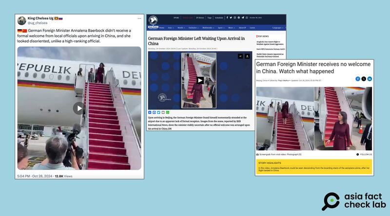

# 事實查覈｜德國外交部長出訪印度 下機時無人接待？

作者：莊敬

2024.11.06 13:49 EST

## 查覈結果：錯誤

## 一分鐘完讀：

近日，中國社交媒體微博平臺上，有多位影響力用戶發佈一則短視頻，畫面是德國外交部長貝爾伯克步下飛機。配文稱這是貝爾伯克訪問印度時抵達德里機場時的情景，停機坪上無人迎接，她顯得很驚訝。進一步查證發現，該圖片還有另一版本解讀，被印度、伊朗網絡媒體稱爲是貝爾伯克“訪問中國”時的場景。

經詢問德國外交部、與德國媒體新聞報道交叉印證，該網傳畫面實爲貝爾伯克於今年一月訪問馬來西亞時所拍攝。德國官方證實當時因溝通問題，班機停錯位置，因此貝爾伯克下機後走向在原定位置等待的馬來西亞官員。網傳所謂貝爾伯克抵達印度無人接待，爲錯誤信息。

## 深度分析：

多位微博"大V"用戶在10月28日、29日發佈同一則短視頻,包括粉絲七百多萬人的時政評論人" [司馬平邦](https://m.weibo.cn/detail/5094538618077938) ",以及軍事博主" [思想沸點](https://m.weibo.cn/detail/5094538618077938) "、互聯網科技博主" [大弟子Leo](https://m.weibo.cn/detail/5094572290736660) "等帳號。視頻內容是德國外交部長貝爾伯克(Annalena Baerbock)走下飛機後,短暫看向周遭,身旁人員隨即指引她走向某處。前述博主稱這是貝爾伯克訪問印度、抵達德里機場時無人迎接,她顯得很驚訝。

多個微博大V發佈德國外交部長貝爾伯克下機的視頻，稱她抵達印度時無人迎接。（圖取自微博）

## 同一張圖片，印度、伊朗傳另一版本假信息

在查覈的過程中,AFCL注意到,這則短視頻的另一版本在中、英文社媒上廣泛傳播,其敘述類似,只是將地點改成了中國,說是是貝爾伯克沒有受到中國官方的接待。發佈該版本信息的有發佈大量有親俄羅斯傾向信息的 [英文社媒帳號](https://twitter.com/ug_chelsea/status/1850825960980893773?ref_src=twsrc%5Etfw%7Ctwcamp%5Etweetembed%7Ctwterm%5E1850825960980893773%7Ctwgr%5E00ea1ba06ed4bd2965f45d36d2d4bfde02e920a6%7Ctwcon%5Es1_&ref_url=https%3A%2F%2Fwww.wionews.com%2Fworld%2Fgerman-foreign-minister-receives-no-welcome-in-china-watch-what-happened-771389) 、以及一家名爲"伊朗新聞通訊社"的 [新聞網站](https://iranpress.com/german-foreign-minister-left-waiting-upon-arrival-in-china) (AFCL注: 該網站英文名爲Iran Press News Agency,並非伊朗國家通訊社"IRNA"), [印度媒體"WION"](https://archive.ph/yc9QC) 還引述網民的帖子發佈報道,但AFCL於10月30日再度造訪報道頁面時,內容已刪除。

英文社媒帳號、新聞網站傳播德國外交部長貝爾伯克下機的畫面，稱這是她抵達中國時無人接待的景象。（圖取自X、WION、“Iran Press News Agency”網站）

## 網圖實爲馬來西亞接待失誤

亞洲事實查覈實驗室(Asia Fact Check Lab, 下簡稱AFCL)將視頻定格截圖,並以圖反搜,找到《 [德國之聲](https://www.dw.com/en/germany-strikes-balancing-act-in-southeast-asia/a-68000565) 》今年1月報道貝爾伯克訪問馬來西亞,報道搭配的照片中,貝爾伯克的服裝符合網傳視頻。進一步查詢貝爾伯克訪問馬來西亞的相關內容,發現 [德國駐馬來西亞吉隆坡大使館的Instagram帳號](https://www.instagram.com/reel/C2RUE4KAIDn/) ,曾發佈貝爾伯克訪問馬來西亞的影片,其中幾個片段符合網傳視頻。

德國外交部告訴AFCL，網傳影片確是貝爾伯克抵達馬來西亞時所拍攝，並證實她當時有受到馬來西亞官員的接待，只是當時因爲溝通出問題，飛機停的位置並不是之前安排的地方，而接待的官員則在原本安排的地點等候，所以貝爾伯克下機後，經過指引走向接待的官員。

此前,針對印度媒體所傳播的"中國不接待德國外長"說法,《今日印度》(India Today)已經 [發佈查覈報告](https://www.indiatoday.in/fact-check/story/fact-check-german-foreign-minister-annalena-baerbock-not-formally-welcomed-at-delhi-airport-2625115-2024-10-29) ,判定該信息爲錯誤。

*亞洲事實查覈實驗室(* *Asia Fact Check Lab* *)針對當今複雜媒體環境以及新興傳播生態而成立。我們本於新聞專業主義,提供專業查覈報告及與信息環境相關的傳播觀察、深度報道,幫助讀者對公共議題獲得多元而全面的認識。讀者若對任何媒體及社交軟件傳播的信息有疑問,歡迎以電郵 [afcl@rfa.org](mailto:afcl@rfa.org)*  *寄給亞洲事實查覈實驗室,由我們爲您查證覈實。*

*亞洲事實查覈實驗室在* *X* *、臉書、* *IG* *開張了,歡迎讀者追蹤、分享、轉發。* *X* *這邊請進:中文 [@asiafactcheckcn](https://twitter.com/asiafactcheckcn)*  *;英文: [@AFCL\_eng](https://twitter.com/AFCL_eng)*  *、 [FB在這裏](https://www.facebook.com/asiafactchecklabcn)*  *、 [IG也別忘了](https://www.instagram.com/asiafactchecklab/)*  *。*

[Original Source](https://www.rfa.org/mandarin/shishi-hecha/hc-german-foreign-minister-visit-india-without-reception-11062024134534.html)