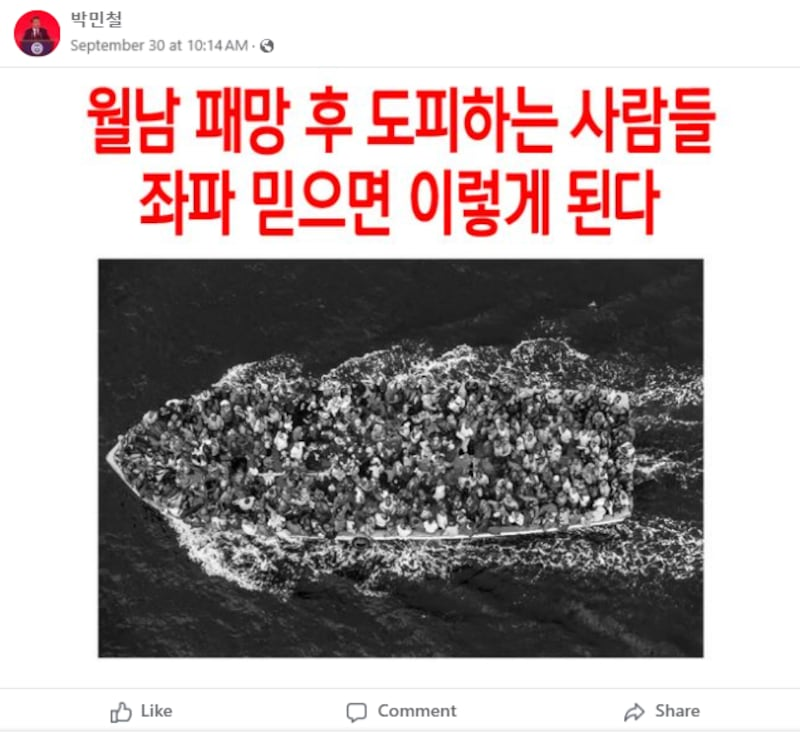
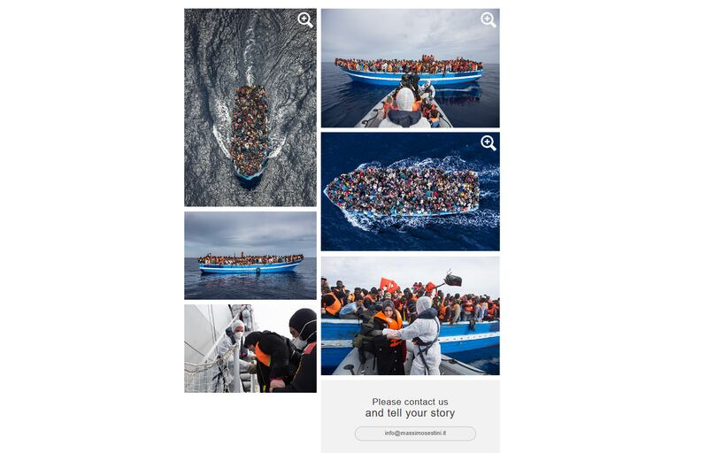

# 事實查覈｜這張照片是1970年代南越的海上難民嗎？

作者：Taejun Kang

2024.11.07 14:32 EST

## 查覈結果：錯誤

## 一分鐘完讀：

在韓國，社羣媒體流傳一張照片，內容爲載滿人的船隻，並聲稱是1975年南越政府在越戰中被北越共產黨軍隊擊敗後，從海上逃離的人們，意在用越戰的例子評論目前韓國的左派政治家。但事實上，這張照片是2014年意大利海軍在北非沿海救起尋求庇護者的照片。

## 深度分析：

這張流傳的 [照片](https://perma.cc/GL7U-SZ5D)顯示一艘船漂流在海上,船上擠了一大羣人。亞洲事實查覈實驗室(Asia Fact Check Lab)於2024年9月30日發現這張圖片在Facebook韓語賬號之間廣傳、分享。圖片被打上了字:"南越滅亡後,人們逃離。這就是你追隨左翼會發生的事。"

流傳一段時間之後，這張圖片已被移除。

Facebook虛假貼文的熒幕截圖。（Facebook截圖）

## 越戰後大量南越難民從海上逃亡

1975年，當時的南越首都西貢市被北越軍隊攻陷，標誌着越戰的結束和國家的統一，引發了南方難民的大規模逃亡。歷史上確實有此事件。

但前述這則貼文的說法是錯誤的。事實上，這張照片顯示的是意大利海軍在北非沿海救起的尋求庇護者。

AFCL透過反向圖像搜尋,在意大利攝影師塞斯蒂尼(Massimo Sestini)的網站上找到了 [原始照片](https://www.massimosestini.it/wru.html),以及同一場景、不同角度拍攝的其它照片。

該照片原圖來自意大利攝影師塞斯蒂尼。 （Massimo Sestini網站截圖）

該圖片標示時間爲2014年6月7日，圖說打着：“距離利比亞海岸20英里”。

經過進一步的反向圖像搜尋，這一張照片曾被多家國際媒體使用，其中包括《華爾街日報》於2015年3月26日的報導，照片圖說都寫着：“試圖穿越地中海、前往歐洲尋求庇護的移民擾亂了航運。上圖是6月意大利海軍在非洲海岸，營救遭遇海難的移民。”

*亞洲事實查覈實驗室(Asia Fact Check Lab)針對當今複雜媒體環境以及新興傳播生態而成立。我們本於新聞專業主義,提供專業查覈報告及與信息環境相關的傳播觀察、深度報道,幫助讀者對公共議題獲得多元而全面的認識。讀者若對任何媒體及社交軟件傳播的信息有疑問,歡迎以電郵*  [*afcl@rfa.org*](mailto:afcl@rfa.org)  *寄給亞洲事實查覈實驗室,由我們爲您查證覈實。* *亞洲事實查覈實驗室在X、臉書、IG開張了,歡迎讀者追蹤、分享、轉發。X這邊請進:中文*  [*@asiafactcheckcn*](https://twitter.com/asiafactcheckcn)  *;英文:*  [*@AFCL\_eng*](https://twitter.com/AFCL_eng)  *、*  [*FB在這裏*](https://www.facebook.com/asiafactchecklabcn)  *、*  [*IG也別忘了*](https://www.instagram.com/asiafactchecklab/)  *。*

[Original Source](https://www.rfa.org/mandarin/shishi-hecha/hc-1970s-south-vietnam-refugees-11072024143209.html)