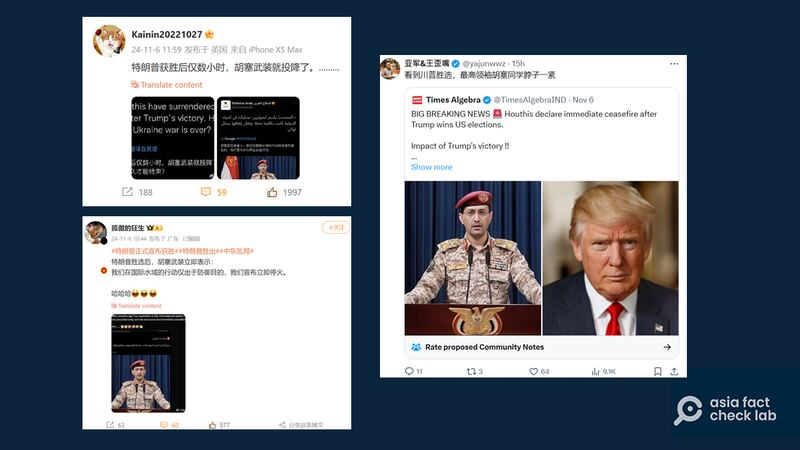
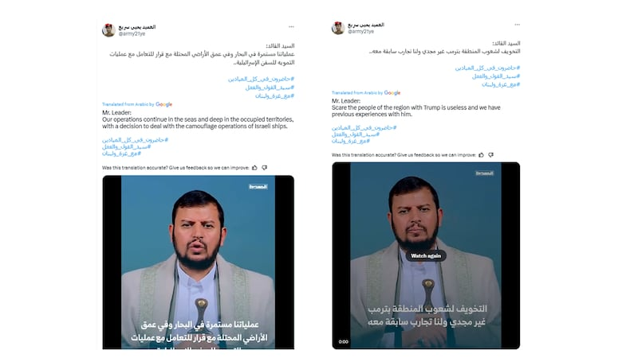

# 事實查覈｜特朗普一勝選，胡塞武裝就宣佈投降？

作者：鄭崇生（董喆對本報告有貢獻）

2024.11.08 16:29 EST

## 查覈結果：錯誤

## 一分鐘完讀：

美國總統大選結果在微博上引發熱議，因特朗普勝選，胡塞武裝立刻投降停火的傳聞也在微博上傳開，相關消息在X上亦有傳播。經查覈發現，沒有證據或可信報道顯示，胡塞武裝已做出所謂停火或投降的聲明。

另根據也門沙巴通訊社（SABA）報道，胡塞武裝領導人表態，無論特朗普或者拜登，都無法阻止他們支持巴勒斯坦。

## 深度分析：

近日,關於胡塞武裝在特朗普(Donald Trump,又譯作川普)勝選後立即停火投降的傳聞( [1](https://archive.ph/WCw8A)、 [2](https://archive.ph/wkdEk))在新浪微博上熱傳。

微博上熱傳美國大選結果導致胡塞武裝投降的消息 圖截取自新浪

亞洲事實查覈實驗室(以下簡稱AFCL)發現,這些中文帖子所引用的信息並非正規媒體發佈,但發佈者截取了也門武裝部隊發言人葉亞·薩雷伊(Yahya Sare'e) [X帳號上的視頻](https://archive.ph/xc924),並解讀稱胡塞武裝對外表示:"我們在國際水域的行動僅出於防禦目的,我們宣佈立即停火。"

AFCL發現,薩雷伊在X上發佈了胡塞運動領導人薩依德·阿卜杜勒·馬利克·胡塞(Al-Sayyid Abdul Malik Al-Houthi)的 [一段談話影像](https://archive.ph/YWgiY)。AFCL商請約旦查覈組Fatabyyano協助解讀這一段阿拉伯語談話,該組織記者赫雷斯(Loay Khreis)回信如下:

“在你發送的影片中，胡塞組織完全沒有提到想要停止紅海的攻擊。相反，薩依德·阿卜杜勒·馬利克·胡塞正號召人們參加週五的抗議行動。”

胡塞組織領導人講話視頻截圖

另外,也門武裝部隊發言人辦公室主任阿米恩·海揚(Ameen Hayyan)也轉發了胡塞談話的 [完整視頻](https://archive.ph/SZ5Gy)。赫雷斯說,在前述完整的演講中(時間標記:01:09:00處),他說的是"無論是特朗普還是拜登"都無法阻止他們"支持巴勒斯坦人民",沒有提到特朗普當選總統將使他們停止在紅海上的攻擊行動。

除微博外,在X上的 [中文社羣意見領袖](https://archive.ph/xZqUW)也有相似的說法,其所轉發的英文賬號推文更直接表明,胡塞武裝的停火表態,是特朗普勝選所帶來的效應,但推文下其實已有用戶在社羣筆記(Community Notes)註明,上述相關說法無根據。

有關胡塞武裝的新聞,在微博上常成爲網民討論的熱門話題,AFCL過去也曾針對在該平臺傳播的相關不實消息發佈過查覈報告 [1](2023-12-27_事實查覈｜胡塞武裝在紅海擊沉以色列船隻？.md)、 [2](2024-06-13_事實查覈｜胡塞武裝擊沉美國艾森豪威爾航母？這些影像移花接木.md)、 [3](2024-05-29_事實查覈｜網傳視頻顯示胡塞武裝擊沉美軍梅森號驅逐艦？.md)。

[美國國務院](https://www.state.gov/terrorist-designation-of-the-houthis/)今年1月將胡塞武裝(the Houthis)認定爲恐怖組織。半島電視臺(Aljazeera) [介紹](https://www.aljazeera.com/news/2024/1/12/who-are-yemens-houthis-a-basic-guide),在以哈衝突爆發後,胡塞武裝就因襲擊紅海上的商船而聲名大噪,這個在1990年代發跡的軍事團體,在2014年發起反對也門政府的武裝行動,導致也門深陷內戰,而胡塞武裝聲稱,在紅海上的打劫與攻擊行動,是針對支持以色列的各國商船,以藉此聲援巴勒斯坦。

聯合國(UN) [認定](https://yemen.un.org/en/about/about-the-un),深陷內戰的也門正發生世界上最嚴重的人道危機,約2400萬人(即八成也門人口)亟需"人道主義援助和保護"。

*亞洲事實查覈實驗室(Asia Fact Check Lab)針對當今複雜媒體環境以及新興傳播生態而成立。我們本於新聞專業主義,提供專業查覈報告及與信息環境相關的傳播觀察、深度報道,幫助讀者對公共議題獲得多元而全面的認識。讀者若對任何媒體及社交軟件傳播的信息有疑問,歡迎以電郵*  [*afcl@rfa.org*](mailto:afcl@rfa.org)  *寄給亞洲事實查覈實驗室,由我們爲您查證覈實。* *亞洲事實查覈實驗室在X、臉書、IG開張了,歡迎讀者追蹤、分享、轉發。X這邊請進:中文*  [*@asiafactcheckcn*](https://twitter.com/asiafactcheckcn)  *;英文:*  [*@AFCL\_eng*](https://twitter.com/AFCL_eng)  *、*  [*FB在這裏*](https://www.facebook.com/asiafactchecklabcn)  *、*  [*IG也別忘了*](https://www.instagram.com/asiafactchecklab/)  *。*

[Original Source](https://www.rfa.org/mandarin/shishi-hecha/hc-donald-trump-middle-east-issue-11082024162917.html)