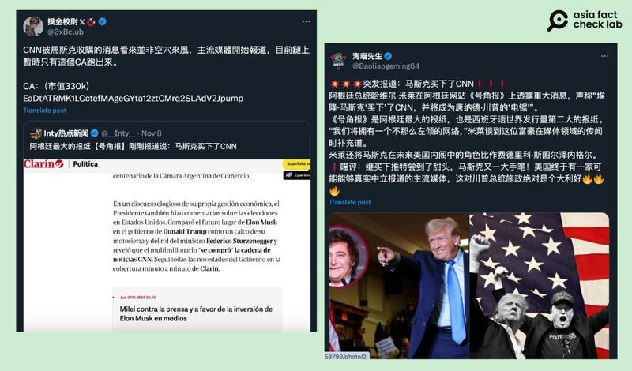

# 事實查覈｜特朗普勝選後，馬斯克買下CNN？

作者：艾倫

2024.11.11 11:20 EST

## 查覈結果：缺乏證據

## 一分鐘完讀：

在2024美國總統大選中，特朗普以312張選舉人票勝出，成爲下一屆美國總統。

特朗普宣佈勝選後，中英文社媒隨即流傳相關消息，稱馬斯克已經買下美國有線電視新聞網（CNN）。但經查，該傳言不僅沒有可信的消息來源，相關說法也早在選舉日前就已流傳，並經美國查覈組織闢謠。

**深度分析:** 本次選舉中,SpaceX創辦人、也是社媒平臺X的董事長埃隆馬斯克(Elon Musk)扮演舉足輕重的角色,不僅捐了共和黨超過一億元美金的政治獻金,也多次批評主流媒體袒護民主黨候選人哈里斯(Kamala Harris,中文又譯賀錦麗),並未如實呈現兩位候選人。

因此在特朗普當選後,X平臺上出現大量貼文( [1](https://x.com/0xBclub/status/1854769005493469695), [2](https://x.com/Baoliaogeming64/status/1854729750750658793), [3](https://x.com/__Inty__/status/1854756844645810644), [4](https://x.com/zhihui999/status/1854863997322903651), [5](https://x.com/__Inty__/status/1854754177559278027)),宣稱特朗普(Donald Trump,中文又譯川普)勝選後,馬斯克已買下美國有線電視新聞網(CNN),相關消息也被轉發到社媒 [Threads](https://www.threads.net/@prince56942/post/DCHckstyVpd?xmt=AQGzrM33dYacOWD_0rMkw7oLbL8yTGwb2eeCOElJVt0H7g)上。這些轉發相關消息的帳號大多借此提到馬斯克將會"整頓"美國左傾的主流媒體,讓他們重新開始平衡報道。

特朗普贏得2024美國總統大選後，網路上出現傳言稱馬斯克已買下美國有線電視新聞網（CNN）。(圖取自X)

AFCL檢查了這些傳言貼文,會發現許多用戶引用的資料來源是阿根廷報紙《號角報》的 [報道](https://www.clarin.com/politica/javier-milei-medidas-vivo-sabemos-podemos-contar-usted-hacer-grande-argentina-nuevamente-presidente-volvio-felicitar-trump-video-tiktok_0_DTVq8gP6KG.html?srsltid=AfmBOoppUmdGCNVXSSXvKPDqBAzvW8LdpphhnkA-A7vy7yuB3gnf167t),內容引述阿根廷總統哈維爾米萊(Javier Milei)對美國大選的評論。米萊將馬斯克在特朗普政府中未來的角色,比作自己和國家轉型與放松管制部長費德里科·斯圖爾岑內格(Federico Sturzenegger)的關係,並宣稱馬斯克已經收購了CNN ,但米萊沒有進一步提供任何證據,證明CNN已被收購。

AFCL另以英文關鍵字搜尋，並未找到任何可信報道指出CNN已被收購；馬斯克本人也不曾發表類似說法。

最近一次的相關傳言則是在10月20日於英文Threads上 [流傳](https://www.threads.net/@aladdinumar/post/DBWyTnUvY1X?fbclid=IwY2xjawGE9lNleHRuA2FlbQIxMAABHTX_x5z68m4i87E_OW3IS6AP_hLmjZ-0VOF4JsP6kgLOihH2GgC3dOyFgQ_aem_1LJBE_2Lg3X3kzzqxn_fkw),當時美國查覈機構Politifact已找出 [傳言源頭](https://www.google.com/url?q=https://archive.is/qYAER&sa=D&source=docs&ust=1731311423262926&usg=AOvVaw066XjbHCKUVM388KdEiPHi),是來自於SpaceXMania這個網站,該網站在 [自介頁面](https://spacexmania.com/about-us/#google_vignette)稱自己主要提供"最新鮮的假新聞"(freshest fake news),所以該傳言並非來自有公信力的消息來源。

此外，X上有不少仿冒馬斯克的帳號，其中一個帳號“Elon Musk (Parody)”曾經發文稱：“也許我應該乾脆買下福斯新聞和CNN，然後關掉它們。我這樣是在幫助人類”。可看出相關傳言皆不是來自本人。

綜合上述查覈內容，可得出網傳所謂「馬斯克買下CNN」的傳聞缺乏證據。

*亞洲事實查覈實驗室(Asia Fact Check Lab)針對當今複雜媒體環境以及新興傳播生態而成立。我們本於新聞專業主義,提供專業查覈報告及與信息環境相關的傳播觀察、深度報道,幫助讀者對公共議題獲得多元而全面的認識。讀者若對任何媒體及社交軟件傳播的信息有疑問,歡迎以電郵*  [*afcl@rfa.org*](mailto:afcl@rfa.org)  *寄給亞洲事實查覈實驗室,由我們爲您查證覈實。*

亞洲事實查覈實驗室在X、臉書、IG開張了,歡迎讀者追蹤、分享、轉發。X這邊請進:中文  [*@asiafactcheckcn*](https://twitter.com/asiafactcheckcn)  *;英文:*  [*@AFCL\_eng*](https://twitter.com/AFCL_eng)  *、*  [*FB在這裏*](https://www.facebook.com/asiafactchecklabcn)  *、*  [*IG也別忘了*](https://www.instagram.com/asiafactchecklab/)  *。*

[Original Source](https://www.rfa.org/mandarin/shishi-hecha/hc-musk-bought-cnn-after-trump-won-election-11112024111623.html)