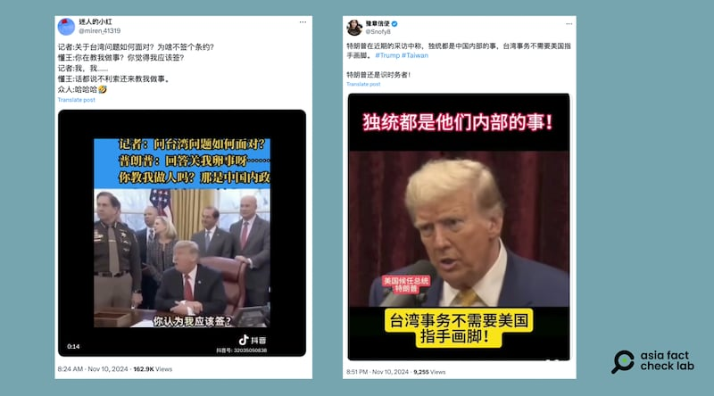

# 事實查覈｜特朗普當選後就稱：臺灣「是中國內政」？

作者：莊敬

2024.11.11 11:26 EST

## 查覈結果：錯誤

## 一分鐘完讀：

美國總統大選後，部分中文社媒帳號傳播當選人特朗普談論臺灣的影像。其中一則視頻顯示特朗普曾說「那是中國內政」，另有圖卡則指特朗普在近期的採訪中表態「(臺灣的)獨統都是中國內部的事」。

但經查兩者都是錯誤信息。視頻爲挪用2019年無關事件，搭配虛構的簡體中文字幕。至於圖卡，取自特朗普選前上podcast節目的畫面，而在該節目中，特朗普提及臺灣的晶片生意與保護費用，並沒有說出「獨統都是中國內部的事」。

## 深度分析：

2024年美國總統大選於當地時間11月5日舉行投開票，由共和黨候選人特朗普（Donald Trump，又譯川普）勝出。選後，中文世界關注特朗普對中國的態度、對臺海情勢的立場，但其中流傳不少錯誤信息。

亞洲事實查覈實驗室(Asia Fact Check Lab,下簡稱AFCL)多次查覈的X中文帳號 [「迷人的小紅」](https://twitter.com/miren_41319/status/1855406211044368752)在11月10日發佈一則21秒的短視頻,畫面是特朗普坐在白宮辦公桌簽署文件,視頻上疊加的簡體中文字幕寫着「記者:問臺灣問題如何面對?普朗普(應爲特朗普):回答關我卵事呀⋯⋯你教我做人嗎?那是中國內政」。

播放短視頻後發現,畫面中坐在辦公桌前的特朗普,正與前方的記者對話,但談話內容並未出現臺灣。 AFCL進一步以「特朗普」、「記者」、「員工」、「政府」、「記者」、「簽署」等出現在對話中的英文關鍵字查詢,發現原 [影片](https://www.youtube.com/watch?v=h3blpKa3OZU)出自美國有線電視新聞網(CNN),上傳日期爲2019年1月,場合是時任總統特朗普在簽署有關人口販運受害者保護法案時,與在場記者談到聯邦政府停擺危機,和臺海問題完全無關。

網傳視頻上的簡體中文字幕爲虛構內容，部分社媒帳號傳播了錯誤信息。

美國總統大選後，部分中文社媒帳號傳播總統當選人特朗普有關臺灣的言論。(圖取自X)

AFCL另注意到X上獲「藍勾勾」的中文帳號 [「豫章信使」](https://twitter.com/Snofy8/status/1855594151699763472)在11月10日發帖,指「特朗普在近期的採訪中稱,獨統都是中國內部的事,臺灣事務不需要美國指手畫腳。 」帖子並附上一張截圖,畫面是特朗普對着麥克風講話,搭配簡體中文字幕寫着「獨統都是他們內部的事!臺灣事務不需要美國指手劃腳!」

以圖反搜發現,網傳截圖符合特朗普在選前接受podcast節目「喬羅根體驗」(The Joe Rogan Experience)訪問的 [畫面](https://www.youtube.com/watch?v=hBMoPUAeLnY&t=10564s)。特朗普在節目中確實談及臺灣,指臺灣偷走美國的晶片生意,臺灣若要美國保護,就應該支付保護費,但他並沒有說出「獨統都是中國內部的事」。另以英文關鍵字搜尋,也未查到特朗普在近期的採訪中有說這番話。

而特朗普在選前接受《華爾街日報》採訪時 [曾說](https://www.reuters.com/world/trump-says-he-would-impose-tariffs-china-if-china-went-into-taiwan-2024-10-18/),如果中國「進入臺灣」,將對中國徵收150%至200%的關稅。而針對特朗普有關臺灣的發言,中國外交部發言人 [毛寧](https://www.fmprc.gov.cn/fyrbt_673021/jzhsl_673025/202411/t20241107_11522924.shtml)在11月7日的記者會上重申一貫立場,呼籲美國慎重處理涉臺問題。

*亞洲事實查覈實驗室(Asia Fact Check Lab)針對當今複雜媒體環境以及新興傳播生態而成立。我們本於新聞專業主義,提供專業查覈報告及與信息環境相關的傳播觀察、深度報導,幫助讀者對公共議題獲得多元而全面的認識。讀者若對任何媒體及社交平臺傳播的信息有疑問,歡迎以電郵*  [*afcl@rfa.org*](mailto:afcl@rfa.org)  *寄給亞洲事實查覈實驗室,由我們爲您查證覈實。*

亞洲事實查覈實驗室在X、臉書、IG開張了,歡迎讀者追蹤、分享、轉發。 X這邊請進:中文  [*@asiafactcheckcn*](https://twitter.com/asiafactcheckcn)  *;英語:*  [*@AFCL\_eng*](https://twitter.com/AFCL_eng)  *、*  [*FB在這裏*](https://www.facebook.com/asiafactchecklabcn)  *、*  [*IG也別忘了*](https://www.instagram.com/asiafactchecklab/)  *。*

[Original Source](https://www.rfa.org/mandarin/shishi-hecha/hc-trump-claimed-taiwan-is-now-domestic-chinese-politics-11112024112330.html)