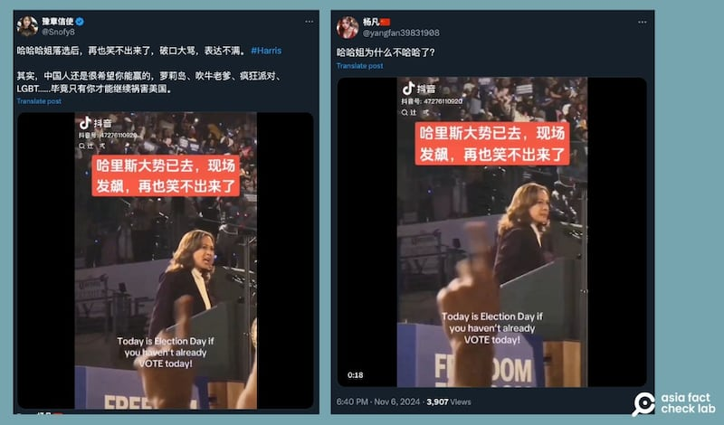
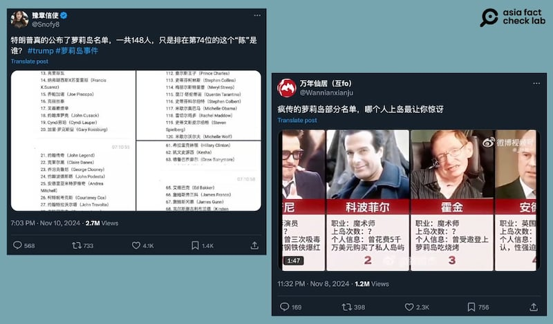
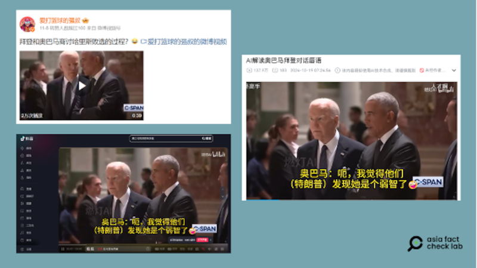
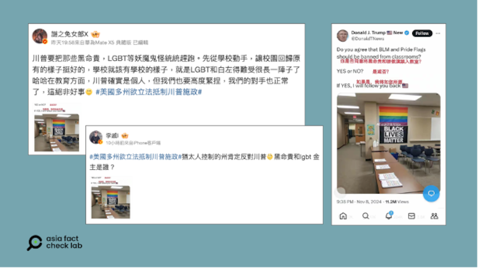

# 事實快查｜美大選後哈里斯發飆？特朗普宣佈將趕走LGBT？

作者：莊敬、艾倫

2024.11.12 18:23 EST

美國大選後，關於特朗普(Trump，或譯川普)和哈里斯(Kamala Harris，或譯賀錦麗)兩位候選人的各類信息在中文社交媒體平臺上大量流傳。亞洲事實查覈實驗室(Asia Fact Check Lab，下稱AFCL)查覈了其中流傳甚廣的幾則：

## 一、哈里斯敗選後，現場發飆視頻流出？

查覈結果：錯誤

11月6日至7日,X賬號" [楊凡](https://x.com/yangfan39831908/status/1854111555891466745)"及" [豫章信使](https://x.com/Snofy8/status/1854320148783800816)"轉發一則短視頻,內容是哈里斯對着人羣大喊:"我們不走回頭路"("We're not going back")。視頻上字幕寫着:"哈里斯大勢已去,現場發飆,再也笑不出來了"。"豫章信使"更是直接在文案寫道:"哈哈哈姐落選後,再也笑不出來了,破口大罵,表達不滿。"

美國2024年總統大選後，網路上流傳一段"哈里斯發飆"的視頻。(X截圖）

AFCL查覈後發現,美國公共電視網(PBS)曾 [直播](https://www.wpbstv.org/watch-live-beyonce-joins-kamala-harris-for-campaign-rally-in-houston-texas/)10月25日哈里斯在德州休士頓的造勢活動。當天,美國知名歌手碧昂絲也到場支持。視頻3小時57分處可以聽到,哈里斯和支持者開始一起喊"我們不走回頭路",一共喊了三次。

哈里斯喊出該句話的語境是他們談到美國女性的生育自主權問題，她認爲美國不能在這個議題上“再走回老路”，並敦促支持者趕快投票，因當時距離選舉日只剩11天，德州已開放提前投票。

比對網傳視頻和PBS的直播，哈里斯穿的是同一套深紫色西裝外套搭配白色襯衫，所喊內容的次數語氣皆相同，判斷是同一場景。但當時還在選舉中，因此網傳畫面呈現的是哈里斯的造勢場合，並非如傳言所說是哈里斯發現自己“大勢已去”才“破口大罵”。

## 二、特朗普依照選舉約定，公佈“愛潑斯坦島”賓客名單？

查覈結果：沒有根據

近期多個X賬號轉發三張"愛潑斯坦島"(中文原名小聖詹姆斯島,又稱戀童癖島、蘿莉島)的賓客名單,稱特朗普實現選前承諾,揭露共148人在內的名單。其中" [豫章信使](https://x.com/snofy8/status/1855566968709124493?s=46&t=OcwRl26KwGrlCoefgaqyvw)"及" [萬年仙居](https://x.com/Wannianxianju/status/1854909766855770207)"轉發該消息至今,已累積將近四百萬的閱讀量。臺媒《新頭殼》也發表相關 [新聞](https://newtalk.tw/news/view/2024-11-12/944186),直接引用"豫章信使"的帖文。

中文互聯網上近期出現一份據稱是特朗普釋出的"愛潑斯坦島"登島名單（X截圖）

名單上出現不少政商名流，例如現任美國總統拜登、歌手蕾哈娜、企業家比爾∙蓋茲、英國皇室安德魯王子、美國前第一夫人米雪爾∙歐巴馬等。

“愛潑斯坦島”事件源於美國已故富豪愛潑斯坦（Jeffrey Epstein）生前所涉的多項性侵少女案件，其私人島嶼小聖詹姆斯島（Little St James Island）被認爲是愛潑斯坦與其他可能牽涉其中的名人一起對未成年人實施犯罪的地方。

美國 [國家廣播公司](https://www.nbcnews.com/tech/jeffrey-epstein-document-release-online-speculation-conspiracies-rcna132380)(NBC)及 [英國廣播公司](https://www.bbc.com/news/world-us-canada-67861498)(BBC)等媒體皆曾報導目前美國法院已同意公開的相關法律文件,其中可看到許多國際名人曾出現在愛潑斯坦的人脈網絡裏,如美國前總統比爾∙克林頓(Bill Clinton)及即將上任的特朗普,但並沒有證據顯示他們也涉嫌犯罪。

根據美國解釋性新聞媒體Vox的 [報道](https://archive.ph/lseDf#selection-1581.0-1585.18),由於這些文件在社媒上常被誤傳爲愛潑斯坦潛在客戶或共謀者的"名單",實際上,文件中提到的許多人並未被指控有不當行爲,而這些檔案也並非如部分人推測的"客戶名單"。

特朗普日前曾 [喊話](https://nypost.com/2024/09/03/us-news/trump-suggests-hell-release-jeffrey-epstein-client-list-if-elected/),若他當選,將會公佈曾登上該島的客戶名單。但AFCL搜尋主流媒體及網絡後,並沒有發現可信的媒體或信息來源發佈了所謂"登島客戶名單",特朗普本人也沒有發表相關談話或信息,因此前述社媒發表的所謂"賓客名單",爲沒有根據的信息。

AFCL致信詢問特朗普辦公室，至截稿（11月12日）前未獲回應。

## 三、網傳視頻顯示拜登、奧巴馬在商討哈里斯敗選過程？

查覈結果：錯誤

美國總統大選後, [微博](https://m.weibo.cn/detail/5097481866056746)、抖音( [1](https://v.douyin.com/iAapG18w), [2](https://v.douyin.com/iAapXc8M), [3](https://v.douyin.com/iAas1EE6))上多個賬號傳播了同一則短視頻,畫面是美國總統拜登(Joe Biden)與前總統奧巴馬(Barack Obama)在某個場合談話。

在網傳短視頻的字幕中，拜登詢問奧巴馬“哈里斯還好嗎？”奧巴馬回說：“她沒戲了。我覺得他們發現她是個弱智了，現在我們基本上完蛋了，特朗普在大選投票中輾壓了我們......”。拜登又問：“如果我回來再次參選總統呢？”奧巴馬說，“你不可能再參選了”。

美國總統大選後，微博、抖音等中文平臺用戶瘋傳美國總統拜登與前總統奧巴馬對話的短視頻。（微博、抖音、B站截圖）

經查, [原始畫面](https://www.c-span.org/video/?539264-1/ethel-kennedy-memorial-service)是今年10月拜登與奧巴馬出席艾瑟∙肯尼迪(Ethel Kennedy)的追悼會時交談的情景。當時 [《紐約郵報》](https://nypost.com/2024/10/17/us-news/biden-told-obama-shes-not-as-strong-as-me-and-ex-prez-agreed-thats-true-at-ethel-kennedy-funeral/)請脣語師弗里曼(Jeremy Freeman)解讀,指拜登對奧巴馬說"她不如我強",奧巴馬錶示"我知道,這是真的"。雖然這段解讀未直接提到哈里斯的名字,但報道稱"很難想象這段對話還能指誰",而這篇報道引起了相當大的討論,亦有不少人質疑脣語解讀的準確性。

《紐約郵報》的報道中也引述拜登發言人貝茲（Andrew Bates）回應表示：“這絕對不是（他們的對話內容）。”

而在選後,社媒上再度瘋傳這則配上簡體中文字幕的短視頻。經查,多位網民轉發的短視頻取自視頻網站 ["B站"](https://www.bilibili.com/video/BV15ZCDYEEbk/?spm_id_from=333.337.search-card.all.click)(bilibili),其標題爲"AI解讀奧巴馬拜登對話脣語",視頻上方標註"該內容疑似使用AI技術合成,請謹慎甄別"。部分社媒賬號( [1](https://m.weibo.cn/detail/5098403031942063), [2](https://m.weibo.cn/detail/5098175222780255))轉傳時有註明是AI配音、純屬虛構,但也有多個抖音賬號發佈視頻時未有任何說明。

## 四、特朗普宣佈將趕跑BLM和LGBT？

查覈結果：錯誤

有微博"大V"用戶( [1](https://m.weibo.cn/detail/5099252117668635), [2](https://m.weibo.cn/detail/5099320800182799))轉傳社媒截圖,稱特朗普"要把黑命貴(BLM,黑人的命也是命)、LGBT等妖魔鬼怪"統統趕跑。截圖上文字寫着,"你是否同意BLM 和驕傲旗幟禁入教室?請選擇是或否。如果是,我將如你所願。"

但截圖來源爲X上的藍勾勾賬號 ["Donald J. Trump News (@DonaldTNews)"](https://x.com/donaldtnews?lang=en),簡介寫着"無隸屬關係"(no affiliation),並非特朗普的社媒賬號,亦無證據顯示上述社媒賬號可代表特朗普發言。

微博"大V"用戶轉傳社媒截圖，稱美國總統當選人特朗普要把BLM、LGBT等"妖魔鬼怪統統趕跑"。（微博截圖）

*亞洲事實查覈實驗室(Asia Fact Check Lab)針對當今複雜媒體環境以及新興傳播生態而成立。我們本於新聞專業主義,提供專業查覈報告及與信息環境相關的傳播觀察、深度報道,幫助讀者對公共議題獲得多元而全面的認識。讀者若對任何媒體及社交軟件傳播的信息有疑問,歡迎以電郵*  [*afcl@rfa.org*](mailto:afcl@rfa.org)  *寄給亞洲事實查覈實驗室,由我們爲您查證覈實。* *亞洲事實查覈實驗室在X、臉書、IG開張了,歡迎讀者追蹤、分享、轉發。X這邊請進:中文*  [*@asiafactcheckcn*](https://twitter.com/asiafactcheckcn)  *;英文:*  [*@AFCL\_eng*](https://twitter.com/AFCL_eng)  *、*  [*FB在這裏*](https://www.facebook.com/asiafactchecklabcn)  *、*  [*IG也別忘了*](https://www.instagram.com/asiafactchecklab/)  *。*

[Original Source](https://www.rfa.org/mandarin/shishi-hecha/hc-harris-trump-after-election-fact-check-11122024181236.html)