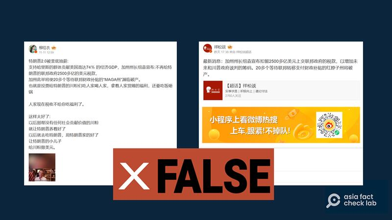
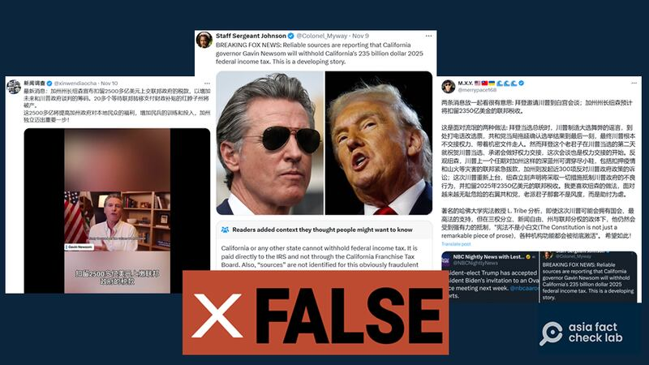
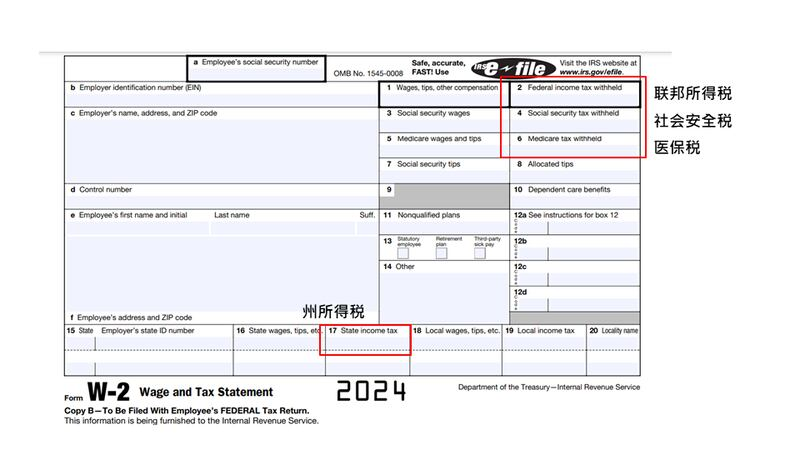

# 事實查覈｜加州州長將扣下千億聯邦稅對抗特朗普？

作者：鄭崇生

2024.11.13 14:26 EST

## 查覈結果：錯誤

## 一分鐘完讀：

美國前總統特朗普（Donald Trump）即將入主白宮，社交媒體平臺X及中國的新浪微博上都傳出民主黨籍加州州長加文·紐森準備祭出一連串行政手段，以對抗特郎普主政的聯邦政府，包括“扣下2500億（一說爲2350億）美元的聯邦稅不上繳”。

但加州州長辦公室告訴亞洲事實查覈實驗室（AFCL），“這絕對是錯誤的（說法）”。 AFCL進一步查覈也發現，美國的稅收制度設計，不存在能使州政府扣留聯邦稅收的機制。

## 深度分析：

"紐森扣下聯邦稅不上繳"的相關信息,典型的內容就如X平臺中文帳號" [新聞調查](https://archive.ph/LsGWJ)",它擷取加文·紐森(Gavin Newsom)8日在一場線上會議的談話 [視頻片段](https://x.com/GavinNewsom/status/1855322761515958689),並另外加註中文旁白宣稱紐森扣留稅款,是爲了"增加未來和川普政府談判的籌碼"。

發文者甚至自行推論衍申稱:一旦加州稅款不上繳,"20多個等待聯邦轉移支付財政補貼的紅脖子州將破產",同時這些稅款將用來"提高加州政府對本地民衆的福利,增加民兵的訓練和投入",更將使"加州獨立邁出重要一步!"在微博上傳開的相關消息( [1](https://archive.ph/KGZxi)、 [2](https://archive.ph/dCyfs)),內容也大致相同。

有微博賬戶稱加州州長將"扣留聯邦稅款作爲與特朗普政府談判籌碼"（微博截圖）

X平臺帳號 [M.X.Y.](https://archive.ph/aNihJ) 則引用了英文帳號" [約翰遜中士](https://archive.ph/OKzHG)"(Staff Sergeant Johnson)的發文,文中有一幅聲稱來自福斯新聞網報道的截圖,做爲紐森截留稅款,準備對抗聯邦政府的證明。

X平臺也有不少中英文賬號傳播加州州長將扣押加州的聯邦稅款的錯誤信息（X截圖）

但亞洲事實查覈實驗室查覈（Asia Fact Check Lab, AFCL）後發現，福斯新聞並沒有這樣的報道。 ”M.X.Y.”帳號推文下已經有其他X用戶加註：“加州不可能扣留聯邦稅收”。

此外,"新聞調查"引述的新聞片段,的確是紐森在選後首次面對鏡頭 [發表談話](https://x.com/GavinNewsom/status/1855387232225632745)。但AFCL檢視後發現內容是要求州議會提前召開特別會議(special session),希望在州政府層級儘快落實像是保護婦女墮胎權利在內的"生育自由"等政策。AFCL檢視此次會議的公開信息,發現紐森完全沒有提到希望州議會支持的預算金額具體數字,更沒有所謂上述要扣留聯邦政府稅款的說法。

AFCL另向加州州長辦公室查詢,辦公室以背景說明的方式回覆AFCL電子郵件詢問時、明確否認上述說法,並附上紐森在6日針對選舉結果的 [書面聲明](https://www.gov.ca.gov/2024/11/06/2024-presidential-results/)指出,"加州將尋求與即將上任的總統合作",但也打算與全國各州站在一起,捍衛憲法,維護法治。

## 州政府可以"扣押"聯邦稅嗎？

至於在美國的體制下，州政府有沒有可能”扣留聯邦稅不上繳”？答案是否。

美國國務院全球公共事務局就曾經 [發文解釋](https://archive-share.america.gov/zh-hans/does-the-u-s-federal-government-collect-tax-revenues-from-state-governments/),各州政府並沒有向聯邦政府上交稅款的義務與責任,聯邦政府的稅收的徵收方式,則是"直接向個人、企業等徵收工資稅、所得稅、遺產稅、消費稅、關稅等"。

例如,每年初開始的報稅季節,不少人都會從僱主處收到過去一年工資和稅收 [W-2表格](https://www.irs.gov/pub/irs-pdf/fw2.pdf),並要向聯邦國稅局與所在州政府、以及地方政府分別申報收入,辦理退稅或者補繳稅款。

W-2表格說明 （圖說：IRS官網W-2表格範本/AFCL加註）

關於聯邦政府的徵稅權力,規定在美國 [《憲法》第八條](https://www.archives.gov/founding-docs/constitution-transcript)中,另外,《憲法》 [第16修正案](https://www.archives.gov/founding-docs/amendments-11-27)於1913年通過後,更明確了國會有權對任何來源的收入課徵所得稅,且無須在各州按比例分配,也無須考慮任何人口普查或人口統計。

*亞洲事實查覈實驗室(Asia Fact Check Lab)針對當今複雜媒體環境以及新興傳播生態而成立。我們本於新聞專業主義,提供專業查覈報告及與信息環境相關的傳播觀察、深度報道,幫助讀者對公共議題獲得多元而全面的認識。讀者若對任何媒體及社交軟件傳播的信息有疑問,歡迎以電郵*  [*afcl@rfa.org*](mailto:afcl@rfa.org)  *寄給亞洲事實查覈實驗室,由我們爲您查證覈實。* *亞洲事實查覈實驗室在X、臉書、IG開張了,歡迎讀者追蹤、分享、轉發。X這邊請進:中文*  [*@asiafactcheckcn*](https://twitter.com/asiafactcheckcn)  *;英文:*  [*@AFCL\_eng*](https://twitter.com/AFCL_eng)  *、*  [*FB在這裏*](https://www.facebook.com/asiafactchecklabcn)  *、*  [*IG也別忘了*](https://www.instagram.com/asiafactchecklab/)  *。*

[Original Source](https://www.rfa.org/mandarin/shishi-hecha/hc-california-governor-to-withhold-federal-taxes-fact-check-11132024142001.html)