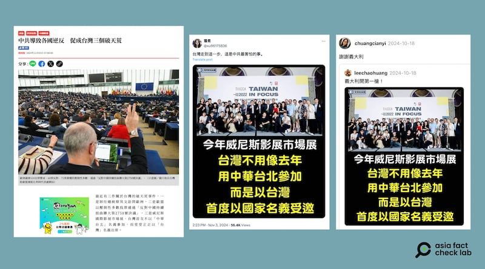

# 事實查覈｜ 臺灣參加威尼斯影展，首次拒絕使用“中華臺北”？

作者：莊敬

2024.11.15 14:29 EST

## 查覈結果：錯誤

## 一分鐘完讀：

臺灣媒體《上報》近日轉載一篇臉書文章，宣稱“威尼斯國際影展市場展，臺灣首次不以‘中華臺北’名義參加，而堂堂正正以‘臺灣’名義出席。”在社媒上，也有多位用戶傳播相似內容。但經查證，臺灣文策院之前並沒有以“中華臺北”名義參加威尼斯展會的紀錄，因此網傳消息並不正確。

## 深度分析：

臺灣網路媒體《 [上報](https://archive.ph/R19UQ)》11月3日刊登一篇轉載自臉書的文章,指出最近有三件關於臺灣的破天荒事件,其中一件是威尼斯國際影展巿場展,臺灣首次不以"中華臺北"名義參加,而堂堂正正以"臺灣"名義出席。

亞洲事實查覈實驗室(Asia Fact Check Lab,下簡稱AFCL)搜尋後發現,今年10月、11月間,在 [X](https://x.com/xu96175836/status/1852959878672969957)、 [Threads](https://www.threads.net/@chuangcianyi/post/DBRFqPrS0DC)等社媒平臺上,有多位用戶傳播相似內容的圖卡,寫着"今年威尼斯影展市場展,臺灣不用像去年用中華臺北參加,而是以臺灣,首度以國家名義受邀"。圖卡上搭配的照片,人羣后的背板可見"2022"、"第79屆意大利威尼斯影展暨市場展 行前記者會"等文字。

臺灣媒體與社媒傳出消息，指今年威尼斯國際影展市場展，臺灣首次不以“中華臺北”名義參加，而是以“臺灣”名義出席。（圖取自《上報》、X、Threads）

進一步以圖卡上的照片反搜,找到 [2022年的報道](https://www.cna.com.tw/postwrite/chi/322409),指當年臺灣首度獲邀成爲威尼斯影展市場展主題國之一,但內容並無提到過往臺灣是以"中華臺北"名義參加。其他 [相關報道](https://www.voacantonese.com/a/Taiwan-demands-correction-blames-China-for-Venice-film-fest-name-change-20210810/5997433.html)顯示,往年威尼斯影展期間,曾發生臺灣入圍影片的出品國籍被標註成"中華臺北"的爭議事件,但這是關於入圍影片,並非近期網傳的市場展。

AFCL詢問文化內容策進院(文策院),臺灣是否曾以"中華臺北"名義參加威尼斯國際影展市場展,其公共關係室回覆表示,2022年市場展的部分,臺灣跟威尼斯影展合作,以"臺灣主題國"的名義展出;沉浸式影展的部分,臺灣自2019年以來,曾以"Taiwan"和"Taipei"的名義參加,但文策院並沒有以"中華臺北"名義參加威尼斯展會的紀錄。另根據 [新聞稿](https://taicca.tw/article/0f94fa35),第81屆威尼斯國際影展於8月28日至9月7日舉行,文策院今年持續於威尼斯"沉浸式內容市場展"設立實體與線上臺灣館(Taiwan Pavilion)。

因此，網傳所謂“今年威尼斯影展市場展，臺灣不用像去年用‘中華臺北’參加，而是首度以‘臺灣’名義受邀”的說法，爲錯誤信息。

*亞洲事實查覈實驗室(Asia Fact Check Lab)針對當今複雜媒體環境以及新興傳播生態而成立。我們本於新聞專業主義,提供專業查覈報告及與信息環境相關的傳播觀察、深度報道,幫助讀者對公共議題獲得多元而全面的認識。讀者若對任何媒體及社交軟件傳播的信息有疑問,歡迎以電郵*  [*afcl@rfa.org*](mailto:afcl@rfa.org)  *寄給亞洲事實查覈實驗室,由我們爲您查證覈實。* *亞洲事實查覈實驗室在X、臉書、IG開張了,歡迎讀者追蹤、分享、轉發。X這邊請進:中文*  [*@asiafactcheckcn*](https://twitter.com/asiafactcheckcn)  *;英文:*  [*@AFCL\_eng*](https://twitter.com/AFCL_eng)  *、*  [*FB在這裏*](https://www.facebook.com/asiafactchecklabcn)  *、*  [*IG也別忘了*](https://www.instagram.com/asiafactchecklab/)  *。*

[Original Source](https://www.rfa.org/mandarin/shishi-hecha/hc-taiwan-chinese-taipei-film-festival-11152024142847.html)