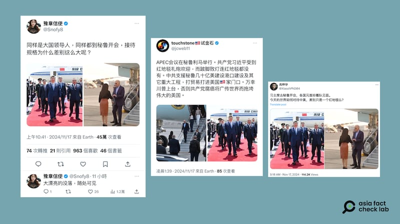
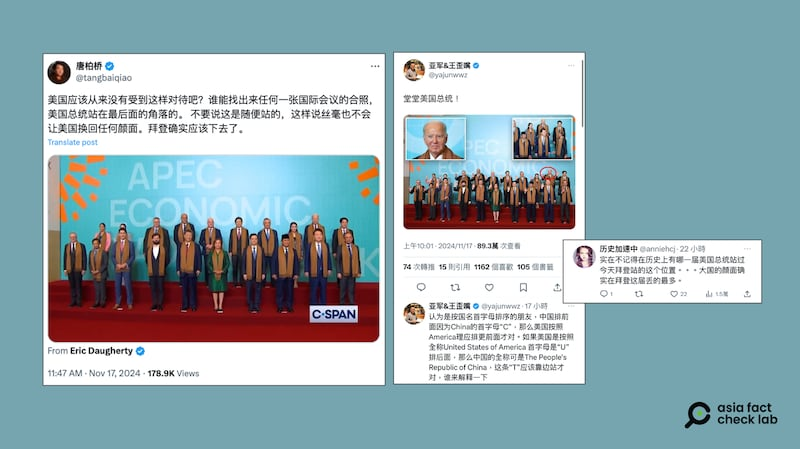
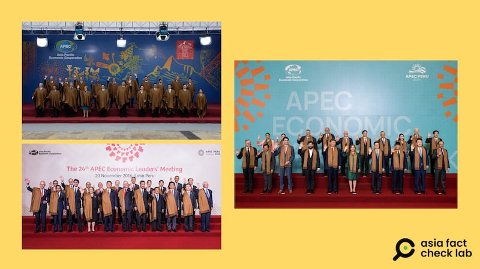

# 事實查覈｜祕魯APEC禮遇習近平冷落拜登？

作者：莊敬

2024.11.19 13:13 EST

## 查覈結果：誤導

2024年亞太經濟合作經濟領袖會議（APEC Economic Leaders' Meeting, AELM）於11月15日至16日在祕魯首都利馬召開，包括美國總統拜登（Joe Biden）、中國國家主席習近平等21個經濟體的領袖齊聚，外界關注即將卸任的拜登與各國領袖互動，以及在會議期間舉行可能是他任內最後一次的“拜習會”。

亞洲事實查覈實驗室（Asia Fact Check Lab，下簡稱AFCL）注意到，在X、網易等平臺上，有大量中文用戶傳播拜登與習近平在APEC被“差別對待”的圖文信息，AFCL查覈了其中傳播較廣的兩則。

## 一、APEC會議主辦方以不同規格接待來參會的習近平與拜登？

## 查覈結果：誤導

X上的中文賬號( [1](https://twitter.com/Snofy8/status/1857977228598063460), [2](https://x.com/XiaozhPhD04/status/1857956332206436423))以及 [網易文章](https://www.163.com/dy/article/JH5TB80605370GH5.html)比較了美國總統拜登與中國國家主席習近平分別抵達祕魯的照片,習近平下機走在紅毯上,拜登腳下則無紅毯,並藉此質疑祕魯對兩人接待規格差別大,解讀爲"美國沒落""對比中國差遠了"。

中文社媒用戶比較中國國家主席習近平與美國總統拜登抵達祕魯時的接待規格（X截圖）

經查,習近平此次赴利馬出席APEC領袖非正式會議並不僅僅是開會,同時也對祕魯進行了 ["國事訪問"](http://cpc.people.com.cn/BIG5/n1/2024/1116/c64094-40362463.html)(state visit)。與他類似的是, [馬來西亞總理安華](https://www.kln.gov.my/web/guest/-/official-visit-of-the-prime-minister-to-lima-peru-and-his-participation-at-the-asia-pacific-economic-cooperation-apec-economic-leaders-week-2024-13-16)、 [越南國家主席梁強](https://en.baochinhphu.vn/president-starts-official-visit-to-peru-111241113090606584.htm)也是同期對祕魯進行了"正式訪問"(official visit),根據媒體捕捉到的畫面, [安華](https://theedgemalaysia.com/node/733789)、 [梁強](https://en.nhandan.vn/state-president-arrives-in-lima-beginning-official-visit-to-peru-attendance-at-aelw-post141173.html)抵達利馬時,停機坪也鋪了紅地毯迎接。

據 [白宮聲明](https://www.whitehouse.gov/briefing-room/statements-releases/2024/11/07/statement-from-white-house-press-secretary-karine-jean-pierre-on-president-bidens-travel-to-peru-and-brazil/),美國總統拜登11月14日至16日前往利馬會見祕魯總統博魯阿爾特 ( Dina Boluarte ) ,強化雙邊關係,並參加APEC峯會。拜登、 [加拿大總理杜魯多](https://www.youtube.com/watch?v=0mm02Be7-Tc)等領袖,這次到利馬的目的是爲出席APEC會議,並非對祕魯進行國事訪問或正式訪問,停機坪上沒有鋪紅毯。部分網民比較了習近平和拜登的接待規格,卻忽略了兩者的訪問性質不同,而傳播誤導信息。

根據《美國之音》 [報道](https://www.voacantonese.com/a/japan-20150318/2685516.html),"國事訪問"是指他國元首的特殊訪問,接待規格包括晚宴和歡迎儀式。"正式訪問"是指他國政府領導人的訪問,接待規格則和國事訪問一致。

## 二、APEC領袖合照 美國總統第一次被安置到後排？

## 查覈結果：錯誤

在今年的APEC經濟領袖大合照中,習近平站在前排中間位置,拜登則站在後排右2, [《紐約郵報》](https://nypost.com/2024/11/16/us-news/biden-humiliated-with-back-corner-spot-in-apec-family-photo-as-chinas-xi-get-place-of-honor-in-front/)(New York Post)等媒體報道時,藉合照的位置安排,討論起美國地位、世界影響力,多家 [華文媒體](https://money.udn.com/money/story/5599/8365439)也引述外媒報道,引起熱議。

AFCL注意到社媒上出現針對拜登的特定信息,例如X上的 ["藍勾勾"中文賬號](https://twitter.com/tangbaiqiao/status/1857993946976202946)發佈APEC經濟領袖合照,稱"美國應該從來沒有受到這樣對待吧?誰能找出來任何一張國際會議的照片,美國總統站在最後面的角落的。"另有網民回複相關帖子時表示,"實在不記得在歷史上有哪一屆美國總統站過今天拜登站的這個位置,大國的顏面確實在拜登這屆丟得最多。"

中文社媒用戶轉傳APEC經濟領袖合照，指從未有美國總統站在拜登的位置。（X截圖）

上述網民的說法並不正確。

經查, [2016年](https://www.apec.org/press/photos/2016/1120_leaders#&gid=1&pid=21)的APEC會議也是由祕魯主辦,當時的美國總統奧巴馬(Barack Obama)站在後排右2。 [2008年](https://www.apec.org/meeting-papers/leaders-declarations/2008/2008_aelm)時任總統小布什(George W. Bush)出席APEC,也是站在同樣位置拍攝合照。

2008年（左上）、2016年（左下）、2024年（右）由祕魯主辦的APEC經濟領袖峯會，大合照中時任美國總統的奧巴馬和小布什都站在後排右2。（APEC網站截圖）

《彭博社》(Bloomberg) [報道](https://www.bloomberg.com/news/articles/2024-11-16/xi-takes-spotlight-in-apec-family-photo-with-biden-off-to-side?sref=TuLYJzYL)說明,APEC經濟領袖合照通常是按國家(經濟體)字母順序排列,但排列方式可能因所在國家或地區而有所不同。如2023年在美國舊金山舉行的APEC峯會上,各國領導人合影時,字母A開頭的國家的代表更接近主辦國的總統拜登,國家名稱爲C開頭的習近平站位較靠邊;今年在祕魯的APEC經濟領袖合照,字母A開頭的澳大利亞總理阿爾巴尼斯(Anthony Albanese)站在前排右1,C開頭的習近平站位靠中間。

根據 [APEC網站](https://www.apec.org/about-us/about-apec/policies-and-procedures)上公佈的 [會議舉辦指南](https://www.apec.org/docs/default-source/aboutus/policiesandprocedures/2023/guidelines-for-hosting-apec-meetings_updated-august-2023_approved-at-bmc2-2023.pdf?sfvrsn=315e8e21_2),對於舉辦經濟領袖會議的接待規格、相關安排,都是以主辦經濟體爲主,APEC並無規範。其中有關經濟領袖會議的座位安排,APEC建議安排以舒適度爲主,也沒有要求經濟領袖必須以字母順序排列,而是完全交由主辦國安排。(詳見指南第6頁至第8頁)

但是，APEC對於部長級會議與資深官員會議有明確排列順序（詳見指南第13頁），即是按照經濟體名稱首字母順序，從澳大利亞（Australia）開始，後依序爲汶萊、加拿大、智利、中國、香港、印尼、日本、韓國、馬來西亞、墨西哥、新西蘭、巴布亞紐幾內亞、祕魯、菲律賓、俄羅斯、新加坡、中華臺北、泰國、美國、越南。

據前述報道，白宮國安會發言人薩維特（Sean Savett）說明，今年APEC經濟領袖合照與2008年和2016年時的順序相同，但有幾位領袖站錯位置，而拜登正確地站在安排的位置上。

*亞洲事實查覈實驗室(Asia Fact Check Lab)針對當今複雜媒體環境以及新興傳播生態而成立。我們本於新聞專業主義,提供專業查覈報告及與信息環境相關的傳播觀察、深度報道,幫助讀者對公共議題獲得多元而全面的認識。讀者若對任何媒體及社交軟件傳播的信息有疑問,歡迎以電郵*  [*afcl@rfa.org*](mailto:afcl@rfa.org)  *寄給亞洲事實查覈實驗室,由我們爲您查證覈實。* *亞洲事實查覈實驗室在X、臉書、IG開張了,歡迎讀者追蹤、分享、轉發。X這邊請進:中文*  [*@asiafactcheckcn*](https://twitter.com/asiafactcheckcn)  *;英文:*  [*@AFCL\_eng*](https://twitter.com/AFCL_eng)  *、*  [*FB在這裏*](https://www.facebook.com/asiafactchecklabcn)  *、*  [*IG也別忘了*](https://www.instagram.com/asiafactchecklab/)  *。*

[Original Source](https://www.rfa.org/mandarin/shishi-hecha/hc-xi-jinping-snubs-biden-fact-check-11192024130713.html)