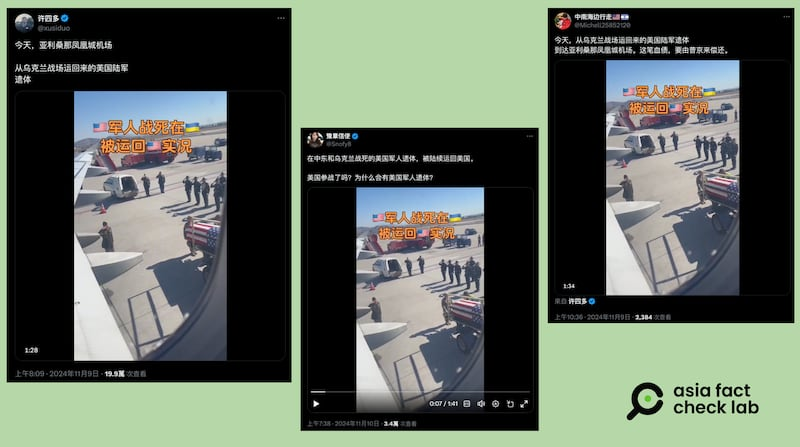
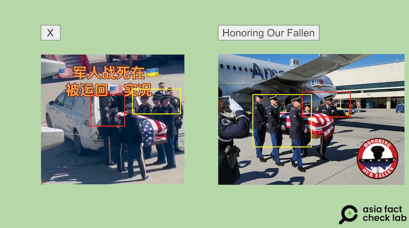
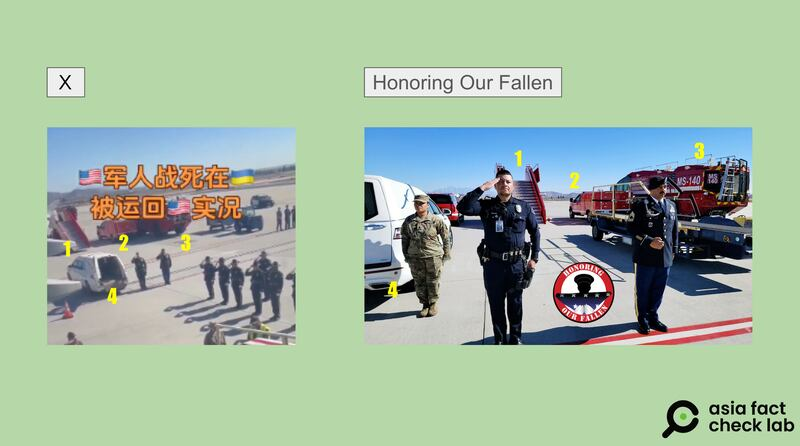

# 事實查覈｜美軍在烏克蘭戰死，遺體回家視頻曝光？

作者：董喆

2024.11.20 15:47 EST

## 查覈結果：錯誤

## 一分鐘完讀：

社媒X（原推特）近日有多個帳號貼出一部從飛機上運下一具棺木的視頻，宣稱這是“從烏克蘭戰場運回的美國陸軍遺體”，到達亞利桑那鳳凰城機場的實況。

亞洲事實查覈實驗室向對殉職美軍提供支持的非營利機構Honoring Our Fallen求證，該視頻地點爲加州安大略機場，視頻中運送的遺體，則屬於一位在二戰中喪生的軍人，他的遺骸因爲DNA技術進步而被確認身份。並且，根據美國官方政府文件，美國對烏克蘭的援助中並不包括派遣美軍部隊爲主。因此，前述流傳的爲錯誤信息。

## 深度分析：

一具覆蓋美國國旗的棺木移出飛機,並在6名軍人的陪伴下送上白色靈車。社羣平臺X近期流傳一則視頻, [最早發文者](https://archive.ph/JWmYP)稱畫面是自己在亞利桑那州鳳凰城機場拍下,並自行加上配樂與貼文:"美國軍人戰死在烏克蘭,被運回美國的實況"。數日後他改口這是在加州安大略機場,但仍維持視頻主角是戰死烏克蘭美軍的說法,並宣稱消息來源是機組人員。

社交軟件流傳一則運送美國國旗覆蓋棺木的視頻，稱這是"從烏克蘭戰場運回"的美軍遺體。（X截圖）

這則視頻被多方轉發, [有帳號](https://archive.ph/VInaO)以此譴責俄羅斯總統普京要償還這筆"血債", [亦有帳號](https://archive.ph/w7HL9)質疑,"美國參戰嗎?爲什麼會有美國軍人遺體?"並將這則傳言擴充爲"在中東和烏克蘭戰死的美國軍人遺體,被陸續運回美國"。

亞洲事實查覈實驗室（以下簡稱AFCL）查證，視頻中的消防車身上印有“ONTARIO FIRE DEPT.”，發生地點應該是美國加州的安大略機場。

進一步聯繫專門爲殉職美軍及其家屬提供支持的非營利組織“Honoring Our Fallen”，該組織創辦人及執行長Laura Herzog告訴AFCL，視頻中穿着棕色褲子和白色襯衫的正是他們的工作人員，視頻的儀式是爲了在二次世界大戰中陣亡的美國陸軍航空軍上等兵Harry M. Seiff，科學家以DNA技術確認了屍骨就是Seiff，並不是烏克蘭陣亡的美軍。

根據美國國防部視覺訊息分發部(DVIDS) [新聞稿](https://www.dvidshub.net/news/484769/remains-world-war-ii-soldier-buried-los-angeles-california), [Harry M. Seiff](https://www.dpaa.mil/News-Stories/ID-Announcements/Article/3867959/airman-accounted-for-from-wwii-seiff-h/)二戰期間被關押在菲律賓的戰俘營,死於1942年11月14日。 2023年12月18日Seiff的遺骨經美國國防部確認身份,從菲律賓馬尼拉美國公墓移出,並交由實驗室分析確認,今年11月14日安葬在加州洛杉磯國家公墓。

AFCL進一步比對Honoring Our Fallen提供的照片與視頻，從當中的影片人員組成以及車輛配置，可以確定兩者相符。因此網傳影片稱是烏克蘭戰死美軍返國的說法爲錯誤訊息，視頻實際上是二戰陣亡士兵的返家儀式。

網傳視頻中畫面與非營利組織“Honoring Our Fallen”發佈的照片對比可以見，多處人物、景物細節符合，應爲同一場景。（X截圖、Honoring Our Fallen發佈圖片）

根據10月16日 [白宮新聞稿](https://www.defense.gov/News/Releases/Release/Article/3937146/biden-administration-announces-additional-security-assistance-for-ukraine/),美國國防部宣佈提供額外安全援助,以滿足烏克蘭國防需求,但當中並不包含派兵。

2024年G7峯會召開期間,美國總統拜登與烏克蘭總統澤連斯基在峯會周邊的酒店簽署安全協議,白宮會後新聞稿 [記載](https://www.whitehouse.gov/briefing-room/speeches-remarks/2024/06/13/remarks-by-president-biden-and-president-volodymyr-zelenskyy-of-ukraine-in-joint-press-conference-fasano-italy/),拜登提到美國協助烏克蘭的方法不是派遣美軍部隊參加烏克蘭的戰鬥。

另外,美國國防部於 [9月發表的聲明](https://www.defense.gov/News/News-Stories/Article/Article/3918679/latest-security-assistance-for-ukraine-announced-white-house-directs-dod-to-all/)中指出,自 2022年2月俄羅斯入侵烏克蘭以來,美國已承諾通過總統授權和烏克蘭安全援助倡議向烏克蘭提供約563億美元的安全援助。國防部亦隨聲明 [公開援助清單](https://media.defense.gov/2024/Sep/26/2003554492/-1/-1/1/20240926-UKRAINE-FACT-SHEET-PDA-66-AND-USAI-T21.PDF),當中亦不包括派兵。

*亞洲事實查覈實驗室(Asia Fact Check Lab)針對當今複雜媒體環境以及新興傳播生態而成立。我們本於新聞專業主義,提供專業查覈報告及與信息環境相關的傳播觀察、深度報道,幫助讀者對公共議題獲得多元而全面的認識。讀者若對任何媒體及社交軟件傳播的信息有疑問,歡迎以電郵*  [*afcl@rfa.org*](mailto:afcl@rfa.org)  *寄給亞洲事實查覈實驗室,由我們爲您查證覈實。* *亞洲事實查覈實驗室在X、臉書、IG開張了,歡迎讀者追蹤、分享、轉發。X這邊請進:中文*  [*@asiafactcheckcn*](https://twitter.com/asiafactcheckcn)  *;英文:*  [*@AFCL\_eng*](https://twitter.com/AFCL_eng)  *、*  [*FB在這裏*](https://www.facebook.com/asiafactchecklabcn)  *、*  [*IG也別忘了*](https://www.instagram.com/asiafactchecklab/)  *。*

[Original Source](https://www.rfa.org/mandarin/shishi-hecha/hc-deceased-us-personnel-in-ukraine-found-fact-check-11202024154214.html)