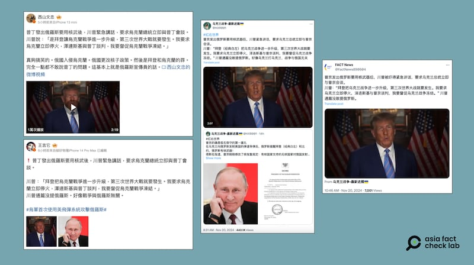
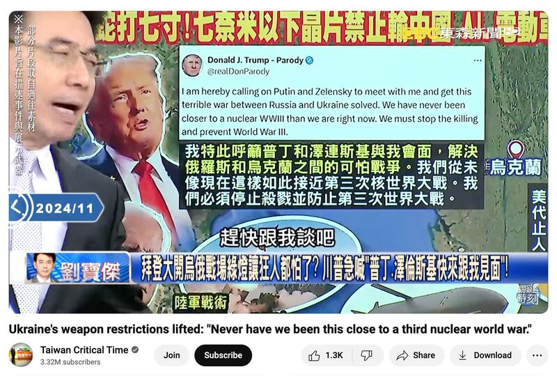

# 事實查覈｜特朗普發表緊急談話回應俄羅斯核武新原則？

作者：莊敬

2024.11.21 18:02 EST

## 查覈結果：錯誤

## 一分鐘完讀：

11月19日，俄羅斯總統普京簽署了核武器使用的新原則後，有社媒用戶發佈消息稱，美國總統當選人特朗普發佈了緊急講話，要求烏克蘭總統澤連斯基立即與普京會談。該消息附有一段2分多鐘的視頻，畫面是特朗普在談話。但經查，這段視頻最早發佈於2023年3月，且特朗普當時的言論並非針對近期俄烏情勢。至截稿爲止，特朗普本人尚未針對俄烏最新情勢發佈公開評論。部分網民挪用過往影像傳播了錯誤信息。

## 深度分析：

俄烏戰爭滿千日之際, [華盛頓允許烏克蘭使用美國武器](https://apnews.com/article/biden-ukraine-long-range-weapons-russia-52d424158182de2044ecc8bfcf011f9c)對俄羅斯本土發動攻擊,據 [報道](https://www.reuters.com/world/europe/ukraine-marking-1000-days-russian-invasion-eyes-end-war-next-year-2024-11-18/),烏克蘭已首度運用美國陸軍戰術飛彈系統(ATACMS)打擊俄羅斯領土。俄羅斯總統普京(Vladimir Putin,又譯普丁)於11月19日 [簽署法令](https://www.bbc.com/zhongwen/articles/c20g23266j2o/trad),批准降低俄羅斯使用核武器的門檻。修改後的政策稱,任何無核國家,在有核國家參與或支持下對俄羅斯的侵略,視爲對俄國的聯合攻擊。

亞洲事實查覈實驗室(Asia Fact Check Lab,下簡稱AFCL)注意到,多位微博用戶( [1](https://m.weibo.cn/detail/5102737364881323), [2](https://m.weibo.cn/detail/5102714956021819))和X中文賬號( [1](https://x.com/FactNews890604/status/1859065851015577703), [2](https://x.com/HXR001/status/1859031717539086511))於11月20日發帖,稱普京宣佈新原則後,美國總統當選人特朗普(Donald Trump,又譯川普)被嚇得緊急發表講話,要求烏克蘭總統澤連斯基(Volodymyr Zelensky,又譯澤倫斯基)立即與普京會談。

“川普：拜登把烏克蘭戰爭進一步升級，第三次世界大戰就要發生。我要求烏克蘭立即停火，澤連斯基與普京談判，我要敦促烏克蘭戰爭凍結。”這些帖子並附上一段2分多鐘的視頻，或是視頻截圖，畫面是特朗普發表談話。

中文社媒用戶近日發帖稱，在俄羅斯發佈核武新規後，美國總統當選人特朗普緊急講話。（微博、X截圖）

AFCL以英文關鍵字查詢後,找到了原始視頻。這段視頻最初發布在介紹特朗普政策和計劃的網站 ["Agenda47"](https://www.donaldjtrump.com/agenda47/agenda47-preventing-world-war-iii)上,長3分35秒,主題是如何避免第三次世界大戰,發佈日期爲2023年3月16日,因此特朗普的這段談話並非針對今年11月的俄烏情勢。

而且，即使在這段視頻中，特朗普也沒有說出要求烏克蘭總統立即與普京會談或要求烏克蘭立即停火等內容。也就是說，部分網民挪用過往影像評論當今事態，並在發文時加油添醋，傳播錯誤信息。

這段2023年發佈的影像近期在中、英文社媒廣傳,包括特朗普的"模仿"(parody)賬號"Donald J. Trump - Parody (@realDonParody)"在11月18日 [發帖](https://x.com/realDonParody/status/1858361662274781670),呼籲普京、澤連斯基與特朗普會面解決俄烏衝突,這則帖子也附上了特朗普2023年的視頻。

[臺灣政論節目](https://www.youtube.com/watch?v=Li9v8RHFQuU)引用了上述特朗普"模仿"賬號的帖子,主持人稱"我們看到川普都非常緊張了,川普緊張到什麼程度,他說澤倫斯基跟普丁趕快跟我談吧,現在這個世界已經非常危險了,這個世界已經接近了第三次世界大戰"。

臺灣政論節目引用美國總統當選人特朗普的"模仿"賬號發文 (YouTube截圖）

至本文截稿前,特朗普尚未針對俄烏情勢最新發展公開評論,僅有親近特朗普的人士針對拜登授權烏克蘭以ATACMS攻擊俄羅斯本土一事表態。據 [報道](https://www.washingtonpost.com/politics/2024/11/18/waltz-trump-ukraine-russia-atacms/),特朗普任命的白宮國家安全顧問瓦爾茲(Mike Waltz)表示,美國總統拜登的決定使俄烏戰事繼續升級,沒人知道事態會如何發展。特朗普的通訊總監史蒂文·張(Steven Cheung)指出,正如特朗普總統在競選過程中所說,他是唯一能夠讓雙方團結起來進行和平談判、努力結束戰爭的人。

*亞洲事實查覈實驗室(Asia Fact Check Lab)針對當今複雜媒體環境以及新興傳播生態而成立。我們本於新聞專業主義,提供專業查覈報告及與信息環境相關的傳播觀察、深度報道,幫助讀者對公共議題獲得多元而全面的認識。讀者若對任何媒體及社交軟件傳播的信息有疑問,歡迎以電郵*  [*afcl@rfa.org*](mailto:afcl@rfa.org)  *寄給亞洲事實查覈實驗室,由我們爲您查證覈實。* *亞洲事實查覈實驗室在X、臉書、IG開張了,歡迎讀者追蹤、分享、轉發。X這邊請進:中文*  [*@asiafactcheckcn*](https://twitter.com/asiafactcheckcn)  *;英文:*  [*@AFCL\_eng*](https://twitter.com/AFCL_eng)  *、*  [*FB在這裏*](https://www.facebook.com/asiafactchecklabcn)  *、*  [*IG也別忘了*](https://www.instagram.com/asiafactchecklab/)  *。*

[Original Source](https://www.rfa.org/mandarin/shishi-hecha/hc-trump-respnds-to-russia-nuclear-arm-principle-fact-check-11212024175520.html)