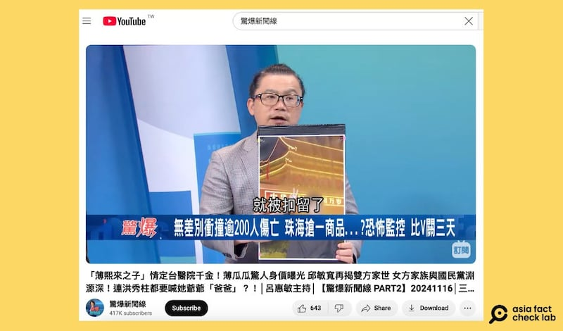
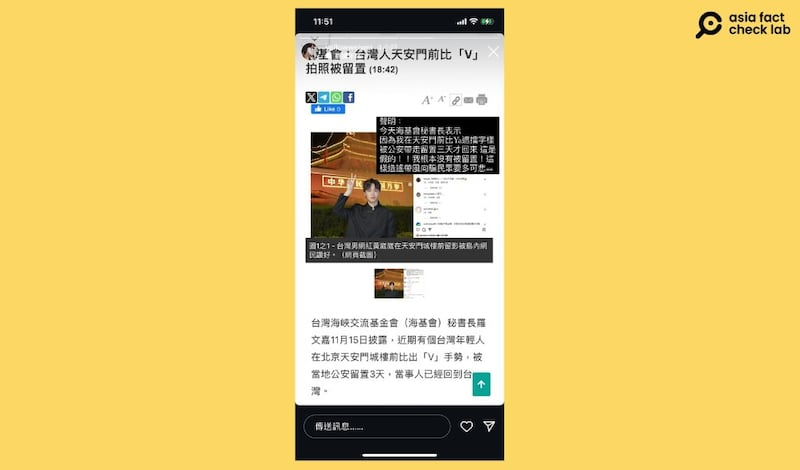

# 事實查覈｜在天安門擺拍“中華民國萬歲”，臺灣網紅黃崴崴遭拘留？

作者：艾倫

2024.11.22 14:02 EST

## 查覈結果：錯誤

## 一分鐘完讀：

臺灣海基會祕書長近日表示，一名臺灣女子因在天安門廣場擺姿勢拍照片，遮住了“中華人民共和國萬歲”標語的部分文字，使其變成“中華民國萬歲”，而遭到中國公安留置。

多家臺灣媒體報道海基會的說法時，直接使用了臺灣男網紅黃崴崴在天安門廣場做相同動作的圖片，造成誤導；更有臺灣政論節目來賓引述報道時直接稱是黃崴崴被抓。而黃崴崴個人已澄清，這是錯誤信息。

## 深度分析：

11月15至16日期間,多家臺媒報道,臺灣海峽交流基金會(海基會)祕書長 [羅文嘉表示](https://www.worldjournal.com/wj/story/121475/8363838?from=wj_maintab_cate&zh-cn),近期一名臺灣女子在北京天安門廣場旅遊時,因在天安門城樓前比出"YA "的手勢(該手勢在中國通常被稱爲比V、剪刀手等),遮住了"中華人民共和國萬歲"標語中的"人"、"共"、"和"三個字,使城樓上的標語文字變成"中華民國萬歲",結果被當地公安帶走並遭留置三天後才被釋放。

羅文嘉補充：“他（中國）的政權是高度敏感緊張，我們在自由社會臺灣不會（被帶走），但在那裏就會”，提醒臺灣人赴中旅遊時不要仿效類似行爲。

然而,臺灣媒體三立電視臺旗下政論節目"驚爆新聞線"11月17日上傳 [最新一期節目](https://www.youtube.com/watch?v=NcUGXxXanmA),其中一名臺灣財經專家謝晨彥,在該視頻約39分31分處時提及相關新聞時,引用的卻是臺灣網紅黃崴崴在天安門拍的一張照片,稱該名男網紅因在天安門前比YA而被扣留,主持人則回應:"他太大膽了"、"原來就是他被抓"。

臺媒政論近期報道一則消息，稱一名臺灣網紅因在天安門前比YA拍照被拘留。（驚爆新聞線YouTube頻道截圖 ）

此外,多家臺灣網媒如 [壹蘋新聞網](https://tw.nextapple.com/politics/20241115/7EBC9D0097D40F1D50CD7B7347C79819)、 [新頭殼](https://newtalk.tw/news/view/2024-11-16/944891)和 [菱傳媒](https://rwnews.tw/article.php?news=18081)也報道臺灣女子因在天安門廣場擺拍被拘留的新聞,內容雖正確引述羅文嘉的話,首圖卻直接使用黃崴崴的這張照片,容易引起誤會。

多家臺媒皆報道臺灣海基會的說法，但使用的圖片爲臺灣男網紅的照片，易生誤會。圖截自菱傳媒、新頭殼。

10月10日, [自由亞洲粵語](https://www.rfa.org/cantonese/news/htm/taiwan-slogan-yellowweiwei-tiananmen-64-10112024015533.html?fbclid=IwY2xjawGny6VleHRuA2FlbQIxMAABHXzthsVdxbW1VJDf1VsFK_Aw8pFHqp3-86N8c7p64Qe-Ch3Nrh2k-6DyPw_aem_CrftiMxuW0kpcPkxb2FH9g)和其他多家媒體曾報道,臺灣網紅黃崴崴在社媒Instagram發文,表示他在臺灣國慶前夕,於北京天安門廣場藉由拍攝角度用手擋住"中華人民共和國萬歲"標語,拍成"中華民國萬歲",他發的另一張照片甚至比出"六四"手勢。

然而，該照片發佈一月有餘，並無公開報道稱黃崴崴曾因此照片遭拘留。

在三立電視臺的政論節目發佈後，黃崴崴本人已在個人社媒上發表動態澄清，表示自己並沒有遭到拘留。海基會的說法及網紅本人皆指出，三立電視臺錯誤引用了新聞資訊。

遭誤指因在天安門廣場擺拍而被拘留的臺灣網紅黃崴崴，在社媒駁斥相關說法，但稱海基會“造謠”的說法也有不妥之處。（黃崴崴Instagram 截圖）

不過，黃崴崴在社媒動態稱海基會“造謠”的說法，也有不妥之處，他引述新聞報道時稱，“海基會說他被關三天”是假的，如此說法是在“造謠帶風向”。然而，海基會透露是一名臺灣女子被抓，但並沒有稱黃被抓。

對於海基會羅文嘉所稱的臺灣女子在天安門“比YA”被留置一事，至本文發稿之前，AFCL並沒有找到其他公開信息或是報道。

*亞洲事實查覈實驗室(Asia Fact Check Lab)針對當今複雜媒體環境以及新興傳播生態而成立。我們本於新聞專業主義,提供專業查覈報告及與信息環境相關的傳播觀察、深度報道,幫助讀者對公共議題獲得多元而全面的認識。讀者若對任何媒體及社交軟件傳播的信息有疑問,歡迎以電郵*  [*afcl@rfa.org*](mailto:afcl@rfa.org)  *寄給亞洲事實查覈實驗室,由我們爲您查證覈實。* *亞洲事實查覈實驗室在X、臉書、IG開張了,歡迎讀者追蹤、分享、轉發。X這邊請進:中文*  [*@asiafactcheckcn*](https://twitter.com/asiafactcheckcn)  *;英文:*  [*@AFCL\_eng*](https://twitter.com/AFCL_eng)  *、*  [*FB在這裏*](https://www.facebook.com/asiafactchecklabcn)  *、*  [*IG也別忘了*](https://www.instagram.com/asiafactchecklab/)  *。*

[Original Source](https://www.rfa.org/mandarin/shishi-hecha/hc-tiananmen-roc-photo-11222024140154.html)