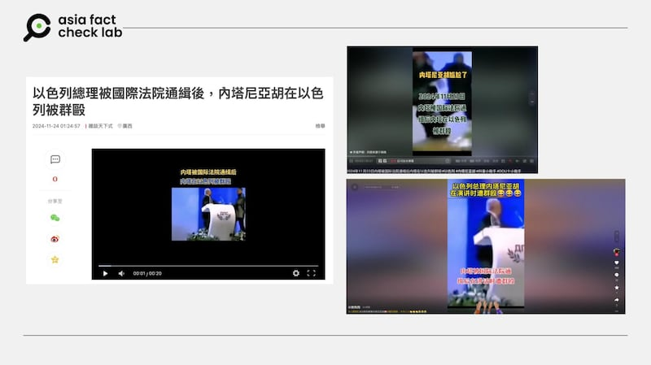

# 事實查覈｜以色列總理內塔尼亞胡被羣毆的影像流出？

作者：莊敬

2024.11.26 14:22 EST

## 查覈結果：錯誤

## 一分鐘完讀：

近日，多箇中文社媒賬號轉傳一則短視頻，稱是以色列總理內塔尼亞胡遭羣衆圍毆。模糊的畫面中，一名身穿西裝的白髮男子站在講臺前，身旁突然出現一名疑似攻擊者，緊接着一羣人衝上前將其中一人撲到在地並進行羣毆。畫面中所有人的面部都不清晰。

經查，這是2013年保加利亞政治人物被人持槍攻擊事件現場的畫面，與以色列及內塔尼亞胡都無關。部分網民挪用無關影像、傳播了錯誤信息。

## 深度分析：

最近在抖音( [1](https://v.douyin.com/iDr8hYuY), [2](https://v.douyin.com/iDrRccHC), [3](https://v.douyin.com/iDr8FD4k))、 [網易](https://www.163.com/v/video/VAGPRJ3QL.html)、 [X](https://x.com/0K7n9Nviz82KC9r/status/1860327477253669098)等平臺上,有多個用戶轉傳"以色列總理被國際法院通緝後,內塔尼亞胡在以色列被羣毆"的短視頻,畫面中一名白髮西裝男子站在講臺前,身旁出現一位看起來有持槍的男子,引起一陣騷動,緊接著一羣男性衝上前將一人撲到在地拳打腳踢。

社媒用戶轉傳短視頻，稱是以色列總理內塔尼亞胡被羣毆的畫面。（網易、抖音截圖）

亞洲事實查覈實驗室(Asia Fact Check Lab,下簡稱AFCL)注意到,畫面中背板上寫着"2013",判斷這段影像很可能不是最近發生的事件。根據畫面中的線索,包括"2013""政治人物"(politician)"槍"(gun)等英文關鍵字搜尋,找到2013年 [美國有線電視新聞網](https://edition.cnn.com/2013/01/19/world/europe/bulgaria-pistol-attack/index.html)(CNN)的報道,確認這則影片記錄的是保加利亞政治人物多安(Ahmet Dogan)遭人持槍攻擊的事件。 [美國廣播公司](https://abcnews.go.com/blogs/headlines/2013/01/man-points-gun-at-bulgarian-politicians-head-during-speech)(ABC)、 [衛報](https://www.theguardian.com/world/2013/jan/20/bulgaria-turkey)(The Guardian)等多家媒體都曾報道。

AFCL進一步查詢後發現,這段影像在今年初曾被誤傳爲保加利亞總理遭刺殺影片,當時已有查覈組織發佈 [報告](https://www.mygopen.com/2024/02/bulgaria.html)。這次社媒用戶又挪用這段影像,加上錯誤的簡體中文標題和字幕,傳播以色列總理遭羣毆的錯誤信息。

根據 [英國廣播電臺](https://www.bbc.com/zhongwen/articles/cgj7xnz5en2o/trad)(BBC)等媒體報道, [國際刑事法院](https://www.un.org/zh/224580)11月21日對以色列總理內塔尼亞胡(Benjamin Netanyahu)和前國防部長加蘭特(Yoav Gallant)發出逮捕令,指控他們在以色列進攻加沙地帶期間犯下了戰爭罪和反人類罪,引發以色列政壇強烈反彈。國際刑事法院還對巴勒斯坦武裝組織哈馬斯最高軍事指揮官戴夫(Mohammed Deif)發出逮捕令。

*亞洲事實查覈實驗室(Asia Fact Check Lab)針對當今複雜媒體環境以及新興傳播生態而成立。我們本於新聞專業主義,提供專業查覈報告及與信息環境相關的傳播觀察、深度報道,幫助讀者對公共議題獲得多元而全面的認識。讀者若對任何媒體及社交軟件傳播的信息有疑問,歡迎以電郵*  [*afcl@rfa.org*](mailto:afcl@rfa.org)  *寄給亞洲事實查覈實驗室,由我們爲您查證覈實。* *亞洲事實查覈實驗室在X、臉書、IG開張了,歡迎讀者追蹤、分享、轉發。X這邊請進:中文*  [*@asiafactcheckcn*](https://twitter.com/asiafactcheckcn)  *;英文:*  [*@AFCL\_eng*](https://twitter.com/AFCL_eng)  *、*  [*FB在這裏*](https://www.facebook.com/asiafactchecklabcn)  *、*  [*IG也別忘了*](https://www.instagram.com/asiafactchecklab/)  *。*

[Original Source](https://www.rfa.org/mandarin/shishi-hecha/hc-israel-pm-beaten-fact-check-11262024141925.html)