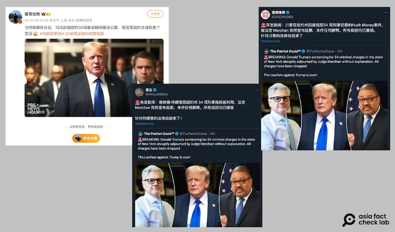

# 事實查覈｜特朗普勝選後，34項罪名已被撤銷？

作者：艾倫

2024.11.25 20:22 EST

## 查覈結果：錯誤

## 一分鐘完讀：

特朗普（Donald Trump，中文又譯川普）於11月贏得美國總統大選後，各界猜測選舉結果是否影響他的“封口費案”判決。微博、X上都出現了稱特朗普所涉34項有罪判決均已“撤銷”的說法。

然而，根據來自檢察官辦公室的一份法律文件，目前檢方正在考慮將案件暫緩到特朗普卸任後再處理，也就是可能要等到特朗普完成第二總統任期後，法院纔會對他的刑罰進行裁決。特朗普的律師目前仍在努力試圖推翻有罪判決，但法院並沒有打算更動現有的判決，網傳說法爲錯誤結論。

## 深度分析：

11月20日前後,微博大V ["服哥炫物"](https://weibo.com/2435939794/P1acxDmNt?refer_flag=1001030103_)和X認證賬號 ["客塵"](https://x.com/MilesW8964/status/1859009771371983033) ["德潤傳媒"](https://x.com/DXDWX999/status/1858929590565228788)分別發文,稱特朗普確定就任後,他曾被指控的34項罪名已"被撤銷"。有用戶嘲笑"美國的法律就是個笑話",也有人說"針對特朗普的法律戰結束了"。

中文社媒近期出現傳言稱，法院已"全數撤銷"特朗普封口費案件的34項罪名。（微博、X截圖）

根據曼哈頓地區檢察官辦公室釋出的 [法院文件](https://www.documentcloud.org/documents/25345958-da_recommendation?responsive=1&title=1),特朗普即將獲取的總統身份不足以成爲撤銷已判罪名的理由。然而,檢方指出,基於"平衡憲法利益",必須考慮將案件暫緩到特朗普卸任後再行處理。

美聯社 [報道](https://apnews.com/article/trump-hush-money-case-stormy-daniels-8793ae086092c64325d38a380851e23a)稱,檢察官表示,他們目前已將特朗普的原量刑日期延後至11月26日再次審理,與此同時他的律師仍不斷嘗試推翻原判決。

負責該案的法官胡安∙梅爾尚（Juan M. Merchan）目前尚未對對該案件的最終量刑作出裁決。然而，隨著量刑程序暫停，特朗普的律師正採取多重法律途徑試圖撤銷此案，而這將會是前所未有的法律案例，最後可能得經由最高法院審理。

今年5月，當時還在競選期間的特朗普被正式定罪，罪名高達34項，原因是他曾挪用2016年大選的競選經費並僞造商業記錄，支付封口費來掩蓋自己的婚外情醜聞，不過他至今仍否認這些指控。

美國憲法專家羅伯特·麥克維特(Robert Mcwhirter)接受美國媒體CBS News [採訪](https://www.cbsnews.com/losangeles/video/will-trump-face-prison-constitutional-law-expert-robert-mcwhirter-weighs-in/)時表示,特朗普在2025年1月20日即將就任,因此即使法院立刻判刑,他立即服刑的機率也不高,更有可能會在卸任後纔開始。

“如果他（特朗普）現在被判緩刑，可能會有一些行動限制。例如會出現他需要每週五和緩刑官通電話報告狀態，而特勤維安也會剛好在場的奇怪狀況。”

*亞洲事實查覈實驗室(Asia Fact Check Lab)針對當今複雜媒體環境以及新興傳播生態而成立。我們本於新聞專業主義,提供專業查覈報告及與信息環境相關的傳播觀察、深度報道,幫助讀者對公共議題獲得多元而全面的認識。讀者若對任何媒體及社交軟件傳播的信息有疑問,歡迎以電郵*  [*afcl@rfa.org*](mailto:afcl@rfa.org)  *寄給亞洲事實查覈實驗室,由我們爲您查證覈實。* *亞洲事實查覈實驗室在X、臉書、IG開張了,歡迎讀者追蹤、分享、轉發。X這邊請進:中文*  [*@asiafactcheckcn*](https://twitter.com/asiafactcheckcn)  *;英文:*  [*@AFCL\_eng*](https://twitter.com/AFCL_eng)  *、*  [*FB在這裏*](https://www.facebook.com/asiafactchecklabcn)  *、*  [*IG也別忘了*](https://www.instagram.com/asiafactchecklab/)  *。*

[Original Source](https://www.rfa.org/mandarin/shishi-hecha/hc-charges-against-trump-to-be-dropped-after-his-eletion-fact-check-11252024201557.html)