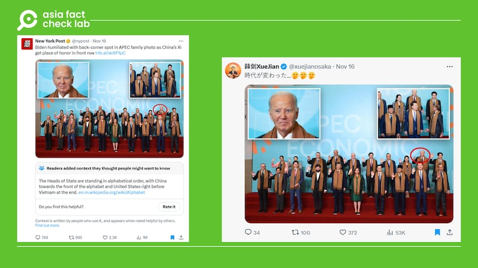
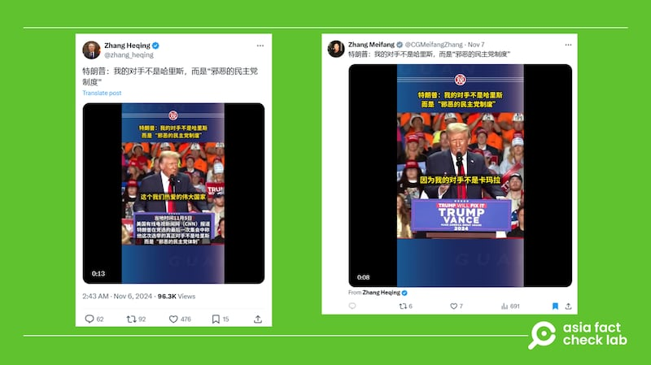
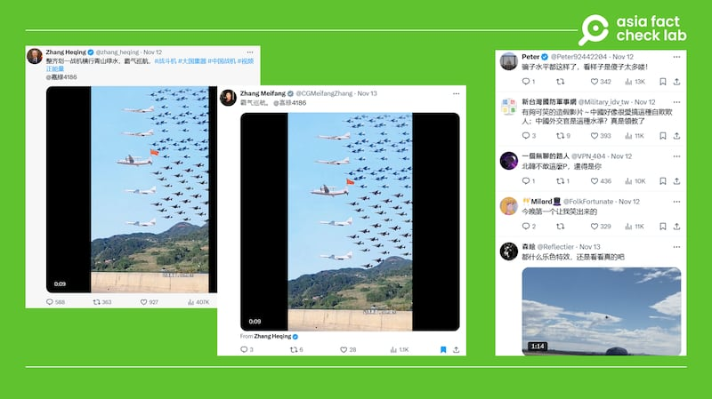
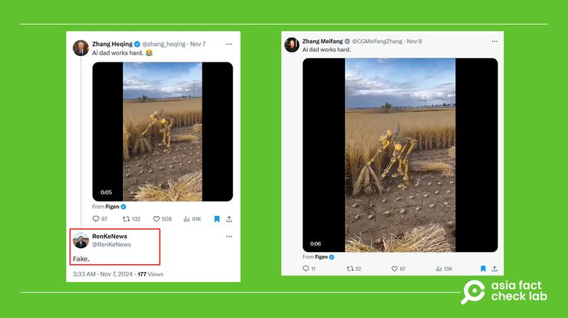
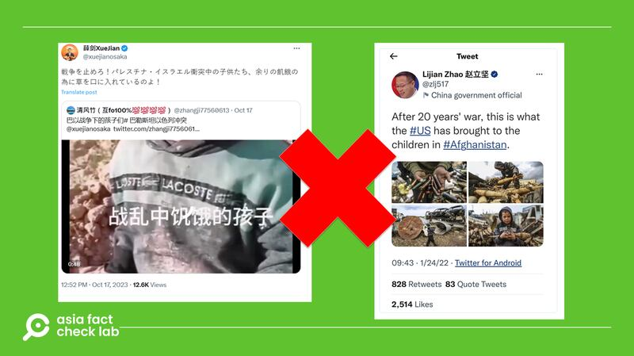

# 傳播觀察｜中國外交官的"社媒外交"

作者：鄭崇生

2024.11.25 20:06 EST

中國外交部一直以來奉行“不干涉他國內政” [原則](https://www.mfa.gov.cn/web/ziliao_674904/wjs_674919/2159_674923/200011/t20001107_10251031.shtml),這也是 [《維也納外交公約》](https://legal.un.org/ilc/texts/instruments/english/conventions/9_1_1961.pdf)第41條的規定——各國外交官負有“不干涉駐在國內政的義務“。但中國駐大阪總領事薛劍前不久被指違背了這一原則,在日本衆議院改選期間公開爲特定的候選人拉票。 [《日本產經新聞》](https://www.sankei.com/article/20241122-43RFQCBXCREULKKYLEOK2BK2EY/?outputType=theme_election2024)報道,日本政府22日在內閣會議通過書面文件,批評薛劍言論“極不合適“,並通過外交管道要求中方刪文。在薛劍的X賬號上目前已經看不到他鼓吹投票給特定日本政治人物的發文。

在X上擁有8萬多粉絲的薛劍對“美國事務”也極有興趣，常常轉發援引美國媒體的報道與評論。

11月16日,到祕魯利馬參加亞太經濟合作會議(APEC)的各國元首依例拍攝了大合照。這是美國總統拜登(Joe Biden)最後一次參加APEC,他的位置被安排在後排右數第二個。《紐約郵報》(New York Post)刊登了現場照片並做了標記, [評論稱](https://archive.ph/xyVj7)拜登被安排在右後方,是因爲即將卸任而遭羞辱,而比較習近平則是被安排在了“C位“的前排中央。

[薛劍](https://x.com/xuejianosaka?lang=zh-Hant)直接取用 [這張照片](https://archive.ph/jHMdF),在自己X平臺的賬號上以日文發文評論:“時代變了“(時代が変わった…),附帶三個笑臉的表情符號。然而《紐約郵報》的信息涉及誤導,亞洲事實查覈實驗室(AFCL)已發佈相關 [報告](2024-11-19_事實查覈｜祕魯APEC禮遇習近平冷落拜登？.md)。

薛劍截取《紐約郵報》圖片發帖稱"時代變了" 圖截取自《紐約郵報》、X

中國外交官的外交風格隨着時代的改變而有所改變。

“我覺得既要堅持原則，同時又要注意策略。這個需要好好把握的。……有時候你該厲害時厲害不上去也不行，厲害時也不是說凶神惡煞，那也不行。要學會‘小聲說重話’。”

於2013年退休的中國前國務委員戴秉國,過去長期主管外交,他2016年接受《新京報》 [專訪](http://www.xinhuanet.com/world/2016-04/08/c_128874516.htm)時,以“小聲說重話“總結自己從事外交工作的心得。然而,被評論爲“戰狼“風格的新一代外交官已經不再遵從“用詞嚴謹“”說話審慎“這種傳統風格。

中國外交從已故領導人 [鄧小平的“韜光養晦“到習近平的“奮發有爲”](https://www.siis.org.cn/updates/cms/old/UploadFiles/file/20180312/201802006%20%20%E6%9D%8E%E5%BF%97%E6%B0%B8.pdf),“戰狼外交“成了主流,前外長秦剛曾對此做出解釋與正名,稱這是因爲” [一些國家對中國的抹黑詆譭,簡直就是惡狼"](https://cn.chinadaily.com.cn/a/202102/10/WS6023333ca3101e7ce973f733.html),中國外交官必須站出來說不,要" [與狼共舞"](https://news.cctv.com/2023/03/07/ARTIBG0w9eSXlkbC6XiKLEiS230307.shtml)。

2019年,外交部官員開始大舉 [征戰](https://www.bbc.com/zhongwen/simp/world-49429531)前身爲推特(Twitter)的“外網社媒平臺“,其主動佔領輿論陣地已經不僅僅是“對批評中國的言論說不“這麼簡單。一部分中國外交官的賬號經常散佈不實信息,成爲各事實查覈機構的查覈對象。除了薛劍外,走這種風格路線的外交官還包括中國駐巴基斯坦文化參贊 [張和清](https://archive.ph/9CMvd)、前駐北愛爾蘭貝爾法斯特總領事 [張美芳](https://archive.ph/QiQgx),亞洲事實查覈實驗室針對他們的言論發表過查覈報告,部分內容列表如下:

張和清: [美衆議員爆粗口、罵涉猶法案可恥?](2024-06-15_事實查覈｜美衆議員爆粗口、罵涉猶法案可恥？.md)

[ [美國總統拜登又和"看不見的人"打招呼"？Opens in new window](2023-07-28_事實查覈｜美國總統拜登又和"看不見的人"打招呼"？.md) ]

[ [因拜登限制進口中國商品 美國人瘋搶中國品牌電視？Opens in new window](2023-08-11_事實查覈｜因拜登限制進口中國商品 美國人瘋搶中國品牌電視？.md) ]

張美芳: [中國促俄烏和談,美國主張“戰爭不應停止“?](2023-03-23_事實查覈 ｜ 中國促俄烏和談，美國主張"戰爭不應停止"？.md)

[ [北溪爆炸案謎團："親烏組織"就是拜登政府嗎？Opens in new window](2023-03-14_事實查覈 ｜ 北溪爆炸案謎團："親烏組織"就是拜登政府嗎？.md) ]

[ [與150多國家免籤？ 中國護照的含金量越來越高？Opens in new window](2023-03-08_事實查覈 ｜ 與150多國家免籤？　中國護照的含金量越來越高？.md) ]

薛劍: [王毅“霸氣“會晤以色列總理,拒絕主動伸手示好?](2024-10-31_事實查覈｜王毅“霸氣”會晤以色列總理，拒絕主動伸手示好？.md)

[ [中華人民共和國從未發動過戰爭？Opens in new window](2024-09-03_事實查覈｜ 中華人民共和國從未發動過戰爭？.md) ]

[ [男警"跪頸壓制"女子，"我不能呼吸"重現臺灣？Opens in new window](2023-05-31_事實查覈｜男警"跪頸壓制"女子，"我不能呼吸"重現臺灣？.md) ]

綜觀他們的推文，可以總結出幾個特點：

## 美國是主要攻擊對象

公開資料顯示，上述幾位中國外交官，目前都不負責處理中國對美事務，但這沒有減少他們對美國的關注程度，尤其是在美國大選等時間節點，他們頻繁發佈涉美信息和言論。

美國的德國馬歇爾基金會(GMF)保衛民主項目(Alliance for Securing Democracy)下、有一個 [漢米爾頓儀表板2.0](https://securingdemocracy.gmfus.org/hamilton-dashboard/)(The Hamilton 2.0 dashboard)的數據庫,這個數據庫專門監測中國、俄國與伊朗官方與外交官員在社交媒體平臺上的活動。

根據數據庫的不完全統計,在美國總統大選投票當週(11月4日至8日),張和清的一則 [推文](https://archive.ph/0AO48)是當週十大中國官方X推文排名第六的,內容轉發來自中國媒體抖音號、報導即將二度入主白宮的美國前總統特朗普(Donald Trump)在競選期間如何批評民主黨人。

中國外交官在社交平臺上傳播不少美國民主的“陰暗面“,包括 [張和清](https://archive.ph/f17mi)與 [薛劍](https://archive.ph/60f6Q)都曾以斷章取義的方式,以一臺發生故障的圈票機暗示美國選舉存在舞弊,但AFCL查覈後發現 [圈票機故障](2024-11-03_事實快查 ｜ 美總統大選提前投票，「作票」流言又來了.md)問題早已解決。

主持漢米爾頓儀表板2.0數據庫的馬歇爾基金會資深研究員謝弗（Bret Schafer）告訴AFCL，“與其說這讓美國的民主看起來很糟糕，不如說這讓中國的宣傳工作看起來既草率也不專業。”謝弗對圈票機故障這則視頻的宣傳效果表示懷疑，遑論產生“西方民主毀了，中國製度纔好”這種影響力。

張和清的推文經常放大美國政治的對立面，張美芳的推文也有相同的傾向。事實上，兩人當“搬運工”，從抖音搬到X上的這則有關“特朗普批評民主黨人”的發文，用語是一模一樣。

張和清與張美芳所發的雷同的推文 圖截取自X

但謝弗認爲，轉發美國選舉過程中的缺失及放大美國政治對立的這類視頻，兩人的目標受衆既不是美國人也不是中國公民，而是如“全球南方”（Global South）國家的民衆。“全球南方”指新興市場與發展中國家。“他們的目標是讓美國民主看來缺乏吸引力，讓中國被視爲一個可行的替代選項。儘管我不認爲這段視頻能幫助他們實現這一目標，但指出美國製度中的真實情況或感知缺陷，已被證明是一種成功的宣傳策略”，謝弗補充。

## 借用AI影像輔助傳播

觀察張和清和張美芳的社媒賬號，還可以發現倆人發佈的帖子中用到了很多存在後期製作和加工的視頻或圖片，有的甚至是“一眼假”。

在中國珠海航展舉行期間，倆人都貼出一則宣傳中國戰機“霸氣巡航”的視頻，但該視頻是由動畫合成，並非真實影像，引發了網絡輿論一片譁然。

外交官們發佈的經過變造的"航展"視頻 圖截取自X

“號稱大國重器,實則動畫遊戲””這真的是一名外交官賬號該發的嗎“——這些都是節選自張和清X發文下的 [留言評論](https://archive.ph/y6EU8)。這段明明標註後製生成的“動畫畫面“,卻成了張和清12日在X上“講好中國故事“的素材。第二天, [張美芳](https://archive.ph/zT7NF)繼續轉發該視頻,再次引發輿論熱議。

“雙張組合”不是第一次拿“電腦合成（Computer-Generated）的影像當真相”。下圖所示“機器人割稻草”的短視頻，事實上是無中生有的僞造，新華社記者任珂在張和清發文下方留言告訴她這是“假的”，但這依然沒有阻礙他發佈虛假信息。

張和清和張美芳發佈的機器人割稻草假圖片 圖截取自X

這種利用AI技術支持,將真人演示的視頻替換成機器人的假視頻,AFCL於2024年3月就曾發表 [查覈報告](2024-03-27_事實查覈｜球技高超的中國羽毛球隊，是機器人陪練出的？.md),內容是中國以機器人訓練羽毛球員。

常年研究中國媒體發展的中國傳媒研究計劃（China Media Project）總監班志遠（David Bandurski）認爲，中國外交官們發佈的這類信息互動性往往很低，“但真正的影響在於加劇社交媒體平臺的混亂”。

“在一個化糞池裏發現亂七八糟的東西，應該不會讓人感到驚訝。”班志遠以直白比喻描繪對中國外交官們這五年來推動“X外交”的評價，他告訴AFCL，“中國正試圖用各種信息淹沒社交媒體空間。一些可能產生病毒式的影響（快速傳播），另一些則可能不了了之。但他們知道，自己可以在這個極度混亂的信息世界從中獲利。”

## 傳播移花接木的“另類事實”

錯假信息常在國際間發生重大沖突時流傳,AFCL過往的查覈中發現,中國外交官也經常轉發這類錯假信息。例如朝鮮半島日前局勢一度緊張加劇之際,張和清將韓國民衆街頭抗議、反對總統尹錫悅的活動, [錯譯](2024-10-23_事實快查｜韓國百萬人遊行反戰？中國遭韓國導彈恐嚇？.md)成是韓國民衆反戰遊行“不要當第二個烏克蘭“”不當美國佬炮灰“等。

又例如“以哈衝突“爆發後,薛劍 [挪用舊片](https://archive.ph/wip/iL3p8), [描繪歐美製造出的加沙人道主義災難的危機](2023-10-25_事實快查｜以哈衝突中的熱傳視頻：哈馬斯童軍突襲警局？加沙孩子餓到喫草？.md);更早的 [事例](https://www.rfa.org/mandarin/yataibaodao/meiti/rc-01282022094606.html)是著名的“戰狼外交官“趙立堅在擔任外交部發言人期間,將敘利亞攝影記者拍攝戰地兒童生存的照片,說成是美國在阿富汗20年留下的苦果。

薛劍和趙立堅挪用無關影像作爲美國製造"戰爭災難"的證據 圖截取自X

## X上的“戰狼矩陣“的演變和前景

謝弗認爲，中國外交官在信息傳遞方面其實已大幅放低了“戰狼外交”的姿態。他解釋，雖然仍有一些中國外交官繼續散播陰謀論或是強烈的對抗性，但這些並非常態，他的分析是，這一轉變是因爲中國認識到，“他們在社交媒體上的更具侵略性的姿態損害了自己的聲譽，因此他們回到專注於塑造中國正面形象的策略上。”

對照張和清開始不時轉發X上來自至少與中國省、市地方政府或媒體有關聯的至少60個賬號，推薦中國各地旅遊、美食與傳統文化的軟實力片段或內容，薛劍有一個比較鮮明的個人特色是增加了“長輩早安文”的發帖，且轉發的許多賬號名稱都含有要求互相關注或是帶中國國旗圖案，細看這些賬號頭像，不乏疑似AI生成的檔案照，究竟薛劍能透過這類頻繁轉發、增加多少點擊率，進而換得實際的廣告收益？至截稿，中國外交部沒有回應AFCL電郵的置評請求。

可以肯定的是，中國外交官還會分享上述各類資訊，繼續推動不只是X平臺上的社媒外交，薛劍、張和清、張美芳各自的風格又會如何改變，還得靠時間檢驗。

*亞洲事實查覈實驗室(Asia Fact Check Lab)針對當今複雜媒體環境以及新興傳播生態而成立。我們本於新聞專業主義,提供專業查覈報告及與信息環境相關的傳播觀察、深度報道,幫助讀者對公共議題獲得多元而全面的認識。讀者若對任何媒體及社交軟件傳播的信息有疑問,歡迎以電郵* [*afcl@rfa.org*](mailto:afcl@rfa.org) *寄給亞洲事實查覈實驗室,由我們爲您查證覈實。* *亞洲事實查覈實驗室在X、臉書、IG開張了,歡迎讀者追蹤、分享、轉發。X這邊請進:中文* [*@asiafactcheckcn*](https://twitter.com/asiafactcheckcn) *;英文:* [*@AFCL\_eng*](https://twitter.com/AFCL_eng) *、* [*FB在這裏*](https://www.facebook.com/asiafactchecklabcn) *、* [*IG也別忘了*](https://www.instagram.com/asiafactchecklab/) *。*

[Original Source](https://www.rfa.org/mandarin/shishi-hecha/hc-china-social-media-diplomacy-11252024195420.html)