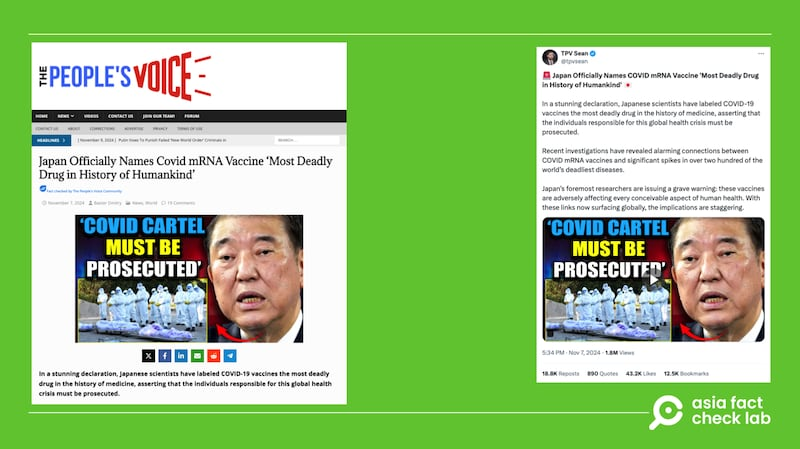

# 事實查覈｜日本正式宣佈新冠mRNA疫苗"史上最致命"？

作者：董喆

2024.11.27 14:20 EST

## 查覈結果：錯誤

## 一分鐘完讀：

近期社羣媒體上流傳日本正式宣佈新冠肺炎mRNA疫苗列爲“人類史上最致命藥物”的說法，消息源自被國際多個事實查覈組織列爲假新聞網站的“The People’s Voice”。該網站利用誤導性封面照片及錯誤資訊製作相關報道，並在影片中引用日本參議員川田龍平的記者會影像。

實際上，川田龍平的記者會旨在探討一款名爲“Kostaive”疫苗的潛在風險，該記者會上也並沒有說法將COVID-19 mRNA 疫苗列爲“人類歷史上最致命的藥物”，川田等少數人的觀點也不代表日本官方觀點或是日本科學界觀點，。並且，即使是川田龍平及少部分專家對“Kostaive”疫苗表達的疑慮，日本衛生單位及其它疫苗專家也已經作出澄清，認爲這些說法缺乏科學依據。

## 深度分析：

## 疫苗"致命"傳言源自假新聞網站

近期中文 [X(原推特](https://archive.ph/iR4GU))與微博上出現消息( [貼文1](https://archive.ph/mJZFk), [貼文2](https://archive.ph/xtkQC)),稱日本正式將新冠肺炎mRNA疫苗列爲"人類史上最致命的藥物"。稱該消息來自於"日本科學家"、"頂尖研究人員"。

中文社交媒體稱，日本正式宣佈新冠mRNA疫苗"史上最致命"，經查覈，這是錯誤信息。（X、微博截圖）

前述中文社媒帳號使用的“報道截圖”有兩個來源：第一是Ｘ平臺上“TPV Sean”帳號的貼文截圖；第二種是美國新聞網站“The People’s Voice”網撰寫的報道截圖。亞洲事實查覈實驗室（以下簡稱AFCL）發現，兩者其實都是“The People’s Voice”的平臺。

中文社媒關於新冠疫苗"致命"的傳言，均源自經常發佈假新聞的平臺"The People's Voice"。（"The People's Voice"網站截圖、該網站主持人之一"TPV Sean"X賬號截圖）

"The People's Voice"於2014年以"Your News Wire"爲名創立,2018年曾改名"News Punch",2023年改爲"The People's Voice"。此網站被多個國際事實查覈組織列爲假新聞網站,包含 [FactCheck.org](http://factcheck.org)、 [Politifact](https://www.politifact.com/personalities/yournewswirecom/)以及 [Snopes](https://www.snopes.com/tag/your-news-wire/),上述組織都曾多次針對"The People's Voice"散播的陰謀論發佈查覈報告。

X帳號"TPV Sean"在個人簡介中自稱是"The People's Voice"的主持人,"TPV Sean"在X上發表日本將新冠肺炎mRNA疫苗列爲致命藥物的短視頻,至今已有超過180萬次觀看,而這則視頻是以"The People's Voice"的 [一則報道](https://archive.ph/3yGGa)爲基礎製作。

## 疫苗假新聞挪用無關照片

一排身穿隔離衣的工作人員站在擔架旁，擔架上擺放的是被白布包裹的大體，一旁則放上日本首相石破茂的照片，一個紅色箭頭將兩者串連，左上角大字寫着“新冠肺炎利益集團應該被起訴（Covid cartel must be prosecuted）”。

“The People’s Voice”將此作爲報道的封面照片，並搭配標題“日本正式將 Covid mRNA 疫苗命名爲人類歷史上最致命的藥物”。

AFCL以圖反搜，發現此張哀悼遺體的照片出自路透社，攝於2021年7月14日緬甸曼德勒（Mandalay），是志工在葬禮上向染疫而亡的新冠肺炎患者祈禱，與日本並無關聯。

"疫苗致命"傳言的源頭"The People's Voice"使用與日本不相關的圖片作爲標題配圖。（"The People's Voice"、路透社截圖，AFCL標註）

另外,根據日本厚生勞動省 [的公告](https://www.mhlw.go.jp/english/new-info/index.html),至截稿前都未曾發佈將任何新冠肺炎疫苗列爲致命藥物的公告,日本主流媒體亦沒有與此相關的報道。

AFCL嘗試聯繫日本厚生勞動省以及日本駐中國大使館，至截稿前未獲回應。不過日本駐臺灣機構”交流協會”以書面回覆AFCL，“日本政府沒有發佈過這樣的公告”。

因此，“日本官方將新冠肺炎mRNA疫苗列爲致命藥物”的說法爲假。

## 持疫苗陰謀論的日本參議員說了什麼？

“The People's Voice”製作的視頻中引用了日本參議員川田龍平的記者會畫面，AFCL進一步追查，發現這場記者會於2024年9月12日舉辦，訴求是要日本政府暫停接種由明治製藥銷售的新冠肺炎疫苗“Kostaive”疫苗，卻被“The People's Voice”挪用，爲“日本將新冠肺炎mRNA疫苗列爲致命藥物”的錯誤說法背書。

根據川田龍平發表的 [會後新聞稿](https://ameblo.jp/kawada-ryuhei/entry-12867328481.html),當中並未提及要求官方將mRNA疫苗列爲致命藥物的論述,AFCL二次以電子郵件聯繫川田龍平,至截稿前未獲回應。

日本武藏大學媒體社會系教授奧村信幸協助我們確認影像內容，他告訴AFCL，這場記者會討論主題爲“Kostaive”疫苗的潛在風險，影片中名古屋大學小島勢二教授的確曾在新聞發佈會中提到“這是毒藥，這是一場屠殺”。但奧村信幸補充，“小島博士作爲醫生或科學家被視爲極端人物，他的言論並未被日本媒體認真對待。該新聞發佈會幾乎沒有在新聞中報道，只有少數商業電視臺的綜藝節目例外。 ”

AFCL進一步詢問奧村信幸，是否有任何日本公衆人物曾公開表示“COVID-19 mRNA 疫苗是人類歷史上最致命的藥物”？奧村信幸的答案是否定的，但他補充，另一名日本衆議員原口一博以在疫情期間散播陰謀論聞名，他因爲誹謗明治疫苗而早到訴訟。

根據日本 [《每日新聞》報道](https://mainichi.jp/english/articles/20241102/p2a/00m/0na/003000c),明治製藥正考慮對原口一博提告,原因是他在X上將"Kostaive"疫苗描述爲生化武器。

不過，儘管日本政治人物對“Kostaive”疫苗有批評，但都僅限於個人意見，並未有“日本將新冠肺炎mRNA疫苗列爲致命藥物”的說法或是倡議，他們的意見更不代表日本科學界或是官方意見，

## 日本少數人對“Kostaive”疫苗的質疑並無科學根據

“The People's Voice”將日本國內對新型COVID-19疫苗“Kostaive”的爭論，演繹爲專家集體反對mRNA疫苗，並做出“日本官方將COVID-19 mRNA 疫苗列爲“人類歷史上最致命的藥物””的虛假陳述。

事實上,引發日本國內討論的是一款新型COVID-19疫苗"Kostaive"。根據日本厚生勞動省的 [新聞稿](https://www.mhlw.go.jp/stf/kaiken/daijin/0000194708_00626.html),2023年11月27日他們批准了由明治製藥生產與銷售的"Kostaive",這是世界上首款獲批准的"自我擴增mRNA"疫苗,由美國CSL和Arcturus Therapeutics公司開發。

奧村信幸告訴AFCL，日本大部分民衆、主流媒體以及醫界對“Kostaive”抱持正面態度，但以川田爲代表的少數反疫苗者對“Kostaive”抱有疑慮，認爲“自我擴增mRNA”疫苗的成份會不斷複製並擴散，導致未接種者受感染。他們還宣稱“Kostaive”臨牀試驗過程中有死亡案例，以此呼籲政府停止接種。

根據《日本時報》 [報道](https://www.japantimes.co.jp/news/2024/10/07/japan/science-health/replicon-vaccine-fears/),日本政府及專家已 [多次澄清](https://www.mhlw.go.jp/content/10906000/001316061.pdf),這些質疑者的說法並無科學根據。

臺灣國家衛生研究院感染症與疫苗研究所副研究員餘佳益告訴我們AFCL，“自我擴增mRNA”疫苗利用病毒的複製機制，讓RNA 疫苗在細胞內進行短暫的自我複製，從而提高蛋白質的產量，並降低所需的RNA 劑量和潛在的副作用。他也表示，所謂“疫苗脫落”、“無限複製”的傳言並不可信。

“疫苗脫落”傳言稱 “自我擴增mRNA”疫苗成分會“脫落”，在體內或體外釋放，進而感染未接種的人。餘佳益解釋，疫苗脫落髮生在“減毒疫苗”，像是口服小兒麻痹疫苗，由於是使用帶有完整基因組的活病毒，有可能經由糞口傳播，使得接觸者也受到疫苗的作用。但“自我擴增mRNA”疫苗使用的是刪除、置換部份基因的缺陷型病毒，要發生脫落的機率非常低。且加上自我複製型RNA分子很大，難以在沒有其他外力或介質介入的情況下穿過細胞膜進入其他細胞。

“自我擴增mRNA”會“無限複製”的傳言，餘佳益強調，“這在實驗室裏面都不是一件容易辦到的事情，那更別提說放在人體裏面”。他說明，自我擴增mRNA疫苗在正常細胞內可以短暫複製，但並不會無限增殖，且人體細胞擁有先天的免疫機制可以應對排除這些RNA，隨着時間推移，自我複製型RNA 的數量也會逐漸減少。

至於川田龍平所提及的"死亡案例",日本事實查覈組織"Litmus"對此曾發佈 [查覈報告](https://litmus-factcheck.jp/2024/11/4359/),解釋這些案例與疫苗的因果關係並未獲確認,該臨牀測試中,接種安慰劑的對照組的死亡率(0.2%)高於接種疫苗的受試組(0.1%)。

*亞洲事實查覈實驗室(Asia Fact Check Lab)針對當今複雜媒體環境以及新興傳播生態而成立。我們本於新聞專業主義,提供專業查覈報告及與信息環境相關的傳播觀察、深度報道,幫助讀者對公共議題獲得多元而全面的認識。讀者若對任何媒體及社交軟件傳播的信息有疑問,歡迎以電郵*  [*afcl@rfa.org*](mailto:afcl@rfa.org)  *寄給亞洲事實查覈實驗室,由我們爲您查證覈實。* *亞洲事實查覈實驗室在X、臉書、IG開張了,歡迎讀者追蹤、分享、轉發。X這邊請進:中文*  [*@asiafactcheckcn*](https://twitter.com/asiafactcheckcn)  *;英文:*  [*@AFCL\_eng*](https://twitter.com/AFCL_eng)  *、*  [*FB在這裏*](https://www.facebook.com/asiafactchecklabcn)  *、*  [*IG也別忘了*](https://www.instagram.com/asiafactchecklab/)  *。*

[Original Source](https://www.rfa.org/mandarin/shishi-hecha/hc-japan-declares-new-vaccine-most-lethal-fact-check-11272024141021.html)