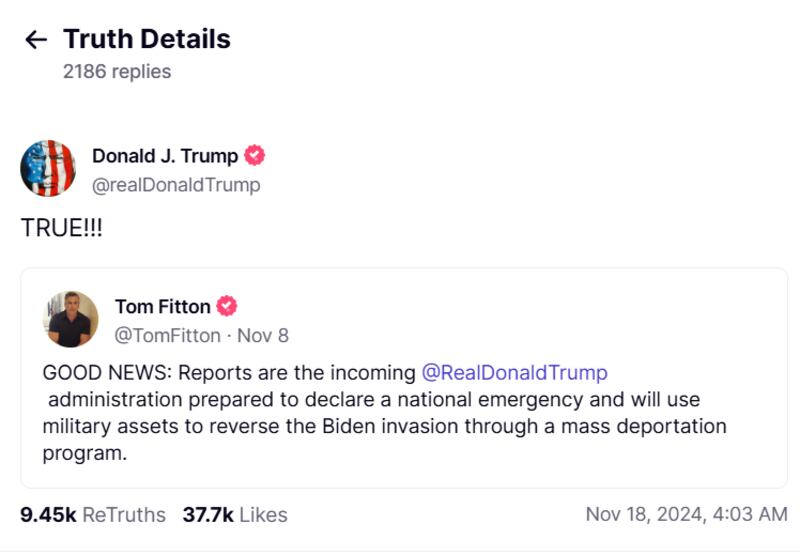

# 事實釐清｜特朗普將“調動美國軍隊”驅逐非法移民？

作者：鄭崇生

2024.11.29 10:47 EST

## 一分鐘完讀：

近日，特朗普將“調動美國軍隊”驅逐非法移民的說法在中文網絡熱傳。經查覈，該說法來自一位美國政治人物在社媒上的發言，原話稱，特朗普將在大規模遣送非法移民的行動中“動用軍事資源”，而特朗普隨後轉發該帖予以肯定。該說法引發英文媒體大量報道，而在中文媒體環境中，該話題則進一步傳播爲特朗普將“動用軍隊”。

就AFCL的工作原則，特朗普的未來行動預測，不屬於事實查覈範圍。但就該說法在媒體和社媒上傳播而言，英文原文“use military asset”（中譯應爲“動用軍事資源”）與中文媒體標題中所稱“調動軍隊”（英譯應爲“deploy military troops”）的意思有所偏差，因此提供該說法的來龍去脈，是爲釐清。

## 深度分析：

11月18日, “特朗普證實將調動美軍驅逐非法移民”的說法一度登上微博熱搜榜,包括 [北京日報](https://archive.ph/kfAaL)、 [第一財經](https://archive.ph/rydfC)微博都這樣引用報道,在抖音上也有大量相關傳聞。

特朗普將“調動軍隊”、驅逐非法移民的說法成爲中國媒體熱點。（微博、抖音截圖）

特朗普將動用“軍事資源“驅逐非法移民的說法,源自美國一個立場親保守派的組織“司法觀察“(Judicial Watch)主席費頓(Tom Fitton)。他8日在特朗普創辦的 [社交媒體平臺Truth Social](https://truthsocial.com/@realDonaldTrump/posts/113503150672865350) 上說,“好消息,即將上任的特朗普政府準備宣佈國家進入緊急狀態,並將在大規模驅逐計劃中使用軍事資源( military assets),以扭轉拜登時期的侵略行爲“(原文見圖2)。

11月18日,特朗普本人賬號在該平臺轉發了此條消息,並加以評論“True(是的)!“,但並沒有更多解釋,隨後,這個表態成爲新聞熱點,引發不少媒體 [討論](https://www.vox.com/politics/386808/trump-mass-deportations-military-law)。

特朗普轉發費頓帖文，稱特朗普政府將大規模驅逐非法移民行動中“使用軍事資源”。（Truth Social特朗普賬號截圖）

不少美國主流媒體在討論此事將該社媒發文的原話簡化，稱特朗普將“use military”（使用軍力），而中文媒體和社媒用戶在翻譯該條新聞時，則直接稱特朗普將“調動軍隊”。

亞洲事實查覈實驗室（Asia Fact Check Lab，簡稱AFCL）就此事向特朗普交接團隊發出詢問，至截稿時未收到回覆。

費頓的發言中的“use military asset”是不是“動用美國軍隊”？亞洲事實查覈實驗室認爲，兩者不能直接畫上等號。英文原文“use military asset”的翻譯應爲“動用軍事資源”，而大部分中文標題“調動軍隊”，翻譯爲英文應爲“deploy military troops”，兩者意思有所偏差，應是媒體和社媒用戶在中英文翻譯之時造成。

值得一提的是,部分英文主流媒體,如 [紐約時報](https://www.nytimes.com/2024/11/18/us/politics/trump-military-mass-deportation.html)、 [美國廣播公司](https://abcnews.go.com/Politics/trump-confirms-plan-declare-national-emergency-military-mass/story?id=115963448)在報道此事時,都使用了特朗普證實將使用“軍力“(military)作爲標題,但在內文中都解釋了該說法的背景,並完整引用了費頓的原話“使用軍事資源“(military asset),並進一步討論總統對於軍事資源使用的權限。

然而大部分中國媒體報道之時，卻沒有交代背景，直接翻譯成特朗普將“調動美國軍隊”、執行大規模驅逐行動，造成了意思上的偏差。

*亞洲事實查覈實驗室(Asia Fact Check Lab)針對當今複雜媒體環境以及新興傳播生態而成立。我們本於新聞專業主義,提供專業查覈報告及與信息環境相關的傳播觀察、深度報道,幫助讀者對公共議題獲得多元而全面的認識。讀者若對任何媒體及社交軟件傳播的信息有疑問,歡迎以電郵* [*afcl@rfa.org*](mailto:afcl@rfa.org) *寄給亞洲事實查覈實驗室,由我們爲您查證覈實。* *亞洲事實查覈實驗室在X、臉書、IG開張了,歡迎讀者追蹤、分享、轉發。X這邊請進:中文* [*@asiafactcheckcn*](https://twitter.com/asiafactcheckcn) *;英文:* [*@AFCL\_eng*](https://twitter.com/AFCL_eng) *、* [*FB在這裏*](https://www.facebook.com/asiafactchecklabcn) *、* [*IG也別忘了*](https://www.instagram.com/asiafactchecklab/) *。*

[Original Source](https://www.rfa.org/mandarin/shishi-hecha/hc-trump-military-mass-deportation-11292024104059.html)