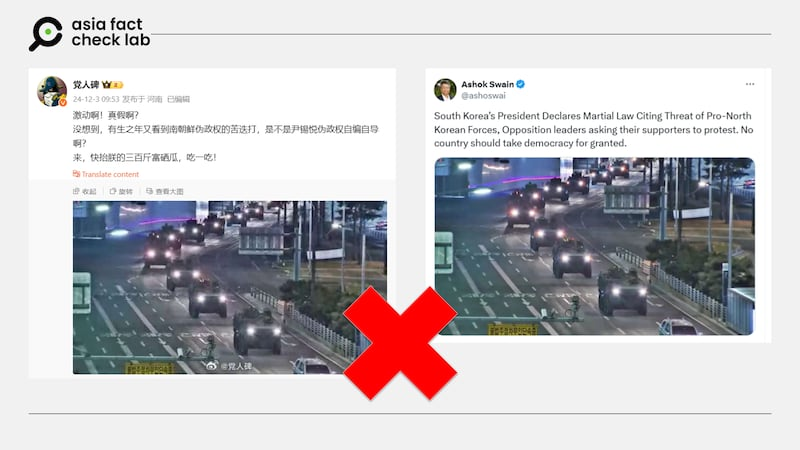
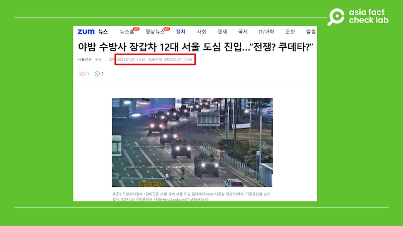

# 事實快查｜韓國宣佈戒嚴後 坦克與裝甲車首爾街頭集結？

作者：鄭崇生

2024.12.03 18:51 EST

## 查覈結果：誤導

## 一分鐘完讀：

韓國總統尹錫悅3日宣佈，韓國時間當日晚11時起，韓國進入緊急戒嚴狀態。相關討論迅速佔據各大媒體和社交平臺。幾小時後，韓國國會4日凌晨召開緊急會議，表決取消戒嚴令。

中文社交媒體上，流傳着不少“坦克”、“裝甲車”在街頭行駛的圖片和視頻，被稱爲是此次首爾的戒嚴時街景，引起熱議。經查覈，這些影像多爲挪用舊照片，並非此次韓國戒嚴期間的景象。

## 深度分析：

韓國宣佈戒嚴後，不少微博用戶，包括幾名有百萬粉絲追隨的[大V](https://archive.ph/vVJms)都在傳播一張多輛裝甲車集結成隊、在黑夜中移動的圖像，在X等社交平臺上，不少英文、韓文用戶，包括瑞典烏普薩拉大學（Uppsala University）專研和平與衝突議題的教授史威（[Ashok Swain](https://archive.ph/KBWnB) ）也在轉傳同一張圖。

多箇中英文社交媒體賬號發佈裝甲車列隊行駛在城市道路上的圖片，被稱爲是此次戒嚴時期的街景。（微博、X截圖） 多箇中英文社交媒體賬號發佈裝甲車列隊行駛在城市道路上的圖片，被稱爲是此次戒嚴時期的街景。（微博、X截圖） (微博、X截圖)

然而，亞洲事實查覈實驗室（AFCL）以圖反搜發現，這張多輛裝甲車集結成隊、在黑夜中移動的圖像，是《[首爾新聞](https://news.zum.com/articles/88427712)》發表於2024年1月底的報道。

裝甲車列隊行駛在城市道路上的圖片實爲2024年初軍事訓練的舊圖片。（韓國媒體zum網站截圖） 裝甲車列隊行駛在城市道路上的圖片實爲2024年初軍事訓練的舊圖片。（韓國媒體zum網站截圖） (韓國媒體zum網站截圖)

當時的報道稱，2024年1月25日的凌晨，韓國陸軍首都防衛司令部在首爾市中心進行裝甲車的機動訓練，主要爲了解首爾的作戰環境，加強準備，當時裝甲車隊伍穿過漢江大橋，在首爾市中心行進的圖像發佈在媒體上。

截至本文發稿，亞洲事實查覈實驗室注意到，在包括路透社、韓聯社在內的各大新聞通訊社媒體都對12月3日晚間戒嚴期間首爾的形勢進行了報道，發佈了不少軍用車輛在國會周邊集結、直升機飛越國會上空的新聞圖片，但並沒有圖片顯示有大量坦克車或裝甲車在首爾街頭行進，也沒有韓國調動集結大批軍力進駐首爾的報道。

根據[韓聯社中文網](https://cb.yna.co.kr/gate/big5/cn.yna.co.kr/view/ACK20241204000100881)，尹錫悅頒佈戒嚴令後，韓國國防部陸軍參謀總長樸安洙隨即發佈《戒嚴司令部佈告令（第一號）》，禁止國會、地方議會、政黨的活動，禁止政治結社、集會、示威等一切政治活動。

但隨後韓國國會在190名國會議員出席的情況下，全票通過解除尹錫悅頒佈的戒嚴令，這其中包括尹錫悅所屬的執政黨國民力量18名“親韓派”議員和在野陣營172名議員，都投下解嚴贊成票。韓國國會共有300個席次，按照韓國《憲法》規定，國會過半數議員要求總統解除戒嚴時，總統須遵守。

韓國時間4日上午4時27分，尹錫悅通過電視直播表示，接受國會要求，將隨即召開國務會議解除戒嚴。

*亞洲事實查覈實驗室（Asia Fact Check Lab）針對當今複雜媒體環境以及新興傳播生態而成立。我們本於新聞專業主義，提供專業查覈報告及與信息環境相關的傳播觀察、深度報道，幫助讀者對公共議題獲得多元而全面的認識。讀者若對任何媒體及社交軟件傳播的信息有疑問，歡迎以電郵*[*afcl@rfa.org*](mailto:afcl@rfa.org)*寄給亞洲事實查覈實驗室，由我們爲您查證覈實。*

*亞洲事實查覈實驗室在X、臉書、IG開張了，歡迎讀者追蹤、分享、轉發。X這邊請進：中文*[*@asiafactcheckcn*](https://twitter.com/asiafactcheckcn)*；英文：*[*@AFCL\_eng*](https://twitter.com/AFCL_eng)*、*[*FB在這裏*](https://www.facebook.com/asiafactchecklabcn)*、*[*IG也別忘了*](https://www.instagram.com/asiafactchecklab/)*。*

[Original Source](https://www.rfa.org/mandarin/shishi-hecha/2024/12/03/hc-tanks-on-street-after-declaration-of-marshal-law-fact-check/)