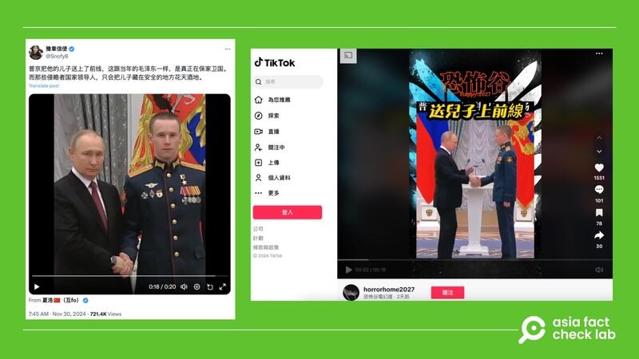

# 事實查覈｜視頻拍下普京送兒子上烏克蘭戰場？

作者：莊敬

2024.12.03 14:56 EST

## 查覈結果：錯誤

## 一分鐘完讀：

中文社媒盛傳俄羅斯總統普京把兒子送上了烏克蘭戰場前線。這則消息附上一段視頻或一張照片，內容是普京與一名着軍裝的青年合影。但經查覈，網傳畫面出自2022年底普京頒發獎章給軍人的報道，既與當前的俄烏戰爭沒有關係，也沒有證據證明這名青年軍人和普京有任何親緣關係。

## 深度分析：

近日在[X](https://x.com/Snofy8/status/1862644092444029057)、[TikTok](https://www.tiktok.com/@horrorhome2027/video/7442995813690723591)、[Threads](https://www.threads.net/@chiahong.chao.9/post/DC8Ne-QvtDg)等平臺上有用戶發佈消息，指俄羅斯總統普京（Vladimir Putin，又譯普丁）把兒子送上烏克蘭戰場前線。這些消息附上視頻（或照片），畫面是普京與一名着軍裝的青年握手，接着在青年的衣服上別上獎章，再次握手後，兩人轉往同一方向，像是看向攝影機合影。

社媒盛傳俄羅斯總統普京把兒子送上烏克蘭戰場前線 社媒盛傳俄羅斯總統普京把兒子送上烏克蘭戰場前線 (X、TikTok截圖)

亞洲事實查覈實驗室（Asia Fact Check Lab）將視頻定格截圖，並以圖反搜後，找到了同樣場景的[照片](https://www.upi.com/News_Photos/view/upi/f3465606e1c2ada9e57afdb014b5acd8/President-Putin-Attends-Ceremony-for-Presenting-State-Decorations/)，圖說指出，普京於2022年12月頒發“金星獎章”給俄羅斯軍人，圖中的軍人名叫Stepan Belov。其他[圖庫](https://www.alamy.com/moscow-russia-20th-dec-2022-russian-president-vladimir-putin-left-awards-senior-lieutenant-stepan-belov-with-the-gold-star-medal-of-the-hero-of-russia-during-the-ceremony-for-presenting-state-decorations-of-the-russian-federation-at-the-kremlins-st-catherine-hall-in-moscow-russia-on-december-20-2022-photo-by-kremlin-poolupi-credit-upialamy-live-news-image501929521.html)也有這張照片。

根據《[紐約時報》報道](https://cn.nytimes.com/world/20220517/putin-family-wealth-sanctions/zh-hant/)，普京公開承認有兩名女兒，來自他的第一段婚姻，但據獨立的俄羅斯新聞機構和未經證實的國際報道，普京可能還有其他子女。而在今年9月，調查新聞機構「檔案中心」（Dossier Center）[揭露](https://www.rferl.org/a/putin-children-dynasty-kabayeva-aristocracy/33117353.html)了普京與前奧運體操冠軍卡巴耶娃（Alina Kabaeva）育有兩名兒子的更多細節。

不過，俄羅斯官方並未證實關於普京是否有其他子女的傳言，普京本人也極少談論家庭狀況。目前並無證據顯示網傳畫面中的年輕軍人與普京有任何親屬關係，但可以確定的是，部分網民挪用了其他場合的影像，傳播未經證實的消息。

*亞洲事實查覈實驗室（Asia Fact Check Lab）針對當今複雜媒體環境以及新興傳播生態而成立。我們本於新聞專業主義，提供專業查覈報告及與信息環境相關的傳播觀察、深度報道，幫助讀者對公共議題獲得多元而全面的認識。讀者若對任何媒體及社交軟件傳播的信息有疑問，歡迎以電郵*[*afcl@rfa.org*](mailto:afcl@rfa.org)*寄給亞洲事實查覈實驗室，由我們爲您查證覈實。亞洲事實查覈實驗室在X、臉書、IG開張了，歡迎讀者追蹤、分享、轉發。X這邊請進：中文*[*@asiafactcheckcn*](https://twitter.com/asiafactcheckcn)*；英文：*[*@AFCL\_eng*](https://twitter.com/AFCL_eng)*、*[*FB在這裏*](https://www.facebook.com/asiafactchecklabcn)*、*[*IG也別忘了*](https://www.instagram.com/asiafactchecklab/)*。*

[Original Source](https://www.rfa.org/mandarin/shishi-hecha/2024/12/03/hc-putin-sends-son-to-ukraine-front-fact-check/)