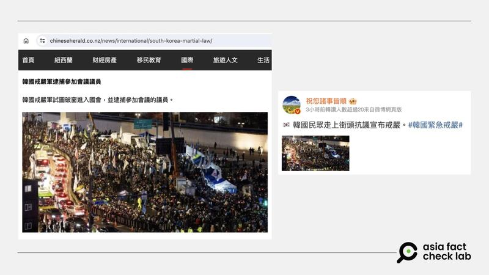

# 事實快查｜網傳照片是韓國“戒嚴”後民衆抗議畫面？

作者：莊敬

2024.12.04 14:54 EST

## 查覈結果：誤導

## 一分鐘完讀：

韓國總統尹錫悅12月3日深夜突然宣告戒嚴，但遭國會投票推翻，尹錫悅隨即於4日凌晨4時許表示接受國會要求解除戒嚴，這場“戒嚴”全程約僅6小時。這段時間，網路上流傳許多與韓國戒嚴相關的畫面，其中有媒體、具影響力的社媒帳號挪用無關舊影像，誤導讀者。

## 深度分析：

韓國總統尹錫悅於12月3日10時25分宣佈從當晚11時實施緊急戒嚴，宣稱此舉是爲應對導致國家基本職能癱瘓的反國家勢力。國會於4日凌晨1時緊急召開全體會議，190名議員一致通過關於要求解除緊急戒嚴的決議案。尹錫悅在4日凌晨4時27分透直播發表談話，[宣佈解除戒嚴](https://cb.yna.co.kr/gate/big5/cn.yna.co.kr/view/ACK20241204001600881?section=politics/index)。從宣佈戒嚴至解嚴，僅維持約6小時。

亞洲事實查覈實驗室（Asia Fact Check Lab，下簡稱AFCL）注意到，這段時間網路上流傳許多與韓國戒嚴相關的視頻與照片，但有部分媒體與網民挪用了無關事件的影像，散佈不實信息。

例如，《新西蘭中文先驅報》12月4日轉載的[文章](https://archive.ph/fRMEK)中，寫到“韓國戒嚴軍試圖破窗進入國會，並逮捕參加會議的議員”，報道所搭配的照片中可見大量人羣在街道集結，時間像是在晚間。另一位微博[“大V”用戶](https://m.weibo.cn/detail/5107660434702672)也轉傳同張照片，配文寫着“韓國民衆走上街頭抗議宣佈戒嚴”。另有[英文媒體](https://www.republicworld.com/world-news/video-crowd-storms-south-korean-parliament-amid-martial-law-unrest)在報道韓國戒嚴新聞時，搭配同張照片。

網傳韓國民衆上街抗議宣佈戒嚴，但經查這張照片是在韓國戒嚴事件前拍攝。 網傳韓國民衆上街抗議宣佈戒嚴，但經查這張照片是在韓國戒嚴事件前拍攝。（新西蘭中文先驅報網站、微博截圖） (（新西蘭中文先驅報網站、微博截圖）)

AFCL以圖反搜後，在不同網站（[1](https://folhapress.folha.com.br/foto/28399914),[2](https://www.ansalatina.com/sito/photogallery/primopiano/2024/11/30/seulcortei-per-chiedere-dimissioni-presidente-yoon-suk-yeol_dfa655bb-572c-4918-8fbe-046f5098ef1a.html)）上找到符合的照片，根據圖說，這是今年11月30日，民衆在首爾集結抗議要求尹錫悅下臺。網路資訊顯示，這張照片來源是西班牙“艾菲通訊社”（Agencia EFE）與“歐洲新聞圖片社”（EPA），拍攝者爲[JEON HEON-KYUN](https://www.sfcc.or.kr/?page_id=29932)，檔案日期爲2024年11月30日。

而透過以圖反搜，亦發現多張角度不同但場景相似的照片，出自韓國媒體對於上述事件的相關報道（[1](https://koreajoongangdaily.joins.com/news/2024-12-01/national/politics/Protestors-throng-downtown-Seoul-to-denounce-Yoon-govt-demand-special-probe-for-first-lady/2190070),[2](https://english.khan.co.kr/khan_art_view.html?artid=202412021703517&code=710100)）。此外，事實查覈機構“Verify”已針對網傳照片[發佈查覈報告](https://www.verifythis.com/article/news/verify/world-verify/photos-korea-martial-law-protests-fact-check/536-3e4e9e0e-3641-4fbb-a4a3-3295ce8a6b91)。

韓國戒嚴風波持續延燒，尹錫悅遭朝野圍攻，其高層幕僚集體辭職，亦有民間組織舉行集會要求尹錫悅下臺。本篇查覈的網傳照片雖然是民衆要求尹錫悅下臺，但發生在韓國戒嚴風波之前，部分媒體與網民挪用舊影像談論韓國戒嚴事件，恐誤導受衆。 AFCL稍早亦針對其它挪用舊影像的誤導信息，發佈了[查覈報告](2024-12-03_事實快查｜韓國宣佈戒嚴後 坦克與裝甲車首爾街頭集結？.md)。

*亞洲事實查覈實驗室（Asia Fact Check Lab）針對當今複雜媒體環境以及新興傳播生態而成立。我們本於新聞專業主義，提供專業查覈報告及與信息環境相關的傳播觀察、深度報道，幫助讀者對公共議題獲得多元而全面的認識。讀者若對任何媒體及社交軟件傳播的信息有疑問，歡迎以電郵*[*afcl@rfa.org*](mailto:afcl@rfa.org)*寄給亞洲事實查覈實驗室，由我們爲您查證覈實。*

*亞洲事實查覈實驗室在X、臉書、IG開張了，歡迎讀者追蹤、分享、轉發。X這邊請進：中文*[*@asiafactcheckcn*](https://twitter.com/asiafactcheckcn)*；英文：*[*@AFCL\_eng*](https://twitter.com/AFCL_eng)*、*[*FB在這裏*](https://www.facebook.com/asiafactchecklabcn)*、*[*IG也別忘了*](https://www.instagram.com/asiafactchecklab/)*。*

[Original Source](https://www.rfa.org/mandarin/shishi-hecha/2024/12/04/hc-south-korea-martial-law-impeachment-opposition/)