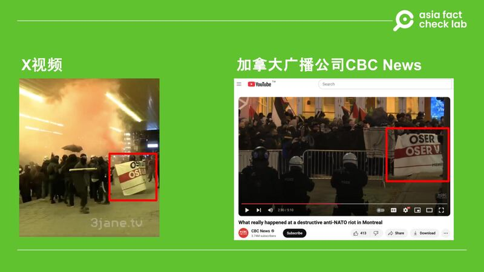

# 答讀者問｜網傳“加拿大蒙特利爾暴力衝突”的視頻是真的嗎？

作者：艾倫

2024.12.05 13:31 EST

## 查覈結果：正確

11月23日，有X用戶[標記](https://x.com/zymzmxw/status/1860322124361269640)AFCL，詢問一則據稱是在加拿大發生的暴力衝突視頻是否爲真。

轉傳這則視頻的帳號署名“[唐丹鴻](https://x.com/DanHongTang/status/1860213256692044254)”，稱該視頻發生於加拿大蒙特利爾，並附評論稱“伊斯蘭共產主義進步運動就要成功了”。

通過對比當地主流媒體信息，AFCL認爲，該視頻中的場景確實發生在加拿大，是近期一次支持巴勒斯坦、反北約活動中，暴力衝突升級的現場，然而部分中文社交媒體轉發該視頻時稱該活動是“伊斯蘭共產主義進步運動”的說法並不準確。

## 深度分析：

在轉發視頻時，[“唐丹鴻”](https://x.com/DanHongTang/status/1860213256692044254)寫道：“恭喜形形色色的聖戰士、‘抵抗戰士’和親哈！你們的蒙面事業蒸蒸日上，巴勒斯坦即將解放！”

hc 11月底，有讀者在X上轉發一則加拿大反北約的示威遊行視頻，並詢問真僞。（X截圖）

該視頻展示的事件現場中，有抗議者使用煙霧彈、敲破窗戶以及縱火。進一步查詢，該段視頻轉發自英文帳號“The Mossad: Satirical and Awesome”，視頻上印有浮水印“3jane.tv”，該賬號在發佈視頻時提及：“加拿大已不再是加拿大了。我們希望賈斯廷特魯多（Justin Trudeau）在讓其餘的聖戰分子進來並征服這個國家之前下臺。他們正在蒙特利爾焚燒猶太人的雕像。”

AFCL比對網傳視頻及加拿大廣播公司CBC News的[報道畫面，](https://www.youtube.com/watch?v=IF7UqK3aLFw)發現多數畫面相同：

一、網傳畫面和媒體引用的視頻皆出現抗議者手持“OSER LUTTER OSER VAINCRE”的法文標語，意思爲“敢於鬥爭，敢於勝利”，標語設計皆爲白底黑字及紅底白字。

hc 社媒流傳的視頻及加拿大媒體的報道畫面，皆出現相同抗議標語。（X、YouTube截圖）

二、網民詢問的視頻畫面顯示，其中一個示威地點爲蒙特利爾會議中心（Palais des congrès de Montréal），和加拿大媒體出示的畫面相同。

hc 蒙特利爾會議中心爲示威的其中一個地點，X視頻及加拿大廣播公司皆有相關畫面。（X、YouTube截圖）

三、X和CBC新聞的視頻皆捕捉到一名身着全身黑色服裝的示威者嚇到一名攝影師的畫面，地點也在蒙特利爾會議中心前。

hc 抗議現場的攝影師被身着全黑服裝的示威者嚇到畫面。（X、YouTube截圖）

四、網民轉發的視頻及當地媒體新聞畫面皆呈現同一畫面，也就是此次抗議羣衆“焚燒猶太人仿像（effigy）”。其中CBS News引用的畫面來源和X貼文相同，都是英文用戶“The Mossad: Satirical and Awesome”。

hc 此次示威抗議中，可看到有民衆焚燒“猶太人仿像”的畫面。（X、YouTube截圖）

AFCL去信詢問CBS News公關室，以多重確認網傳畫面的真實性，至截稿日（12月5日）前未獲回應。但從上述資料畫面比對，可判斷網民詢問的視頻畫面爲真實事件，CBS News也在其報道中保證其引用畫面的準確性：“我們審查並覈實了暴動當晚的社媒內容，並獲得了獨家影像，展示了事件的發生經過。”

除了CBS News之外，加拿大[CTV電視網](https://www.youtube.com/watch?v=nYDD3PG5tEk)、國際通訊社[美聯社](https://apnews.com/article/montreal-nato-protest-canada-9230b0d52b191ef12bf092ab51f68e5a)也曾對這次抗議發佈相關報道。綜合當地及國際媒體報道，本次示威活動中有人使用了煙霧彈，金屬路障被拋到街道上，還兩輛汽車被縱火，一些商家以及正在舉辦北約會議的會展中心的窗戶被砸毀，警方逮捕了至少三人。

該抗議活動由“巴勒斯坦撤資行動”（Divest for Palestine）和“反資本主義鬥爭聯盟”（The Convergence of Anti-Capitalist Struggles）組織，針對的是11月23至24日期間來自北約成員國和夥伴國的代表，他們當時在蒙特利爾討論包括支持烏克蘭、氣候變遷及北約未來等議題。並沒有證據顯示，該抗議活動宣稱有伊斯蘭宗教背景。

這次抗議活動的暴力升級也在加拿大引發了廣泛爭論。 加拿大總理賈斯汀特魯多（Justin Trudeau）在11月24日曾[發文譴責](https://x.com/JustinTrudeau/status/1860367559956070846)，“昨晚在蒙特利爾街頭髮生的景象令人震驚。任何形式的反猶太主義、恐嚇和暴力行爲都必須被譴責，無論它們發生在哪裏。”

而特魯多也因爲這場暴亂而受到批評， 例如加拿大保守派、現任在野黨黨魁博勵治（Pierre Marcel Poilievre）就[譴責](https://x.com/PierrePoilievre/status/1860411739973751287)特魯多領導無方，任內只推動“有毒的覺醒身分政治”（toxic woke identity politics ），才導致這場暴亂的發生。

*亞洲事實查覈實驗室（Asia Fact Check Lab）針對當今複雜媒體環境以及新興傳播生態而成立。我們本於新聞專業主義，提供專業查覈報告及與信息環境相關的傳播觀察、深度報道，幫助讀者對公共議題獲得多元而全面的認識。讀者若對任何媒體及社交軟件傳播的信息有疑問，歡迎以電郵*[*afcl@rfa.org*](mailto:afcl@rfa.org)*寄給亞洲事實查覈實驗室，由我們爲您查證覈實。*

*亞洲事實查覈實驗室在X、臉書、IG開張了，歡迎讀者追蹤、分享、轉發。X這邊請進：中文*[*@asiafactcheckcn*](https://twitter.com/asiafactcheckcn)*；英文：*[*@AFCL\_eng*](https://twitter.com/AFCL_eng)*、*[*FB在這裏*](https://www.facebook.com/asiafactchecklabcn)*、*[*IG也別忘了*](https://www.instagram.com/asiafactchecklab/)*。*

[Original Source](https://www.rfa.org/mandarin/shishi-hecha/2024/12/05/hc-canada-violent-conflict-video/)