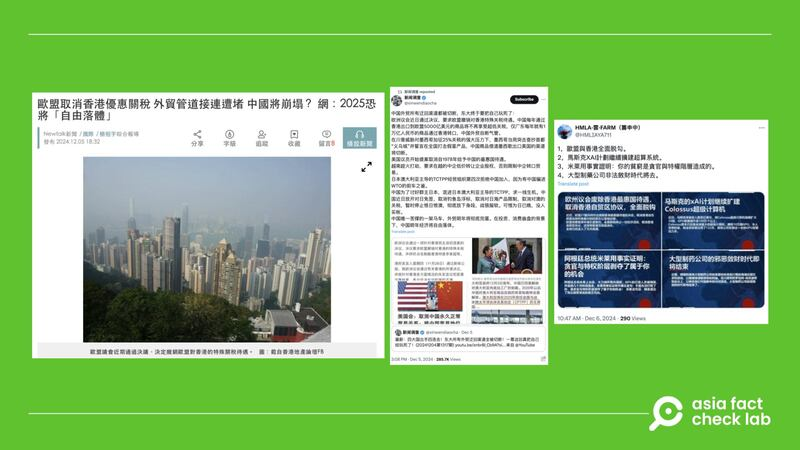

# 事實查覈｜歐盟決定撤銷香港特殊關稅待遇？

作者：莊敬

2024.12.09 16:53 EST

## 查覈結果：誤導

## 一分鐘完讀：

臺灣媒體“NewTalk新聞”近日發佈報道，稱“歐盟議會(編案：應爲歐洲議會)近期通過決議，決定撤銷歐盟針對香港的特殊關稅待遇”。

經覈查確認，歐洲議會在11月底通過的決議案爲“呼籲（calls on）”歐盟國家撤銷香港的特殊關稅待遇，這項決議案並不具約束力，因此“NewTalk新聞”報道所寫“歐盟決定撤銷對香港優惠關稅”並不正確，其它發佈相關信息的網絡論壇和門戶網站，都傳播了誤導信息。

## 深度分析：

臺灣網路媒體“NewTalk新聞”12月5日[發佈報道](https://archive.ph/S8wLi)，標題寫着“歐盟取消香港優惠關稅”，內文寫道：“推主‘新聞調查’稱，歐盟議會近期通過決議，決定撤銷歐盟對香港的特殊關稅待遇。”這則報道經“Yahoo!新聞”[轉載](https://tw.news.yahoo.com/%E6%AD%90%E7%9B%9F%E5%8F%96%E6%B6%88%E9%A6%99%E6%B8%AF%E5%84%AA%E6%83%A0%E9%97%9C%E7%A8%85-%E5%A4%96%E8%B2%BF%E7%AE%A1%E9%81%93%E6%8E%A5%E9%80%A3%E9%81%AD%E5%A0%B5-%E4%B8%AD%E5%9C%8B%E5%B0%87%E5%B4%A9%E5%A1%8C-%E7%B6%B2-2025%E6%81%90%E5%B0%87-103217053.html?)，也被分享到臺灣網路論壇“[Mobile01](https://www.mobile01.com/topicdetail.php?f=780&t=7053823)”。此外，[X](https://x.com/HMLIAYA711/status/1864864279033237959)上也有中文賬號傳播相關信息的圖卡，稱“歐洲議會廢除香港最惠國待遇”。

網路媒體與社媒用戶傳播歐盟決定撤銷香港優惠關稅的消息。圖取自NewTalk新聞、X 網路媒體與社媒用戶傳播歐盟決定撤銷香港優惠關稅的消息。 (圖取自NewTalk新聞、X)

經查，報道引述的X賬號“[新聞調查](https://x.com/xinwendiaocha/status/1864567401519698077)”12月5日發帖，指“歐洲議會近日通過決議，要求歐盟撤銷對香港特殊關稅待遇。中國每年通過香港出口到歐盟5000億美元的商品將不再享受超低關稅⋯⋯”。此處需要注意的是，“新聞調查”在陳述歐洲議會通過的決議時，用字爲“要求”撤銷，但“NewTalk新聞”引用時寫成“決定撤銷”。

亞洲事實查覈實驗室（Asia Fact Check Lab，下簡稱AFCL）進一步查詢歐洲議會近期通過的決議，發現歐洲議會在11月28日以473票贊成、23票反對、98票棄權下，通過一項不具約束力的[決議案](https://www.europarl.europa.eu/doceo/document/TA-10-2024-0051_EN.html)，譴責香港就民主派47人案的判決，要求立即釋放民主派人士，並且“呼籲（calls on）”歐盟國家撤銷香港的特殊關稅待遇，重新審視香港駐布魯塞爾經貿辦的地位等。

根據歐洲議會的[說明資料](https://www.europarl.europa.eu/RegData/etudes/BRIE/2024/757839/EPRS_BRI(2024)757839_EN.pdf)，雖然決議不具約束力，但仍是重要的工具，表達了議會多數人的觀點，且議會可以透過決議引起其他機構對特定問題的關注，進而影響其行動。

[香港特別行政區政府](https://www.info.gov.hk/gia/general/202411/28/P2024112800681.htm)11月28日就歐洲議會通過有關香港的決議，表示堅決反對和強烈不滿。

AFCL檢視了歐洲議會決議案，以及[美國之音](https://www.voachinese.com/a/european-parliament-calls-for-canceling-hong-kong-s-special-customs-status-20241130/7882911.html)、[法廣](https://www.rfi.fr/tw/%E4%B8%AD%E5%9C%8B/20241129-%E6%AD%90%E6%B4%B2%E8%AD%B0%E6%9C%83%E4%BF%83%E6%92%A4%E6%B8%AF%E9%97%9C%E7%A8%85%E5%84%AA%E6%83%A0-%E4%B8%AD%E6%B8%AF%E5%8F%8D%E5%B0%8D-%E7%A8%B1%E6%90%8D%E6%AD%90%E4%BC%81%E5%88%A9%E7%9B%8A)等媒體報道，確認歐洲議會通過的決議內容爲“呼籲”歐盟國家撤銷香港的特殊關稅待遇，並非“決定撤銷”。“NewTalk新聞”僅引用社媒用戶的分析，並沒有提供歐洲議會決議案原文等重要資訊，且報道用詞不準確，傳播了扭曲決議案原意的誤導信息。

*亞洲事實查覈實驗室（Asia Fact Check Lab）針對當今複雜媒體環境以及新興傳播生態而成立。我們本於新聞專業主義，提供專業查覈報告及與信息環境相關的傳播觀察、深度報道，幫助讀者對公共議題獲得多元而全面的認識。讀者若對任何媒體及社交軟件傳播的信息有疑問，歡迎以電郵*[*afcl@rfa.org*](mailto:afcl@rfa.org)*寄給亞洲事實查覈實驗室，由我們爲您查證覈實。*

*亞洲事實查覈實驗室在X、臉書、IG開張了，歡迎讀者追蹤、分享、轉發。X這邊請進：中文*[*@asiafactcheckcn*](https://twitter.com/asiafactcheckcn)*；英文：*[*@AFCL\_eng*](https://twitter.com/AFCL_eng)*、*[*FB在這裏*](https://www.facebook.com/asiafactchecklabcn)*、*[*IG也別忘了*](https://www.instagram.com/asiafactchecklab/)*。*

[Original Source](https://www.rfa.org/mandarin/shishi-hecha/2024/12/09/hc-new-talk-misleading-report-taiwan/)