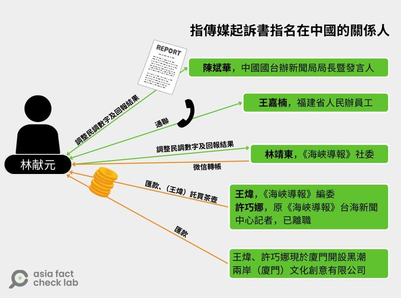

# 深度報道｜中共外宣在臺灣之一： 臺檢以《反滲透法》訴大選假民調當事人，一審因何失利？

作者：莊敬、董喆、艾倫

2024.12.11 19:04 EST

## 前言：

亞洲事實查覈實驗室（Asia Fact Check Lab，AFCL）今天起推出年終重磅系列報道 “中共外宣在臺灣”。深度聚焦中共宣傳、統戰機構是如何通過“業務合作”、金錢交易及人員邀訪等方式，逐步影響臺灣媒體，再借由媒體的力量影響臺灣。

極權政府的外宣，常是不實信息的產地。AFCL在長期查覈不實信息的過程中發現，要消除不實信息，不但要查覈單則事件，更應該揭露不實信息的整個生產線。

2023年底，AFCL揭露了發佈總統大選假民調的《指傳媒》案。過去一年，AFCL仍然持續追蹤相關案件，在過程中獲得許多看似不相干的線索碎片，但串聯相關人事物後，發現其中不少人和事都與福建省的媒體及宣傳機構存在某種程度的關聯，進而得以拼湊出一個框架、一個系統性的操作策略—我們稱之爲“福建網絡”。在接下來刊出的每一篇調查報道中，都能看到“福建網絡”的操作痕跡。

該系列第一篇報道，也是《指傳媒》案的續集。

## 正文：

2023年12月22日，亞洲事實查覈實驗室刊出了《指傳媒案調查報道：“謎之總統大選民調”與他們的產地》（[上](https://www.rfa.org/cantonese/news/factcheck-tw1-12222023163055.html)、[下](https://www.rfa.org/cantonese/news/factcheck-tw2-12222023170615.html)）。《指傳媒》《元豐傳媒》等網媒曾刊登了一份國民黨正副總統候選人侯友宜、趙少康“首次超車”民進黨對手的民調，被[預測網站](https://tsjh301.blogspot.com/2023/11/2024-Taiwanese-presidential-election.html)收錄後進入主流媒體，也登上門戶網站“Yahoo奇摩新聞”，相關新聞報道更一度在網絡社羣PTT（批踢踢實業坊）八卦版“紅爆”。

這份民調由“民調專家”、退休教授蘇雲華執行，最初報道這份民調的是《指傳媒》的記者林獻元，他同時也參與民調執行。AFCL採訪後，發現這份民調的調查方式極不專業，是一次不實信息的操作。

就在調查報道刊出的同一天，臺中地檢署發佈[新聞稿](https://www.tcc.moj.gov.tw/295804/295830/657577/1134792/post)，起訴了林獻元和蘇雲華。起訴書指控民調是林獻元涉嫌接受“中共福建省委員會”官員指示製作，並且獲得了來自中國的資金。

檢察官偵查終結後在2024年2月[提起公訴](https://www.tcc.moj.gov.tw/295804/295830/657577/1148074/post)，判斷被告林獻元和蘇雲華涉嫌犯下兩條罪行：

一、《總統副總統選舉罷免法》：意圖使特定候選人當選或不當選，以文字、圖畫傳播不實事項。

二、《反滲透法》第7條：受滲透來源之指示、委託或資助，而犯總統副總統選舉罷免法第五章......之罪者，加重其刑至二分之一。

檢察官引用《反滲透法》中所稱的“滲透來源之指示、委託、資助”，指的就是來自福建所屬機構的資金。但2024年8月，本案一審宣判的結果，針對違反《反滲透法》的部分卻被認定並不成立。

爲什麼是這樣的結果呢？

## 宣判

2024年8月30日上午9時28分，臺中地方法院第19法庭[宣判](https://tcd.judicial.gov.tw/tw/cp-3656-2525946-55a34-211.html)“113選訴字第1號”案件，被告林獻元未出庭聆聽判決，蘇雲華則由親屬陪同出庭。結束後，蘇雲華快步離去。面對記者包圍、追問，他只回了一句：“我一塊錢都沒拿”。

林獻元依違反《公司法》《選罷法》，判處有期徒刑8個月、褫奪公權2年，蘇雲華依違反選罷法判處有期徒刑4個月、褫奪公權1年，均得易科罰金。至於兩人被控《反滲透法》部分，法官認爲不成立。

根據《自由時報》[報道](https://video.ltn.com.tw/article/TfGX_X17iOE/PLI7xntdRxhw0r6oz4YWJY9xRScLkoe0Wi)，林獻元的委任律師朱清奇回應判決說，“被控觸犯《反滲透法》部分，法官認爲不成立，他們感謝法官明辨。”

爲何《反滲透法》部分不成立？出面說明判決的臺中地院黃玉琪庭長說，被告林獻元是長年從事兩岸採訪新聞工作的記者，所以他跟大陸新聞媒體記者同業，或跟大陸地區的官方新聞聯絡人、發言人有直接的聯絡，或者有交換新聞資訊，並不是不能理解或想像。“本院認爲，這與從事新聞媒體採訪的工作生態是密切相關的，不能因此直接作爲對林獻元不利之認定。”

## 案情

儘管一審法官認爲《反滲透法》部分不成立，但綜合一審[起訴書](https://psue.moj.gov.tw/psiqs/detail.jsp?d=86bfe5c5eeaba768d6b817baf92e3a43e2942401cb61d80ea9)與[判決書](https://judgment.judicial.gov.tw/FJUD/default.aspx)所述的情節顯示，此案存在不尋常的中國金流與人脈，甚至直達中國國臺辦。

起訴書指出，林獻元在2023年4月20日至23日，受中國共產黨福建省委員會直屬報社《海峽導報》社委林靖東邀約赴廈門旅遊，林獻元並邀約蘇雲華共同前往。林獻元返臺後，爲便於日後以網路媒體公司名義在臺發佈民調結果以取信中共官媒，於2023年4月間著手成立“指動新媒體傳播有限公司”，並創立網路新聞平臺“元豐傳媒”。

林獻元於2023年10月初，以指動新公司名義，與蘇雲華約定以每波民調15萬元新臺幣，即10波民調共150萬元的價格，委託蘇雲華進行“2024年中華民國總統大選民意調查”。雙方通謀虛僞籤立一份民調合作書，稱“本合作案系無償進行”，兩人並籤立不實的150萬借據，佯稱林獻元向蘇雲華借款150萬，之後再由林“還款”給蘇。

蘇雲華在各地火車站以隨機拍照、攀談方式佯作其有實際製作民調，林獻元接續傳播不實民調，自行或透過不知情的友人分別發佈在《元豐傳媒》、《指傳媒》、《藍雀新傳媒》等網站，誤導選民對於選情的判斷。

AFCL發現，在非主流網媒之中，《指傳媒》算是小有名氣，因爲它曾在2019年涉入[“紅色網媒案”](https://news.ltn.com.tw/news/politics/breakingnews/2851530)，受到臺灣國安單位、媒體的關注，此後原本常赴中國參加活動的社長遊勝鈞轉趨低調。林獻元也曾在《指傳媒》擔任大陸中心主任。

蘇雲華在製作民調的期間，曾透過通訊軟體向林獻元詢問“紅色網媒案”，並表達要“思考未來合作與否”，林獻元則回以“老師，有發生什麼事情嗎？能否把剩下的做完，有始有終，才能請款？”

然而，林獻元並沒有每次都依照蘇雲華交付的民調結果公佈，他曾自行調升“侯康配”的支持度，調整幅度1%至2%。

“第一次調是我自己想的，因爲差距比較大，第二、三次是林靖東拜託我的，我受到大陸媒體同業林靖東請託，基於人情壓力，所以更改、調整民調結果……因爲林靖東他們也都是支持侯康，希望我能幫這個忙。”林獻元供稱。

## 對價關係？

除了林靖東外，起訴書上還出現了多名在中國的關係人：

陳斌華，中國國臺辦新聞局局長暨發言人

王嘉楠，福建省人民辦的員工

王煒，《海峽導報》編委

許巧娜，原擔任《海峽導報》臺海新聞中心記者，現已離職，她和王煒在廈門合夥開設立黑潮兩岸（廈門）文化創意有限公司。

根據檢方的調查，這些在中國的關係人和林獻元有以下互動：

王煒、許巧娜曾分別轉帳匯款到林獻元指定的中國賬戶，其中有些轉帳的時間點之巧合，像是林獻元在2023年12月3日發佈“侯康配首次超車”的民調數據新聞後，許巧娜於12月4日轉帳人民幣一萬元至林的廈門銀行賬戶。

林獻元於2023年12月9日把不實民調結果，以通訊軟體微信傳送給陳斌華，陳表示：“收到”。12月10日，林靖東以微信賬號撥款人民幣2千元到林獻元微信賬戶。

12月11日，林獻元再度發佈民調新聞後，把網站連結傳給林靖東，林靖東表示：“收到”。

12月13日，林獻元告知林靖東預計作第9波、第10波民調出爐的時間，並向林靖東稱“到時候數據出來，你再自己調整給我”，林靖東回以“OK”。12月16日，許巧娜轉帳人民幣5千元至林獻元廈門銀行賬戶。

12月19日，林獻元分別傳送民調數據給林靖東和王煒，並且與兩人通話。期間，林靖東曾傳送“+3”的訊息給林獻元。在經過多次微信通話討論後，林獻元向林靖東傳送“侯康加2點”，以及更改數據後的文字檔案。林靖東傳送“辛苦了”，林獻元傳送“明天可以發出嗎？”，林靖東回以“抓緊”，林獻元並於12月20日發佈經過調整後的民調結果。

《指傳媒》案起訴書中羅列林獻元和中國方面人士的關係圖

*圖：《指傳媒》案起訴書中指明的中方聯繫人示意圖 AFCL 製圖*

12月21日，臺灣檢警執行搜索，扣得手機、電腦及製作不實民調相關文件，傳喚林獻元、蘇雲華與相關證人7人到案說明。

經調查，林獻元收受款項共計人民幣13萬餘元。林獻元主張，是受王煒之託購買茶壺的費用，並提出購買茶壺資料爲憑。檢方則主張，扣除購買茶壺費用，其餘是林獻元爲中方寫稿發佈新聞的報酬，但林獻元否認。

## 林靖東算不算滲透來源？

但檢方提出的證據，臺中地院法官認爲它最多隻能證明林獻元從事兩岸新聞工作，並結交部分中國友人或媒體同業，“尚難認爲被告2人就本案傳播不實之事，主觀上具有直接對價之營利意圖”。法院並認爲，檢方主張蘇雲華與“指動新公司”訂立的總統大選民調合作書和借據都虛僞不實，卻又以這項證據證明2人有150萬元製作民調費用的約定，“容有過度臆測之嫌，尚難採憑”。

至於2人涉犯違反[《反滲透法》](https://law.moj.gov.tw/LawClass/LawAll.aspx?pcode=A0030317)第7條，法官認定並沒有積極證據足以證明被告2人是受滲透來源指示、委託或資助。

《反滲透法》對於“滲透來源”的定義是：“境外敵對勢力之政黨對臺工作機關派遣之人、境外敵對勢力各組織、機構、團體所設立或實質控制之人或派遣之人。”

接下來的問題就在於：林靖東是否符合“滲透來源”的定義？以及被告2人是否知道林靖東爲“滲透來源”？

根據判決書，“公訴意旨認定林靖東爲‘滲透來源’，無非以林靖東任職之報社《海峽導報》系福建日報社報業集團下屬機構，福建日報報業集團又系中共福建省委會直屬正廳級事業單位，爲其主要論據。”

“然而，此種‘間接’關聯性，是否爲被告2人或一般人所得知悉，已非無疑。”法官引述學者研究指出，相較於《人民日報》以政治議題爲重，《海峽導報》著重兩岸民間交流，淡化傳統《人民日報》使用的“遏獨促統”與“一中論述”報導框架。而林靖東曾數度到臺灣駐點，與從事兩岸新聞採訪工作者有一定聯繫，林獻元辯稱不知林靖東爲“滲透來源”等語，並非全然不可採信。

檢方另以林獻元與陳斌華、王煒的對話，以證明林獻元與中共黨政有關。法官認爲，林獻元長年從事兩岸新聞採訪事務，與中國新聞媒體同業或官方新聞聯絡人、發言人有直接聯絡方式或互相交換新聞、資訊並非不能理解或想象。

## 滲透來源的法理和事實

“這位法官......對媒體（的性質）有他個人的判斷，但這可能與事實不符......”。在《指傳媒》案判決出爐後，一位負責兩岸、國安事務的決策官員，很含蓄地評論，他直言，執法人員需要強化“識讀中國”的素養。

AFCL訪問的法律專家，對法官的認定也有不同看法。

“這（指林靖東）怎麼會是間接呢？”臺灣永社理事長、南臺科技大學財經法律研究所特聘教授兼所長羅承宗接受AFCL採訪，聽到判決書內容後搖搖頭，直說“在中國體制裏面，誰跟你直接、間接，就算是間接，也都影響得到呀！”

羅承宗指出，臺灣法官所學多是西方的民主憲政秩序，不瞭解世界上存在的另一種體系，也就是民主集中制，而民主集中制的重點，就是黨代表國、不信任權力制衡、沒有所謂官與民的分別。當臺灣的法官一廂情願用臺灣法律視角看中國，“只用你所知道的西方民主憲政套用，就會產生誤差”。

曾任行政院政務委員的律師羅秉成受訪表示，法官以“中央級”的《人民日報》做比較，而認爲省級的《海峽導報》不符合滲透來源；但若將重點放在“實質控制”面，《海峽導報》員工應該落在“滲透來源”的定義之內，因爲中國官媒不分中央、地方，都受到黨的實質控制，檢方提出的上訴理由書需要好好說明這一點。

## 檢方上訴：

針對一審判決，檢方已提起[上訴](https://judgment.judicial.gov.tw/FJUD/printHistory.aspx?id=TCDM,113,%25E9%2581%25B8%25E8%25A8%25B4,1,113,%25E9%2581%25B8%25E8%25A8%25B4,1,20240830,1&d=20240830)，據瞭解，上訴理由包括：

一、原審量刑顯然過輕，不足以嚇阻以假訊息干擾民主選舉行爲。

二、被告2人確實有“意圖營利”而發佈不實民調。

三、被告2人主觀上顯然知悉林靖東爲反滲透法所指之滲透來源。

四、被告林獻元爲媒體新聞工作者，並長期在中國走動，辯稱僅知悉林靖東爲報社或新聞同業人員，不知林靖東等人爲滲透來源云云，悖離一般經驗法則。

針對檢方的上訴理由，林獻元的另一位委任律師楊玉珍回應：

一、反滲透法自立法以來即爭議不斷，並有多名學者提出質疑，其構成要件不夠明確，讓掌權者享有很大操作空間，有違反罪刑法定原則之虞。

二、林獻元本職爲記者，主要報道與兩岸交流相關之議題，因而與中國記者有所認識、往來，並未悖於常情，故原審就反滲透法部分系不另爲無罪諭知，檢察官以捕風捉影、臆測方式，上訴指摘原判決違背經驗法則，顯無理由。

檢方就《指傳媒》假民調案上訴的結果還在未定之天，中共國臺辦發言人、《海峽導報》員工是否符合法律定義的滲透來源，檢方、院方、專家各有想法，暫時留下一個問號。但從《指傳媒》案的案情中頻繁出現了一個名字：林靖東。這位《海峽導報》任職，長時間採訪兩岸的中國新聞工作者，曾多次踏上臺灣土地，熟悉臺灣主流、非主流媒體生態，無疑已經“參透”臺灣。林靖東所代表的，是一個更大的執行對臺統戰的結構。在接下來的報道里，我們將仔細敘述這個結構。

(感謝外部專家黃維玲、獨立記者與研究員陳慧敏對本系列報道的貢獻。）

本系列其它各篇專題如下：

之二：[林靖東和林獻元背後的大外宣架構](2024-12-12_深度報道｜中共外宣在臺灣之二：林靖東和林獻元背後的大外宣架構.md)
之三：[老牌本土報紙如何被澆灌出親中敍事？](2024-12-20_深度報道｜中共外宣在臺灣之三：老牌本土報紙如何被澆灌出親中敘事？.md)
之四：[海峽兩岸的兩家《導報》](2024-12-25_深度報道｜中共外宣在臺灣之四：海峽兩岸的兩家《導報》.md)
之五：[對臺統戰的操盤手“福建網絡”](2024-12-31_深度報道｜中共外宣在臺灣之五：對臺統戰的操盤手“福建網絡”.md)
之六：[管不管網路？那是個問題](https://www.rfa.org/mandarin/shishi-hecha/2025/01/03/fact-check-ccp-propaganda-taiwan-serial6/ "https://www.rfa.org/mandarin/shishi-hecha/2025/01/03/fact-check-ccp-propaganda-taiwan-serial6/")

*亞洲事實查覈實驗室（Asia Fact Check Lab）針對當今複雜媒體環境以及新興傳播生態而成立。我們本於新聞專業主義，提供專業查覈報告及與信息環境相關的傳播觀察、深度報道，幫助讀者對公共議題獲得多元而全面的認識。讀者若對任何媒體及社交軟件傳播的信息有疑問，歡迎以電郵*[*afcl@rfa.org*](mailto:afcl@rfa.org)*寄給亞洲事實查覈實驗室，由我們爲您查證覈實。*

*亞洲事實查覈實驗室在X、臉書、IG開張了，歡迎讀者追蹤、分享、轉發。X這邊請進：中文*[*@asiafactcheckcn*](https://twitter.com/asiafactcheckcn)*；英文：*[*@AFCL\_eng*](https://twitter.com/AFCL_eng)*、*[*FB在這裏*](https://www.facebook.com/asiafactchecklabcn)*、*[*IG也別忘了*](https://www.instagram.com/asiafactchecklab/)*。*

[Original Source](https://www.rfa.org/mandarin/shishi-hecha/2024/12/12/hc-ccp-propaganda-in-taiwan/)