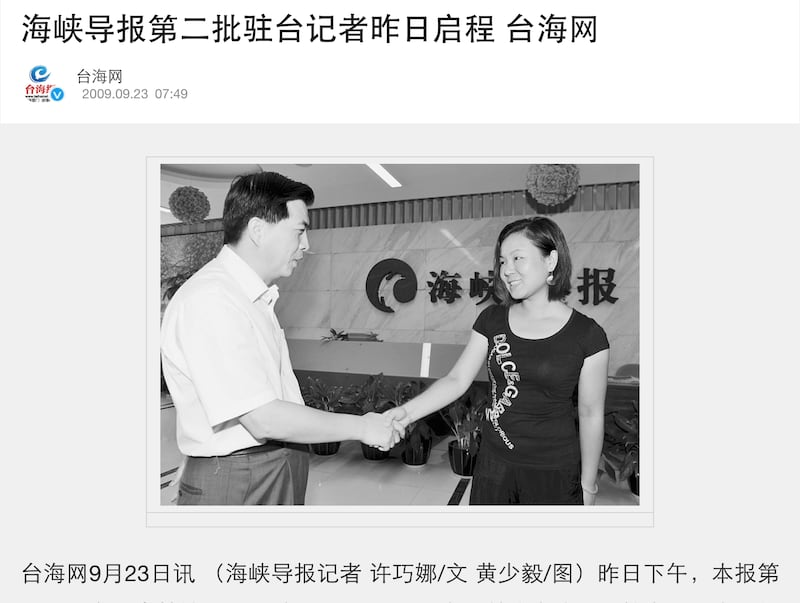
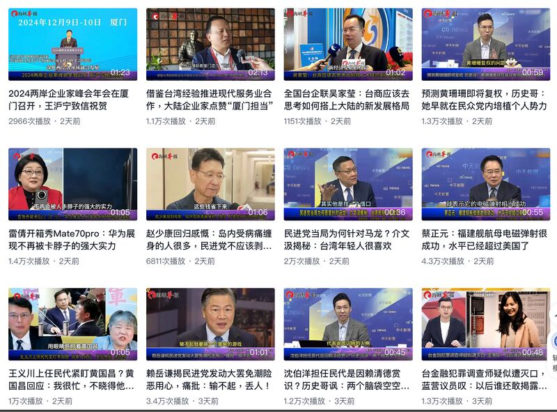
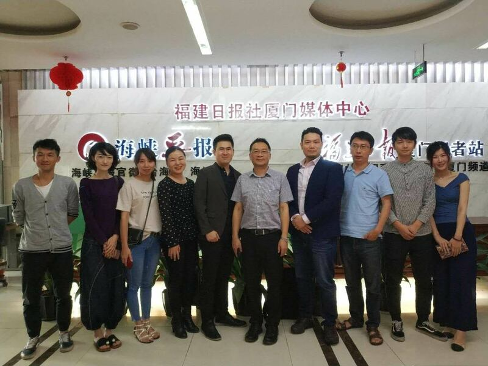
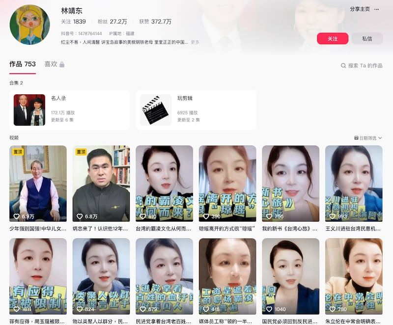
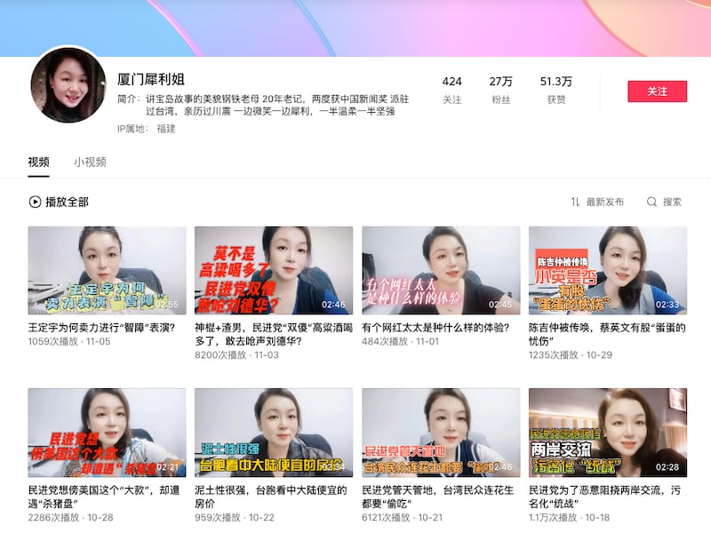
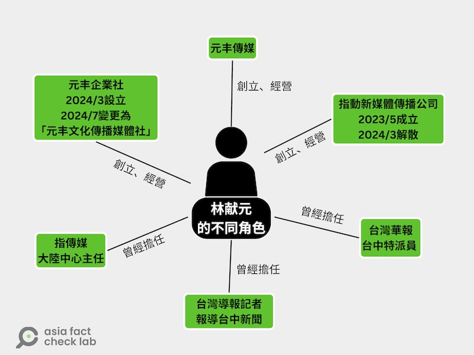

# 深度報道｜中共外宣在臺灣之二：林靖東和林獻元背後的大外宣架構

作者：莊敬、艾倫、董喆

2024.12.12 14:30 EST

臺灣YouTuber“八炯”6日發表了一部[《統戰紀錄片》](https://www.youtube.com/watch?v=IXndeTRH8tU&t=32s)，僅僅五天觀看人次就超過250萬，也讓片中一位中國記者林靖東和她服務的《海峽導報》成了風暴核心，片中網紅出示與林靖東的對話紀錄，顯示長期以來兩人相互配合，由林靖東提供素材、網紅負責編曲批評民進黨政府。在《指傳媒》案起訴書描繪的統戰網絡裏，林靖東只是其中一環，而她藉助媒體工作執行對臺灣新聞界的統戰已經超過20年。

同樣，2023年底執行假民調，並且曾多年爲《臺灣導報》發稿的網媒記者林獻元，也是一個臺灣網路傳媒集羣的重要成員。這些網路集羣的成員，日常刊發的“兩岸新聞”着力描寫中國大陸好山好水，兩岸同文同種。到了選舉關鍵時刻，則集體發出假造民調，幫助“候康配民調首度超車”的“新聞”攻上網路重要位置。

可以說，林靖東和林獻元各代表一個結構，雙方在交流往來的過程中接通了中共統戰臺灣的線路。

## 《海峽導報》和“廈門犀利姐”

林靖東爲《海峽導報》工作25年。[公開資料](https://sjc.hqu.edu.cn/info/1031/4049.htm)顯示，她自1999年進入《海峽導報》工作，於2009年[首次駐臺採訪](https://news.sina.cn/sa/2009-09-23/detail-ikmyaawa2166082.d.html)，爲《海峽導報》第二批駐臺記者，當時省委宣傳部副部長朱清還特地爲她送行。在林靖東20多年的記者生涯中，至少三度以《海峽導報》記者身份派駐臺灣。

2009年《海峽導報》派遣林靖東等記者駐臺時的報道 圖截取自臺海網 2009年《海峽導報》派遣林靖東等記者駐臺時的報道 (圖截取自臺海網)

《海峽導報》是《福建日報》報業集團旗下媒體，《福建日報》社隸屬中共福建省委，持有《海峽導報》百分之百的股份。《海峽導報》1991年在廈門創刊，定位是全中國唯一以對臺宣傳爲主的市民生活報，“立足廈門、輻射臺灣”。

2023年《海峽導報》又[成立](http://big5.taiwan.cn/xwzx/la/202408/t20240823_12644419.htm)兩岸第一個“融合發展青創空間”，目標是要兩岸青年“多往來、多交心”。

《海峽導報》影音平臺發佈的內容，大量剪輯中天、中視、TVBS等臺灣媒體政論節目評論員畫面，搭配新聞時事製作成新聞片，當中不乏錯假資訊，亞洲事實查覈實驗室（Asia Fact Check Lab, AFCL）也曾發佈過與之相關的查覈報吿（[1](https://www.rfa.org/mandarin/shishi-hecha/hc-11092023145604.html?encoding=traditional)，[2](https://www.rfa.org/cantonese/news/factcheck/tw-01042024075008.html)）。

《海峽導報》影音平臺引用臺灣媒體素材製作的新聞和評論視頻 圖截取自《海峽導報》短視頻平臺 《海峽導報》影音平臺引用臺灣媒體素材製作的新聞和評論視頻 (圖截取自《海峽導報》短視頻平臺)

2023年10月，臺灣名嘴介文汲在中天政論節目《秀芳辣晚報》中宣稱日本福島核電站日工人接觸到核污染水後送醫情況危急；2024年1月，臺灣前臺北縣長周錫瑋同樣在中天政論節目中稱臺灣從美國買F-16戰機是“冤大頭”。兩者都被證實是錯誤資訊，但已被《海峽導報》搬運，作爲疑美、疑日的素材。

根據臺灣環境資訊研究中心（IORG）於2023年的[調查](https://iorg.tw/da/57)，最常引用臺灣名嘴的中共官媒抖音頻道前3名依序爲“臺海網”（44.97%）、“海峽導報”（31.26%）、“中國臺灣網”（7.69%）。其中臺海網及海峽導報，皆隸屬在福建日報報業集團之下。

除了大量搬運臺灣親中網紅言論，《海峽導報》的記者亦肩負新聞採訪以外的其他“任務”。林靖東就是其代表，在多起中國對臺輿論戰事件中，皆扮演替臺灣親中勢力穿針引線的角色。

林靖東的名字曾出現在一篇有影響力的調查報道中——臺灣媒體《報道者》2019年刊出的[《打不死的內容農場––揭開“密訊”背後操盤手和中國因素》](https://www.twreporter.org/a/information-warfare-business-content-farm-mission)。

“密訊”是在臺灣小有名氣的內容農場，因充斥浮濫內容和不實訊息而多次被下架。根據《報道者》的調查，其背後操盤手爲新黨青年委員會委員林正國，而在2018年4月，選在福建省廈門市搶先推動“惠臺60條”後，林正國與時任新黨發言人王炳忠出席《海峽導報》多媒體中心的落成儀式並拍攝合照，林靖東也在其中。

林正國、王炳忠和林靖東等人出席《海峽導報》多媒體中心的落成儀式 圖取自王炳忠臉書 林正國、王炳忠和林靖東等人出席《海峽導報》多媒體中心的落成儀式 (圖取自王炳忠臉書)

林靖東以本名林靖東經營抖音、臉書，以“廈門犀利姐”經營西瓜視頻，共同點是以“前駐臺記者”身份，發佈大量鍼砭臺灣時事的短影音，集中火力抨擊臺灣執政黨民進黨以及現任總統賴清德。時間跨度從2020年至今，未曾間斷更新。

林靖東以本名和網名經營的短視頻平臺 圖截取自抖音、西瓜視頻 林靖東以本名和網名經營的短視頻平臺 (圖截取自抖音、西瓜視頻)

林靖東以本名和網名經營的短視頻平臺 圖截取自抖音、西瓜視頻 林靖東以本名和網名經營的短視頻平臺 (圖截取自抖音、西瓜視頻)

林靖東於2021年記者節在百度刊登文章自述，“回望自己的職業生涯：前半部分，我在書寫、記錄別人的喜怒哀樂，記錄著歷史；後半部分，我走上臺前，展現自己的喜怒哀樂，成爲事件的一部分。用現在的流行語，叫‘價值輸出’，記者生涯要求我客觀公正，不摻情感，而網紅生涯需要我引導輿論，輸出情緒和價值。”

林靖東的這番話，明確將自己的職業生涯做了兩階段的定義：前半生是記者，後半生是網紅。她以駐臺記者身份，在臺灣累積了親中勢力人脈，即便結束駐臺生涯，這些人脈織成一張綿密的網，支撐他作爲自媒體網紅的內容資本。

即使2023年底《指傳媒》案爆發後，林靖東的名字頻繁出現在臺灣媒體的報道中，也沒有讓她停止對臺工作。賴清德就職後，林靖東在騰訊網發表[專文](https://news.qq.com/rain/a/20240523A03HEU00)，批評賴清德的講話傷害兩岸，稱“美國人利用賴清德是想佔便宜”；她並持續在[微博](https://m.weibo.cn/u/1076159053?luicode=10000011&lfid=1005051076159053)、抖音發佈視頻，話題包括“民進黨惡意阻擋兩岸交流，污名化統戰”“賴清德巧立名目舔美，順便A臺灣的民脂民膏”等。

林靖東也保持與林獻元的互動，2024年6月，林獻元在林靖東臉書留言稱“來臺灣，會被抓哦！”，林靖東回應“你懂”。

## 《指傳媒》案發生後

至於《指傳媒》案主要被告林獻元，他在交保後[高調宣佈復出](https://news.ltn.com.tw/news/politics/breakingnews/4577651)，並且向媒體[喊冤](https://news.ltn.com.tw/news/politics/breakingnews/4577719)，表示自己從沒對不起臺灣，是受到政治打壓。

“林獻元”這個名字，在不同時期曾經和不同的媒體有所關聯。有時他是創立、經營者，例如2024年3月解散的“指動新媒體傳播有限公司”。但同時又設立“元豐企業社”，7月再更名爲“元豐文化傳播媒體社”。

以“開啓兩岸交流新紀元”爲口號的“元豐傳媒”網站仍在運作，林獻元亦經常發佈臺中新聞。此外，過去他曾擔任“[《指傳媒》大陸中心主任](https://hk.crntt.com/crn-webapp/touch/detail.jsp?coluid=7&kindid=0&docid=105482667)”，也曾爲《臺灣導報》和《臺灣華報》報導臺中新聞。

林獻元的不同角色示意圖 製圖：AFCL 林獻元的不同角色示意圖 (製圖：AFCL)

AFCL 發現，像林獻元這樣接連創立、經營多家公司或者不同媒體品牌、交錯兼任其它媒體機構工作的情形並非個案，而是地方小型網媒集羣發展的常態。

以《指傳媒》案爲例，從法院文件可以發現本案證人包括網路新聞《藍雀新傳媒》平臺的許姓經營者、《指傳媒》遊姓經營者、《臺灣民衆電子報》陳姓記者、前《元豐傳媒》蘇姓記者等。

進一步查詢後發現，上述證人與林獻元有着很高的相似性——他們的名字常出現在特定幾個網媒上，例如在《元豐傳媒》也可看到記者陳姓記者報道；蘇姓記者曾爲《臺灣導報》和《指傳媒》發稿。

而且，前述新聞工作者都曾經赴中國參加媒體採訪活動，其中許、遊和林獻元曾以臺灣媒體人身分接受中國媒體訪問。

## 小型網媒爲什麼集結成羣？

深挖《指傳媒》案，一個“小型網媒集結成羣，人員相互幫襯”的產業結構逐漸浮現出來。但這些網媒如何生存？他們的影響力又在哪裏？

林獻元在2023年底接受AFCL記者採訪時，曾經解釋這些地方媒體的經營策略是以“人情”爲中心的“螞蟻雄兵”。 “大家都是人情而已啦，人情拜託他幫忙發一下，很多都是義務性的”他說道。

一位熟悉臺灣媒體生態的人士接受AFCL採訪時，首先表達他不同意將《指傳媒》稱之爲地方媒體，但也坦言不知該如何定位“這類網站”。

接着他分析創立“這類網站”的三種可能用途：第一賺錢，可利用平臺找議員、市府要求“宣傳廣告費”“賣個版面兩萬到三萬”，如果市府不配合，這類網站的記者就可能“會鬧、亂寫，或搞假投票”，例如小內閣滿意度調查，或配合議員攻擊市府，又或是把發文連結傳到地方羣組，進而對市府形成壓力。

我們進一步搜尋，找到了幾個《臺灣導報》在臺灣曾接過的宣傳廣告案，包含[臺中市新聞局](https://www.news.taichung.gov.tw/media/807578/%E6%96%B0%E8%81%9E%E5%B1%805%E6%9C%88%E8%BE%A6%E7%90%86%E6%94%BF%E7%AD%96%E5%8F%8A%E6%A5%AD%E5%8B%99%E5%AE%A3%E5%B0%8E%E4%B9%8B%E5%9F%B7%E8%A1%8C%E6%83%85%E5%BD%A2%E8%A1%A8.pdf)、[臺中市政府地方稅務局](https://www.tax.taichung.gov.tw/media/1003326/112%E5%B9%B48%E6%9C%88-%E4%BF%AE2.pdf)、[臺中市政府原民委員會](https://www.ipd.taichung.gov.tw/media/915576/111%E5%B9%B4%E8%BE%A6%E7%90%86%E6%94%BF%E7%AD%96%E5%8F%8A%E6%A5%AD%E5%8B%99%E5%AE%A3%E5%B0%8E%E4%B9%8B%E5%9F%B7%E8%A1%8C%E6%83%85%E5%BD%A2%E8%A1%A8-12%E6%9C%88.pdf)、[中油](https://ws.cpc.com.tw/Download.ashx?u=LzAwMS9VcGxvYWQvMS9yZWxmaWxlLzg5NzAvNzEyODQvOTkzOGI0ZGItMDNmYy00OWEyLWExYzQtYzlmMjkwZmJiY2Y3Lnhsc3g%3D&n=MTEy5bm0NuaciOaUv%2BetluWuo%2BWwjuW7o%2BWRii54bHN4&icon=.xlsx)等，而這些合作案的收入大多落在一萬至五萬臺幣不等。證明了採訪對象的分析。

第二種可能是某勢力的網軍，只要養工程師架網站、內容到處抓公開新聞稿即可，而這類網站常在選舉前後突然成立並“齊發”特定內容，有時可以引起主流媒體注意、報導“地方媒體盛傳”某個消息，然而網站會在選舉後消失，下次選舉前又改名出現。第三種則是政治團體的外圍網站，爲了以特定內容攻擊某政治人物。

一位臺中市議員助理告訴AFCL，類似像《指傳媒》《臺灣導報》等地方網媒，雖然表面上不如主流媒體來得有影響力，但卻能透過在地方臉書、LINE等臺灣人常用通訊軟體流傳消息，這些影響力都無法估計。

## 小型網媒能夠影響輿論走向嗎？

“科技、民主與社會研究中心”（DSET）研究員林雨蒼長期關注資訊操弄，在2019年率先分析[“紅色網媒案”](https://news.ltn.com.tw/news/politics/breakingnews/2851530)的網絡。他近期接受AFCL訪問時，談到“紅媒案”仍印象深刻，他認爲《指傳媒》主事者在臺灣創立多個網站，目的就是爲了複製中國的宣傳文章，滿足對方的KPI（關鍵績效指標）需求。

四年後，看到《指傳媒》仍在運作，又因刊登總統大選假民調再度躍上媒體版面，林雨蒼一點也不感到驚訝。他說，這些網媒只要有“統戰錢”可賺，就可以生存下去，雖然網站的傳播力不大，但可以形成“背景的雜音”，人們看久了，還是會有效果。

林雨蒼比喻，這就像是“排廢水”，不肖業者爲了賺點小錢，把廢水到處排，某些網媒也是，爲了賺中國的錢，“把髒東西排到臺灣的言論市場，污染你的入口網站”。

曾任記者，並曾任職入口網站的臺灣政治大學新聞系助理教授李怡志認爲，雖然可能很少人聽過、看過《指傳媒》這類“迷你媒體”，但它們被看到的機會還是很多，仍具傳播效益，因爲現在常見公關操作路徑是先刊在一個名不見經傳的媒體，經由這些媒體登上“Yahoo奇摩新聞”“LINE TODAY”後，再把看起來“經過認證”的連結，轉發到PTT、DCard（臺灣匿名交流平臺）。

“稿子一旦上了Yahoo或是LINE TODAY，你就會信任。”李怡志說。

李怡志分析，有些人創立“迷你媒體”也許存在政治動機，但更多是出自公關動機，運用網媒露出，與新聞內容聚合平臺簽約，就能向付費客戶賣保證曝光的方案。這些網媒通常得維持日常發佈正常稿件，以便與大型聚合平臺簽約，“但簽約後，假設我每天放一百則（報道）進來，在裏面塞個兩則（有問題的報道）你也不會知道，因爲稿件的量很大”。

“這有解方嗎？”記者問。

李怡志苦笑，每次被問到這題，他的答案都一樣：“請看主流可信的媒體，只有這個解方，沒有別的了”。如果聚合平臺未經查證、率而轉載，是否負連帶責任，李怡志認爲還需要更多討論，他建議平臺應思考建立一個“定期抽樣”的機制，每一段時間抽看稿件是否有問題。

## “以小博大”的戰略

“我覺得他在對臺灣進行以小博大的戰略。”陸委會主委邱垂正接受AFCL訪問時，直言中國政府正透過一部分小型網路媒體影響地方，特別鎖定中南部、中下階層，以及年輕世代。這個戰略對臺灣的潛在危害就是“平時養著，必要時揭竿而起”，影響選舉，或是讓臺灣變弱，變得沒有抵抗能力。

“所以我還是覺得，對於中共的假訊息攻擊，揭露很重要。揭露他對臺灣的不良意圖，怎麼樣滲透，怎麼樣製造臺灣的混亂，讓國人知道他有這個企圖，我們就可以反攻。”邱垂正說，社會韌性最重要的一塊，就是識讀教育，包括識讀中國、識讀兩岸關係，不僅針對一般人，對專業人士也很重要。

一名資深兩岸記者表示，他常在中國參訪行程遇到某幾家臺灣地方網媒的經營者和記者，就他觀察，網媒在兩岸的賺錢方式其實差不多，大致是向政府單位賣版面賺宣傳費，或是推觀光的業務合作案。他曾看過臺灣網媒經營者向中國官員提供網頁、PDF檔交差，“其實對岸也知道（臺灣地方網媒）沒有什麼影響力，但辦活動就要結案、要報告，形式上有臺媒參加、有露出……不管成效如何”。

這位資深記者以自身經驗分析，臺灣主流媒體比較“邀不動”的原因，除了考量活動新聞性不足，其實有些人也怕《反滲透法》而“不敢動”“不敢接業務”；另一方面也是對岸的“落地招”待遇愈來愈差，例如取消了車馬費文化，以及過往城市之間移動可以搭機，後來只能搭高鐵二等座。也因此，中國地方政府爲活動結案所需，常邀臺灣地方網媒“沖人氣”，最近更愛網紅與自媒體。

曾任臺灣行政院政務委員的律師羅秉成也提出識假、破假的重要性，透過揭露假訊息加強免疫力。從這個角度而言，雖然在《指傳媒》案，檢方和院方對滲透來源的定義範圍看法不同，但它成爲“法院認證的假民調”就很有意義，人們以後看民調會自我提醒，背後可能有政治操作、境外勢力，讓它“入不了腦”。

《指傳媒》、《元豐傳媒》雖然是小型地方網媒，但由他們引發的總統大選假民調案，是個指標性的案件，讓外界看見中國如何利用臺灣媒體生態的弱點攻擊分化臺灣。但這個“媒體生態的弱點”從何而來？ 系列的下一篇，AFCL將從臺灣南部老牌媒體《民衆日報》的故事說起。

(感謝外部專家黃維玲、獨立記者與研究員陳慧敏對本系列報道的貢獻。）

本系列其它各篇專題如下：

之一：[臺檢以《反滲透法》訴大選假民調當事人，一審因何失利？](2024-12-12_深度報道｜中共外宣在臺灣之一： 臺檢以《反滲透法》訴大選假民調當事人，一審因何失利？.md)
之三：[老牌本土報紙如何被澆灌出親中敍事？](2024-12-20_深度報道｜中共外宣在臺灣之三：老牌本土報紙如何被澆灌出親中敘事？.md)
之四：[海峽兩岸的兩家《導報》](2024-12-25_深度報道｜中共外宣在臺灣之四：海峽兩岸的兩家《導報》.md)
之五：[對臺統戰的操盤手“福建網絡”](2024-12-31_深度報道｜中共外宣在臺灣之五：對臺統戰的操盤手“福建網絡”.md)
之六：[管不管網路？那是個問題](2025-01-03_深度報道｜中共外宣在臺灣之六：管不管網路？那是個問題.md)

*亞洲事實查覈實驗室（Asia Fact Check Lab）針對當今複雜媒體環境以及新興傳播生態而成立。我們本於新聞專業主義，提供專業查覈報告及與信息環境相關的傳播觀察、深度報道，幫助讀者對公共議題獲得多元而全面的認識。讀者若對任何媒體及社交軟件傳播的信息有疑問，歡迎以電郵*[*afcl@rfa.org*](mailto:afcl@rfa.org)*寄給亞洲事實查覈實驗室，由我們爲您查證覈實。*

*亞洲事實查覈實驗室在X、臉書、IG開張了，歡迎讀者追蹤、分享、轉發。X這邊請進：中文*[*@asiafactcheckcn*](https://twitter.com/asiafactcheckcn)*；英文：*[*@AFCL\_eng*](https://twitter.com/AFCL_eng)*、*[*FB在這裏*](https://www.facebook.com/asiafactchecklabcn)*、*[*IG也別忘了*](https://www.instagram.com/asiafactchecklab/)*。*

[Original Source](https://www.rfa.org/mandarin/shishi-hecha/2024/12/12/hc-in-depth-report-ccp-media-taiwan/)