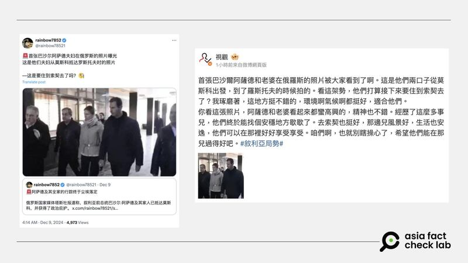
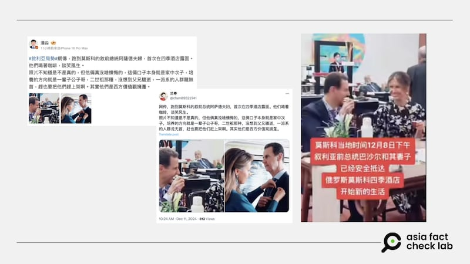

# 事實查覈｜阿薩德夫婦逃到莫斯科，照片曝光了？

作者：莊敬

2024.12.13 13:19 EST

## 查覈結果：錯誤

## 一分鐘完讀：

敘利亞阿薩德政權倒臺後，俄羅斯國家媒體稱阿薩德夫婦已抵達莫斯科並獲得俄“人道庇護”，但並未發佈相關圖片。中、英文社媒近日流傳數張阿薩德夫婦的照片，稱是阿薩德夫婦出逃後抵達莫斯科的近況。但經查，網傳照片都並非近照，而是敘利亞政變之前阿薩德夫婦參加各類活動的場景，這些賬號傳播了錯誤信息。

## 深度分析：

12月8日，敘利亞反政府武裝團體攻入首都大馬士革，總統巴沙爾·阿薩德（Bashar al-Assad）逃離，長達24年的獨裁政權垮臺。據[英國廣播公司](https://www.bbc.com/zhongwen/articles/cp83q927q06o/trad)（BBC）等媒體引述俄媒的報道，俄羅斯基於人道主義理由給予阿薩德及家人庇護。近日中、英文社媒流傳數張阿薩德夫婦的照片，傳播者稱這是他們出逃後抵達莫斯科的近況。

## 首張阿薩德夫婦在俄照片曝光？

敘利亞阿薩德政權倒臺後，阿薩德夫婦的照片在社媒廣泛流傳，被稱是阿薩德出逃後抵達莫斯科照片曝光。圖取自X、微博 敘利亞阿薩德政權倒臺後，阿薩德夫婦的照片在社媒廣泛流傳，被稱是阿薩德出逃後抵達莫斯科照片曝光。 (圖取自X、微博)

在[微博](https://m.weibo.cn/detail/5110331443249235)、[X](https://x.com/rainbow78521/status/1865852536302833868)等平臺上，都有用戶轉傳一張阿薩德與妻子阿斯瑪·阿薩德（Asma al-Assad )並肩行走的照片，稱“首張巴沙爾阿薩德夫婦在俄羅斯的照片曝光，這是他們夫婦從莫斯科抵達羅斯托夫時的照片”。

亞洲事實查覈實驗室（Asia Fact Check Lab，下簡稱AFCL）以圖反搜後，發現這是阿薩德夫婦2023年訪問阿勒坡時的[畫面](https://www.youtube.com/watch?v=nHoKYVFIB_c)，並非近況。這張照片在英文世界廣傳，[法新社（AFP）](https://factcheck.afp.com/doc.afp.com.36PW3N9)、[Logically](https://www.logicallyfacts.com/en/fact-check/2023-image-shared-as-first-picture-of-bashar-al-assad-moscow-fleeing-syria)等機構已發佈查覈報告。

## 逃到俄國的阿薩德夫婦露面“談笑風生”？

敘利亞阿薩德政權倒臺後，社媒盛傳阿薩德夫婦的照片，稱兩人逃到莫斯科後露面、談笑風生。圖取自X、微博、Bilibili 敘利亞阿薩德政權倒臺後，社媒盛傳阿薩德夫婦的照片，稱兩人逃到莫斯科後露面、談笑風生。 (圖取自X、微博、Bilibili)

近日在[微博](https://m.weibo.cn/detail/5110348856164667)、[B站](https://www.bilibili.com/video/BV1LvqcYbE3L/)、[X](https://x.com/chen09522741/status/1866670264240705861)等平臺，多位用戶發佈阿薩德夫婦的照片（或視頻），其中一張是阿薩德夫婦坐着相視而笑，另一張看起來像是阿斯瑪在爲阿薩德別胸章。配文寫著：“網傳跑到莫斯科的敘前總統阿薩德夫婦，首次在四季酒店露面。他們喝着咖啡，談笑風生。照片不知道是不是真的⋯⋯”。

AFCL以圖反搜並未找到相符照片。由於照片中阿斯瑪手上的茶杯、場地的擺設、桌上的水壺等線索透露場景很可能在中國，因此AFCL先以“阿薩德”“中國”等關鍵字搜尋照片，發現阿薩德夫婦於2023年9月參加杭州亞運相關活動的裝扮（[照片1](https://images.app.goo.gl/6GcDTQdFbCMTSyY27)、[照片2](https://images.app.goo.gl/janyS7iggCdH88qAA)），與兩人在網傳照片中的裝扮高度相似。

進一步以“阿薩德訪華”“杭州亞運”等關鍵字詞在各平臺查詢，找到微博用戶[“靜漪微瀾“](https://m.weibo.cn/detail/4949515921786079)於2023年9月24日上傳的一則7秒短視頻，內有網傳阿薩德妻子爲阿薩德別胸章的畫面，而這段視頻的左上角寫著“asmaalassad”。再以此賬號搜尋，在[TikTok](https://www.tiktok.com/@asmaalassadsyria/video/7401822844599995664)上找到一段14秒的短視頻，其中包括前述別胸章的畫面，以及阿薩德夫婦坐著相視而笑的影像，從視頻底下的留言時間判斷，這則視頻並非近日拍攝、上傳。

近期在中文社媒流傳的三張照片，都是阿薩德政權倒臺之前所拍攝，並非阿薩德出逃後抵達莫斯科的近況照，因此網民傳播了錯誤信息。

*亞洲事實查覈實驗室（Asia Fact Check Lab）針對當今複雜媒體環境以及新興傳播生態而成立。我們本於新聞專業主義，提供專業查覈報告及與信息環境相關的傳播觀察、深度報道，幫助讀者對公共議題獲得多元而全面的認識。讀者若對任何媒體及社交軟件傳播的信息有疑問，歡迎以電郵*[*afcl@rfa.org*](mailto:afcl@rfa.org)*寄給亞洲事實查覈實驗室，由我們爲您查證覈實。*

*亞洲事實查覈實驗室在X、臉書、IG開張了，歡迎讀者追蹤、分享、轉發。X這邊請進：中文*[*@asiafactcheckcn*](https://twitter.com/asiafactcheckcn)*；英文：*[*@AFCL\_eng*](https://twitter.com/AFCL_eng)*、*[*FB在這裏*](https://www.facebook.com/asiafactchecklabcn)*、*[*IG也別忘了*](https://www.instagram.com/asiafactchecklab/)*。*

[Original Source](https://www.rfa.org/mandarin/shishi-hecha/2024/12/13/hc-al-assad-photo-exposed/)