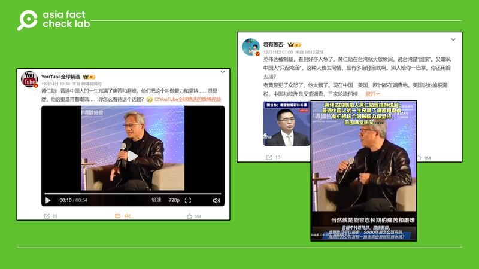
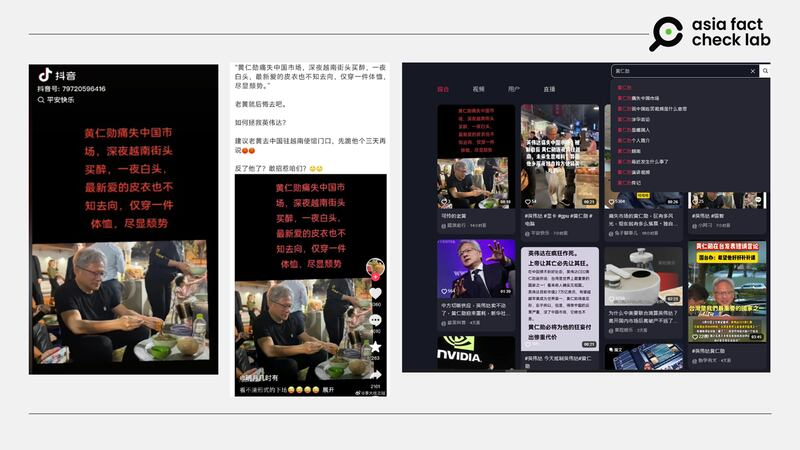
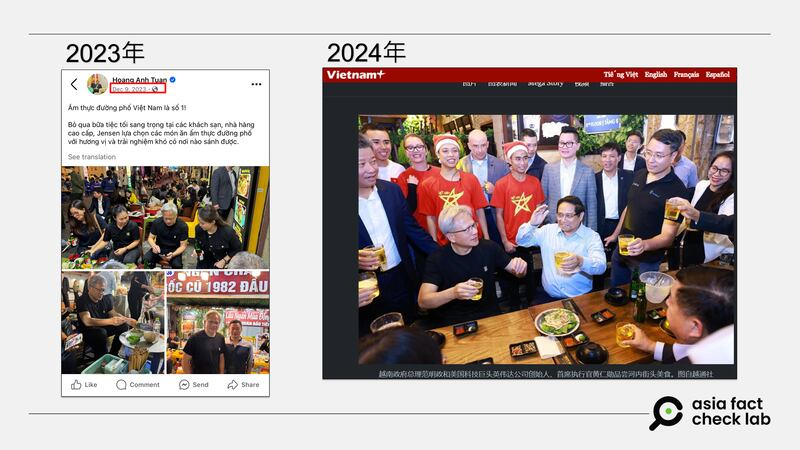
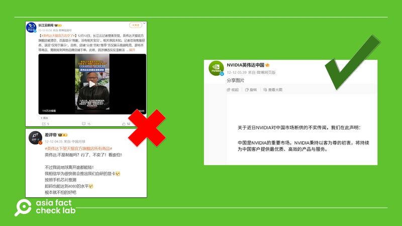

# 事實查覈 | 中國反壟斷大刀砍向NVIDIA 後，假消息傳播開來

作者：鄭崇生、艾倫

2024.12.17 14:37 EST

中國國家市場監督管理總局12 月 9 日以涉嫌違反“反壟斷法”，對美國人工智能（AI）與圖形處理器大廠英偉達（NVIDIA，又譯輝達）[展開調查](https://www.samr.gov.cn/xw/zj/art/2024/art_ed4d3090401741a0894e475d35db652b.html)。同時，微博與抖音上出現不少針對NVIDIA及執行長黃仁勳的傳言，塑造他與NVIDIA的負面形象。然而，亞洲事實查覈實驗室（AFCL）發現，這些傳言中，有挪用舊片斷章取義的，還有無法覈實其信息來源的，AFCL查覈了其中傳播甚廣的一些信息：

## 1. 黃仁勳挑釁稱“普通中國人的一生充滿了痛苦和磨難，他們把這個叫做毅力和堅持”？他還嘲諷“中國人只配喫苦”？

這是根據黃仁勳講話的視頻進行斷章取義編造的內容，“黃仁勳嘲諷中國人只配喫苦”的說法則是無中生有。

[抖音](https://v.douyin.com/iUB5QwUA/)與微博上（[1](https://archive.ph/wip/tJgqF)、[2](https://archive.ph/y3YUn)）一些有影響力的大V以下列視頻片段或截圖聲稱，黃仁勳曾發表對中國人不友善的言論。

黃仁勳嘲諷中國人 中文社媒上傳播的“黃仁勳嘲諷中國人”網帖 (微博截圖)

AFCL查詢原視頻發現，這是出自2023年黃仁勳參加華美半導體協會（CASPA）晚宴時的[轉播視頻](https://www.youtube.com/watch?v=F2eis4isQiA)，而完整查看黃仁勳談話的上下文，他其實是在講述身爲華裔的優勢，他認爲華人父母對孩子的勤管嚴教有助於訓練出當代企業領袖所需要的喫苦耐勞的特質。

在這場以科技產業發展爲主題的聚會上，一名亞洲面孔的年輕人在問答環節提問黃仁勳（約上述視頻連結54’20開始）：“作爲一個領導者而言，你覺得是哪些特質幫助你發現圖形處理器（GPU）發展初期的潛力，並最終影響了所有產業的關鍵進展？”

黃仁勳先是說明了他對產業發展的看法，從整合到細分工，到英偉達選擇專注發展圖形處理器的過程，約三分鐘後，他纔講到人所需要具備的品質問題（約57’23開始），AFCL節錄關鍵段落的英文原文，並附加上中文翻譯如下：

黃仁勳：不要爲我接下來要說的話而感到氣餒。在這個時代，聰明的人（intelligent people）是一種商品，我知道這聽起來很怪。今天，有多少學生在SAT考試中獲得滿分？多少學生獲得4.0 的成績平均績點（GPA）？非常多，走出校園的聰明之人比例非常高，這是好事，原因是人類變得越來越聰明，在包括物理、數學、基礎科學、藝術和哲學的表現上也更熟練，這都是事實。所以，你得與許多極其聰明的人競爭，而每間公司都是由聰明絕頂的人創立的，我們周圍都是非常聰明的人。問題就是爲什麼有些人能領導別人，而有些人沒有？爲什麼有些人脫穎而出，取得令人難以置信的成就？（58’44）其中一個原因就是……身爲華裔，對你來說這是很幸運的。華裔的特點之一就是忍受長期痛苦與折磨的能力（臺下笑聲與掌聲）。如果你是由華人父母撫養長大的，那麼你肯定經歷過許多痛苦和磨難，不是嗎？事實上，喫苦耐勞的能力被稱之爲堅毅，GRIT。而堅毅被認爲是成功人士最重要的特質之一，所以，我希望你這一生（臺下笑聲）能有許多喫苦耐勞（的磨練）。

（英文原文）This is one of those things where you’re blessed to have been raised (as) Chinese. One of the characteristics of Chinese, of course, is the ability to tolerate long-term pain and suffering. If you’ve been raised by a Chinese parent, you have enjoyed a lot of pain and suffering. Isn’t that right? And so, in fact, the ability to endure pain and suffering is called grit, GRIT. It is now recognized as one of the most important characteristics of successful people and so I wish upon you a lifelong, plenty of pain and suffering.

黃仁勳在講述行業領導者應該具備的人格特質時，一開始就告訴提問者“你很幸運身爲華裔”，而在整個語境中，他所說的“Chinese”並不特指某一國籍的華人，而是更多從文化和傳統角度講述華裔的共性。

## 2. 黃仁勳痛失中國市場，深夜越南街頭買醉，一夜白頭？

這是無中生有的說法。

黃仁勳12月5日[與越南總理範明正（Pham Minh Chinh）會談](https://en.baochinhphu.vn/nvidia-to-establish-ai-research-and-development-center-in-viet-nam-11124120520055114.htm)後，雙方宣佈NVIDIA將在越南建立AI研發與數據中心。[範明正表態稱越南就是NVIDIA的第二故鄉](https://www.digitimes.com/news/a20241211PD205/nvidia-ceo-jensen-huang-thailand-vietnam.html)。

黃仁勳受到越南官方高度重視，越共總書記蘇林也於6日與黃仁勳會面，越南政府新聞網站也公佈了簡體中文版的[新聞稿](https://cn.baochinhphu.vn/%E8%8B%8F%E6%9E%97%E6%80%BB%E4%B9%A6%E8%AE%B0NVIDIA%E6%98%AF%E8%B6%8A%E5%8D%97%E5%9C%A8%E5%8D%8A%E5%AF%BC%E4%BD%93%E5%92%8C%E4%BA%BA%E5%B7%A5%E6%99%BA%E8%83%BD%E9%A2%86%E5%9F%9F%E7%9A%84%E6%88%98%E7%95%A5%E5%90%88%E4%BD%9C%E4%BC%99%E4%BC%B4-116241208000218675.htm)。範明正5日晚間則是陪同黃仁勳逛河內古街，越南官方通訊社越通社也[報道](https://zh.vietnamplus.vn/%E8%B6%8A%E5%8D%97%E6%94%BF%E5%BA%9C%E6%80%BB%E7%90%86%E8%8C%83%E6%98%8E%E6%94%BF%E4%B8%8E%E7%BE%8E%E5%9B%BDnvidia%E9%9B%86%E5%9B%A2%E9%A6%96%E5%B8%AD%E6%89%A7%E8%A1%8C%E5%AE%98%E9%BB%84%E4%BB%81%E5%8B%8B%E5%A4%9C%E8%AE%BF%E6%B2%B3%E5%86%85%E5%8F%A4%E8%A1%97-post232570.vnp)了兩人在街頭喫小喫，喝啤酒，與民衆互動的情況。而相關新聞很快也在中國社交媒體平臺[微博上流傳](https://archive.ph/wip/3yJEk)。

針對黃仁勳的越南行，抖音（[1](https://v.douyin.com/iUB5QB2q/)、[2](https://v.douyin.com/iUBH1LLS/)、[3](https://v.douyin.com/iUBHYfwj/)）上多條視頻信息以同一張黃仁勳的照片和同樣的文案發布稱：黃仁勳痛失中國市場，深夜越南街頭買醉，一夜白頭，皮衣也不知去向，只穿一件T-shirt。另外，在抖音搜索上輸入“黃仁勳”，算法會自動推送關聯詞“痛失中國市場”。

黃仁勳痛失中國市場後深夜越南街頭買醉 中文社媒上出現雷同的“黃仁勳痛失中國市場後深夜越南街頭買醉”網帖 (抖音截圖)

然而，亞洲事實查覈實驗室以圖反搜發現，這是黃仁勳2023年底訪問越南時的舊照，當時是由越南駐舊金山總領事黃英俊（Hoang Anh Tuan）在[個人臉書](https://www.facebook.com/share/p/fnHSfZADGaF7ZBwt/)上公佈的，並不是今年訪問的照片，當時也有[媒體報道](https://www.yahoo.com/news/nvidias-billionaire-ceo-jensen-huang-220233307.html)。

黃仁勳2023年訪問越南 黃仁勳2023年訪問越南時的舊照片 (黃英俊臉書、越通社網站截圖)

從黃仁勳在河內街頭喫小喫的照片上可以發現，這張照片的小桌子上並沒有啤酒，而是椰子汁，在他的後方依稀可見保全人員，另外一張照片中，維安人員更配帶着清楚可見的耳機。

另外，黃仁勳也並不是“一夜白頭”，[公開資料](https://youtu.be/VPSr3Sek_0E?si=M_tsm5IKcCJADCAe)顯示，黃仁勳至少在2014年的美國消費性電子展（CES）推銷NVIDIA產品的說明會上，灰白髮色就已清晰可見。

## 3. 因反壟斷調查英偉達退出中國市場？

這則信息缺乏證據

“黃仁勳痛失中國市場”或“英偉達退出中國市場”的說法，起因於12月12日湖北廣電旗下新媒體[“長江雲新聞”發佈的消息](https://archive.ph/wip/ZNw0r)稱英偉達清空了天貓官網產品，這隨後引發了NVIDIA退出中國市場的熱門話題。

“英偉達退出中國市場”的說法很快也傳到了抖音及X等平臺上，其中X用戶[“小蛋糕（日本勇者村）”](https://archive.ph/7y0M6)更是在發文五天內就收穫超過兩百萬閱讀量。

英偉達退出中國市場 “英偉達退出中國市場”的網絡討論和英偉達官方微博賬號的闢謠消息 (微博截圖)

然而，英偉達中國已經通過[官方微博闢謠](https://archive.ph/AWZ7J)，強調中國是該公司的重要市場，將持續爲中國客戶提供產品及服務。目前並無可靠消息顯示英偉達將退出中國市場。

*亞洲事實查覈實驗室（Asia Fact Check Lab）針對當今複雜媒體環境以及新興傳播生態而成立。我們本於新聞專業主義，提供專業查覈報告及與信息環境相關的傳播觀察、深度報道，幫助讀者對公共議題獲得多元而全面的認識。讀者若對任何媒體及社交軟件傳播的信息有疑問，歡迎以電郵*[*afcl@rfa.org*](mailto:afcl@rfa.org)*寄給亞洲事實查覈實驗室，由我們爲您查證覈實。*

*亞洲事實查覈實驗室在X、臉書、IG開張了，歡迎讀者追蹤、分享、轉發。X這邊請進：中文*[*@asiafactcheckcn*](https://twitter.com/asiafactcheckcn)*；英文：*[*@AFCL\_eng*](https://twitter.com/AFCL_eng)*、*[*FB在這裏*](https://www.facebook.com/asiafactchecklabcn)*、*[*IG也別忘了*](https://www.instagram.com/asiafactchecklab/)*。*

[Original Source](https://www.rfa.org/mandarin/shishi-hecha/2024/12/17/hc-china-anti-trust-measure-against-nvidia-fact-check/)