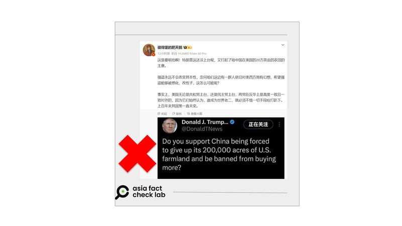
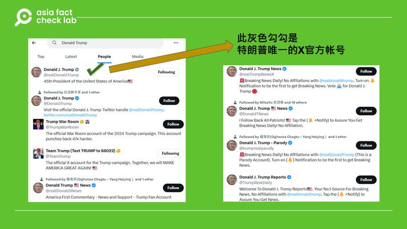
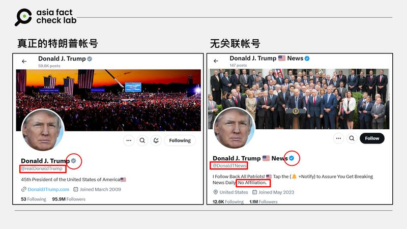

# 事實查覈 | 特朗普發話要“明搶”中國人持有的美國農地？

作者：鄭崇生

2024.12.17 13:18 EST

查覈結果：誤導

## 一分鐘完讀：

美國候任總統特朗普（Donald Trump，或譯川普）2025年1月20日將再次入主白宮，引發網絡輿論對中美關係的聚焦。

近日，微博上逾百萬粉絲的軍事博主“[彼得堡的肥天鵝](https://archive.ph/LkrqA)”發文稱，特朗普還沒上臺，就開始詢問“是否支持應強迫中國放棄所擁有的20萬英畝美國農地，並禁止他們（中國人）繼續買？”。

但亞洲事實查覈實驗室發現，“彼得堡的肥天鵝”截圖引述的賬號儘管有X藍勾勾認證，卻不是來自特朗普的官方X賬號。而其中所謂“中國在美擁有20萬英畝農地”的說法，也是錯誤資訊。

## 深度分析：

“彼得堡的肥天鵝”在發文中指控特朗普打算“明搶”中國在美國20萬英畝農田，凸顯美國新政府將展現“強盜本性”。

但亞洲事實查覈實驗室(Asia Fact Check Lab, AFCL)查覈後發現，“彼得堡的肥天鵝”截取的[原始發文](https://archive.ph/0egBz)賬戶名稱是“@DonaldTNews”，這個賬號在介紹中已明確指出，自己和特朗普無關（No Affiliation）。該賬號常以問答形式發文，傳播特朗普說過的言論與觀點。

“彼得堡的肥天鵝”發文引述模擬特朗普的社媒賬號稱特朗普打算“明搶”中國在美國20萬英畝農田 “彼得堡的肥天鵝”發文引述模擬特朗普的社媒賬號稱特朗普打算“明搶”中國在美國20萬英畝農田 (圖截取自X)

若在X上以特朗普的名字“Donald Trump”搜索，會出現上百個與特朗普官方賬號使用同樣照片的賬戶，這些賬戶也都有藍勾勾認證。但特朗普本人的認證賬號稱爲“[真正的特朗普](https://x.com/realDonaldTrump)”（@realDonaldTrump），它被X平臺官方標誌爲“第45任美國總統”，並打上“[灰勾勾](https://help.x.com/en/using-x/grey-checkmark)”認證。和前述的多個藍勾賬號都沒有關聯。

X上以特朗普的身份註冊的衆多賬號 X上以特朗普的身份註冊的衆多賬號 (圖截取自X)

“真假特朗普”賬號的認證區別 “真假特朗普”賬號的認證區別 (圖截取自X)

## 中國擁有多少美國農地？

至於“藍勾勾特朗普”所稱，中國在美國擁有20萬英畝農地的說法也是錯誤資訊。

根據美國農業部（USDA）的[公開資訊](https://www.fsa.usda.gov/sites/default/files/documents/2022_afida_annual_report_12_20_23.pdf)顯示，截至2022年底，中國在美國擁有農用土地面積超過34萬英畝，而非20萬英畝。

持有美國農地的主要有是兩家中國企業：一是中國廣匯能源投資的布拉索斯高地資產（Brazos Highland Properties），一是中國雙匯收購的豬肉商史密斯菲爾德（Smithfield Foods）。

[美國全國農業法中心](https://nationalaglawcenter.org/foreign-investments-in-ag/)（The National Agricultural Law Center）介紹，美國有外國購買農地的聯邦申報機制，但沒有全國統一的相關限制令。目前，約有24個州根據商務部定義的“外國敵對勢”力如中國、伊朗、俄羅斯、朝鮮與委內瑞拉在內的企業與實體、各有不同針對性的購買農地或房地產限制，而有些州的法律正面臨美國法制程序下的挑戰。

以佛羅里達州爲例，2023年通過《SB264》法，禁止包括中國在內的外國敵對勢力公民在佛州軍事或關鍵基礎設施的10英里內購買房地產，而沒有綠卡的上述國家公民，也不得在佛州置產。美國有線電視（CNN）[報導](https://edition.cnn.com/2024/06/17/homes/florida-law-bans-chinese-citizens-buying-homes/index.html)，目前，這一州法仍在聯邦上訴法院審理是否合憲。

2022年，中國山東的食品加工龍頭阜豐集團在北達可達州購買370英畝農地後，引發全美關注。[CNBC報導](https://www.cnbc.com/2022/07/01/chinese-purchase-of-north-dakota-farmland-raises-national-security-concerns-in-washington.html)，這塊農地離美國軍方研究敏感的無人機技術所在的大福克斯空軍基地（Grand Forks Air Force Base）僅不到20分鐘的路程。大福克斯空軍基地也是美國新的太空網絡中心所在地。

*亞洲事實查覈實驗室（Asia Fact Check Lab）針對當今複雜媒體環境以及新興傳播生態而成立。我們本於新聞專業主義，提供專業查覈報告及與信息環境相關的傳播觀察、深度報道，幫助讀者對公共議題獲得多元而全面的認識。讀者若對任何媒體及社交軟件傳播的信息有疑問，歡迎以電郵*[*afcl@rfa.org*](mailto:afcl@rfa.org)*寄給亞洲事實查覈實驗室，由我們爲您查證覈實。*

*亞洲事實查覈實驗室在X、臉書、IG開張了，歡迎讀者追蹤、分享、轉發。X這邊請進：中文*[*@asiafactcheckcn*](https://twitter.com/asiafactcheckcn)*；英文：*[*@AFCL\_eng*](https://twitter.com/AFCL_eng)*、*[*FB在這裏*](https://www.facebook.com/asiafactchecklabcn)*、*[*IG也別忘了*](https://www.instagram.com/asiafactchecklab/)*。*

[Original Source](https://www.rfa.org/mandarin/shishi-hecha/2024/12/17/trump-china-buying-us-farmland-threatens-farmers/)