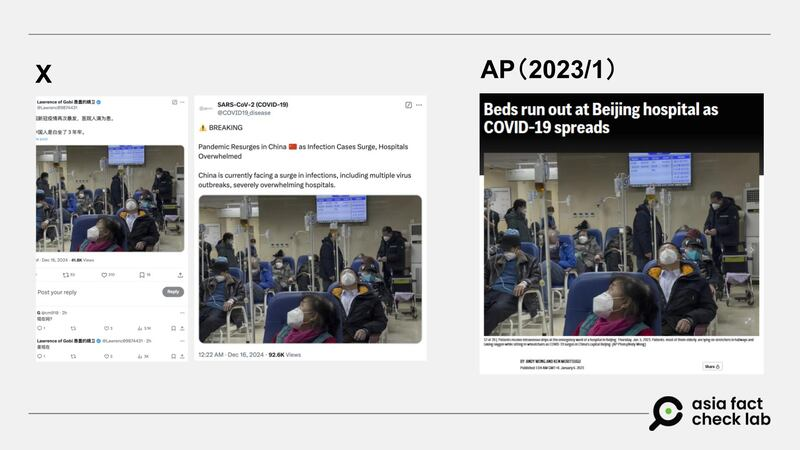

# 事實查覈｜網傳照片曝中國新冠疫情再起醫院人滿爲患？

作者：莊敬

2024.12.18 13:24 EST

查覈結果：誤導

## 一分鐘完讀：

近日有中、英文社媒用戶傳播中國新冠疫情再次爆發，醫院人滿爲患的消息，並搭配一張人們戴着口罩坐在醫院椅子上的照片。經查，這張照片呈現的並非現況，而是2023年1月的情景，傳言挪用了舊照片誤導民衆。

## 深度分析：

X上的“藍勾”[中文賬號](https://x.com/Lawrenc09874431/status/1868373575868227611)和[英文賬號](https://x.com/COVID19_disease/status/1868330866067521642)於12月中發帖，稱中國新冠疫情再次爆發，醫院人滿爲患，配圖是同一張人們戴著口罩坐在醫院椅子上等待的照片。在其中一則帖子下，有網民發問“現在嗎？”，發文者回覆“是現在”。

亞洲事實查覈實驗室（Asia Fact Check Lab）以圖反搜發現，前述社媒用戶傳播的照片並非近期拍攝，而是2023年1月美聯社發佈的新聞照片，[該新聞](https://apnews.com/article/politics-health-china-government-beijing-762d314d452875ecc525d5c21dbfa541)描述了當時北京新冠疫情再度升溫，醫院牀位不足的情況。

近期中英文社媒用戶傳播的中國新冠疫情再起導致醫院人滿爲患的消息（左），所使用的照片出自美聯社2023年1月的新聞報道（右）。 近期中英文社媒用戶傳播的中國新冠疫情再起導致醫院人滿爲患的消息（左），所使用的照片出自美聯社2023年1月的新聞報道（右）。 (圖取自X、AP)

另以中、英文關鍵字搜尋，最近的有關中國疫情升溫的消息來自臺灣的[中央社](https://www.cna.com.tw/news/acn/202408120125.aspx)等媒體今年8月的報道，但近期主流媒體並未報道中國新冠疫情再度爆發的消息，中國疾控中心或世衛組織等機構也並未發佈相關消息，涉及醫院人滿爲患場景的公共衛生新聞僅有[諾羅病毒羣體感染事件](https://udn.com/news/story/7332/8399638)，[新唐人電視臺](https://www.ntdtv.com/b5/2024/12/04/a103934900.html)採訪的醫生質疑中共以諾羅病毒掩蓋新冠疫情。

中國新冠疫情的真實情況並非本文查覈範圍，本文僅查覈網傳信息所用的照片是否能作爲中國再次爆發疫情的證據。而這張2023年1月發佈的照片並不能代表現況，部分社媒用戶挪用過往畫面時，未說明照片爲資料畫面，還稱“是現在”“currently（目前）”，傳播了誤導信息。

*亞洲事實查覈實驗室（Asia Fact Check Lab）針對當今複雜媒體環境以及新興傳播生態而成立。我們本於新聞專業主義，提供專業查覈報告及與信息環境相關的傳播觀察、深度報道，幫助讀者對公共議題獲得多元而全面的認識。讀者若對任何媒體及社交軟件傳播的信息有疑問，歡迎以電郵afcl@rfa.org寄給亞洲事實查覈實驗室，由我們爲您查證覈實。*

*亞洲事實查覈實驗室在X、臉書、IG開張了，歡迎讀者追蹤、分享、轉發。X這邊請進：中文*[*@asiafactcheckcn*](https://twitter.com/asiafactcheckcn)*；英文：*[*@AFCL\_eng*](https://twitter.com/AFCL_eng)*、*[*FB在這裏*](https://www.facebook.com/asiafactchecklabcn)*、*[*IG也別忘了*](https://www.instagram.com/asiafactchecklab/)*。*

[Original Source](https://www.rfa.org/mandarin/shishi-hecha/2024/12/18/china-covid-19/)