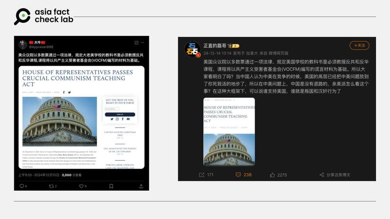

# 事實查覈｜美衆議院通過法律要求學校必須開設反共、反華課程？

作者：董喆; 鄭崇生亦對此文有貢獻

2024.12.19 16:36 EST

## 查覈結果：誤導

## 一分鐘完讀：

近期，微博與Ｘ上有帖文稱，美國衆議院通過法律，規定美國學校教科書必須教授反共和反華課程。亞洲事實查覈查證，美國衆議院確實在2024年12月6日通過《共產主義關鍵教育法案》(Crucial Communism Teaching Act），但法案僅提到提供美國高中生相關教材，並非強制。另外此法案尚未獲得參議院通過及總統簽署，並未正式成爲聯邦法律。

## 深度分析：

12月14日，微博用戶[正直的磊哥](https://archive.ph/E7EQu)發文稱，美國衆議院通過法律，規定美國學校教科書必須教授反共和反華課程，次日Ｘ上亦有[類似推文](https://archive.ph/ZvUJh)出現。

中文社媒上關於美立法規定“學校教科書必須教授反共和反華課程”的消息及評論 圖截取自X、微博 中文社媒上關於美立法規定“學校教科書必須教授反共和反華課程”的消息及評論. (圖截取自X、微博)

亞洲事實查覈實驗室查證，美國衆議院確實於12月6日通過編號H.R.5349的《共產主義關鍵教育法案》（Crucial Communism Teaching）。草案發起人佛羅里達州的共和黨籍聯邦衆議員[瑪麗亞·薩拉查](https://salazar.house.gov/media/press-releases/salazars-crucial-communism-teaching-act-passes-house)（Maria Salazar），以及[美國共產主義受難者紀念基金會](https://victimsofcommunism.org/house-of-representatives-passes-crucial-communism-teaching-act/)(Victims of Communism Memorial Foundation)都發布了新聞稿。

不過，對照[法案原文](https://www.congress.gov/bill/118th-congress/house-bill/5349/all-actions)可知，此法案旨在讓美國高中生了解共產制度以及其危險，並未提到“反華”，另外，法案目的是要開發和傳播公民教育課程和口述歷史資源，教材由美國共產主義受難者紀念基金會提供，並與州政府合作協助高中生使用這些資源，並未出現“強制”以及“必修”等字眼。

對於“必須教授”和“反華”等說法，衆議員瑪麗亞·薩拉查回覆亞洲事實查覈實驗室參考官方發佈的新聞稿，並未發表其他看法。

美國非營利新聞組織[The Intercept的報道](https://theintercept.com/2024/12/05/congress-anti-communism-school-curriculum/)中亦提到，H.R.5349 不具約束力的，且未提到美國共產主義受難者紀念基金會的工作資金來源。

另外以立法程序而言，法案於[12月9日](https://www.congress.gov/bill/118th-congress/house-bill/5349/all-actions?overview=closed#tabs)被參議院接收，經參議院審讀兩次後，移交至衛生、教育、勞工與養老金委員會（Committee on Health, Education, Labor, and Pensions）審議，尚未到參議院的表決階段。截至發稿，該法案還尚未有新的進度，尚未完成立法程序成爲法律。

## 12月20日更新：

## 本文發佈後，AFCL於12月20日接到衆議員瑪麗亞·薩拉查辦公室以書面回覆表示：該法案確實要求「共產主義受害者紀念基金會」提供有關共產主義危害的教育材料，但學校是否將這些材料納入課程完全是自願的，該法案並未強制要求。

*亞洲事實查覈實驗室（Asia Fact Check Lab）針對當今複雜媒體環境以及新興傳播生態而成立。我們本於新聞專業主義，提供專業查覈報告及與信息環境相關的傳播觀察、深度報道，幫助讀者對公共議題獲得多元而全面的認識。讀者若對任何媒體及社交軟件傳播的信息有疑問，歡迎以電郵*[*afcl@rfa.org*](mailto:afcl@rfa.org)*寄給亞洲事實查覈實驗室，由我們爲您查證覈實。*

*亞洲事實查覈實驗室在X、臉書、IG開張了，歡迎讀者追蹤、分享、轉發。X這邊請進：中文*[*@asiafactcheckcn*](https://twitter.com/asiafactcheckcn)*；英文：*[*@AFCL\_eng*](https://twitter.com/AFCL_eng)*、*[*FB在這裏*](https://www.facebook.com/asiafactchecklabcn)*、*[*IG也別忘了*](https://www.instagram.com/asiafactchecklab/)*。*

[Original Source](https://www.rfa.org/mandarin/shishi-hecha/2024/12/19/hc-senate-us-law-anti-communism/)