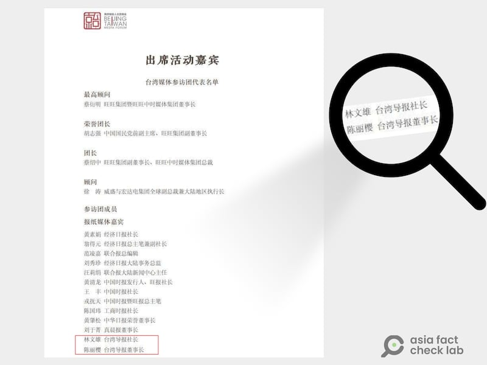
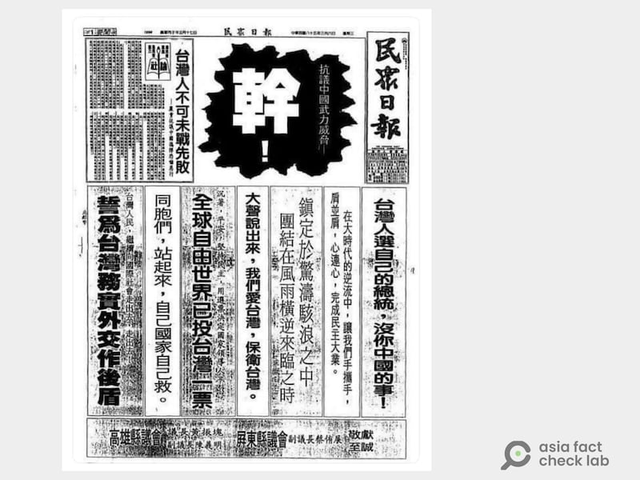
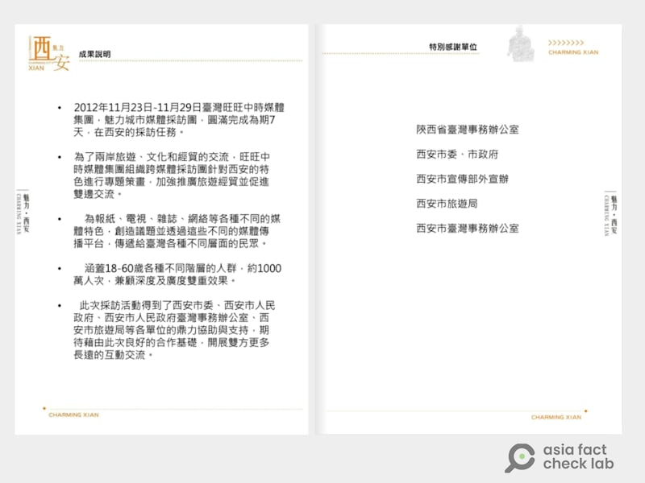

# 深度報道｜中共外宣在臺灣之三：老牌本土報紙如何被澆灌出親中敘事？

作者：艾倫、莊敬、董喆

2024.12.20 16:51 EST

“當年兩岸關係解凍，菁英界的、媒體界的朋友們立了汗馬功勞，現在我們要實現‘和平統一’，實現‘一國兩制’，仍要靠媒體界的朋友們共同努力。”

這是在2019年的“第四屆兩岸媒體人北京峯會”上，時任中國政協主席的汪洋對與會臺灣媒體人的發言。他希望臺灣媒體人“認清”現在的格局，爲“我們的國家去鼓與呼”。汪洋“訓示臺灣媒體人”事件在當時引發輿論熱議，隨後[遭到了臺灣的強烈譴責](https://www.voachinese.com/a/taiwan-china-media-pressure/4913926.html "https://www.voachinese.com/a/taiwan-china-media-pressure/4913926.html")。

後來，2019年“兩岸媒體人北京峯會”臺灣參與者的名單被完整揭露，其中按媒體類別區分， “報紙媒體”的十三名“嘉賓”中，九名來自《旺旺中時》和《聯合報》兩大報系。另外四人中，兩人來自《臺灣導報》，一位是社長林文雄，一位是董事長陳麗櫻，兩人是夫妻。

2019年北京兩岸媒體人峯會，《臺灣導報》社長林文雄、董事長陳麗櫻都是座上賓。 (圖取自獨立記者林雨蒼HackMD頁面)

《指傳媒》假民調案件中，製作假民調試圖影響臺灣選舉的記者林獻元前後擁有過諸多頭銜，其中之一就是《臺灣導報》的記者。亞洲事實查覈實驗室（Asia Fact Check Lab, AFCL）在2024年6月取得的臺中媒體通訊錄上，林獻元也仍被列爲《臺灣導報》的記者。

林獻元在臺灣的工作以採寫地方新聞爲主，《臺灣導報》和與它關係相近的媒體集羣多屬於地方新聞媒體，但他們何以能夠和親中敘事及中共外宣沾上邊？兩位《臺灣導報》的負責人爲什麼這麼熱衷參與在中國的交流活動？

這個故事得先從《臺灣導報》的社長，也是創辦人林文雄，以及臺灣一家老牌本土報紙《民衆日報》講起。

## 《民衆日報》的轉型

根據臺灣經濟工商登記資料，臺灣導報社在2012年10月1日創立於高雄市苓雅區，創辦人爲林文雄。在創立《臺灣導報》前，林文雄曾經擔任《民衆日報》社長，《民衆日報》是南臺灣老字號地方媒體，在臺灣運營超過70年。

《民衆日報》1950年於基隆創立，當時臺灣正處於戒嚴時期，《民衆日報》立場傾向反對陣營，經常報道黨外運動等敏感新聞，被國民黨政府視爲眼中釘，也常遭到當局公權力介入，進行新聞檢查。 “解嚴”前一年，《民衆日報》甚至曾因報道中共當時的開放路線，以及美國建議臺灣取消戒嚴令等新聞而遭短暫停刊。

早期的民衆日報，明顯可見其反中、本土的立場。 (圖取自Threads。)

2001年，東森媒體集團收購《民衆日報》，由時任無黨籍立委的蔡豪擔任社長。當時《民衆日報》的銷售量已逐漸走下坡。 2007年5月，上百名報社員工遭資遣，當時的董事長王世均（原名王親雄）被員工告到高雄市政府勞工局，要求給付已積欠兩個月的資遣費，王世均最後承諾給付1631萬元。

一位前《民衆日報》地方記者告訴AFCL，《民衆日報》銷量下滑時，正職記者每天都是以“業務導向”跑新聞，每個人都要想辦法拉到廣告， “東森就是嫌平面媒體不賺錢才退出”，他說。

他舉例，《民衆日報》一度要求正職記者繳交自己廣告業務收益的一半給報社，也就是說，若一個月拉到20萬的收益，有10萬要上繳公司。

2007年5月林文雄接掌《民衆日報》，成爲該報新的董事長兼社長，而《民衆日報》賴以爲生的“拉業務”賺錢模式，也逐漸從臺灣拓展至中國。

## 傳統媒體衰落，統戰資金趁虛而入

一位曾爲《民衆日報》工作超過15年的資深記者告訴AFCL，林文雄發跡於臺中鹿港一帶，曾是《鹿港時報》的負責人，因爲一開始是做發行起家， “有業務概念”，便在自己身爲董事長期間，將《民衆日報》的重心放在商業營收上。

與《民衆日報》同時發生的，是《中國時報》（簡稱“中時”）集團被食品業商人蔡衍明出手買下，改名“旺旺中時集團”（簡稱“旺中集團”），除了原有的報刊外，又新創立了《旺報》。

2009年2月，臺灣《天下雜誌》刊出[報道](https://www.cw.com.tw/article/5001838 "https://www.cw.com.tw/article/5001838")，蔡衍明在買下中時集團後，其內部刊物《旺旺月刊》揭露，他和時任中國國臺辦主任、現任外交部長的王毅會面時， “彙報”《中國時報》媒體集團的相關情況，並稱收購的目的之一是“希望藉助媒體的力量，來推進兩岸關係的進一步發展。”

報道也引述一名不具名的資深媒體人指出，成爲“媒體人”的蔡衍明，成功打通了中國中央層級的關係，並意圖藉此壯大旺旺集團在中國市場的食品本業。

曾任《中國時報》社長的林聖芬也告訴《天下雜誌》，蔡衍明是個商人，經營旺中集團是以商業盈利爲考量，這和原本以新聞起家的中時不一樣。報道也指出，蔡衍明非常在乎業績和虧損， “嚴格控管數字”。

亞洲事實查覈實驗室以關鍵字搜尋，發現2012年11至12月，旺中集團與中國的合作項目“魅力城市”到了陝西省的西安及寶雞兩個城市。其中西安市公開的結案報告指出，爲了促進兩岸旅遊、文化和經貿間的交流，旺中集團組織跨媒體採訪團針對西安特色進行專題報道。參與媒體包含中國電視、《中國時報》《旺報》《時報週刊》以及中時電子報，預估受衆約1000萬人。

該專案結案報告裏特別“感謝”多箇中國官方機構，包含西安市委、西安市人民政府、西安人民臺辦及旅遊局等，雖無提及對價關係，但和中國的媒體合作卻已展露無遺。

亞洲事實查覈實驗室於臺北時間12月20日下午以電郵發信至旺中集團公關室信箱，查證這兩份結案報告的真實性，至截稿前未獲回應。

旺中與中國合作的“魅力城市”專題中，西安市的執行成果說明。其特別感謝單位包含陝西國臺辦和西安市政府等中國官方單位。

就在旺中集團與中國密切合作的同時，統戰資源也遞向了《民衆日報》。 “北旺中，南民衆”，一位曾在民衆日報服務的資深記者說，就他的瞭解，中國看重《民衆日報》，是因爲它一向被認爲是親民進黨、獨派的報紙，能滲透其中，意義重大。

《民衆日報》最初與中國的合作模式是“互換版面”。所謂的“互換版面”，指的是《海峽導報》當時每天提供兩個版面報道臺灣各地觀光景點、名勝、風土民情，《民衆日報》則釋出一個版面，專寫中國觀光旅遊名勝及地方風土民情相關資訊。

這項“合作”曾經在2009年4月被《自由時報》揭發，標題爲“中資挹注經營？民衆日報與廈門海峽導報合作”。[報道](https://news.ltn.com.tw/news/focus/paper/294425 "https://news.ltn.com.tw/news/focus/paper/294425")稱《民衆日報》高層證實，該報已與中國廈門《海峽導報》簽約合作，但否認有中資挹注經營，純粹是互相提供新聞版面，報道兩岸的新聞。

報道也引述《民衆日報》當時的高層人士表示，這些兩岸媒體合作是爲了“行銷彼此的觀光商機”，以達到增加報社廣告與發行收益的目標。言下之意，合作的報道本身沒有金錢對價關係。

但一位熟悉當時《民衆日報》中國業務的知情人士告訴亞洲事實查覈實驗室，儘管在原報道中，《民衆日報》高層人士否認收錢發報道，但實則確有金錢往來：

“那時候我們（《民衆日報》）也都是很創新的，我說的是版面對版面，反正我們去採訪，然後我們出一整版給你，看你付我們多少錢。”

這位消息人士指出，兩個報紙（海峽、民衆）名義上雖然都稱是版面互換，但實際上與“錢”脫不了干係，這些“都是檯面下的事情”。

“我們就是一邊做一邊修正。其實這個東西（互換版面）都是以前沒有做，後來竟然成了，國臺辦也覺得我們這個想法還蠻不錯的，然後就把海西二十個城市報道交給我們。”

接下來中國向《民衆日報》投放資源的方式，也就是受訪者口中的“海西二十個城市”，事實上和旺中的“魅力城市”這類專案很像。

## 對價關係

“海西”指的是“海峽西岸經濟區”的開發計劃。 2009年5月，中國國務院開會通過《關於支持福建省加快建設海峽西岸經濟區的若干意見》，內文提到，西岸經濟區與臺灣地緣相近，擁有“獨特的對臺優勢”，是兩岸人民交流合作的“先行先試區域”。

簡單地說，中國希望發展一塊經濟特區，與臺灣深度整合。就如同在廣東發展“大灣區”以整合香港、澳門類似。

這二十個城市包含福建省全境的九個地級市，以及浙江、江西、廣東省的部分城市，龍頭市爲福州、泉州、廈門、溫州、汕頭市。而《民衆日報》和國臺辦合作的，正是把這些“和臺灣地緣、血緣相近城市”的美好，帶到臺灣社會大衆眼前。

“像梅州，事實上他們（臺辦）都會提供很多的資料，只是說他們的內容到了我們（臺灣）這邊，我們還要再修稿，然後採訪、專訪這樣。所以大的政策就是他要推海西二十個城市的系列報道。”受訪者證實，最後的報道呈現方式則是會另出一份八開的“特刊”來報道這些內容。

至於海西二十個地級市的宣傳專案，國臺辦究竟用了多少利益交換？其中一名知情人士回答說： “我印象中好像是兩千萬（臺幣）” 。

他解釋，一個地級市約三十萬人民幣，二十個共六百萬人民幣， “等於接近現在的兩千多萬”臺幣。

不過這位受訪者也強調，中國的給錢方式是做完一個城市給一個城市的錢，他無法確認《民衆日報》是否有如期做完二十個城市的專案。

## 從《民衆日報》到《臺灣導報》

2010年5月，《民衆日報》的經營權生變，前立委蔡豪及前董座王世均介入《民衆日報》的經營權，爆發商標權爭奪之亂。蔡豪甚至率人進入報社搬走電腦和伺服器，連報頭上的“董事長”署誰的名字也引發了糾紛，最後甚至出現“鬧雙胞”的情形，形成北蔡豪、南王世均的分裂狀況。

這位受訪者說，當時林文雄雖然名義上還是《民衆日報》的老闆，但各方勢力相爭不下，經營管理非常混亂。這讓林文雄萌生了“自己出來做”的念頭。另一個鼓勵林文雄創新品牌，自立門戶的人，就是他原本在中國的合作對口單位 ——《海峽導報》，而林文雄創立的這份新媒體，就叫做《臺灣導報》。

“兩岸兩導報”的線路，就在這裏接通。下篇報道”系列四”將延續本篇，接續到《臺灣導報》和《海峽導報》的關係，聊聊盤踞在臺灣中南部的親中網媒集羣，如何同時運作並分配統戰利益。

(感謝外部專家黃維玲、獨立記者與研究員陳慧敏對本系列報道的貢獻。）

本系列其它各篇專題如下：

之一：[臺檢以《反滲透法》訴大選假民調當事人，一審因何失利？](2024-12-12_深度報道｜中共外宣在臺灣之一： 臺檢以《反滲透法》訴大選假民調當事人，一審因何失利？.md)
之二：[林靖東和林獻元背後的大外宣架構](2024-12-12_深度報道｜中共外宣在臺灣之二：林靖東和林獻元背後的大外宣架構.md)
之四：[海峽兩岸的兩家《導報》](2024-12-25_深度報道｜中共外宣在臺灣之四：海峽兩岸的兩家《導報》.md)
之五：[對臺統戰的操盤手“福建網絡”](2024-12-31_深度報道｜中共外宣在臺灣之五：對臺統戰的操盤手“福建網絡”.md)
之六：[管不管網路？那是個問題](2025-01-03_深度報道｜中共外宣在臺灣之六：管不管網路？那是個問題.md)

*亞洲事實查覈實驗室（Asia Fact Check Lab）針對當今複雜媒體環境以及新興傳播生態而成立。我們本於新聞專業主義，提供專業查覈報告及與信息環境相關的傳播觀察、深度報道，幫助讀者對公共議題獲得多元而全面的認識。讀者若對任何媒體及社交軟件傳播的信息有疑問，歡迎以電郵*[*afcl@rfa.org*](mailto:afcl@rfa.org)*寄給亞洲事實查覈實驗室，由我們爲您查證覈實。*

*亞洲事實查覈實驗室在X、臉書、IG開張了，歡迎讀者追蹤、分享、轉發。X這邊請進：中文*[*@asiafactcheckcn*](https://twitter.com/asiafactcheckcn)*；英文：*[*@AFCL\_eng*](https://twitter.com/AFCL_eng)*、*[*FB在這裏*](https://www.facebook.com/asiafactchecklabcn)*、*[*IG也別忘了*](https://www.instagram.com/asiafactchecklab/)*。*

[Original Source](https://www.rfa.org/mandarin/shishi-hecha/2024/12/20/fact-check-ccp-propaganda-taiwan-serial3/)