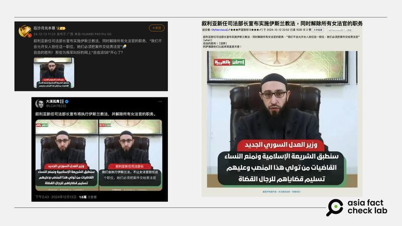

# 事實查覈｜敘利亞新任司法部長宣佈解除所有女法官職務？

作者：董喆

2024.12.23 16:57 EST

## 查覈結果：缺乏證據

## 一分鐘完讀：

近日，中文社媒平臺有消息稱，敘利亞新任司法部長宣佈實施伊斯蘭教法，解除所有女法官的職務，但根據敘利亞司法部的臉書官方賬號，以及敘利亞查覈組織“Verify-sy”的查證，這樣的說法並沒有根據。

## 深度分析：

敘利亞阿薩德政權垮臺後，沙姆解放組織領導人艾哈邁德·沙拉（Ahmad al-Sharaa）任命穆罕默德·巴希爾（Mohammed al-Bashir）任臨時政府的看守總理，與該過渡政府相關的可疑資訊開始在網上傳播。

微博賬號“[後沙月光本尊](https://archive.ph/wckxt)”發文稱，敘利亞新任司法部長宣佈實施伊斯蘭教法，解除所有女法官的職務，中國其他社羣平臺以及Ｘ上亦在傳播相同的消息。這些消息都使用了一張截圖，並加上字幕“敘利亞新任司法部長：我們會執行伊斯蘭法，不讓女法官擔任這個職位，他們必須把案件交給男法官”。有評論據此稱，“阿薩德跟他們比起來簡直天使。”

中文社交媒體上傳播的“敘利亞新任司法部長宣佈解除所有女法官職務”的信息 圖截取自微博、X、留園網 中文社交媒體上傳播的“敘利亞新任司法部長宣佈解除所有女法官職務”的信息 (圖截取自微博、X、留園網)

不過，這樣的說法並沒有根據。

12月8日，也就是阿薩德政權垮臺當日，敘利亞司法部的臉書官方賬號就[發佈信息](https://archive.ph/AT5rD)向該部工作人員保證，他們將繼續在各自崗位上工作，且工作地點、薪資與福利不會有任何變動。

另外，沙姆解放組織在12月10日任命過渡政府總理後，12月12日司法部臉書[再次發文](https://archive.ph/dl43F)，向法官、國家律師及司法部及其附屬機構的所有工作人員說明，請他們自12月15日起返回工作崗位，並按照過往規定工作，並未提到要免職女性法官。

另外，根據敘利亞查覈組織“Verify-sy”的[查覈報告](https://verify-sy.com/details/10556/%D9%87%D9%84-%D8%A3%D8%B9%D9%84%D9%86--%D9%88%D8%B2%D9%8A%D8%B1-%D8%A7%D9%84%D8%B9%D8%AF%D9%84-%D8%A7%D9%84%D8%B3%D9%88%D8%B1%D9%8A-%D8%A7%D9%84%D8%AC%D8%AF%D9%8A%D8%AF--%D9%85%D9%86%D8%B9-%D8%A7%D9%84%D9%86%D8%B3%D8%A7%D8%A1-%D9%85%D9%86-%D9%85%D9%85%D8%A7%D8%B1%D8%B3%D8%A9-%D8%A7%D9%84%D8%B9%D9%85%D9%84-%D8%A7%D9%84%D9%82%D8%B6%D8%A7%D8%A6%D9%8A%D8%9F?continueFlag=279163f2447f61c162d4b4c659344684)，這則謠言最早出現在阿拉伯社羣，“Verify-sy”聯繫了位在敘利亞阿勒坡的律師馬哈茂德·哈曼（Mahmoud Hamam），截至該查覈報告發布的12月12日，法院和司法部門的工作人員仍在正常工作，沒有任何被解僱或隔離的情況，馬哈茂德·哈曼否定了禁止女性從事司法工作的說法。

亞洲事實查覈實驗室以電子郵件聯繫敘利亞司法部，至截稿前未獲回應。

*亞洲事實查覈實驗室（Asia Fact Check Lab）針對當今複雜媒體環境以及新興傳播生態而成立。我們本於新聞專業主義，提供專業查覈報告及與信息環境相關的傳播觀察、深度報道，幫助讀者對公共議題獲得多元而全面的認識。讀者若對任何媒體及社交軟件傳播的信息有疑問，歡迎以電郵afcl@rfa.org寄給亞洲事實查覈實驗室，由我們爲您查證覈實。*

*亞洲事實查覈實驗室在X、臉書、IG開張了，歡迎讀者追蹤、分享、轉發。X這邊請進：中文*[*@asiafactcheckcn*](https://twitter.com/asiafactcheckcn)*；英文：*[*@AFCL\_eng*](https://twitter.com/AFCL_eng)*、*[*FB在這裏*](https://www.facebook.com/asiafactchecklabcn)*、*[*IG也別忘了*](https://www.instagram.com/asiafactchecklab/)*。*

[Original Source](https://www.rfa.org/mandarin/shishi-hecha/2024/12/23/hc-verify-sy-asia-fact-check-lab/)