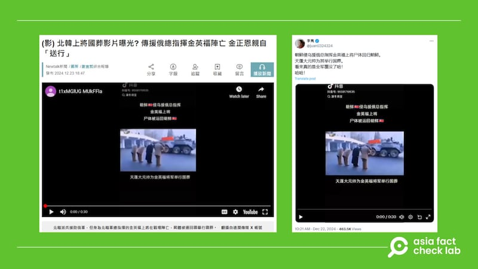
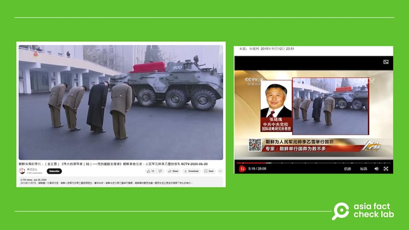

# 事實查覈｜金正恩爲援俄總指揮金英福上將舉行國葬的影像曝光？

作者：莊敬

2024.12.24 12:56 EST

## 查覈結果：錯誤

## 一分鐘完讀：

近日社媒流傳一則視頻，發文者宣稱是朝鮮援俄總指揮金英福上將陣亡，屍體迴歸朝鮮，由最高領導人金正恩主持國葬。臺灣網路媒體“Newtalk新聞”引用網民發文，發佈了相關報道。但經查，網傳視頻是2015年朝鮮爲人民軍元帥李乙雪舉行國葬，部分媒體與網民挪用過往事件畫面，傳播了錯誤信息。

## 深度分析：

X“藍勾勾”用戶（[1](https://x.com/DXDWX999/status/1871077884250706387 "https://x.com/DXDWX999/status/1871077884250706387"),[2](https://x.com/juanli324324/status/1870655759660564663 "https://x.com/juanli324324/status/1870655759660564663")）近日發佈一則約30秒的短視頻（或截圖），視頻上的文字寫着“朝鮮侵烏援俄總指揮金英福上將屍體被運回朝鮮，天蓬大元帥爲金英福將軍舉行國葬”。畫面左上角顯示這段視頻出自抖音號[“凜冬將至](https://www.douyin.com/user/MS4wLjABAAAA-qBiVyNzCS4UNxz5FX9qLQel3-VUDTIjOCdyN0ixlnE?from_tab_name=main "https://www.douyin.com/user/MS4wLjABAAAA-qBiVyNzCS4UNxz5FX9qLQel3-VUDTIjOCdyN0ixlnE?from_tab_name=main")”，也有其它[抖音用戶](https://v.douyin.com/iUpqAvQd/ "https://v.douyin.com/iUpqAvQd/")轉傳則段視頻。“天蓬大元帥”是對金正恩的鄙視稱呼。

臺灣網路媒體[“Newtalk新聞”](https://archive.ph/I2dYd "https://archive.ph/I2dYd")在12月23日發佈“北韓上將國葬影片曝光？傳援俄總指揮金英福陣亡 金正恩親自送行”的報道，內文引用X帳號“德潤傳媒”分享的相關影片，影片中金正恩與身邊的官員，一同對運送金英福屍體的車隊鞠躬。這則報道附上網傳的30秒短視頻，出處同樣是抖音號“凜冬將至”。[“Yahoo!新聞”](https://ynews.page.link/7PVHK "https://ynews.page.link/7PVHK")、[“LINE TODAY”](https://today.line.me/tw/v2/article/ML11wQ3 "https://today.line.me/tw/v2/article/ML11wQ3")轉載了“Newtalk新聞”的報道。

近日臺灣網路媒體與社媒用戶發佈視頻，稱是朝鮮爲援俄總指揮金英福上將舉行國葬的影像曝光。 近日臺灣網路媒體與社媒用戶發佈視頻，稱是朝鮮爲援俄總指揮金英福上將舉行國葬的影像曝光。 (X、Newtalk 網站截圖)

亞洲事實查覈實驗室（Asia Fact Check Lab）以圖反搜，在一則[YouTube視頻](https://www.youtube.com/watch?v=OhvAkfBGPwQ "https://www.youtube.com/watch?v=OhvAkfBGPwQ")找到與網傳視頻相符的畫面（3分36秒處至4分6秒處）。這則視頻的發佈時間爲2020年6月，視頻說明爲“2015年11月7日，朝鮮第一代革命元老、朝鮮人民軍元帥李乙雪因病逝世，享年94歲。朝鮮決定爲李乙雪舉行國葬，朝鮮國防委員會第一委員長金正恩全權指揮了葬禮的舉辦”。

進一步以上述說明查詢，在中國央視網《[今日亞洲](https://tv.cctv.com/2015/11/12/VIDE1447343477341532.shtml?spm=C52507945305.PwquEtqucIWR.0.0 "https://tv.cctv.com/2015/11/12/VIDE1447343477341532.shtml?spm=C52507945305.PwquEtqucIWR.0.0")》欄目2015年11月12日的新聞片段找到相符畫面，另在《[韓國時報](https://www.koreatimes.co.kr/www/nation/2024/12/103_190807.html "https://www.koreatimes.co.kr/www/nation/2024/12/103_190807.html")》找到相似情境的照片，根據這兩家媒體的報道，畫面是朝鮮爲人民軍元帥李乙雪舉行國葬。

根據網上影像證據與發佈日期等相關說明，網傳視頻中的事件發生在2022年俄羅斯入侵烏克蘭之前，部分媒體與網民挪用過往事件畫面，傳播錯誤信息。

網傳朝鮮援俄總指揮金英福國葬畫面，與2015年朝鮮爲人民軍元帥李乙雪舉行國葬的影像相符。 網傳朝鮮援俄總指揮金英福國葬畫面，與2015年朝鮮爲人民軍元帥李乙雪舉行國葬的影像相符。 (YouTube、央視網截圖)

根據朝鮮日報中文版2024年10月的[報道](https://cnnews.chosun.com/client/news/viw.asp?nNewsNumb=20241061802&cate=&mcate= "https://cnnews.chosun.com/client/news/viw.asp?nNewsNumb=20241061802&cate=&mcate=")，金正恩的軍方親信、朝鮮人民軍總參謀副總參謀長金英福以派兵俄羅斯的朝鮮軍總負責人的身分進入俄羅斯。此後，在部分華文網站與社媒上，不時[傳出](https://newtalk.tw/news/view/2024-11-28/946737 "https://newtalk.tw/news/view/2024-11-28/946737")金英福陣亡的消息，但目前未有官方消息。金英福的動向並非本文查覈範圍。

*亞洲事實查覈實驗室（Asia Fact Check Lab）針對當今複雜媒體環境以及新興傳播生態而成立。我們本於新聞專業主義，提供專業查覈報告及與信息環境相關的傳播觀察、深度報導，幫助讀者對公共議題獲得多元而全面的認識。讀者若對任何媒體及社交平臺傳播的信息有疑問，歡迎以電郵afcl@rfa.org寄給亞洲事實查覈實驗室，由我們爲您查證覈實。*

*亞洲事實查覈實驗室在X、臉書、IG開張了，歡迎讀者追蹤、分享、轉發。X這邊請進：中文@asiafactcheckcn；英文：@AFCL\_eng、FB在這裏、IG也別忘了。*

[Original Source](https://www.rfa.org/mandarin/shishi-hecha/2024/12/24/north-korean-general-funeral/)