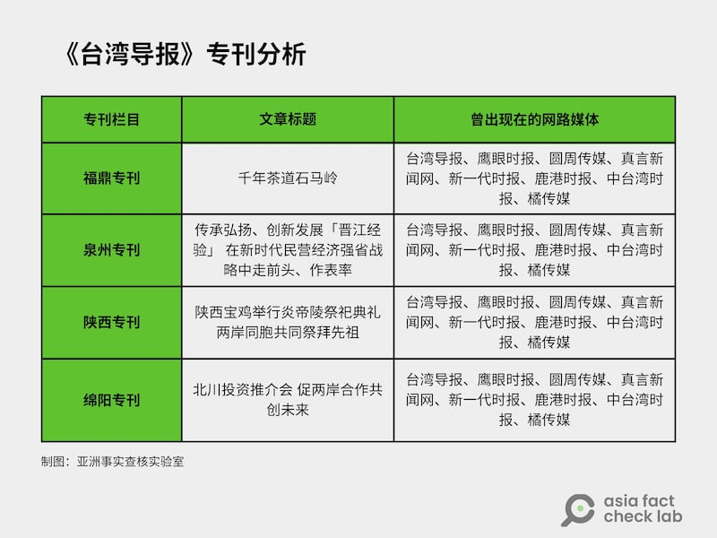
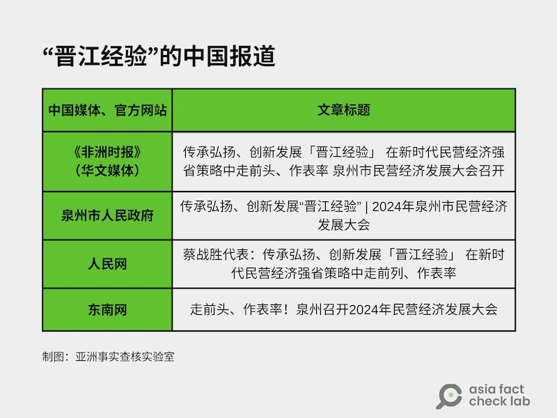
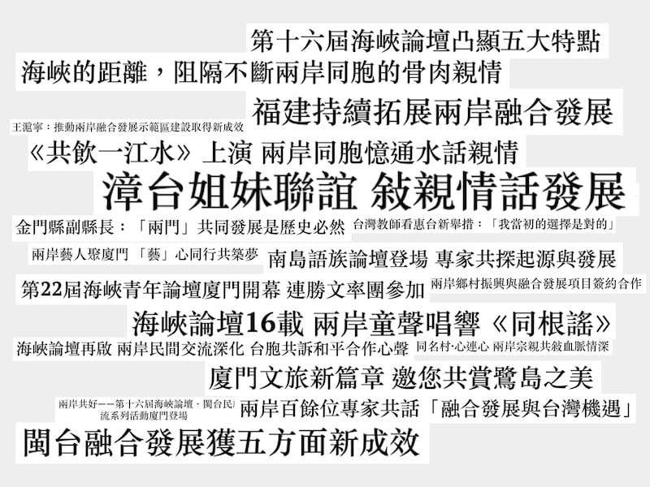

# 深度報道｜中共外宣在臺灣之四：海峽兩岸的兩家《導報》

作者：艾倫、莊敬、董喆

2024.12.25 10:35 EST

“90年代出生的臺灣青年陳斯俊說......第一次來到丹東抗美援朝紀念館受到很大觸動，這樣一段保家衛國、英勇奮戰的歷史，這樣一支爲和平正義而流血犧牲的中國人民志願軍隊伍，令人敬仰。”

2023年9月，中國遼寧省臺辦舉辦了一場”兩岸媒體看遼寧”的新聞交流活動，邀請了十五位兩岸記者和“青年自媒體人”走訪了瀋陽故宮、遼寧省博物館、鴨綠江斷橋和抗美援朝紀念館等文化景點及歷史遺址。

“這是我闊別5年再次來到遼寧，心情非常激動。《臺灣導報》曾多次開設報道遼寧的專版，加深了臺灣民衆對遼寧的瞭解。”《人民日報》海外版在[報道](http://tw.peopledaily.com.cn/BIG5/n1/2024/0916/c14657-40321212.html "http://tw.peopledaily.com.cn/BIG5/n1/2024/0916/c14657-40321212.html")中訪問了《臺灣導報》社長林文雄，他說“臺灣媒體朋友對此行熱情滿滿。”

帶着《民衆日報》的[業務經驗](https://www.rfa.org/mandarin/shishi-hecha/2024/12/20/fact-check-ccp-propaganda-taiwan-serial3/ "https://www.rfa.org/mandarin/shishi-hecha/2024/12/20/fact-check-ccp-propaganda-taiwan-serial3/")，林文雄在2012年10月1日創立《臺灣導報》，總部設在高雄，出版形式兼具紙媒和網絡。在快速走下坡的臺灣媒體業界，林文雄與中國臺辦系統的關係成爲重要的新資源。這一場”兩岸媒體看遼寧”的交流活動是否帶來經濟收入，外界不得而知。但國臺辦所屬的新聞網站《華夏經緯網》報道：參訪期間，《臺灣導報》出版了“宣傳遼寧專版”，“宣推瀋陽、本溪、丹東市的專版”。其旗下的新媒體平臺如《新一代時報》《鹿港時報》《中臺灣時報》《橘傳媒》《鷹眼時報》《圓周傳媒》和《真言新聞網》也都同時宣傳推播遼寧。

《華夏經緯網》的報道稱，具不完全統計，”臺灣導報社長：希望廣大臺胞瞭解兩岸和平統一的重要性”的影片播放超過161萬次，登上頭條熱門桌海榜第1名。相關通報在官方網站、抖音號、快手號、影片號、今日頭條、新浪微博、企鵝號、Facebook、YouTube等平臺刊發，閱讀量超過506.5萬次，部分報道播放量達380.5萬次。

這些報道，其實點出了《臺灣導報》和類似型態媒體的經營模式與組織特性，我們接下來逐一分析。但詳細討論《臺灣導報》之前，或許可以簡述一下他和另一家”導報”--《海峽導報》的關係。

## 《海峽導報》，中國官方的統戰橋樑

首則“中共外宣在臺灣”系列[報道](https://www.rfa.org/mandarin/shishi-hecha/2024/12/12/hc-ccp-propaganda-in-taiwan/ "https://www.rfa.org/mandarin/shishi-hecha/2024/12/12/hc-ccp-propaganda-in-taiwan/")中曾經提及，《臺灣導報》的記者林獻元在《指傳媒》假民調案中，曾多次和《海峽導報》社委林靖東及編委王煒聯絡，雙方交情可見一斑。順着這條線查下去，我們發現兩岸這兩家“導報”關係密切。

《海峽導報》爲福建日報報業集團旗下媒體，隸屬中共福建省委，由福建日報社100%持股，媒體定位爲全中國唯一以對臺宣傳爲主的市民生活報。

一份廈門大學新聞傳播學院的報告指出，《海峽導報》作爲具有“對臺宣傳性”的綜合市民報，長期積極加強輿論宣傳，爲兩岸三通和經貿往來提供交流平臺，“爲最終的統一大業添磚加瓦”。

知情人士向亞洲事實查覈實驗室（Asia Fact Cehck Lab,AFCL）透露，林文雄當年爲了《民衆日報》的經營權焦頭爛額，產生另起爐竈的念頭。在一次餐敘裏，他向時任《海峽導報》社長的馬振霖提起這個想法。馬振霖建議新媒體可以取名《臺灣導報》，兩岸兩導報，可以塑造“一家人”的感覺。

馬振霖是《臺灣導報》建立初期的關鍵人物，一段2012年名“中秋博餅狀元王”選拔活動的[影音](https://www.youtube.com/watch?v=Y66qvyF_MNM "https://www.youtube.com/watch?v=Y66qvyF_MNM")顯示，馬振霖是把這項活動引進臺灣的重要推手。這場活動由《臺灣導報》和《海峽導報》共同舉辦，《臺灣導報》及民衆報業集團都參與了活動。林文雄擔任“中華博餅文化協會”理事長，活動年年舉辦，延續到今天。

從社媒內容來看，兩家導報最早從2013年就有接觸，記者一同[聚會喫烤肉](https://archive.ph/DjXbZ "https://archive.ph/DjXbZ")，林獻元也參加了。

除此之外，林文雄也與《海峽導報》的現任社長林世雄多有往來。

2019年，在廈門舉行的中秋博餅大賽前，林世雄和林文雄見面並交換禮物。根據中國新聞網的[報道](https://www.chinanews.com.cn/tw/2019/09-29/8968251.shtml "https://www.chinanews.com.cn/tw/2019/09-29/8968251.shtml")，林世雄送了一枚刻着“兩岸導報是一家”的印章給林文雄，並稱：“兩岸人民都是龍的傳人，兩岸的導報是一家，希望《海峽導報》和《臺灣導報》和諧交流往來”。

2023年，《海峽導報》正式啓用兩岸融合發展青創空間，當時林文雄也現身《海峽導報》，《臺灣導報》也發了一篇[專刊](https://www.taiwan-reports.com/archives/690432 "https://www.taiwan-reports.com/archives/690432")：“兩岸融合發展青創空間揭牌”，內文提到，《海峽導報》是全中國唯一以對臺宣傳爲特色的都市生活報，並稱贊《海峽導報》在促進兩岸交流上，發展出“有特色、有亮點、有影響力的宣傳平臺和活動品牌”，“產生了深遠的影響”。

類似的兩岸媒體交流活動數不勝數，我們以關鍵字搜尋到不少例子：

[2013年](https://www.facebook.com/photo.php?fbid=442784355843962&set=a.395998153855916&type=3&rdid=wQzYhcYvONXzxDgS&share_url=https%3A%2F%2Fwww.facebook.com%2Fshare%2FVC8HW411Ey6ssEd5%2F# "https://www.facebook.com/photo.php?fbid=442784355843962&set=a.395998153855916&type=3&rdid=wQzYhcYvONXzxDgS&share_url=https%3A%2F%2Fwww.facebook.com%2Fshare%2FVC8HW411Ey6ssEd5%2F#")福建日報報業集團社長蔡小偉率大陸17家主要報社領導到高雄拜訪《臺灣導報》。

[2015年](https://www.facebook.com/permalink.php?story_fbid=pfbid0TEH8tyu9ryhneVGV9B8S8bCAhc7c1yFiRhtnThQE2GDt2Rb7hQCGB7ZAVP6GdS1Zl&id=100006894664551&rdid=ICas7IoOCH5zBakJ "https://www.facebook.com/permalink.php?story_fbid=pfbid0TEH8tyu9ryhneVGV9B8S8bCAhc7c1yFiRhtnThQE2GDt2Rb7hQCGB7ZAVP6GdS1Zl&id=100006894664551&rdid=ICas7IoOCH5zBakJ")《海峽導報》社長赴高雄拜會《臺灣導報》。

2017年，《臺灣導報》特派記者鄭永德在臉書[發文](https://www.facebook.com/permalink.php?story_fbid=pfbid0ayneXAPX2rVZrKo4hYqPWHddv8gX9xdMHwMAuhPanNLY7ymghKdhH9WC7uPV2dQzl&id=100000185321737&rdid=OkCVAcwYjHB7DOXc# "https://www.facebook.com/permalink.php?story_fbid=pfbid0ayneXAPX2rVZrKo4hYqPWHddv8gX9xdMHwMAuhPanNLY7ymghKdhH9WC7uPV2dQzl&id=100000185321737&rdid=OkCVAcwYjHB7DOXc#")，稱《臺灣導報》成爲全臺唯一獲准加入“中國報業協會”的臺灣媒體，報協的[網站](http://zgbx.people.com.cn/BIG5/n1/2020/0611/c415415-31743716.html "http://zgbx.people.com.cn/BIG5/n1/2020/0611/c415415-31743716.html")如此描述使命：“中國報業協會將持之以恆以習近平新時代中國特色社會主義思想爲引領，認真貫徹落實中央決策部署和中宣部總要求，努力團結全行業力量，推動報業加快轉型和融合發展”。

## 別有特色的“大陸新聞”

打開《臺灣導報》網站，首頁有臺灣地方新聞、社論及國際新聞。欄目分類則有全國版、北、中、南地方版、慈濟廣場、大陸視窗、文化藝術及歷史版面。版面分類和一般綜合性媒體沒有不同，但大陸新聞欄位卻別有特色。

我們在12月8日點開《臺灣導報》的”大陸視窗”欄目，四則新聞正滾動輪播：

兩岸美食展沙縣舉辦 臺灣小喫展位人氣旺

中國木拱橋技藝傳承人盼薪火相傳

近700家參展商共聚福建旅交會

“浙東黃金港灣‘湧出條條’大黃魚”

再瀏覽大陸視窗欄目的其它新聞，會發現絕大部分新聞都不觸及中國黨政、軍事或社會，反而都是人文、觀光、風景及兩岸民族情懷的內容。

進一步觀察《臺灣導報》的大陸新聞，一個名爲“專刊報道”的欄目裏，爲（福建省）福鼎市、泉州、陝西、（四川省）綿陽市、北京、天津各開了一個專刊欄目，內容一樣聚焦在當地風土民情、觀光，以及經濟發展等主題，記者可見的內容都是正面報道，例如：

【福鼎專刊】千年茶道石馬嶺

【泉州專刊】傳承弘揚、創新發展「晉江經驗」 在新時代民營經濟強省戰略中走前頭、作表率

【陝西專刊】陝西寶雞舉行炎帝陵祭祀典禮 兩岸同胞共同祭拜先祖

【綿陽專刊】北川投資推介會 促兩岸合作共創未來

我們進一步搜尋了這四個主題，發現相關新聞也同步刊載在多家網路媒體上：

抽樣分析《臺灣導報》專刊，會發現其大陸專刊裏大部分的文章皆同時發佈至其他七家傳媒，而這七家媒體也是《臺灣導報》的“新媒體集羣”。 (亞洲事實查覈實驗室製圖)

從上方表格可以觀察到，四篇“大陸專刊”的內容，不僅刊在《臺灣導報》上，也同時發佈在其他七個網路媒體上，標題、內文幾乎完全相同，只有少數經過改寫。而這七家網媒，都是《臺灣導報》的“新媒體串流平臺”。

亞洲事實查覈實驗室在進行關鍵字搜尋時，發現這些專刊報道發佈的內容，也有簡中的網站同時轉發。以泉州專刊的“晉江經驗”報道爲例，除了中國媒體外，連官方也有發佈高度相似的內容：

將《臺灣導報》泉州專刊裏的“晉江經驗”文章以關鍵字搜尋，會發現其他中國媒體及官方網站同時期發佈高度類似的內容。 (亞洲事實查覈實驗室製圖)

亞洲事實查覈實驗室聯繫了《臺灣導報》，希望瞭解這些”專刊”是自主規劃採編的新聞，或者是有償新聞（paying for news coverage），但聯絡上的人士表示，公司不會有人具名回應我們的問題。

“基本上都是業配，不然的話用一般新聞版面刊登就好了”，一位曾經與林文雄合作的夥伴直白回應了我們對這些“專題”和“特刊”性質的疑問。

另一位不願具名的內部人士稱，在2020年疫情爆發之前，的確有些到中國交流的邀約和機會，但因爲疫情中斷了好幾年。不過隨着疫情結束，這樣的交流又逐漸回覆，例如2024年4月底，兩岸媒體人受邀至福建湄洲島體驗媽祖文化的活動，《臺灣導報》開設了“湄洲媽祖專刊”專門[報道](https://www.taiwan-reports.com/archives/700759 "https://www.taiwan-reports.com/archives/700759")這一系列的活動。

但大篇幅報道這場活動的不只《臺灣導報》，中國新聞網在[報道](http://m.cnhubei.com/content/2024-04/30/content_17822459.html "http://m.cnhubei.com/content/2024-04/30/content_17822459.html")中稱：

“今年是‘媽祖信俗‘列入聯合國教科文組織《人類非物質文化遺產保護代表作名錄》15週年。這場聯合採風活動吸引了民衆日報、中央廣播電視總檯、中國新聞社、東南衛視、臺灣TVBS、臺灣東森電視臺、臺灣導報等兩岸媒體參與”，並稱共有超過三十位兩岸媒體人共同參與此次活動。

儘管主流媒體及地方網媒皆有收到邀訪，兩者報道方式卻不盡相同。以TVBS及《臺灣導報》做比較，會發現同樣以湄洲媽祖爲主軸，TVBS的切入點爲中國香客近年來無法赴臺進香，而《臺灣導報》發佈的兩篇“專刊”報導，則僅報導活動內容及宣傳媽祖文化，並未具有“議題性”。

資深兩岸新聞記者告訴我們，這也是爲什麼近年來中國官方所發的臺媒邀訪，主流媒體有時卻缺乏興致。“主要還是要考慮到是否有新聞性，他們其實不太能夠去約束到我們怎麼報導，而且有些活動真的太鳥到我們根本不想去。”

類似的報道模式也出現在今年六月的海峽論壇期間。 《臺灣導報》不僅在其主頁上設置專欄報道，經統計，論壇期間共發了35篇新聞，相關的標題包含：

2024年6月，《臺灣導報》在其“海峽論壇”專刊上一共發佈35篇相關報道，標題圍繞在兩岸文化、風俗民情及經濟交流，並未提及敏感的政治話題。 (亞洲事實查覈實驗室製圖、標題截圖來自《臺灣導報》)

當《臺灣導報》的大陸新聞如此着重軟性文化的內容，絕口不提敏感的政治話題，其社論上對臺灣執政當局的大力批判就形成了強烈對比：

【社論】反和平顧主權

【社論】法辦陸生 賴政府也要搞戒嚴嗎

【社論】綠營催生武統

【社論】拜登臨去瘋狂 烏克蘭和平遙遠

【社論】美國的墮落

【社論】炒作聯大2758號決議也無法臺獨

亞洲事實查覈實驗室以幾個2024年的重要兩岸、國際事件在《臺灣導報》搜尋，關鍵字包含“2758號決議案”、“聯合利劍A、B”、“俄烏戰爭”、“中國臺北隊爭議”，找到以上社論內容，明確踩在反對民進黨政府及疑美論等立場上。

## 《臺灣導報》集羣

在調查兩岸導報的來往時，亞洲事實查覈實驗室發現，《臺灣導報》並非單打獨鬥，而是一個“集羣”同時運作。

點開《臺灣導報》首頁，會發現一個欄位標示“臺灣導報新媒體串流平臺”，列舉了包含《鷹眼時報》《圓周傳媒》《真言新聞網》《新一代時報》《鹿港時報》《中臺灣時報》《橘傳媒》《亞洲經濟通訊社》等。

將這些媒體放進臺灣公司網搜尋，並非每個都有註冊公司，例如《鷹眼時報》《圓周傳媒》《真言新聞網》和《中臺灣時報》都查無相關資訊。

而《橘傳媒》註冊地址和《臺灣導報》相同，都在高雄的85大樓內，《新一代時報》《鹿港時報》和《亞洲經濟通訊社》則各有其負責人及獨立的公司資訊。

林獻元參與的《指傳媒》，2019年曾涉入[紅色網媒集羣案](https://www.rfa.org/cantonese/news/factcheck-tw1-12222023163055.html "https://www.rfa.org/cantonese/news/factcheck-tw1-12222023163055.html")，這些微型媒體都集中在臺中。如今再看到《臺灣導報》也呈現這樣的集羣操作，不禁讓人疑惑，這些經營者同時運營多家媒體的效益在哪裏？

## 臺辦向上交差，媒體互相拉抬

AFCL此前在報道中分析了媒體集羣操作可能的原因，[首先](https://www.rfa.org/mandarin/shishi-hecha/2024/12/12/hc-in-depth-report-ccp-media-taiwan/ "https://www.rfa.org/mandarin/shishi-hecha/2024/12/12/hc-in-depth-report-ccp-media-taiwan/")是對地方政府形成壓力；[其次](https://www.rfa.org/mandarin/shishi-hecha/hc2-12222023161721.html?encoding=traditional "https://www.rfa.org/mandarin/shishi-hecha/hc2-12222023161721.html?encoding=traditional")，通過多個媒體在同一時間，反覆交替刊出、引用同一主題，甚至同一篇報導，可以觸發搜尋引擎演算法，將這篇報導排在搜尋前果的前頭，這樣的方法稱爲“鏈輪法“（Link Wheel）。

《臺灣導報》集羣可以看見同樣的操作。例如我們在2024年12月12日進入《臺灣導報》媒體集羣的網站，上述八個關聯網媒的大陸新聞皆停留在12月8日的“兩岸暨港澳媒體行廣州啓動”，且記者皆掛名“蔡淑涓”、報道里的文字敘述都一模一樣。 《臺灣導報》發的中國新聞雖然比其新媒體集羣裏的更多，但也在同一天發佈相同的標題及內文。這些媒體用“同天發同稿”的方式處理其中國新聞，已經維持一段時間。

認識林文雄、林獻元，且熟悉這樣操作法的媒體記者告訴亞洲事實查覈實驗室，《臺灣導報》這樣子的辦報手法，讓國臺辦也能對內交差，提高對臺宣傳的“業績”。

“中國是按單位給（錢），看你可以掌控幾個單位。所以他就是一直弄一大堆的傳媒。一個傳媒譬如說拿個一萬人民幣，那我十個，我是不是就拿十萬”，這位記者舉例。

他補充，《臺灣導報》這樣子的“集羣”，可以在國臺辦邀請臺灣媒體參加活動時，誤導中國官方自己是臺灣媒體的領頭羊、重要人物。 “所以他（按：林獻元、林文雄）經營臺灣的關係好處之一，就是變成他去拿大陸案子的支撐，以此證明自己在臺灣有影響力，甚至形塑自己是這一羣人的頭，然後只要你發案子給我的話，我會分配給這些人”。

此外，《臺灣導報》和《指傳媒》也很積極經營在臺灣“各地皆有記者的形象”，力求表現自己是個有模有樣的媒體，在國臺辦面前才能顯示出自己的公信力。 “他（林獻元）就說他總是要做得漂亮一點，就是說他的網站也要做得漂漂亮亮的，人家臺辦還是什麼的各單位纔會買單”。

## 新聞自由或政治收買？

綜合觀察前述對於《臺灣導報》等地方媒體集羣的立場分析，一個必定出現的問題是：即使親中、疑美、批判民進黨，難道不是新聞機構基於言論自由的自主選擇嗎？特別是對政府當局的監督，不正是媒體天職？

面對依法成立的臺灣媒體，臺灣陸委會主委邱垂正承認，執政者要以“最大的忍耐程度面對言論自由，哪怕是不支持執政黨的，都要忍耐，因爲臺灣是自由民主社會。”

但邱垂正也認爲，一旦媒體被中共控制，那就根本不是一般人期待的“公義”或“公器”，而成了控制社會的武器。“如果所有媒體要‘姓黨’，那它就不是社會公器，而是介入臺灣分化對立與製造內亂的工具。”

過去以來臺灣小型地方媒體集羣到中國大陸參訪並接受招待，以及屢見不鮮的“業務合作”。邱垂正認爲，臺灣的媒體經營、生存十分辛苦，中國熟悉這一點，因此會特別收買小型或地方媒體。

但邱垂正認爲重點在於“對價關係”，也就是報導的背後是否涉及統戰利益。即使政治性的內容並無牽涉金錢交易，若有其他業務往來也是踩在灰色地帶上。

研究中國影響力的臺灣政治大學副教授黃兆年則說，收錢做新聞就是違反最“基本的新聞倫理”，就算是爲了經營考量也無法將其合理化。黃兆年強調，中國擅於用軟實力包裝其背後的統戰利益。看起來是文化宣傳，背後卻牽涉系統性的收買及誘因。

## 實質影響力指標：從網站瀏覽量到社媒流量

亞洲事實查覈實驗室在2024年12月9日點開《臺灣導報》“福鼎專刊”的相關新聞，發現從三月至今，每篇在網站上標註的瀏覽數幾乎都落在“七萬至八萬”之間。

再觀察其“海峽論壇”的報道，第一頁的所有新聞觀看數也都落在七、八萬左右。這不禁讓人思考：如此僅僅是改寫新聞稿、且單篇流量不足十萬的中國外宣，在臺灣有其影響力嗎？

一名資深記者受訪時被問到這題，反問AFCL：“你們覺得他們有影響力嗎”，不過也隨即補充道：“我不知道數字的真假，因爲他可能要做成績給臺辦看，告訴他們我們有7萬多人在看”。

但也有資深兩岸記者看到另一種趨勢，類似的邀訪活動，國臺辦都雖然都會廣邀各類媒體，但“我的感覺是網紅、自媒體的人數其實是會多過我們臺媒的”，這名記者點出近年來，中國對臺外宣的資源投注，從傳統媒體逐漸轉換至自媒體、網紅。

臺灣“中華微視”便是其中一個例子。 2016年，時任“中華微視移動融媒體”執行董事吳侑勳，參加第二屆北京兩岸媒體人峯會時上臺發表演講，指出傳統媒體人應積極轉戰新媒體，尤其是社媒平臺，並稱中華微視很早就推動“大陸、臺灣、港澳地區所產生的同根同祖的華人文化和資訊傳遞的交流”，提供新平臺，三成放置傳統媒體的內容，七成則開放給自媒體、個人用戶發表內容、進行交流。

根據臺灣法務部調查局的[公開資料](https://www.mjib.gov.tw/news/Details/1/822 "https://www.mjib.gov.tw/news/Details/1/822")，這間臺灣網媒“中華微視”曾在2022年因發佈不實信息，在臺灣發動認知作戰，並接受由中共解放軍退伍人員擔任董事長的大陸微視提供的資金，因而遭到約談。該公司被發現和在中國名稱相仿的媒體公司“大陸微視網絡科技江蘇有限公司”及“香港中華微視有限公司”有對價關係。

從《臺灣導報》和中華微視的例子可看出，中國近年來的對臺媒體統戰方針已逐漸轉向，因此無論是電視、紙媒都努力轉型到網路上，社媒平臺自然也不缺席。

回顧習近平執政下的中國對外宣傳[方針](https://indsr.org.tw/respublicationcon?uid=12&resid=748&pid=2949 "https://indsr.org.tw/respublicationcon?uid=12&resid=748&pid=2949")，會發現中共中央統戰部在2016年，已宣佈正式將新媒體從業人員等納入統戰對象，2018年則正式納入“網路人士”，這些人包含新媒體資訊平臺從業人員、網路企業和平臺從業人員、網路“大V”、個人網路“大號”、網路社羣組織負責人、網路作家、網路主播、影音紅人、職業電競選手等，以及與網路密切相關的其他企業和社會組織從業人員，統戰對象包山包海。

而像《臺灣導報》這樣以紙媒起家，後來轉戰網路的臺灣地方媒體，其定位變得更加複雜。綜觀《臺灣導報》的網路數據，除了自行架設將近十個新媒體集羣的網站，在臉書上有約四萬人按贊及追蹤，YouTube則有約一萬追蹤者，其餘則沒有太多的社媒曝光。

而《海峽導報》的網路各項數據則明顯高出許多，其抖音有超過八百萬的訂閱、臉書有48萬按贊及追蹤，也同時經營“臺海網”的抖音帳號，收穫超過1800萬追蹤，並同時經營搜狐、網易、B站、西瓜視頻等更多中國網友使用的平臺。

傳統網路媒體同時發展社羣和影音平臺，這已經是一般媒體的發展趨勢，中共對臺統戰更不會棄這條線於不顧。中共外宣如何借影音平臺和社交媒體開展對臺統戰，是我們接下來探索的主題。

但在進入影音、社媒平臺之前，我們將沿着《海峽導報》的線索向上追蹤《福建日報》集團和中共福建省委。這個距離臺灣最近的中國省分，向來被視爲“對臺統戰前沿基地”。 “中共外宣在臺灣”系列下一篇將深入探討對臺宣傳最主要媒體集羣—“福建網絡”。

(感謝外部專家黃維玲、獨立記者與研究員陳慧敏對本系列報道的貢獻。）

本系列其它各篇專題如下：

之一：[臺檢以《反滲透法》訴大選假民調當事人，一審因何失利？](2024-12-12_深度報道｜中共外宣在臺灣之一： 臺檢以《反滲透法》訴大選假民調當事人，一審因何失利？.md)
之二：[林靖東和林獻元背後的大外宣架構](2024-12-12_深度報道｜中共外宣在臺灣之二：林靖東和林獻元背後的大外宣架構.md)
之三：[老牌本土報紙如何被澆灌出親中敍事？](2024-12-20_深度報道｜中共外宣在臺灣之三：老牌本土報紙如何被澆灌出親中敘事？.md)
之五：[對臺統戰的操盤手“福建網絡”](https://www.rfa.org/mandarin/shishi-hecha/2024/12/31/fact-check-ccp-propaganda-taiwan-serial5/ "https://www.rfa.org/mandarin/shishi-hecha/2024/12/31/fact-check-ccp-propaganda-taiwan-serial5/")
之六：[管不管網路？那是個問題](https://www.rfa.org/mandarin/shishi-hecha/2025/01/03/fact-check-ccp-propaganda-taiwan-serial6/ "https://www.rfa.org/mandarin/shishi-hecha/2025/01/03/fact-check-ccp-propaganda-taiwan-serial6/")

*亞洲事實查覈實驗室（Asia Fact Check Lab）針對當今複雜媒體環境以及新興傳播生態而成立。我們本於新聞專業主義，提供專業查覈報告及與信息環境相關的傳播觀察、深度報道，幫助讀者對公共議題獲得多元而全面的認識。讀者若對任何媒體及社交軟件傳播的信息有疑問，歡迎以電郵*[*afcl@rfa.org*](mailto:afcl@rfa.org)*寄給亞洲事實查覈實驗室，由我們爲您查證覈實。*

*亞洲事實查覈實驗室在X、臉書、IG開張了，歡迎讀者追蹤、分享、轉發。X這邊請進：中文*[*@asiafactcheckcn*](https://twitter.com/asiafactcheckcn)*；英文：*[*@AFCL\_eng*](https://twitter.com/AFCL_eng)*、*[*FB在這裏*](https://www.facebook.com/asiafactchecklabcn)*、*[*IG也別忘了*](https://www.instagram.com/asiafactchecklab/)*。*

[Original Source](https://www.rfa.org/mandarin/shishi-hecha/2024/12/25/fact-check-ccp-propaganda-taiwan-serial4/)