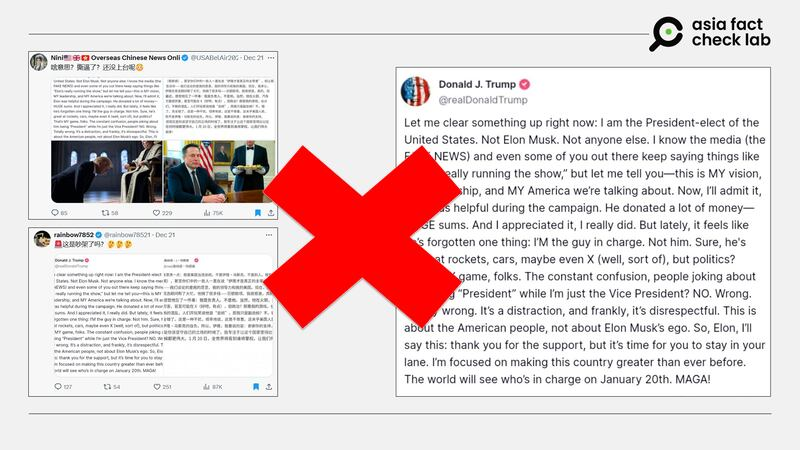
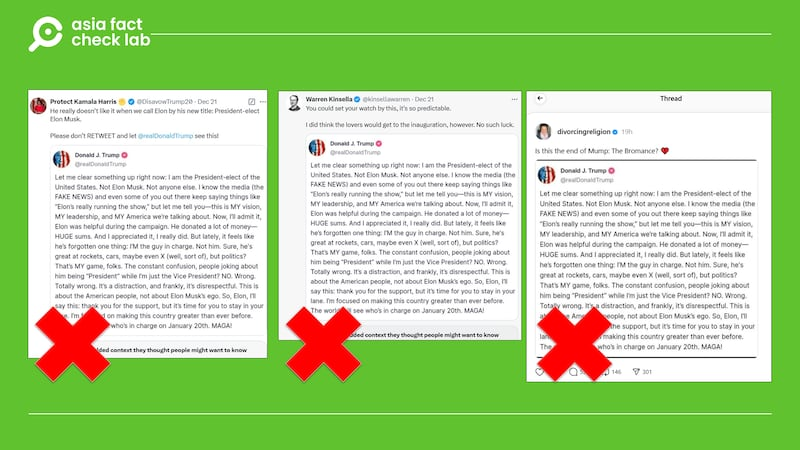
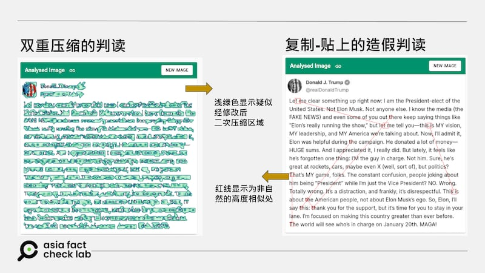

# 事實查覈 | 特朗普與馬斯克翻臉　發文稱“我纔是總統”？

作者：鄭崇生

2024.12.26 20:09 EST

## 查覈結果：錯誤

## 一分鐘完讀：

近日，X平臺流傳一張英文截圖，聲稱美國候任總統特朗普受不了特斯拉執行長馬斯克高調幹政，發文正告馬斯克“我纔是總統”，還有X用戶附上簡體中文翻譯版本的截圖（[1](https://archive.ph/LVdIS)、[2](https://archive.ph/euwqu)），傳播“特朗普和馬斯克吵架開撕”的消息。

亞洲事實查覈實驗室發現，[特朗普的Truth Social賬號](https://truthsocial.com/@realDonaldTrump)上找不到這一發文，查覈工具判讀更顯示，該截圖極可能是以特朗普社媒賬號的頭像合成製作的，製作者模擬特朗普口吻，傳播了虛假訊息。

特朗普發文斥責馬斯克 網傳圖片顯示特朗普發文斥責馬斯克引發輿論關注，但經查圖片系僞造。 (X截圖)

## 深度分析：

特朗普（Donald Trump，或譯川普）勝選後已[宣佈任命馬斯克](https://www.reuters.com/world/us/trump-says-elon-musk-vivek-ramaswamy-will-lead-department-government-efficiency-2024-11-13/)（Elon Musk）執掌“政府效率部”（DOGE），儘管這並非正式的聯邦政府部門，但特、馬兩人的關係也引發了諸多討論。

特別是關於政府預算撥款法案的問題，原本兩黨已經就短期撥款的方案達成共識，而馬斯克於18日在X上[發表批評意見](https://x.com/elonmusk/status/1869446782574645386)後，特朗普則跟進[發文](https://truthsocial.com/@realDonaldTrump/posts/113676124870048584?_nlid=8g39mdWhWF&_nhids=w92Of35JKM)，要求國會共和黨人不要和民主黨合作。美國時政媒體Politico報道稱，[民主黨議員們譏諷特朗普](https://www.youtube.com/watch?v=wng9tyypnpY)現在是聽命於 “總統當選人馬斯克” （President-Elect Musk）。

對於這樣的批評，特朗普22日在鳳凰城的一場活動上主動作出了回應。根據《華爾街日報》（WSJ）的[報道視頻](https://youtu.be/9_FUtq5hqIk?si=Ir35oMxP7sY9e168)（20秒處開始），特朗普說：“最新的謊言是特朗普總統把總統職位讓給馬斯克了……，他不會是總統的，我可以告訴你們，我穩的很，你們知道爲什麼嗎？他不能當美國總統，因爲他不是在這個國家出生的，哈哈。”

針對兩人的關係，有許多借助AI生成的圖片與視頻將特朗普描繪成馬斯克的小弟或僕人，這些圖像也陸續傳播到[微博](https://archive.ph/j0VPZ)上。

亞洲事實查覈實驗室（Asia Fact Check Lab, AFCL）以圖反搜發現，同一張截圖更早之前就出現在幾個立場親民主黨的X賬號的發文中（[1](https://archive.ph/Be3VV)、[2](https://archive.ph/oFARp)），在另一社交媒體平臺[Thread](https://archive.ph/pCXsO)上也有所傳播。

僞造特朗普發文的截圖 僞造特朗普發文的截圖在英文社媒上傳播 (X、Thread截圖)

AFCL先以法新社（AFP）開發的InVID人工智能判讀軟件輔助甄別發現，這張截圖有明顯的雙重壓縮過的痕跡（如下圖左），而下圖右紅線標示處則是極可能是粘貼上的文字，而這些文字經判定爲不自然的相似，也就是人工生成的。

網傳圖片經InVID判讀的結果 網傳圖片經InVID判讀的結果 (AFCL製圖)

此外，這張圖在X的社羣筆記上也已被人標註爲合成圖像。AFCL發現，這張截圖的特朗普頭像雖然和他在Truth Social賬號上的一模一樣，也有粉紅色爲底的白勾勾認證，但細查特朗普近來的發文，確實沒有這樣的內容，也沒有主流媒體報道過他發表過類似言論。

另外，Truth Social平臺上，並沒有安插可自動翻譯成中文的插件，所以“特朗普發文”截圖中的中文翻譯也是後製合成的。

*亞洲事實查覈實驗室（Asia Fact Check Lab）針對當今複雜媒體環境以及新興傳播生態而成立。我們本於新聞專業主義，提供專業查覈報告及與信息環境相關的傳播觀察、深度報道，幫助讀者對公共議題獲得多元而全面的認識。讀者若對任何媒體及社交軟件傳播的信息有疑問，歡迎以電郵afcl@rfa.org寄給亞洲事實查覈實驗室，由我們爲您查證覈實。*

*亞洲事實查覈實驗室在X、臉書、IG開張了，歡迎讀者追蹤、分享、轉發。X這邊請進：中文*[*@asiafactcheckcn*](https://twitter.com/asiafactcheckcn)*；英文：*[*@AFCL\_eng*](https://twitter.com/AFCL_eng)*、*[*FB在這裏*](https://www.facebook.com/asiafactchecklabcn)*、*[*IG也別忘了*](https://www.instagram.com/asiafactchecklab/)*。*

[Original Source](https://www.rfa.org/mandarin/shishi-hecha/2024/12/27/hc-trump-musk-relations-fact-check/)