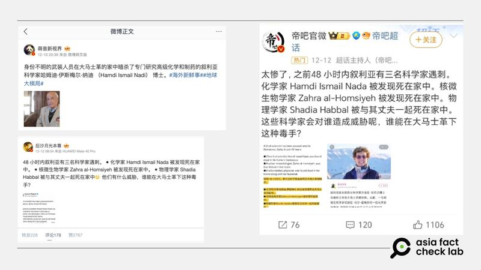
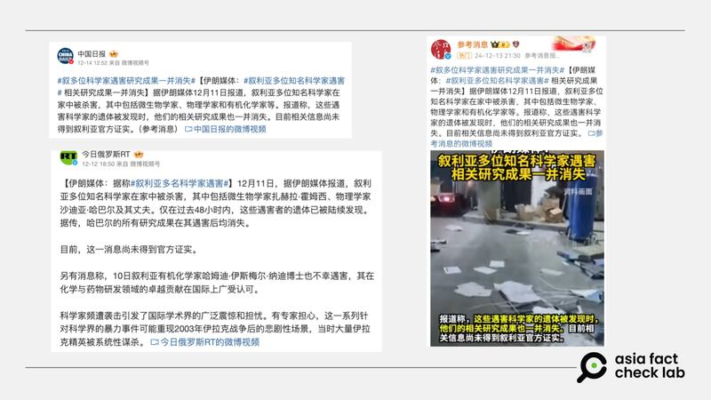

# 事實查覈｜敘利亞三位科學家在阿薩德政權倒臺後遇害，研究成果消失？

作者：董喆

2024.12.27 12:14 EST

## 查覈結果：錯誤

## 一分鐘完讀：

12月中阿薩德政權倒臺後，中國社羣平臺上開始有傳言稱敘利亞有三位科學家及其家屬遭殺害，研究成果也一併消失。經查，傳言中所提到的科學家，其中兩位非敘利亞人且已出面闢謠，另一位則查無此人，並無公開信息顯示有同名的敘利亞籍科學家，學術期刊庫中也沒有以此名字發表的著作。

## 深度分析：

阿薩德政權倒臺後，華語社羣上出現一則消息，稱三位敘利亞科學家遭殺害，稱微生物學家霍姆西（Zahra al-Homsiyeh）、物理學家哈巴爾（Shadia Habbal）夫婦、有機化學家納迪博士（Hamdi Ismail Nadi）遇害，他們的研究成果也一併丟失。許多評論稱這如同2003年伊拉克戰爭後的悲劇重演。

阿薩德政權倒臺後，華語社羣上出現敘利亞科學家遭殺害的消息。 阿薩德政權倒臺後，華語社羣上出現敘利亞科學家遭殺害的消息。 (微博截圖)

亞洲事實查覈實驗室（以下簡稱AFCL）追查這則傳言的傳播路徑，以發文時間以及網傳截圖來看，此消息初期由伊朗傳出，12月10日伊斯蘭共和國通訊社的X帳號[發佈了](https://archive.ph/ZGOX2)有機化學家納迪博士在大馬士革遇害的消息，接著部分微博大V轉傳敘利亞遇害科學家名單以及照片。此消息數日後也由《中國日報》、《今日俄羅斯》等中俄官方媒體在微博發佈報道。

敘利亞科學家遭殺害的消息也由中俄官媒在微博發佈報道。 敘利亞科學家遭殺害的消息也由中俄官媒在微博發佈報道。 (微博截圖)

AFCL逐一針對名單上的科學家進行查覈，發現這則傳言是錯誤資訊。

首先，化學家Hamdi Ismail Nadi實際上是一名74歲的埃及醫師，並非敘利亞人也不是科學家。巴勒斯坦查覈組織《Tayqan》與Hamdi Ismail Nadi[取得聯繫](https://tayqan.net/public/claim/4345?s=08&fbclid=IwZXh0bgNhZW0CMTAAAR3OeTx3HA6OCImgkC6Kt0PV4A_WxgRsECLFbKjr2PEKjTfa9WbT2-mp5ww_aem_CRVsB7XI0UEhg2ew9uDCxQ)，證明其並未遭殺害，Hamdi Ismail Nadi告訴《Tayqan》，傳言的照片的確是他本人，但他最近一次到敘利亞是9年前的一次工作行程。

Hamdi Ismail Nadi在他的臉書說明了自己的身份遭誤用，並將《Tayqan》發佈的查覈報告轉發於個人頁面。

同樣遭誤傳遇害的“物理學家“Shadia Habbal，其實是夏威夷大學天文研究所[教授](https://people.ifa.hawaii.edu/faculty/bio/shadia-habbal/ "https://people.ifa.hawaii.edu/faculty/bio/shadia-habbal/")，她以電子郵件回覆AFCL，“我顯然還活着”，她表示，不明白爲何會有謠言使用她的照片與資料。

AFCL以圖反搜，發現傳言的照片出自阿拉伯科學媒體Atrogate Space Gateway於2020年舉辦的[活動](https://x.com/AstroGateSpace/status/1316762031652036609/photo/1 "https://x.com/AstroGateSpace/status/1316762031652036609/photo/1")，Shadia Habbal是該場活動的來賓。該媒體也在此傳言散播後，[出面闢謠](https://x.com/AstroGateSpace/status/1866920851309728142)Shadia Habbal並未遭殺害。

至於傳言中提到的第三位科學家Zahra al-Homsiyeh，傳言中並沒有描寫太多此人背景，也沒有附上照片，有些賬號甚至也把Shadia的照片用作是Zahra al-Homsiyeh的照片。AFCL以此名字在谷歌學術搜索（Google Scholar）美國國家醫學圖書館 （National Library of Medicine）資料庫平臺[PubMed](https://pubmed.ncbi.nlm.nih.gov/?holding=itwntumtlib_fft_ndi)，以及收納Science Citation Index Expanded（簡稱 SCIE）的索引資料庫[Web of Science](https://access.clarivate.com/login?app=wos&alternative=true&shibShireURL=https:%2F%2Fwww.webofknowledge.com%2F%3Fauth%3DShibboleth&shibReturnURL=https:%2F%2Fwww.webofknowledge.com%2F%3Fmode%3DNextgen%26action%3Dtransfer%26path%3D%252Fwos%252Fwoscc%252Fbasic-search%26DestApp%3DUA&referrer=mode%3DNextgen%26path%3D%252Fwos%252Fwoscc%252Fbasic-search%26DestApp%3DUA%26action%3Dtransfer&roaming=true)進行檢索，皆未找到相符的作者以及相關著作。

*亞洲事實查覈實驗室（Asia Fact Check Lab）針對當今複雜媒體環境以及新興傳播生態而成立。我們本於新聞專業主義，提供專業查覈報告及與信息環境相關的傳播觀察、深度報道，幫助讀者對公共議題獲得多元而全面的認識。讀者若對任何媒體及社交軟件傳播的信息有疑問，歡迎以電郵*[*afcl@rfa.org*](mailto:afcl@rfa.org)*寄給亞洲事實查覈實驗室，由我們爲您查證覈實。*

*亞洲事實查覈實驗室在X、臉書、IG開張了，歡迎讀者追蹤、分享、轉發。X這邊請進：中文*[*@asiafactcheckcn*](https://twitter.com/asiafactcheckcn)*；英文：*[*@AFCL\_eng*](https://twitter.com/AFCL_eng)*、*[*FB在這裏*](https://www.facebook.com/asiafactchecklabcn)*、*[*IG也別忘了*](https://www.instagram.com/asiafactchecklab/)*。*

[Original Source](https://www.rfa.org/mandarin/shishi-hecha/2024/12/27/syrian-scientists-killed/)