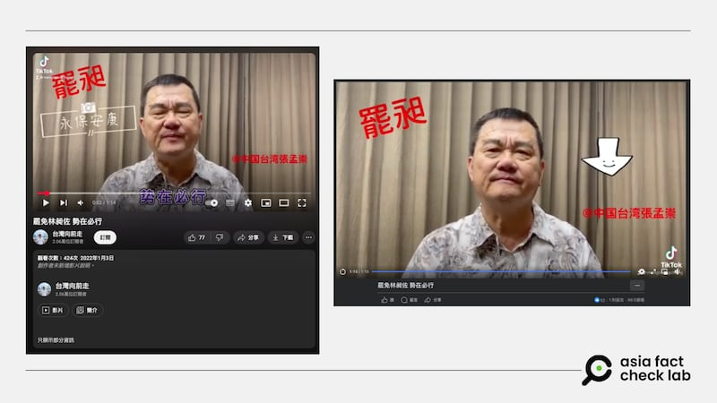
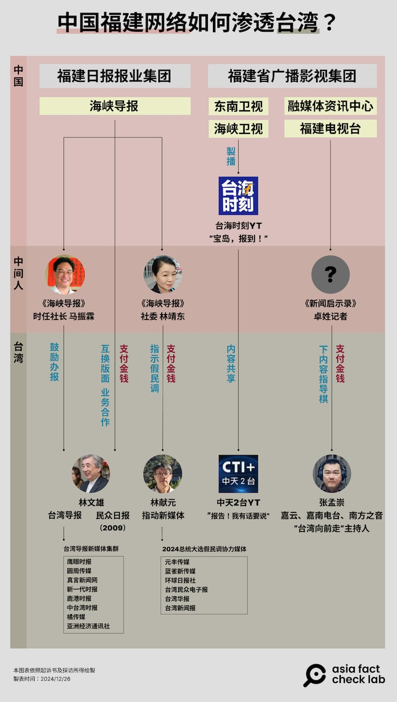
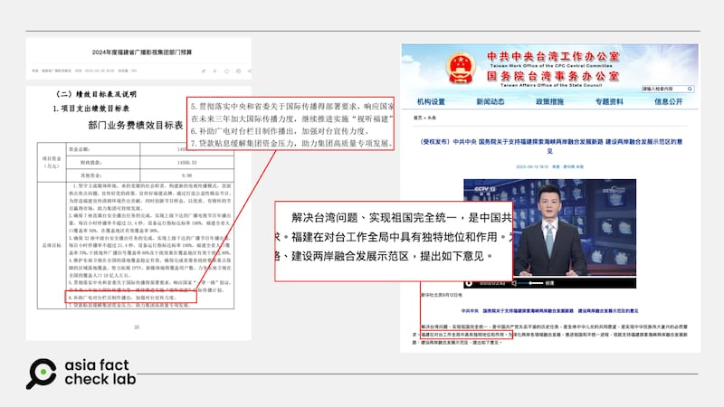
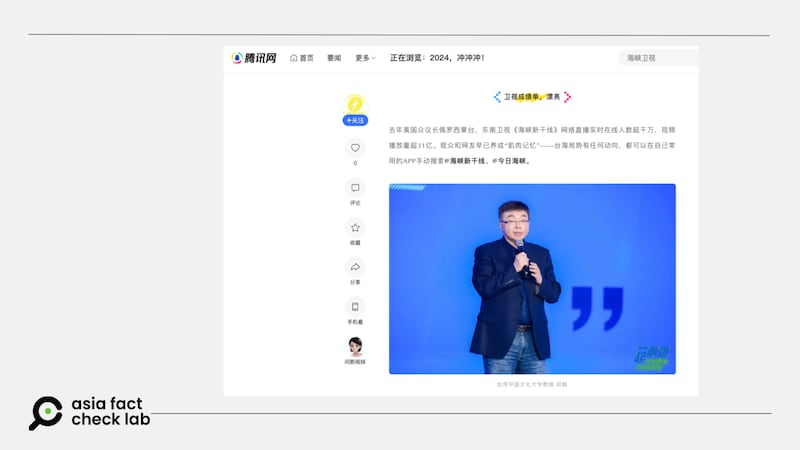
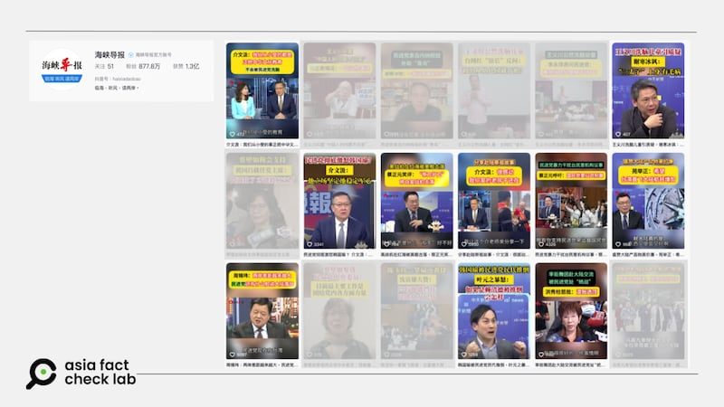
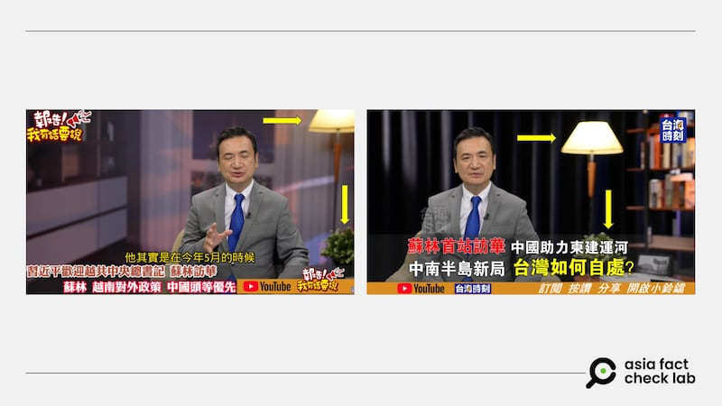
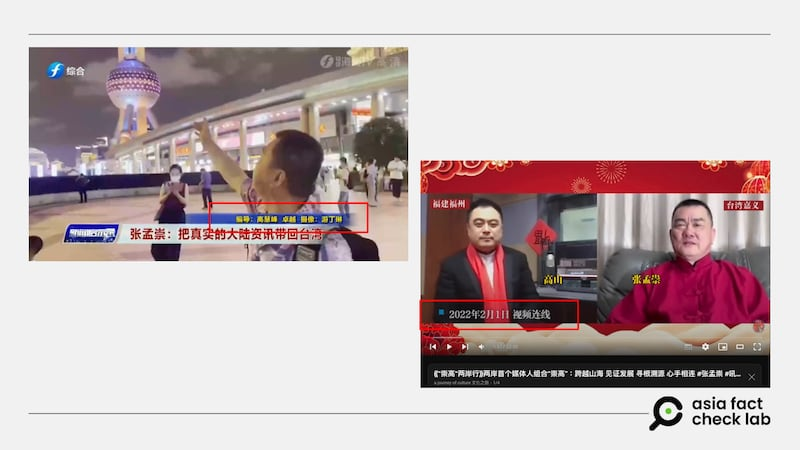

# 深度報道｜中共外宣在臺灣之五：對臺統戰的操盤手“福建網絡”

董喆、艾倫、莊敬

2024.12.31 18:25 EST

“罷免林昶佐，勢在必行！1月9號請中正萬華區的民衆，一起投下罷免林昶佐的票，一個從來沒有到過萬華區的民代，現在要被罷免了，就天天來打卡....”

2022年張孟崇在自己的臉書上發佈了一則影片。身爲中華統一促進黨中央委員、發言人，發佈這部影片，看起來就只是抒發一下自己的意見。但兩年後，一紙起訴書揭開背後的操作：這是一個借臺灣地方小型媒體、廣播電臺實施的統戰宣傳計劃，背後影武者是 “福建省廣播影視集團”。

## 中國審查文稿，臺灣播送宣傳

2022年1月3日下午3時3分，張孟崇與妻子洪文婷的收到來自福建省廣播影視集團卓姓記者的消息。

“罷免林昶佐，勢在必行！....”

“今天罵林昶佐”

“罷免林昶佐這條師母先弄出來發在自己的TikTok YouTube Facebook平臺上”

隨後在下午5時20分，身着花襯衫的張孟崇現身佈景前，將福建捎來的腳本一字不漏的演繹出來。經福建省廣播影視集團新聞評論部審覈後，同月25日張孟崇傳送妻子的賬戶信息給卓姓記者，報領“工作”費用。

張孟崇發佈在個人社媒平臺的短視頻 張孟崇發佈在個人社媒平臺的短視頻 (截圖自TikTok)

張孟崇是中華統一促進黨黨員，政治立場偏向激進統派，並在嘉雲、嘉南電臺、南方之音擔任電臺主持人，並經營抖音、TikTok、YouTube等自媒體頻道。

檢方調查發現，從2020年1月15日到2023年10月31日，張孟崇夫婦以“卓姓記者提供腳本、張孟崇錄製上傳，福建省廣播影視集團新聞評論部審覈”的模式，先後操作了“四大公投案”和“林昶佐罷免案”的網路宣傳，福建方面依照案支付贊助。光是張孟崇在臺灣以銀聯卡提領的贊助金，就達到新臺幣84萬元。嘉義地檢署檢察官在2024年10月25日起訴了張孟崇和他的妻子洪文婷。這是自2023年底的《指傳媒》案之後，另一起中國媒體集團操作檯灣統戰宣傳的《反滲透法》案件。

## 福建網絡，對臺政治宣傳最前線

2024年總統大選前夕，亞洲事實查覈實驗室（Asia Fact Check Lab, AFCL）獨家揭露《指傳媒》假民調案（調查報道[1](https://www.rfa.org/mandarin/shishi-hecha/hc-12222023160359.html?encoding=traditional)、[2](https://www.rfa.org/mandarin/shishi-hecha/hc2-12222023161721.html?encoding=traditional)），之後在“中共外宣在臺灣”系列報道(系列[1](2024-12-12_深度報道｜中共外宣在臺灣之一： 臺檢以《反滲透法》訴大選假民調當事人，一審因何失利？.md)、[2](2024-12-12_深度報道｜中共外宣在臺灣之二：林靖東和林獻元背後的大外宣架構.md))中，再報道於背後操控假民調發布的《海峽導報》社委林靖東等中方人士。

從《指傳媒》到張孟崇案，它們的背後都有中國媒體從業人員直接指揮、主導。更重要的是，這些中國媒體人員都來自“福建廣播影視集團”或“福建日報報業集團”，AFCL將這兩大集團組成的統戰網絡稱爲“福建網絡”。

由下列這張表格可以發現，在已經曝光的，無論是違反《反滲透法》的個案；或者報道、言論立場高度親中的臺灣媒體集羣，不分平媒、網絡或影音媒體，都可以追溯出“福建網絡”所投放的統戰資源。

中國“福建網絡”在臺關係圖 中國“福建網絡”在臺關係圖 (AFCL製圖)

“福建網絡”由兩大集團組成：“福建日報報業集團”和“福建廣播影視集團”。概略區分，前者負責傳統平媒和網絡文字媒體；後者對接電視、廣播和影音平臺，至於社交媒體、自媒體產品，則是兩大集團致力開發的領域。

儘管藉着個案件難以勾勒出中共藉由媒體滲透臺灣的完整圖譜，但從一些中共公開的文件中可以看到，福建省是如何承擔對臺工作的“重責”。

中國國家主席習近平曾在福建任官17年，2019年他在全國人大會議期間指出“努力把福建建成臺胞臺企登陸的第一家園”。2021年，中國人大、政協兩會通過《十四五規劃》，習再次提到要支援福建探索海峽兩岸融合發展新路。中國國務院對兩岸融合發展示範區的[意見書](http://www.gwytb.gov.cn/topone/202309/t20230912_12566987.htm)更直接宣示：“福建在對臺工作全局中具有獨特地位和作用”。

從具體人事任命與收入來源中也可見端倪，福建廣播影視集團的預算說明中，[省財政廳](https://czt.fj.gov.cn/ztzl/sjyjsgkpt/bmyjsgk/bmys/2024/202402/P020240226653703038646.pdf)明確指出總體目標：“補助廣電對臺欄目製作播出，加強對臺宣傳力度”。

中國官方文件顯示出福建在“對臺宣傳”工作中的重要角色 中國官方文件顯示出福建在“對臺宣傳”工作中的重要角色 (AFCL製圖)

如何看待位於福建的這些傳媒集團？陸委會主委邱垂正接受亞洲事實查覈實驗室訪問時坦言：“當然它是對臺的統戰媒體的前沿基地”。邱垂正舉例，福建廣播影視集團下的談話性節目會大量邀請臺灣特定立場人士，配合中國宣傳“疑美”“疑蔡賴”“疑軍”，形同“三疑言論”的製作中心，再傳回臺灣輿論場。

臺灣在2000年開放中國媒體申請來臺駐點，但手續繁瑣、限制較多，當時只有中央媒體如新華社、《人民日報》、中央電視臺等官媒有派記者來臺。

到了2008年時任總統馬英九兌現選舉承諾，基於兩岸媒體相互駐點採訪正常化，開放中國地方性媒體申請來臺駐點，爲廈門衛視、東南衛視以及《福建日報》社打開入境大門。當時馬政府期盼的是讓兩岸媒體記者享受充分新聞自由。但實踐多年，檢討福建媒體在臺灣駐點，邱垂正直言：“福建的媒體‘肇事率’是比其他（地方）媒體要高很多”。他解釋，陸委會覈准中國記者來到臺灣的事由是採訪新聞，但不論是各種的特定人物的安排，或者是特定節目的合作，都不屬於陸委會覈准記者來臺事由。

以往陸委會也曾經對“違規”的福建媒體機構和記者做出過較嚴厲的處分。例如2019至2020年間，未獲駐點許可的《海峽衛視》先是在街頭採訪，誘導受訪者回答批評民進黨言論；接着又在臺租用攝影棚，錄製《今日海峽》。東南衛視也在2020年遭檢舉，一樣是在臺借攝影棚錄“海峽新幹線”，駐點記者最終遭廢證離境。

## 廣播影視集團，頂起“福建網絡”半邊天

在已知的“福建網絡”的圖譜上，此前的系列報道已詳細描述了由福建日報集團操控的部分。而與張孟崇對接的“福建廣播影視集團”於2004年掛牌成立，它整合了福建原本多家傳統媒體，業務涵蓋廣播、電視、新媒體與影視廣告製作，爲中國福建省人民政府的公共企事業單位，董事長兼黨組書記曾祥輝由福建省人民政府任命，預算由政府撥付，但也要做商業營運，創造收入。

福建廣播影視集團每年會舉行“廣告資源推薦會”，目的在幫助企業、政府宣揚自身特色，以促進交流。福建省廣播影視集團的這場推薦會，是前一年度的成果發表會，亦是下一年度戰略目標的宣示。

在2024的推薦會上，臺灣前任立委邱毅現身當場，一同慶賀旗下衛視集團交出“漂亮成績單”。邱毅參與的節目包含“海峽新幹線”“兩岸U觀察”，是長期與福建廣播影視集團合作的臺籍評論員。

臺灣前任立委邱毅現身福建省廣播影視集團活動現場 臺灣前任立委邱毅現身福建省廣播影視集團活動現場 (騰訊網截圖)

## 影音平臺，福建網絡的新戰場

根據臺灣環境資訊研究中心（IORG）於2023年所做的[調查](https://iorg.tw/da/57)，最常引用臺灣名嘴的中共官媒抖音頻道前 3 名依序爲“臺海網”（44.97%）、“海峽導報”（31.26%）、“中國臺灣網”（7.69%），其中臺海網及海峽導報，皆隸屬在福建日報報業集團之下。

《海峽導報》對臺的報道，更是緊貼臺灣親中媒體。攤開《海峽導報》旗下經營的影音平臺，大量剪輯中天、中視、TVBS等臺灣媒體政論節目評論員畫面，搭配新聞時事製作成新聞帶，當中不乏錯假資訊。

《海峽導報》的影音平臺上，相當一部分內容（圖中高亮處）來自臺灣中天電視臺的內容。 《海峽導報》的影音平臺上，相當一部分內容（圖中高亮處）來自臺灣中天電視臺的內容。 (本圖取自抖音，遮蔽效果由AFCL製作)

不過隨着中天關臺，內容轉往網路空間，跳開了NCC的管制，臺灣名嘴發言更加尺度大開，“兩個衛視”與臺灣的合作也更爲緊密。其中“臺海時刻”將郭正亮、賴嶽謙、侯漢廷等知名親中網紅打造成一個又一個IP，更推出網路限定節目“寶島報到！”，這些片段都以繁體中文呈現，明確針對臺灣受衆。亞洲事實查覈實驗室發現，中天2臺有不少影片直接剪輯“寶島報到！”內容，僅更換合成背景、重新壓上字幕並微調畫面佈局就播出。

中天2臺剪輯“寶島報到！”節目內容播出 中天2臺剪輯“寶島報到！”節目內容播出 (YouTube截圖)

而背後的主導者其實就是福建省廣播影視集團。根據2024推薦會的新聞稿，影視集團的2024年度目標就是打造“臺海資訊矩陣”，其中“寶島報到！”正是矩陣的一環。在2024年的海峽論壇上，海峽衛視更以“反獨促融 旗艦戰隊”[自稱](https://news.qq.com/rain/a/20240615A06QYS00)，而福建廣播影視集團正是海峽論壇背後的主要承辦單位。

## 融媒體，統戰新戰場

“去年（2022）美國衆議長佩洛西竄臺，東南衛視‘海峽新幹線’網絡直播實時在線人數超千萬，視頻播放量超31億。觀衆和網友早已養成‘肌肉記憶’——臺海局勢有任何動向，都可以在自己常用的APP手動搜索@海峽新幹線、@今日海峽。”海峽衛視騰訊號下的這條[註解](https://news.qq.com/rain/a/20231101A084UP00?web_channel=wap&openApp=false&suid=&media_id=)，一語道破“兩個衛視”對臺傳播的重要影響力。

福建省廣播影視集團旗下的兩大衛視——“東南衛視”與“海峽衛視”被稱作對臺傳播的兩張王牌，皆以政論節目作爲主打，2020年合併爲“衛視中心”，呼應中國國家主席習近平2019年第12次集體學習的主題[“加快推動媒體融合發展 構建全媒體傳播格局”](http://www.qstheory.cn/dukan/qs/2019-03/15/c_1124239254.htm)。

東南衛視主打“海峽新幹線”，海峽衛視則以“今日海峽”聞名，兩者的節目內容在中國佔舉足輕重角色，根據2020年中國流媒體網[統計](https://lmtw.com/mzw/content/detail/id/193481)，此二節目擁有超過2800萬的頭條粉絲數以及超過4億的點贊量，被稱作“臺海資訊頭部號”，穩坐檯海抖音號前兩名。

但從起訴案例中，可見中國官媒嘗試滲透的林獻元是小型地方媒體負責人，張孟崇更僅經營自媒體，這些對象在臺的影響力並不如預期顯著，爲何中共挑上他們？

中國傳媒計劃總監班志遠（David Bandurski）用“習近平一感冒、全省打噴嚏”來形容中國政府如何推動“媒體融合”。他點出了這當中的弊病，“（地方宣傳部）要集中力量，但是不一定有策略”，他認爲這是中共運動式治理的典型弊病，“就是撒謊說大話，下面要對上面說我們很努力、很成功”。

長年經營兩岸線的媒體工作者私下告訴我們，中共難以約束臺灣主流媒體的新聞切角，“太紅”的活動主流媒體不願配合撰稿甚至不願出席，“我猜測是他們（中共官員）也需要對內的KPI”，小型自媒體與網紅就成了解套。

政治大學國家發展研究所副教授黃兆年長年研究中國影響力，他也分析這些小型網媒與自媒體對中共對臺滲透與資訊操作仍有其意義，“對於中國政府來說，就是業績的暗樁”。黃兆年認爲，中國官方也知道小媒體、小網紅對臺宣傳效果有限，但出席活動有曝光、生產的報道方向正確，這些都是中國官方所需。

黃兆年的觀察，或許解釋了爲什麼中國官媒將小型地方媒體負責人林獻元，或者根本只是自媒體經營者的張孟崇也列爲滲透對象。黃兆年認爲，如果這樣的“基礎工程”持續布建，在必要時刻說不定有意想不到的對臺宣傳效果，就如同指傳媒假民調案意外引發主流媒體甚至政論節目的討論。

## 張孟崇成爲網紅，“純屬意外”嗎？

福建省沒有缺席打造融媒體的運動，2023年6月由福建省委宣傳部主導、福建省廣播影視集團營運的福建省國際傳播中心成立。這是否會成爲中共對臺輿論戰的新灘頭堡？

“我成爲網紅，純屬意外！”張孟崇2023年告訴[《福建日報》](https://archive.ph/fNl3h)記者，他的爆紅起點是2022年他前往上海，隔離期間因爲自行錄製短視頻評論兩岸時事，沒想到在網路爆紅，被網友稱作“吼叔”，還被福建電視臺新聞中心評論部找上，與主播高山湊隊“崇高組合”。

但這極有可能只是張孟崇的一套公關說法，因爲比對臺灣檢調單位的文件以及張孟崇的個人臉書後，亞洲事實查覈實驗室發現，張孟崇與福建廣播影視集團建立聯絡的最早證據爲2021年；再根據檢察官調查，檯面下的金流更是始於2020年。

臺灣嘉義地檢署的起訴書中記載，張孟崇的滲透來源是“新聞啓示錄”節目的卓姓記者。“新聞啓示錄”由福建省廣播影視集團融媒體資訊中心打造，於福建電視臺播出，福建電視臺與東南衛視、海峽衛視同屬福建省廣播影視集團。

2021年7月張孟崇飛往福建與“新聞啓示錄”團隊餐敘，他在臉書貼出了[影片](https://archive.ph/rLfJF)並逐一介紹團隊成員，53秒處，他將鏡頭定格在一名身着白T恤的男子說道：“這是小卓”，他不避諱的在臉書稱福建電視臺“新聞啓示錄”是創造他抖音3億6千萬次觀看的幕後推手。

2021年9月，張孟崇在[臉書](https://archive.ph/9TwKf)貼出兩張微信對話截圖，賬號“Sundy”祝賀張孟崇影片登上熱門，張孟崇將截圖發給“SakeCat小卓福建電視臺新聞啓示錄”，小卓回道：“老大，這條我們比她爆”併發了一支“新聞啓示錄”的短影音，要張孟崇發給Sundy看。兩張圖道出張孟崇這個IP彼一時的熱度，也暴露他與“小卓”的合作關係。

“小卓”的身份在起訴書中被隱去，亞洲事實查覈實驗室回溯“新聞啓示錄”各期節目，找到2021年11月3日該節目播出的[張孟崇專訪](https://www.fjtv.net/haibo4/folder1728/folder3638/folder3644/2021-11-03/3942156.html)，工作人員名單顯示編導有兩人：一位是高慧峯，另一位名叫卓越。

據檢調證據，2021年12月13日張孟崇向福建省廣播影視集團“新聞啓示錄”節目卓姓記者詢問：“我過年後的節目有討論嗎”？卓回應，“你來了，我們就開啓”。張孟崇緊接着問“有薪水嗎？”卓答：“直接問領導，不要問小卓”。

不到2個月後的2022年2月1日，張孟崇身穿大紅色唐裝現身熒幕前，與中國福建電視臺主播高山視訊連線，作爲兩人中國行腳節目“崇高兩岸行”的前導片，此節目亦是由福建省廣播影視集團融媒體資訊中心製作。

2022年，張孟崇現身中國福建電視臺節目中 2022年，張孟崇現身中國福建電視臺節目中 (圖截取自福建電視臺官網)

“崇高兩岸行”上線時間，與張孟崇自稱的“爆紅”時間點不謀而合，這是否是張孟崇口中的“節目”，他又是否領了影視集團提供的“薪水”，都有待檢驗。但根據起訴書，張孟崇與福建廣播影視集團的金錢往來，自2020年1月持續到2023年10月，總資助金額爲84萬。張孟崇與福建廣播影視集團的關係，絕非是他在福建日報專訪中所稱的2022年。更別論在檢調的調查中，張孟崇自2011年開始就收受中共國臺辦的資金，運作其在臺灣的廣播節目，“吼叔”在臺辦及官媒的運作中絕非陌生之人。

“崇高兩岸行”在福建省國際傳播中心成立後成爲[“王牌欄目”](https://www.fjtv.net/fjfb/folder8739/2024-07-12/6000836.html)，節目旁白直指要破解民進黨當局對祖國的污滅抹黑，意圖明確。該節目第一季第一集，恰巧是拜訪陳柏源，三人合譜了一首饒舌歌。

臺灣網紅“八炯”在2024年年底發表了一系列的統戰紀錄片，由曾經身處統戰網絡的音樂人陳柏源現身說法，揭露中國組織、經營、操作對臺統戰的種種手法。其中一位被點名的中國媒體人兼操盤手，就是此係列報道中一再出現的《海峽導報》社委林靖東。

“崇高兩岸行”第一季第一集節目片段 “崇高兩岸行”第一季第一集節目片段 (圖截取自該節目官網)

而她在張孟崇的“工作”中也有角色，2022年8月，張孟崇拜訪《海峽導報》社委林靖東，他與林靖東在《海峽導報》門面[合影](https://archive.ph/O2iwn)，“在《海峽導報》林靖東泡茶、學習網路直播...”。由此可以看出，林靖東不僅在八炯的統戰紀錄片中爲陳柏源牽線資源，且早在2022年他就以“教練”之姿指導臺灣親中自媒體人。

對傳統媒體而言，無論原本主業是平面、文字或影音，新媒體，或稱融媒體都是未來發展的新高地。

張孟崇是福建廣播影視集團曾積極打造的IP，他的案情讓外界看到福建媒體與臺灣自媒體的人流、錢流交錯，建成了一個龐大的輿論水庫，涓滴要滲透臺灣。

針對中天亞洲臺可能與福建媒體機構共同製作節目，共同發佈內容等問題，亞洲事實查覈實驗室向旺中集團發信詢問。臺北時間12月31日下午，AFCL收到署名“中天電視亞洲臺”的回應，全文如下：

“**中天各單位的新聞報道和新聞評論，均謹守新聞真實原則，秉持新聞專業處理，發揚真道理性、 真愛臺灣理念，維護民主社會閱聽大衆知的權利。**

**“貴機構爲境外媒體，且來自民主聖殿美國，來到臺灣作客，尊重我國新聞媒體新聞自由，避免干預或指手劃腳，將有助於臺灣民主憲政的發展。**”

(感謝外部專家黃維玲、獨立記者與研究員陳慧敏對本系列報道的貢獻。）

本系列其它各篇專題如下：

之一：[臺檢以《反滲透法》訴大選假民調當事人，一審因何失利？](2024-12-12_深度報道｜中共外宣在臺灣之一： 臺檢以《反滲透法》訴大選假民調當事人，一審因何失利？.md)
之二：[林靖東和林獻元背後的大外宣架構](2024-12-12_深度報道｜中共外宣在臺灣之二：林靖東和林獻元背後的大外宣架構.md)
之三：[老牌本土報紙如何被澆灌出親中敍事？](2024-12-20_深度報道｜中共外宣在臺灣之三：老牌本土報紙如何被澆灌出親中敘事？.md)
之四：[海峽兩岸的兩家《導報》](2024-12-25_深度報道｜中共外宣在臺灣之四：海峽兩岸的兩家《導報》.md)
之六：[管不管網路？那是個問題](2025-01-03_深度報道｜中共外宣在臺灣之六：管不管網路？那是個問題.md)

*亞洲事實查覈實驗室（Asia Fact Check Lab）針對當今複雜媒體環境以及新興傳播生態而成立。我們本於新聞專業主義，提供專業查覈報告及與信息環境相關的傳播觀察、深度報道，幫助讀者對公共議題獲得多元而全面的認識。讀者若對任何媒體及社交軟件傳播的信息有疑問，歡迎以電郵*[*afcl@rfa.org*](mailto:afcl@rfa.org)*寄給亞洲事實查覈實驗室，由我們爲您查證覈實。*

*亞洲事實查覈實驗室在X、臉書、IG開張了，歡迎讀者追蹤、分享、轉發。X這邊請進：中文*[*@asiafactcheckcn*](https://twitter.com/asiafactcheckcn)*；英文：*[*@AFCL\_eng*](https://twitter.com/AFCL_eng)*、*[*FB在這裏*](https://www.facebook.com/asiafactchecklabcn)*、*[*IG也別忘了*](https://www.instagram.com/asiafactchecklab/)*。*

[Original Source](https://www.rfa.org/mandarin/shishi-hecha/2024/12/31/fact-check-ccp-propaganda-taiwan-serial5/)