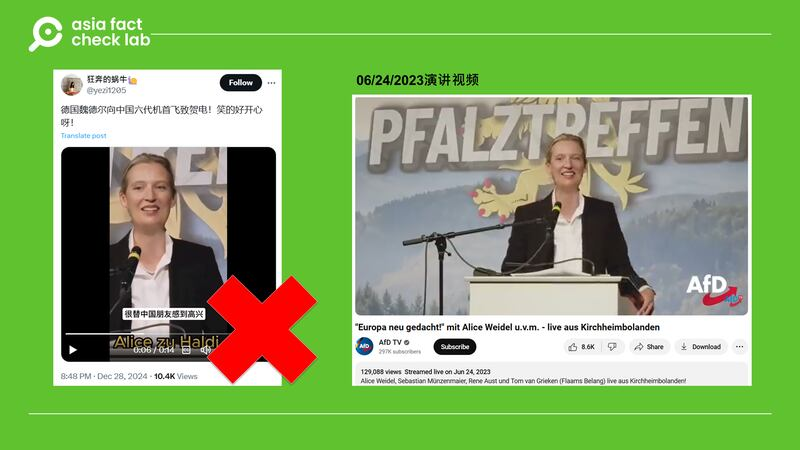

# 事實查覈｜中國六代機傳試飛，“德國新黨首”祝賀叫好？

作者：鄭崇生

2025.01.02 14:21 EST

## 查覈結果：錯誤

## 一分鐘完讀：

2024年12月底，中國新一代戰鬥機試飛的影像引起熱議，近日，一則“德國新黨首魏德爾向中國六代機首飛致賀電”的消息廣爲流傳，所配視頻字幕稱魏德爾“很替中國朋友感到高興”。

AFCL發現，相關視頻是一則移花接木搭配錯誤翻譯的虛假信息，截取自德國“選擇黨”（AfD）聯合主席魏德爾（Alice Weidel）早在2023年6月發表的演說，與“中國”或是“六代機”無關。而將魏德爾稱爲“德國新黨首”的說法，也不準確。

## 深度分析：

張和清在X上轉發網名“豫章信使”的帖子，原始出處來自簡體中文X用戶“[狂奔的蝸牛](https://archive.ph/wip/afFvn)”於12月28日的發文。微博上，[有同樣視頻的發文](https://archive.ph/VWbFU)29日還一度登上了熱門搜索排行榜，這些帳號複製的發文內容都寫着：“德國新黨首魏德爾向中國六代機首飛致賀電！笑的好開心呀！”。

這段14秒的魏德爾講話視頻中所搭配字幕則寫道：“網傳中國的6代戰機試飛成功了，很替中國朋友感到高興，很早之前就和大家說過，東方的中國纔是人類的未來。”

微博、X等社交平臺盛傳德國政治人物“盛讚”中國六代機。 微博、X等社交平臺盛傳德國政治人物“盛讚”中國六代機。 (X、新浪微博截圖)

AFCL以圖反搜發現，上述視頻中的舞臺佈景、魏德爾的穿着以及麥克風設備，都與[YouTube平臺](https://www.youtube.com/live/wlIp1JS-FPw?si=XpkPIdS02OkUgWQm)上魏德爾2023年6月在德國西南方城市基希海姆博蘭登（Kirchheimbolanden）的演講視頻相同。該講話發生在一年多前，當時還沒有“中國六代機試飛”的消息出現。

所謂魏德爾稱讚中國六代機的視頻，發生於一年多前，內容與中國無關。 所謂魏德爾稱讚中國六代機的視頻，發生於一年多前，內容與中國無關。 (X、YouTube截圖)

這段經過剪接的視頻搭配有背景音樂，而完整轉播視頻中並沒有。在14秒的短視頻內容中，有2處跳接剪輯的痕跡，AFCL將網傳視頻比對YouTube上的完整轉播影片發現，網傳視頻的內容是按YouTube視頻中如下的時間段剪輯合成的，按順序分別是：第一段02′50”40至02′50”42，第二段02′50”24至02′50”30，第三段02′50”35至02′50 ”41。

上述14秒視頻中的談話內容，YouTube自動生成的德文字幕爲：

“denn das was dieser Verfassungsschutz hier betreibt das

wir fallen gerade so viele Sachen ein die ich am besten nicht hier äußere denn

der wurde uns ja irgendwie auf den Hals gehetzt um regierungsschutz zu betreiben”

AFCL根據谷歌翻譯（Google Translate），翻譯成中文如下：

“因爲這就是聯邦憲法保護辦公室（保衛局）所做的事情

我們在思考的很多事情所以最好不要在這裏說

他們是以某種攻擊我們的方式來保護政府”

由此可知，該講話與六代機和中國都沒有關係，社交媒體上所謂魏德爾“發來賀電與祝福”的說法，是虛假信息。AFCL同時以 “Alice Weidel” 、“中國”、“戰機”等關鍵詞用谷歌在英文、德文網頁中搜索，並沒有報道顯示她近期就中國六代戰機發表評論。

在影片中，魏德爾講話原文的背景爲德國聯邦政府機構[憲法保衛局（Verfassungsschutz）](https://www.verfassungsschutz.de/EN/home/home_node.html)與其代表的黨派之間的紛爭。德國之聲（DW）[報道](https://www.dw.com/en/germanys-domestic-secret-service-battles-far-right-afd/a-68350993)，該機構在2021年將選擇黨列爲違反憲法的“疑似極端組織”，隨後選擇黨告上法院，2024年，德國法院認定憲法保衛局有權監控與評估選擇黨的活動。

選擇黨則是成立10多年來、將首度推出由魏德爾在2025年國會改選時角逐總理一職。德國主要政黨都已表態不會和選擇黨合作，魏德爾[也坦言](https://www.reuters.com/world/europe/german-far-right-afd-leader-is-chinese-speaking-lesbian-economist-2024-12-07/)選擇黨因此不可能有人入閣。然而，微博帖文將魏德爾簡單稱爲“德國新黨首”，並未交代[德國政壇多個政黨](https://www.tatsachen-ueber-deutschland.de/zh-hans/zhengzhi-deguo/yihuiyuzhengdang)的背景，有誤導之嫌。

因爲具有中國打交道的經歷，魏德爾在中文社交媒體平臺上也頗受關注。路透社[報道](https://www.reuters.com/world/europe/german-far-right-afd-leader-is-chinese-speaking-lesbian-economist-2024-12-07/)，魏德爾曾在中國工作、學習，會說普通話，進入政壇前在高盛集團（Goldman Sachs）任分析師，和來自斯里蘭卡的伴侶共同撫養兩個兒子。

*亞洲事實查覈實驗室（Asia Fact Check Lab）針對當今複雜媒體環境以及新興傳播生態而成立。我們本於新聞專業主義，提供專業查覈報告及與信息環境相關的傳播觀察、深度報道，幫助讀者對公共議題獲得多元而全面的認識。讀者若對任何媒體及社交軟件傳播的信息有疑問，歡迎以電郵*[*afcl@rfa.org*](mailto:afcl@rfa.org)*寄給亞洲事實查覈實驗室，由我們爲您查證覈實。*

*亞洲事實查覈實驗室在X、臉書、IG開張了，歡迎讀者追蹤、分享、轉發。X這邊請進：中文*[*@asiafactcheckcn*](https://twitter.com/asiafactcheckcn)*；英文：*[*@AFCL\_eng*](https://twitter.com/AFCL_eng)*、*[*FB在這裏*](https://www.facebook.com/asiafactchecklabcn)*、*[*IG也別忘了*](https://www.instagram.com/asiafactchecklab/)*。*

[Original Source](https://www.rfa.org/mandarin/shishi-hecha/2025/01/02/fact-check-weidel-six-gen-flighter-video/)