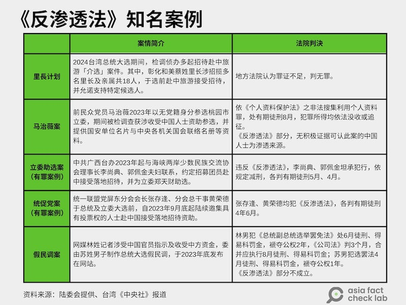

# 深度報道｜中共外宣在臺灣之六：管不管網路？那是個問題

董喆、艾倫、莊敬

2025.01.03 18:23 EST

“日本福島第一核電站日前發生工人接觸到核污染水後送院的事故，工人都還沒出院......情況非常嚴重......”

“F-16戰機是落後武器，又爛又貴......臺灣買一架F-16等於新加坡買一架先進的F-35戰機......民進黨政府是美國人的肥肉。”

這是亞洲事實查覈實驗室（Asia Fact Check Lab）分別在2023年10月和2024年1月發表的兩則查覈報告（[報告1](https://www.rfa.org/mandarin/shishi-hecha/hc-11092023145604.html?encoding=traditional)，[報告2](https://www.rfa.org/cantonese/news/factcheck/tw-01042024075008.html)），第一則是臺灣政治評論員介文汲在中天政論節目“秀芳辣晚報”中宣稱，日本福島核電站日工人接觸到核污染水後送醫情況危急；第二則是臺北縣（現今稱新北市）前縣長周錫瑋批評臺灣從美國買F- 16戰機是“冤大頭”，發表平臺同樣是中天政論節目。兩者都被證實是錯誤資訊，但仍被《海峽導報》搬運轉發，作爲疑美、疑日的素材。

正如“中共外宣在臺灣”系列報道所揭露的，臺灣部分電子媒體會直接引用、甚至照搬中國媒體節目，但這違反了廣播電視的相關法規，也可能影響執照換髮。但隨着中天關臺，內容轉往網路空間，臺灣政府管制不及於網路，旺中媒體集團與福建網絡下屬媒體機構也更爲緊密。

例如，AFCL曾經發掘“中天二臺”有不少影片直接剪輯自福建“海峽衛視”製播的網路限定節目“寶島，報到！”，僅僅更換合成背景、重新壓上字幕並微調畫面佈局。更值得注意的是這些片段都以正體中文呈現，明確是針對臺灣受衆製播。

這樣的趨勢引發了一個問題：在臺灣現行的法律體制下，有線、無線電視臺的營運和內容受到“國家通訊傳播委員會”（ National Communications Commission,NCC）的監管，然而一旦電視臺失去了執照無法上架電視節目，轉戰YouTube或其它網路平臺後，反而言論尺度大開，經營上更可以放手與中國外宣機構合作。

又例如，“中共外宣在臺灣”[專題系列三](2024-12-20_深度報道｜中共外宣在臺灣之三：老牌本土報紙如何被澆灌出親中敘事？.md)所揭露旺中集團與陝西省的西安、寶雞兩個市政府的業務合作案，如果這是西安、寶雞市政府花錢買的專題報道，依臺灣法令，當時在無線頻道中視、有線新聞臺中天播出，都可能有觸法問題；但如果在今天，由中天網路電視臺播出，就完全無法可管。又例如專題系列五所揭露，疑似由福建廣播影視集團和中天共同製作的政論節目“寶島，報到！ ”。

## 網路電視臺與中國合作是否有法可管？

臺灣現行法律《臺灣地區與大陸地區人民關係條例》（之後簡稱“兩岸條例”）第33-1條規定，在臺灣的個人或法人機構，不能和中國的個人或法人機構有“涉及政治性內容之合作行爲”。因此，在前述的例子裏，臺灣媒體與中國合制節目，或者收受如《海峽導報》釋出的統戰利益，是不是違反了兩岸條例33-1條的規定？

AFCL向陸委會主委邱垂正提出了這個問題。邱垂正回答，這類案件的重點在於相關的媒體合作行爲，有沒有事先向臺灣政府申請，並且獲得政府同意。邱垂正也強調，中國的媒體，不管“海峽衛視”、“東南衛視”等，都是官媒，因此臺灣的民間媒體如果要和中國大陸的官媒合作，必須經由政府許可，如果不經過許可就直接合作，的確違反了兩岸條例33條之一的規定。

臺灣大學新聞研究所教授洪貞玲曾經擔任NCC委員，她也同意沒有政府許可與中國合作是違法的，但認爲現行法律對這樣的行爲只處罰十萬到五十萬的罰款，“這真的是開玩笑”。

另一個問題在於，網際網路平臺上流傳的內容，臺灣政府目前沒有任何法規能夠監管。 NCC曾在2022年6月推出《[數位中介服務法草案](https://www.ncc.gov.tw/chinese/files/22081/5542_47882_220811_1.pdf)》，希望建立網路中介服務提供者的問責機制，促使平臺負起“守門人”的監督責任。但草案提出後，即引發鉗制言論自由的爭議，在時任行政院長蘇貞昌的要求下，NCC決議將[草案退回](https://www.cna.com.tw/news/aipl/202209070201.aspx)內部工作小組。

邱垂正受訪時對於《數位中介服務法》推動失敗而扼腕，“我們很期待這個法律，當然是爲了面對中國大陸可能攻我們的網路平臺，因爲這是我們最脆弱的。我們始終沒有主管機關，每次都在協調誰是主管機關，傷透腦筋。我們是個法治國家，任何行爲都有相對應的法律工具，而且要明文。”

但邱垂正也指出，在前一份草案中規定了十多項業務主管機關，例如在網路平臺上的公衛、食藥內容由衛福部主管；詐騙、販毐由警政部門主管... ...等等。但獨獨沒有關於國家安全事務的主管機關。意即，即使前一份草案通過，網路上流傳的，可能涉及妨害國家安全的內容，陸委會或其它國安機關一樣會面臨無權可管的窘境。

“如果國家不能夠介入網路的管理，對這些業者施加約束，那你就是放任‘更大的力量‘來決定臺灣的網路環境。”洪貞玲也強調《數位中介服務法》必須繼續推動，否則臺灣對跨國平臺的管理將束手無策，遑論這些“跨國平臺”還包括了與中國政府關係密切的“TikTok”或者“小紅書”。

洪貞玲認爲，過去這麼多年新聞業界、傳播學界研究、對抗假信息所累積的成果早已說明網路上的一些不實資訊絕對不是在自由的環境裏面產生出來，而是由包括中國操控的內容農場，用假帳號、協同行爲等各種方式產生，再透過臺灣的在地協力者散播......這樣的一套路徑已經發展了非常多年，“如果政府不處理這些，我覺得某種程度你就是在摧毀臺灣的自由跟民主”。

然而每當談及《數位中介服務法》或者類似法律的推動、立法時，往往引來關於“言論自由”的爭論。洪貞玲認爲，言論自由當然意味着相當高的憲法價值，但當言論自由要被限縮時，一定因爲要保護另一個價值，“國家安全當然是一個非常重要的價值，而且可能比很多個人性的價值更高。”

## 《反滲透法》是否需要修訂？

另一部於“中共外宣在臺灣”系列中一再出現的法律，就是《反滲透法》。

根據臺灣最高檢察署2023年12月底發佈的[新聞稿](https://www.tps.moj.gov.tw/media/346627/107-1121229%25E6%25BE%2584%25E6%25B8%2585-%25E5%25A4%2596%25E7%2595%258C%25E8%25B3%25AA%25E7%2596%2591%25E5%2589%258D%25E5%25BE%2580%25E5%25A4%25A7%25E9%2599%25B8%25E5%259C%25B0%25E5%258D%2580%25E9%2580%25B2%25E8%25A1%258C%25E4%25BA%25A4%25E6%25B5%2581%25E4%25BA%258B%25E5%25AE%259C.pdf?mediaDL=true)，自2020年1月施行《反滲透法》近4年來，已有85案、被告155人。近一年來的知名案件，包括2023年底發生的指傳媒案、[里長案](https://www.cna.com.tw/news/asoc/202404240363.aspx)、[馬治薇案](https://www.cna.com.tw/news/aipl/202401060088.aspx)、[立委助選案](https://www.cna.com.tw/news/asoc/202404020108.aspx)、[統促黨案](https://www.mjib.gov.tw/news/Details/1/1044)，其中“立委助選案”成爲首起依《反滲透法》[判處有罪](https://judgment.judicial.gov.tw/FJUD/data.aspx?ty=JD&id=TPDM,113,%25E5%25AF%25A9%25E5%258E%259F%25E7%25B0%25A1,41,20240723,1)的案件。

臺灣近年來與《反滲透法》相關的案例及判決結果 臺灣近年來與《反滲透法》相關的案例及判決結果 (AFCL製圖)

在AFCL關注的兩起案件中，“指傳媒假民調案”一審法官在判決中不認林靖東等人是滲透來源，檢方對此提出了上訴；專題系列五中“[張孟崇案](2024-12-31_深度報道｜中共外宣在臺灣之五：對臺統戰的操盤手“福建網絡”.md)”檢察官同樣以違反《反滲透法》起訴，目前還沒有開庭審理。

根據陸委會對《反滲透法》的[說明](https://www.sef.org.tw/files/6325/126B7BF0-247B-4412-94CE-9AEE268BD71E.pdf)，行爲人必須有受境外敵對勢力指示、委託、資助的“滲透行爲”，加上從事具體的5種“不法行爲”，即違法捐贈政治獻金、助選、遊說、破壞集會遊行及社會秩序、傳播假訊息干擾選舉，纔會成爲處罰對象。

但部分法律專家認爲，現行《反滲透法》規範的強度並不足夠。

曾任行政院政務委員的律師羅秉成認爲，“《反滲透法》有類型侷限，但所謂政治影響、政治干預可能不只五類。”。

“來自境外敵對勢力滲透的嚴重性，跟《反滲透法》能夠產生的效果之間，應該是不成比例的。我們的感受很強烈，他（中國）幾乎是鋪天蓋地，無所不在地影響，如果要期待《反滲透法》對各式各樣的滲透行爲都要產生抑制的效果，那是過度期待。”

臺灣永社理事長、南臺科技大學財經法律研究所特聘教授兼所長羅承宗則將現在的《反滲透法》稱爲1.0版本，有的只是象徵意義。他直言，《反滲透法》需要認真大修，需要2.0版本。

羅承宗認爲，《反滲透法》的一大問題是僅有“天花板”而無“地板”的設計，如果修法就要設置地板，例如至少2年有期徒刑。另一方面，“他”不會在選舉時才滲透，應該要盤點“滲透來源”與當今的“滲透手法”。

對於《反滲透法》的效力，羅承宗顯得悲觀，他預測“指傳媒假民調案”二審維持原判的機率很高，而且從首起有罪判決案例來看，很可能輕判。 “悲觀一點的想法，不只是沒有達到嚇阻的效力，反而還有宣告的效力，就是說反正我們是紙老虎一隻，你就儘量來吧。”

2019年，臺灣基進黨與民進黨部分立委提出[《境外勢力影響透明法》草案](https://ppg.ly.gov.tw/ppg/download/agenda1/02/pdf/10/03/03/LCEWA01_100303_00044.pdf)，旨在規範境外勢力及其代理人在臺灣境內的行爲，揭露其活動與提高透明度。但草案送進立法院後，至今未完成立法工作，[臺灣基進黨](https://statebuilding.tw/%25E3%2580%258C%25E4%25BB%25A3%25E7%2590%2586%25E4%25BA%25BA%25E6%25B3%2595%25E4%25B8%258D%25E8%2583%25BD%25E7%25AD%2589%25E3%2580%258D%25E8%25A8%2598%25E8%2580%2585%25E6%259C%2583/)質疑法案遭親中政黨刻意冷凍，並批評立法怠惰。

AFCL的受訪者中，包括羅秉成、羅承宗等都提到《代理人法》，雖然他們對於在臺灣總統賴清德上任後，臺灣立法院“朝小野大”的情況下闖關並不樂觀，但都同意這項法案是個“值得認真思考”的工具。羅秉成認爲，《代理人法》制度才能讓拿錢的人心理有負擔，“政府部門在看，他可能就會收斂”，但當年討論時機還不成熟，也擔憂會不會只要登記就合法、免責？

## 一般民衆怎麼想？

2024年12月，臺大新聞所等單位發表了“假訊息認知調查”[年度研究成果](https://medium.com/@ntujour2022/2024%E5%81%87%E8%A8%8A%E6%81%AF%E8%AA%8D%E7%9F%A5%E8%AA%BF%E6%9F%A5%E6%9A%A8%E9%AB%98%E5%B3%B0%E8%AB%96%E5%A3%87-95-%E5%8F%97%E8%A8%AA%E8%80%85%E6%9B%BE%E6%94%B6%E9%81%8E%E5%81%87%E8%A8%8A%E6%81%AF-%E9%81%8E%E5%8D%8A%E8%AA%8D%E7%82%BAai%E6%AF%94%E7%9C%9F%E4%BA%BA%E6%9B%B4%E5%AE%A2%E8%A7%80-c67ca98f99f3)，在AFCL進一步取得了即將公開發表的詳細數字中，對於“哪些人或單位有責任減少假消息流傳”，61.66%受訪者認爲是傳播媒體，其次是政府官員（ 61.15%）。而對於“是否應立法要求社羣媒體建立假消息自律機制”，43.10%認爲非常應該，48.23%的人認爲應該。

至於“政府是否應限制假消息，即使損害人民的言論自由”，高達72.92%的受訪者回答“即使損害人民的言論自由，政府也應該限制假消息在網路傳播”，僅27.08%回答“即使在網路散播假消息，人民在網路上的言論自由也應該獲得保障”，兩者比率相當懸殊。

這份研究成果指出，在民主自由的臺灣社會，受訪者有如此高的比例表達應該對假消息予以嚴格的管控，也印證民衆對於假消息氾濫與網路詐騙橫行的憂慮，期待透過立法管制以降低假消息對臺灣社會造成的負面影響。臺大新聞所教授洪貞玲表示，從這項調查結果可以看出民衆對於政府與媒體的期待，建議政府應該思考可能的管制工具，不能因爲《數位中介法》在兩年前喊停，就停止相關討論。

研究還有一項有趣的發現：更多臺灣民衆認知到境外勢力正在製造假訊息。對於“哪種個人或團體爲假訊息的製造者”，受訪者普遍認爲政治人物、媒體工作者、境外勢力都經常在製造假訊息；其中，和2023年的調查相較之下，認爲境外勢力每天在製造假訊息的佔比從17.85%提升至26.59%，幅度最高。

如果一般民衆和專業的傳播工作者、學者都認爲“境外勢力”是假訊息的主要來源，那進一步的問題在於，這些不實信息的危害在哪裏？

研究中國影響力的臺灣政治大學副教授黃兆年告訴亞洲事實查覈實驗室，中國擅於用軟實力包裝其背後的統戰利益。看起來是文化宣傳，背後卻牽涉系統性的收買及誘因。

他分析，即使從一些案例中看到中國收買的是看似影響力較小的媒體，一來固然是爲向上級交代業績。但更重要的是即使這些媒體並未如期達到對臺統戰效果，“做了這個基礎工程之後，在必要的時刻，至少有人是他叫的動的”。他舉例，臺灣網媒記者林獻元就是一個很好的例子，即使《指傳媒》本身影響力不大，但在臺灣總統大選這樣的關鍵時刻依舊起到作用，成功製作假民調並引起輿論關注。

中國傳媒研究計劃（China Media Project）執行董事班志遠（David Bandurski）告訴亞洲事實查覈實驗室，想有效對抗中國外宣及假信息的滲透，臺灣必須先處理本身媒體的問題，也就是創造一個“免疫系統”（immune system）。透過揭露強化媒體韌性、建立社會對外宣及假信息的認知，以及增強大衆的媒體識讀，纔是最終對抗媒體統戰的解方。

邱垂正也有類似看法，他認爲，民主社會尊重包容不同意見，盡最大努力保障言論自由，而媒體在民主社會是很重要的社會公器；但在中國不一樣，所有媒體都姓黨，是一個維護政權的武器。

他指出，應小心使用“統戰”、“滲透”等詞，因爲“部分涉及統戰的行爲未必違法”，其目的在於改變一個人的認同和價值觀，還屬於言論思想範疇內，新聞自由也在其中，而這是需要容忍的。然而“滲透”是違法、惡意的破壞的行爲，中國透過強大的認知作戰一直對臺輸入不實訊息，民主臺灣應該要有基本的防衛力量。

(感謝外部專家黃維玲、獨立記者與研究員陳慧敏對本系列報道的貢獻。）

本系列其它各篇專題如下：

之一：[臺檢以《反滲透法》訴大選假民調當事人，一審因何失利？](2024-12-12_深度報道｜中共外宣在臺灣之一： 臺檢以《反滲透法》訴大選假民調當事人，一審因何失利？.md)

之二：[林靖東和林獻元背後的大外宣架構](2024-12-12_深度報道｜中共外宣在臺灣之二：林靖東和林獻元背後的大外宣架構.md)

之三：[老牌本土報紙如何被澆灌出親中敍事？](2024-12-20_深度報道｜中共外宣在臺灣之三：老牌本土報紙如何被澆灌出親中敘事？.md)

之四：[海峽兩岸的兩家《導報》](2024-12-25_深度報道｜中共外宣在臺灣之四：海峽兩岸的兩家《導報》.md)

之五：[對臺統戰的操盤手“福建網絡”](2024-12-31_深度報道｜中共外宣在臺灣之五：對臺統戰的操盤手“福建網絡”.md)

*亞洲事實查覈實驗室（Asia Fact Check Lab）針對當今複雜媒體環境以及新興傳播生態而成立。我們本於新聞專業主義，提供專業查覈報告及與信息環境相關的傳播觀察、深度報道，幫助讀者對公共議題獲得多元而全面的認識。讀者若對任何媒體及社交軟件傳播的信息有疑問，歡迎以電郵afcl@rfa.org寄給亞洲事實查覈實驗室，由我們爲您查證覈實。*

*亞洲事實查覈實驗室在X、臉書、IG開張了，歡迎讀者追蹤、分享、轉發。X這邊請進：中文*[*@asiafactcheckcn*](https://twitter.com/asiafactcheckcn)*；英文：*[*@AFCL\_eng*](https://twitter.com/AFCL_eng)*、*[*FB在這裏*](https://www.facebook.com/asiafactchecklabcn)*、*[*IG也別忘了*](https://www.instagram.com/asiafactchecklab/)*。*

[Original Source](https://www.rfa.org/mandarin/shishi-hecha/2025/01/03/fact-check-ccp-propaganda-taiwan-serial6/)