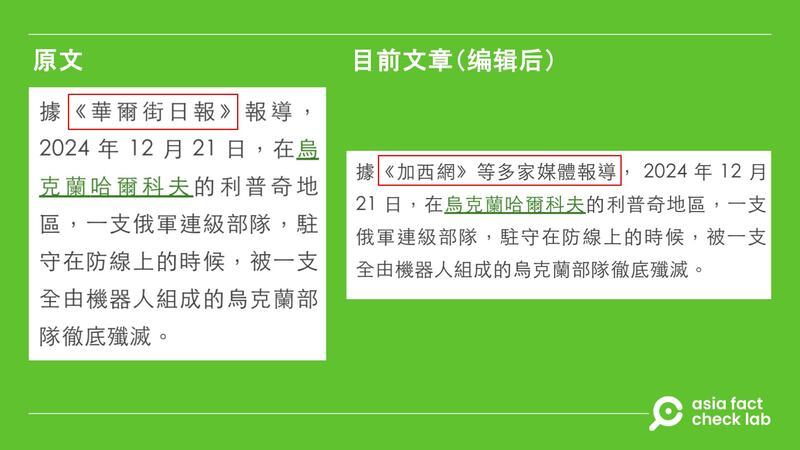

# 事實查覈｜《華爾街日報》曝烏克蘭機器人軍隊全殲俄一整連？

艾倫

2025.01.07 18:58 EST

## 查覈結果：錯誤

## 一分鐘完讀：

2025年1月初，有臺灣媒體稱根據《華爾街日報》的報道，烏克蘭在2024年12月21日以一支全由機器人組成的軍隊，“殲滅”了俄羅斯一“連級部隊”，多箇中文媒體平臺及社媒用戶轉發了該消息。

但亞洲事實查覈實驗室（Asia Fact Check Lab，下稱AFCL）查證後發現，《華爾街日報》並未發佈該新聞。且綜合外媒報道，烏克蘭近期雖然使用了機器人軍隊，但並沒有證據表明該機器人部隊在近期全殲了俄羅斯的連級部隊。

## 深度分析：

臺媒Newtalk新聞（又稱新頭殼）在1月12日發表一篇[報道](https://archive.ph/gf7ld#selection-1891.0-1891.30)，題爲“俄連級部隊慘遭機器人全殲! 哈爾科夫大震撼 徹底改變戰場規則”。稱根據《華爾街日報》的報道，烏克蘭在2024年12月21日以一支全機器人部隊殲滅俄軍連級部隊，事發地點爲烏克蘭哈爾科夫的利普奇地區。

相關消息隨後被[LINE Today](https://today.line.me/tw/v2/article/aGz5J03)、[Yahoo奇摩新聞](https://tw.news.yahoo.com/%E4%BF%84%E9%80%A3%E7%B4%9A%E9%83%A8%E9%9A%8A%E6%85%98%E9%81%AD%E6%A9%9F%E5%99%A8%E4%BA%BA%E5%85%A8%E6%AE%B2-%E5%93%88%E7%88%BE%E7%A7%91%E5%A4%AB%E5%A4%A7%E9%9C%87%E6%92%BC-%E5%BE%B9%E5%BA%95%E6%94%B9%E8%AE%8A%E6%88%B0%E5%A0%B4%E8%A6%8F%E5%89%87-061928722.html)等新聞聚合平臺轉發，中文X用戶“海外爆料”也[原文照搬](https://x.com/zhihui999/status/1875038779158986913)這則新聞。

中文新聞網站和社媒轉傳俄羅斯連級部隊遭烏克蘭機器人部隊全殲消息。 中文新聞網站和社媒轉傳俄羅斯連級部隊遭烏克蘭機器人部隊全殲消息。 (圖取自新頭殼網頁、X)

AFCL查閱12月21日前後《華爾街日報》上關於俄烏戰爭的相關報道，發現該報並未提及相關信息。

再以此搜尋結果向新頭殼求證，該媒體回覆稱，消息來源其實來自兩個網站：[加西網](https://www.westca.com/News/article/sid=1062913/lang=tchinese.html)、[八闋新聞網](https://news.popyard.space/cgi-mod/newscroll.cgi?lan=tw&r=0&sid=16&rid=891641&v=0)，其中“加西網”在其報道中說該消息是來自《華爾街日報》，但沒有附上鍊接或引述其他的消息來源。

而新頭殼在AFCL詢問後，已經將原報道內容[改成](https://newtalk.tw/news/view/2025-01-02/951402)“據《加西網》等多家媒體報道”，並在標題上加上“傳”字。

臺媒新頭殼將原報道引述對象改爲《加西網》。 臺媒新頭殼將原報道引述對象改爲《加西網》。 (圖取自新頭殼網站)

AFCL也電郵詢問《華爾街日報》，至截稿（1月7日）前未獲回應。

記者再以關鍵字搜尋，發現[《福布斯》雜誌](https://www.forbes.com/sites/davidaxe/2024/12/21/ukraines-first-all-robot-assault-force-just-won-its-first-battle/)（Forbes，或譯富比世）及英國[《電訊報》](https://www.telegraph.co.uk/world-news/2024/12/24/ukraine-launches-robot-only-assault-against-russian-troops/)（The Telegraph）都曾發佈過烏克蘭使用全機器人的“聯合兵種”，包括爬行無人機和飛行無人機，在前線對抗俄羅斯並最終取得了勝利的消息。《福布斯》的報道寫到：

*“我們正在談論的是，在前線一小段區域內同時部署數十臺機器人和無人設備，”第13國民警衛旅的發言人解釋道。*

*這是一項令人印象深刻的技術成就，但也反映出烏克蘭軍隊因兵力過度分散而暴露的弱點。尤其是無人地面車輛存在重大侷限性，仍無法完全取代人類步兵。*

*第13國民警衛旅甚至需要在地面攻擊中完全用無人裝備替代士兵，這表明該旅與其對抗的俄羅斯部隊相比，兵力嚴重不足。*

*第13國民警衛旅負責防守靠近烏俄邊境、位於赫利博克鎮（Hlyboke）周邊的五英里前線，面對至少四個團的俄軍。*

《電訊報》則引述烏克蘭哈爾基夫旅（Khartiia Brigade）的代表沃洛迪米爾·德赫佳羅夫（Volodymyr Dehtiarov）所述，稱本次作戰“成功”，但也強調這個說法未經覈實。

綜合國際媒體報道，烏克蘭近期確實曾出動全機器人“聯合兵種”部隊，官方發言人也稱是一場“成功”的作戰，但不僅沒有詳述勝利細節，也沒有如傳言所說“殲滅俄連級部隊”，《華爾街日報》更是不曾報道此消息。

（記者莊敬對本報道亦有貢獻）

## 1月8日更新：《華爾街日報》在臺灣時間1月8日早上回復AFCL，表示”我們不曾發過相關報道”。

*亞洲事實查覈實驗室（Asia Fact Check Lab）針對當今複雜媒體環境以及新興傳播生態而成立。我們本於新聞專業主義，提供專業查覈報告及與信息環境相關的傳播觀察、深度報道，幫助讀者對公共議題獲得多元而全面的認識。讀者若對任何媒體及社交軟件傳播的信息有疑問，歡迎以電郵*[*afcl@rfa.org*](mailto:afcl@rfa.org)*寄給亞洲事實查覈實驗室，由我們爲您查證覈實。*

*亞洲事實查覈實驗室在X、臉書、IG開張了，歡迎讀者追蹤、分享、轉發。X這邊請進：中文*[*@asiafactcheckcn*](https://twitter.com/asiafactcheckcn)*；英文：*[*@AFCL\_eng*](https://twitter.com/AFCL_eng)*、*[*FB在這裏*](https://www.facebook.com/asiafactchecklabcn)*、*[*IG也別忘了*](https://www.instagram.com/asiafactchecklab/)*。*

[Original Source](https://www.rfa.org/mandarin/shishi-hecha/2025/01/07/fact-check-ukraine-robot-army/)